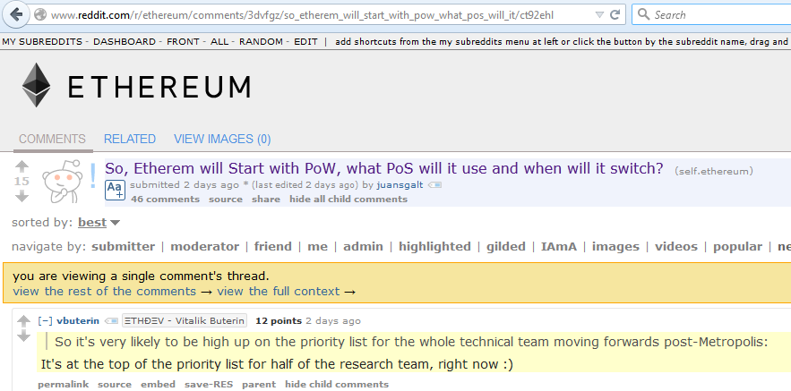
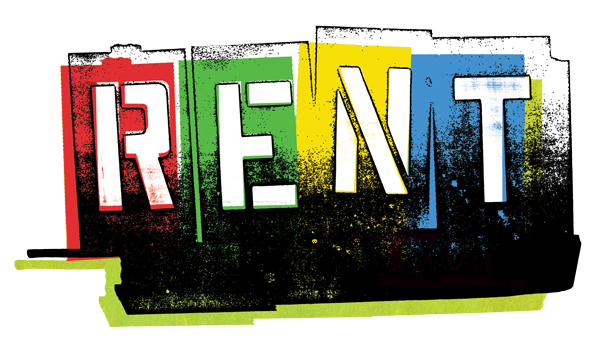
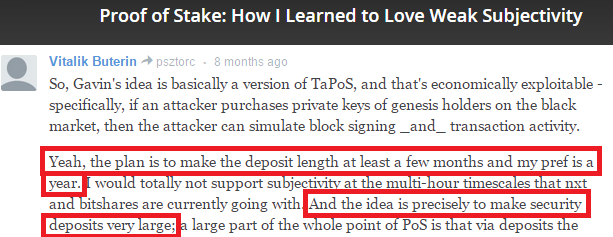
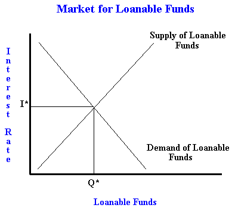
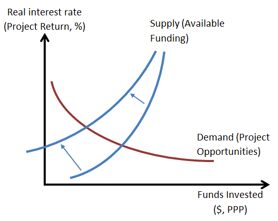
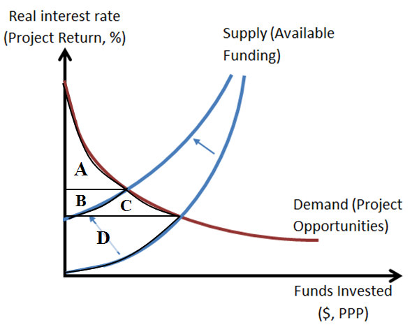
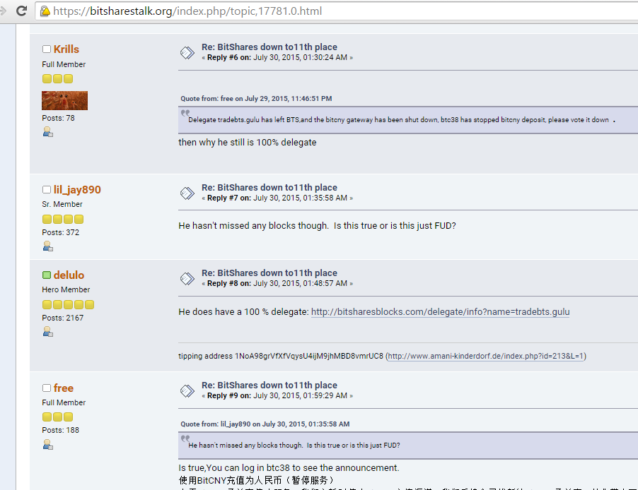

> *作者：Paul Sztorc*
> 
> *来源：<https://www.truthcoin.info/blog/pow-cheapest/>*

>  所谓的工作量证明 “替代者”，“浪费” 了同样多的 “工作量”

## 引言：被浪费的资源

我之前写过一篇《[关于工作量证明（PoW）和挖矿的文章](http://www.truthcoin.info/blog/pow-and-mining/)》，它的前半部分引起了读者极大的兴趣，但是显然没有能够很好地说服大家。例如，[CCRG](http://ccrg.org/mission)（以太坊[投入几百万美元建立的](https://www.truthcoin.info/images/IntendedUseOfRevenue.pdf) “研究” 组织）中，几乎都是[关于 “权益证明（PoS）” 的理论](http://www.reddit.com/r/ethereum/comments/3dvfgz/so_etherem_will_start_with_pow_what_pos_will_it/ct92ehl)。

所以这里我再解释一下前文的前半部分，希望有足够潜能的人们不要再 “浪费” 工作在那些过时的想法上（也希望少一些记者与自以为是的投资者转去关注比特币除了网络货币以外的价值定位）。

## 提纲

1. 重新介绍核心原理（**边际收益等于边际成本**）
2. 通过解释**经济租金**，将核心理论运用于解释人类的行为模式
3. 解释为什么 >0 的经济租金**无法**与点对点货币**共存**
4. 聚焦一些**特例**（Tendermint 共识，DPoS），假设他们能依照 *比特币的时间表* 发行
5. 将理论推广至所有的（数字货币）**发行方案**

## （重申）拍卖100美元，任何支付方式均可

> “拍卖！这里有 100 美元，可以发放给生产 Peercoin 衬衫的 ‘矿工’。”

我之前指出：

命题 A：每个区块产生 50 个新的比特币。

等价于：

命题 B：拍卖这 50 个比特币，价高者得。

在实际的经济主体中，生产活动会一直持续，直到边际成本等于边际收益（MC = MR）。总的来说，每次哈希计算都消耗成本，并（在边际上）提高了矿工得到 50 个比特币奖励的可能性。**任何行为**（不光是哈希计算），只要能增加获得比特币的可能性，人们就会不断重复该行为，直到社会付出的总行为成本等于 50 个比特币的价值。

我们把上述理论应用到简单 PoS 上，就意味着 PoS 容易遭受 “权益研磨” 攻击。这（权益研磨）其实就是 PoW 的一种形式（“不断尝试不同的分叉链，直至找到一条会给你送钱的分叉”），只不过显然不具备累加性（markedly less-cumulative）。由于 PoS 中的工作量无法量化（比特币中用难度系数进行量化），因此难以 看出：付出的全部工作量 = 期望的区块奖励。

（译者注：权益研磨（Stake Grinding）即用户通过不断改变自己资金的形式来影响随机性、获得出块权，也包括不断在不同链上尝试出块。在早期的 PoS 系统中（一般都使用了 UTXO 和不那么复杂的共识算法）较为常见）

在 PoW 中，（出现的分歧）好比我们在 1000 个纽约时报的版本中，决定哪个明天发行；而在 PoS 中，（分歧）变成在一沓 60,000 份报纸中分辨哪个才是真的纽约时报。

那些被抛弃的分叉块（好比众多伪造的纽约时报）将不为人知，但它们的生成消耗了工作量。随着时间推移，绝望的开发者只会让这种消耗的工作量越来越难以被看出来：**所有提出的 PoW 替代方案，最终都可以视为隐式的 PoW**。

我们会看到，用其他算法混淆 PoW 算法的工作量概念（即提高算法复杂度）的同时，并不会改变 “世界（真实）工作量” 与 “区块链所受影响” 之间的联结关系。最终，每个独立的 “矿工”（或不管叫什么）都将：[1] 计算预期收益，[2] 减去成本，[3] 不断付出“工作量”，直到收益等于成本。

“预期收益” 是整个系统中唯一可变更的参数（而非“预期成本”，成本跟随收益变动）。

## “租金” *总是* 使得产品成本（MC）等于产品售价（MR）

> 世界上**所有的**交易，都遵循 “边际成本” = “边际收益” 这一原理，也包括未来的区块链技术

### **测算成本**

一个从事实务的人可能会立刻反对，认为在现实中 MC = MR *永远不可能* 成立（比如：“**我家附近的便利店**卖的啤酒比其它地方的要贵”；“我做小生意时，每样售出的东西**都会加价** 3%，这样才能**保障生意运转和家庭收入**，我的 *利润*，尽管**无法确切算出多少**，也由此加价而来。”）

MC = MR 之所以永远成立，是因为经济学家测算 “成本” 的方式（也是唯一正确的方式）。特别是，当我们[引入“租金”](http://en.wikipedia.org/wiki/Economic_rent#Land_rent) 这一概念时，等式将进一步细化为：MC_rent + MC_nonrent = MR。

> 校对注：对于熟悉价格理论的读者来说，这么说也许更清晰一些：每一单位的产品都需要生产者付出一定的边际成本，在可出售的情况下会带来一定的边际收益，而两者的差额即是产品对生产者租金（生产者剩余）在边际上的贡献（或称 “边际租金”）。

这听起来像在骗人（对于[不懂经济学的人](https://en.wikipedia.org/wiki/Pons_asinorum#Metaphorical_usage)来说），因此，争论前，我要先介绍下经济租金的概念。对于点对点货币来说，公式两边通常都是 0（那些由[央行或者](https://ripple.com/)[中心](https://ripple.com/)[检查点](https://ripple.com/)[控制的货币](https://ripple.com/)则不同，其租金可能被强制设置为非 0）。

### **经济租金是什么？从何而来？**

**以下是经济学教科书的描述**

假设有个卖家拥有某项**专利**（只有他能出售）。卖家会评估专利对客户的价值，给出 “售价 ɛ”，如果售价（边际收益 MR）高于他的成本（边际成本 MC），则它们的差额即为 “经济租金”。在这个假想的买卖中，**MR-MC 的值决定了将专利“租赁”（给某人）的价格会是如何**。尽管卖家自用就不必付租金，但是不租给别人时，他人愿意出的最高价格即是卖家的[机会成本](http://en.wikipedia.org/wiki/Opportunity_cost)。因此，我们新的 MC （包含了租让专利的机会成本）必定等于 MR。

这样的成本测试方法，看起来有些刻意，却是唯一合逻辑的做法。假设你花费 1000 万美元研发了某种药物，它们的生产成本为 0.1 美元，售价为 200 多美元。这个情况下，药物的 “成本” 是 0.1 美元吗？为什么该成本对你而言与对其他老实支付专利费或者直接抄袭你研究成果的人要有所不同呢？

 **感冒药**

我们再用个极端例子来解释下

当我感冒时，我的边际收益（获得的好处）相比感冒药的价格来说要高得多，我可能愿意花 50 美元来安度一晚。我是很幸运，但是，一星期的感冒药剂量还不到 5 美元。那么，是否 MR > MC？

经济租金仍然存在，只是这次从卖方转嫁到了我这（买家）。我的病情是私密的（只有我知道），而我还了解附近的药店和多种感冒药的信息（我是否知道药店信息这一事实也是私密的，只有我自己知道）。如果某家药店有办法知道我生病时求药心切的情况，并且能够阻止其他人帮我买药、阻止其它药店卖药给我，那么它就能对我实施[价格歧视](http://en.wikipedia.org/wiki/Price_discrimination)（获得所有经济租金）；对付药店的反制措施（在健康时囤药、找人代买、选择其它药店）都是我自己保有的[期权](http://en.wikipedia.org/wiki/Real_options_valuation)。如果药店 *知道* 我*愿意* 为 72 小时的药效支付 200 美元，它就会要价 200，但**这个信息只有我自己知道**，因此我自己租用了这部分信息，我受益于此而不用支付额外费用。

当看起来 MR > MC 时，实际情况是这样的：我买了一个单位的 “药物”，一个单位的 “生病信息”，获得了一个新产品 “感冒治愈”。我只有抱恙时才能获得该产品（药物对健康的我无效），没有药店能够等到我生病并阻止我（通过其它途径）获得该货物，而我却知道该药物能治愈我，等等。所以，仍然有， MC = 药物 + 生病信息租 = MR。

### **经济租金是私密的**

只有与选择直接相关的 MC 和 MR 才会影响经济主体的行为。因此经济主体的决策过程是忽略[外部性](http://en.wikipedia.org/wiki/Externality)的（这也是为什么外部性会带来这么多问题）。

### **经济租金随时间自行解体**

当前，你可能不得不从某些人手中 “租赁” 某些东西，随着时间推移，你会开始寻找替代品（无法找到其它的卖家会增加你的成本……而且，因为你尚未拥有这些信息，你不得不通过 “租赁” 来获得 “哪里有更划算的交易” 的知识）。实际上，如果你有创业精神，则可以反其道而行之：通过打折提供那些客户需要的东西来获取其中的租金。如此，整个经济体将更合理地分配稀缺的创业能力和资本到需要它们的地方。

最后——

### **“经济租金” 意味着 “排他”，与 P2P 相矛盾**

> 如果所有节点都是平等的，怎么能让某些人处于（并忍受）屈从的地位呢？

经济租金是由卖家对某物的垄断引起的，使得交易**对手不得不“租赁”该物**。然而，**“排他”的概念和** **“点对点”** **从根本上是矛盾的**。

这个问题不只限于稳定状态下的协议运行过程中，也包括协议建立过程等其它各个方面。一个完全的 P2P 协议，从初始化到稳定运行状态都是点对点的。但是，如果一个协议期望获得租金，那么问题来了：哪些才是我们可以向其租赁的高级节点？为什么是它们而不是其它节点？我们为什么必须租赁？

目前 coinmarketcap 上唯一能赚取租金的是瑞波币（Ripple），因为它不是 P2P 的（它拥有特权节点和无可比拟的银行关系）

我希望以上内容理解起来还算轻松。现在你已经有了理论知识，让我们回到原来的主题上。

## 一切都是 PoW

> 没有经济租金时，按照“25 BTC / 10 分钟”的发行速度，每 10 分钟， 整个系统要浪费 25 BTC。

为了简化，**这一部分阐述中，我们假设所有 P2P 系统中，货币的发行速度都相同**（即，每 10 分钟发行 50 个单位，每 4 年减半）。

下面我们来论述哪些对货币发行方案的改进是没有意义的。

### **与 “工作量” 无关的协议是否可能存在？**

如果一个虚拟货币系统，周期性地发行货币，却 *没有* 同时给出可以让用户 “浪费” 掉与新发行的货币等额价值的激励机制时（校注：也就是没有工作量消耗），系统就必须选择另外一种 *与人类行为完全无关* 的方式，来分配这些发行的货币。这种货币的奖励分配将**与努力程度完全无关**，且分配方式必须与所有可能受人为影响的事物的斯皮尔曼相关系数为零。

这是不可能实现的。*使用软件这一决定* 本身就是受人为影响的，而协议对非用户来说毫无意义。以上情况，使得货币分发要做到与努力程度无关，是完全不可能实现的。也使得所谓的“浪费”不可避免。

### **确认所有权的时间和付出工作量的时间不一致（并不重要）**

考虑以下设计：【设计 1】预先随机地决定 50 个 BTC 的奖励归谁； 【设计 2】保留决定，先不分配，以后再说；【设计 3】事实上将这 50 个 BTC 分配出去。这样的话，当 MR （边际收益）出现时，我们没有什么实际的 “工作量” 需要付出，是这样吗？

不是这样的。

**要付出时间**。

的确，当 [3] 发生时，为了当前的 MR 付出 “工作量” 就为时已晚，但同时，这却是开始为**未来**的 MR 付出 “工作量” 的恰当时机。MR 和 MC [并不同步出现](http://en.wikipedia.org/wiki/Present_value)其实无关紧要，它们通过比特币就联系到了一起。

（你知道吗，比特币的工作量证明奖励在之后的 100 个区块时间内，是无法被花掉的。这是因为，如果出现孤块，这些奖励会完全消失；而且矿工最有可能进行双花攻击。所以，密切留意这些币的归属是明智之举。）

**还有随机性**。

同样，当 [3] 发生时，短时间内为随机结果进行 “研磨”（直到找到能给你带来 MR 的随机数）为时已晚； 同样，[3] 发生时，也是为下一次的随机结果进行研磨的恰当时机（直到找到能给你带来下一次 MR 的随机值）。这就是比特币当前的工作方式。

（你是否知道，比特币使用了[极其强壮的随机性](http://en.wikipedia.org/wiki/Exponential_distribution)，来选择新块的创建者。强壮的随机性避免了区块创建者的串通，并使得双花难以生效，也使得预测下个区块的创建者乃至创建时间绝无可能）

### **使 “工作量” 更有意义（不可行）**

**1. ”我们将利用 PoW （产生的热量）做暖气“** 

首先，复用永远是聪明的做法；第二，人类确实需要热量；第三，如此安排也符合比特币的目标（实现类似 bittorrent 那种，能规避强权操纵的机制）

可是，这将如何影响 MC 和 MR？每 X 次的哈希计算，我们将希望获得（价值 100 美元的比特币） + （价值 5 元的热量），而不仅仅是（价值 100 美元的比特币）。如果之前的成本是 100 美元（达到硬件效率的极限），现在将会攀升到 105 美元（基于比特币的难度调整）。低效的矿工将淘汰出局，但最终的成本仍将是 100 美元（对应产生 95 美元的比特币 + 5 美元热量）

“挖矿暖气” 是又一种增加硬件效率的方式，它将导致更大的挖矿难度，增加每个区块的能源消耗。

**2. “工作量证明算法是否可以不再是 double-sha-256，而是做一些对社会有意义的事，比如寻找素数”**

这个观点听上去很合逻辑。矿工不会因为找到大素数而获得额外的报酬，因此不会增加 MR，那么 MC 也不会增加。但是我们整个社会，在没有增加 “我们” 成本的情况下，却获得额外的益处。这就是上面所谓的关注 “外部性” 的论点。

首先，这个观点是荒谬的，**因为比特币本身就是对社会有益的**（如果不是，挖矿就无利可图）。挖矿创造出我们熟知和深爱的网络；矿工们无从分享我的边际收益（当我使用比特币网络时，获得的隐私保护和成本节约），也无从分享社会财富的增加（[多了一个使用比特币网络的选择](http://en.wikipedia.org/wiki/Real_options_valuation)）。

有些人认为，除了比特币已经实现的好处之外，它还应该改成 *寻找大素数*。跟他们说话你简直要怀疑他们是不是地球人。

其次，这个观点强调收益的外部性，这些收益是面向公众的，并不属于矿工。所以，矿工们也没有动力切换到并接受这样的系统。因此，*那些愈是尝试减少浪费的计划就愈是不切实际的*。

## 举两个例子：TENDERMINT 和 DPoS

首先，让我们来看看将 PoW 变装的、令人难以理解的共识算法。

### **例 1：Tendermint/Casper**

[“......此外，你的获利能力取决于其他已质押验证者的行为及可用性......”](https://blog.ethereum.org/2015/08/01/introducing-casper-friendly-ghost/)

**简介**

[Tendermint](http://tendermint.com/docs/tendermint.pdf) 是这样一个方案：个人可以通过锁定部分电子现金当作押金、成为 “验证者” 集合中的一员。如果验证者作恶就会失去这部分 “押金” ；同时只要足够多的好验证者存在，整个网络就能以 “零挖矿” 的方式达成共识。

其实就我个人来看，这与比特币的 PoW 完全相同。

**先抛开这些......**

这是篇讨论经济性的博客，我会先忽略所有关于 Tendermint 的（更为根本的）**技术问题**（如，过于想当然、签名验证可扩展性、验证者离线/ddos 攻击）、**操作上的问题**（如，当代币价值过低如何启动网络、代币价格下跌时如何控制、如何创造高于比特币的边际收益），以及**密码学系统的问题**（如，用便宜的个人云盘就可以发动长程攻击、制造出数百万条形似主链的假链 [为大规模的双花攻击做准备]，还能排挤试图指出正确主链的节点）。以上问题本文不做讨论，同时我会假设系统正常运行，验证者之间不存在拉帮结派或是威逼利诱的情况。

**验证者 vs. 矿工**

现在问题在于，验证者得到的边际收益 MR（出块奖励 + 交易手续费），也会连带影响边际成本 MC。在现有比特币系统中要达成共识，每 10 分钟矿工会 “浪费” 价值约 25.01 USD 的比特币；如果以 Tendermint 达成共识，每十分钟验证者也会浪费价值约 25.01 USD 的比特币。

**无生产性的投入 = “浪费”** 

以下两栏有什么不同之处？

| **显式 PoW**                                                 | **隐式 PoW**                                                 |
| ------------------------------------------------------------ | ------------------------------------------------------------ |
| 在当前条件下（考虑汇率、交易量、通膨率，等等），挖矿的潜在收益为价值 1500 ~ 2500 美元的比特币。将此投资机会的回报对比其他投资机会，我们借款 1800 作为资本，花了 1000 购买挖矿硬件，并持续使用直到硬件完全折旧。过程中消耗 500 美元的电费，200 美元的劳务费及 63 美元的利息。 | 在当前条件下（考虑汇率、交易量、通膨率，等等），挖矿的潜在收益为价值 \$1500 ~ \$2500 的比特币。将此投资机会的回报对比其他投资机会，无风险利率为 3.5%，进行验证的回报率为 4%。我们借款 \$47400 作为资本，将其作为验证押金，过程中产生 \$1659 利息。 |
| 收益 \$2000，扣掉成本（\$1763）之后，净赚 \$237（视为 “风险补偿” ）。 | 收益 \$1896（ \$47400 * 4%），扣掉成本\$1659（ \$47400 * 3.5%）之后，净赚 \$237（视为 “风险补偿” ）。 |

在显式 PoW 例子中，矿工保障网络的安全性。举例来说，整个社会只生产定量的好车、名牌包、豪宅，等等，而矿工每年能获得一部分的这些稀缺资源（其他劳动者则没有获得这些资源）。一些人成为矿工的上游（挖矿硬件供应商或电厂），有一些人则转为矿工的下游（矿工喜爱的餐馆、慈善机构，艺术家，或是家人和朋友）。

在隐式 PoW 例子中，拥有验证押金的人会得到超常的利益；他们能开上豪车，给自己的妻子买奢侈品，等等。

**相信 “流动性非常重要” 有这么困难吗？**

我很确信 “流动性” 这一经济学概念并不是通俗的字眼。但我也认为，人们普遍觉得，货币指的是能够快速流动而且不必有太多顾虑的东西。在住家存放一些紧急备用金的习惯不是很常见吗？

可惜的是，现今社会无穷的[零利率政策](https://en.wikipedia.org/wiki/Zero_interest-rate_policy)毁了一整个世代潜在的储蓄机会（无法成为 “间接投资者” ）；你可以问问父母辈，当年他们能够买一种叫做 CD（定期储蓄）的理财产品，能够把钱锁定一段时间（6 个月、1 年、2 年）；钱被锁造成的不便，相应地带来更高的利息（因为**银行能够以更高的贷款利率放贷**）。你可以借此 “卖出” 多余的流动性，让整个社会更高效地分配流动性。

你可以问问雷曼兄弟或是 Zerg Ruch 的受害者，就知道 “流动性” 是多么重要。如果资金流动性一切正常，这些人精心计算的长期计划总会让他们获益；但事情没这么单纯。

对于完全不愿意分享自己的流动性的人（即使买了 CD，也可能发生提早赎回的情况——作为惩罚， Tendermint 中提早赎回押金的持有者，在[一年内](https://blog.ethereum.org/2014/11/25/proof-stake-learned-love-weak-subjectivity/)无法将所有押金取出），整体社会从经济层面上 “一无所获” ，而这些不流动的资产、不能被转移的潜在流动性，就是一种 “浪费” 。       

**打个如意算盘**

有人会问，“难道押金的锁定时间不会以某种方式取消吗？”，“整体社会真的会因为部分货币供应被锁定无法流通而受损吗？”

答案是：不会，锁定时间不会取消，也不会造成损害，所有的 PoW （显式和隐式）都会带来正面的影响，因为只有在比特币网络正常运转下，矿工手上的比特币才有价值。这样带来的好处包括矿工赚到钱，芯片制造商有订单，提供服务的公司有利润，低效的支付系统被升级或取代，等等。

**声明 1、3、4**

在[这篇](https://blog.ethereum.org/2014/11/25/proof-stake-learned-love-weak-subjectivity/) Vitalik 的博客中，VB 承认 “对资金长期质押的反对声浪之一，就是这么做会导致用户倾向锁定资金；这是一个低效的行为，和 PoW 带来的挖矿耗损问题相同” 。VB 并列举四点 “**应对解释**” 。其中第一点和第三点完全牛头不对马嘴：【声明 1】边际成本不是总成本（ VB 显然是测量单个区块的边际成本，而不是工作单位的边际成本），【声明 3】押金是绝对安全的（这就像是说 “挖矿硬件运转的很高效” 一样不着边际）。

最后一点，【声明 4】长期质押使得我们可以直接罚没验证者的（资金） “储备” ，而不是只能影响其（运营） “现金流”。这一点也已经被证否了，因为比特币挖矿已经被 ASIC 和有名有姓的矿池主导（矿池的经济价值也会在攻击事件中被完全摧毁）（译者注：即挖矿活动中也有主体的资本价值会被直接影响）。

**声明 2**

【声明 2】资金锁定会产生对整个系统有利的价格通缩。这完全是一厢情愿的想法，“减少货币供给以实现交易目的” 是不靠谱的；而且这样的表述扭曲了押金的意义，因为**促使验证者冻结他们资金的唯一理由，就是稍后他们能把这些钱拿出来使用**。如果真的要紧缩供给，那么应该要永久地销毁这些钱，而且这种销毁行为将以生产者的牺牲为代价，来保持非生产者们的高水平生活。相较之下，债券持有者只需牺牲今日的享受，便可换来未来的相对更高水平的生活。

货币经济学可能是经济学中最令人困惑的分支，那么我用另外三种方式来进行解释。

**声明 2(i) —— 你得选择一条跑道（你得选个定义）**

首先， “价格水平” 只会受到货币供给量变动的影响（并且，如果货币的派生市场活跃且维护得当，只有市场 *未预期到的货币供给量变化* 才能产生这种影响）。这里说的是，即使资金锁定改变了货币供给量（虽然它并没有），只要这些锁定量是恒定的话，通缩效果也不会出现。即使供给量发生变化，其所带来的有益通缩也会被（验证者取钱时候的）通胀所抵消（按照 VB 们的逻辑，这就是 “对社会有害” 的了）。

要注意的是，在资金冻结的短暂时间里，这些货币都没有用于 “流通” ...... 如果货币不流通就能够带来有利的价格紧缩，那**所有人**都会倾向将手上资金进行冻结（不仅仅是验证者）（译者注：即如果真有这种效果，那压根用不着去设计）。

因此我们要么考虑未来的预期流动（包含押金），要么全部忽略不计（只采用当前货币最大供给量）。

**声明 2(ii)——反证法**

其次，假设冻结货币与销毁货币对价格水平的影响相同。如果 99.9% 的货币供给都处于锁定，商品的价格应该会跌至 1/1000 （大家都明白流通量减少 99.9% 会导致什么）。现在，少数手上还拥有现金（“流动性”）的人可以疯狂消费，他们甚至可以与 “将巨款锁仓的、手上缺乏现金流的大鳄” 联手，一起投资其他新的 “项目”，掠夺大量好东西 。这种 “项目” 会比任何非金融项目（进行商业活动、开工厂、汽车贷款等等）来的赚钱，随后激升的利率（ “流动性” 的价格）会使得实业项目被挤出生产领域，导致整个社会更少投资、更少资本储备，并且在未来变得更穷。

**声明 2(iii)    什么东西被浪费了？流动性。**

第三，我们都很清楚，假如某位验证者赚得足够多的 BTC 买了一辆雷克萨斯，而当前整个社会雷克萨斯总量为定量，则有一个人买到，相应就会有人买不到。如果希望商品价格更 “便宜” ，就必须生产更多商品（如，更多雷克萨斯）。

如果不存在挖矿活动，我们的确能省下电力，也能省下制造挖矿芯片的硅。这些省下的资源能否用与其他生产？当然可以。但这些 “非浪费性” 资源的效益会被其他环节的 “浪费” 带来的损失所抵消。PoW 直接影响 *能源和硬件*，而 Tendermint 则是隐晦而普遍地影响 *资金流动性*。

让我们稍微兜个圈子，聊聊贷款利率及市场。假设你是个又饥又饿的猎人，突然你发现身边出现一只看起来非常可口的野兔。需求曲线开始作用：你的身体变得兴奋，开始喘粗气，仅存的一点能量开始注入你的肌肉；你的大脑加速供氧，血液快速输送葡萄糖，因为它正飞速运转着，计划要如何抓住这只野兔。在此之前，你无需浪费仅存的能量（资金 “流动性” ），但（大脑告诉全身）我们知道如果今天捉到这只野兔，就能补充所需的一切能量，甚至还能获得休息的机会，练习新的捕猎技能，传宗接代等等。我想说的是，我们能想象这种 “要打猎→聚集能量→调动生物本能→刺激心理作用” 的一系列因果对吧。

在 PoW 中，流动性的资源（硅、金属、混凝土、电力、时间、人力 —— 各自可用于很多事情，只不过不加组合的话任一要素的用途都有限）被汇集到无法流动的设备（挖矿硬件和设施等需要建设、管理、维护的设备，以及维系设备所有者与其商业伙伴的社会关系；**将这些东西整合在一起能达到特定目的，但拆分来看它们各自没什么意义）。投资者们实际上在打赌 “不会出现比这种 制造-生产方式 更高效的组合”**。 所以对 Tendermint-PoW 来说，这些验证者押金被锁定之后就无法作他用，这些选择投入押金的人其实也在对赌；这里头的浪费貌似无法观察到（因为它涉及到一种 已知-但未发生 的后果），但实际上仍然存在。

在 PoW 的情况下，就像是猎人一边举铁一边抓兔子（更难抓到野兔），在 TenderPoW 情况下，就像葡萄糖及供养无法及时传递到大脑（也更难抓到野兔）；不论什么方式，总会导致目的（抓野兔）更难达成。事实上市场的力量及利率，会促使整个社会在两种方法间找到平衡（即回报率相同）（一旦任何一种方式过度有利可图，将导致资金大量涌入，进而造成市场利率的上升；同样地，更容易产生满足感的的消费型项目也会造成这种消耗）。

长期来看，两种 PoW 可能会出现差异：PoW 对经济增长有利，SoftAltoid 对减少二氧化碳排放有帮助。这不好定论，不过资本减少意味着技术科技、封存减排、碳替代等等领域的进步受阻，对未来当然会造成负面影响。

**与主流知识领域结合**

打开你的经济学笔记本，[这里](http://www.macrobasics.com/chapters/chapter7/lesson73/。)是市场可贷资金的供需曲线：

当前情况是，可贷资金供给线向左移动，表示可贷资金投入 “非生产行为” 所带来的浪费。

区域 C 和 D 就是验证行为（押金）所产生的 “浪费” 。

| 剩余                                                         | 左移之前   | 左移之后 | 净值   |
| ------------------------------------------------------------ | ---------- | -------- | ------ |
| [消费者剩余](https://en.wikipedia.org/wiki/Economic_surplus) | A, B, C    | A        | -B, -C |
| [生产者剩余](https://en.wikipedia.org/wiki/Economic_surplus) | D          | B        | -D, +B |
| 总量                                                         | A, B, C, D | A, B     | -C, -D |

原本属于区域 C 和 D 的效益都浪费了......

### **例 2：DPoS**

DPoS 是一种财阀治理制度（不算民主，也不属于资本主义），人们使用手上的钱票选出 100 名代议士，这些人按一定顺序对区块签名，以此来保证一个还算是点对点的网络的安全性。

一如既往，我们需要忽略以下所有问题：财阀治理制度指的是每个决定都同样的机智（或愚蠢），以及[无法避免堕落](https://en.wikipedia.org/wiki/Celine's_laws#Celine.27s_Second_Law)（不同于 “精英式” 资本主义）；DPoS 强烈集中财富（相应地，对协议控制也集中化）；投票者（即使是很有效率的公司管理层）不会关注或了解他们支持的议案，任何 67 位代表联合起来就能发动无法被发现的双花攻击。

不过现在，我只要证明（比特币发行方法）DPoS 与 PoW 结果仍然相同。

**理论上**

理论上，DPoS 可以安全运行的假设有：【1】“每一 “非攻击者” 都能知道哪 100 位代议士适合这项工作......”；【2】“......某种程度上来说，系统不会被人为地破坏......”；【3】“......攻击者永远不会持有超过货币供给量 50% 的钱......”。

【结论】“......这种网络能够永远保证安全”。 

可以看到，[2] 是 DPoS 系统成败的关键，[1] 没有什么实质帮助。    

**如果你现在已经猜到我想说什么了，请跳过这部分**，直接看 “铸币-锈蚀悖论” 一节就好。不过，因为这恰好是我个人的兴趣所在，所以我准备花多一些笔墨，证明 “投票只在知情成本较低时有效”（显然 DPoS 并不能满足这个条件)。

**货币与政治** 

**选票也是要买的。而且往往不是直接购买**（这样会打破选民们宝贵的自我欺骗，变成千夫所指的焦点），而是通过税收减免、福利、军事行动、补贴、研究奖金、许可证等等形式来购买。台面上，大家都说所有这一切都是服务于公民（实情是对公民有用的只占一部分），而潜台词是：“给候选人 X 投票吧！等于天上掉馅饼！” 此外，还有广告宣传支出以及[个人竞选活动管理](http://www.businessinsider.com/koch-brothers-data-firm-i360-2014-12)。因为选战是零和游戏，这些活动相互取消，最终给整个社会造成 “净浪费”。

这样的选票买卖是个坏事情吗？谁知道呢（想想人类面临的长期合作问题）？就本文的写作目的而言，我也不在乎。

我并不是要主张这是一件好事或者坏事，我只是在证明我的上述言论为真。

总票数越多，选票就越容易买到。虽然 “投票者越多，每个投票者的选票权重就越小” 这样的说法听起来像那么回事，但其中却隐含着一个深刻的悖论。最终来说，投票者的巨大体量会使得每一个投票者都无足轻重 —— 就像一个气球吹大到一定程度，会使得气球表面的塑料变得极其稀薄。如果只有 3 个人投票，一票就可以打破平局，因此任何一个人都是关键；但如果是 1 千万零 1 人投票，平局可能根本就不会出现（[因此任何一个投票者都是无足轻重的](https://en.wikipedia.org/wiki/Banzhaf_power_index)）。只要找出一小群 “无知选民中的关键角色”，并给他们灌输一些会导致自我实现的绝望情绪，你就可以完全操控整个投票流程。如果知情成本很低，这样的自我实现的预期是很难被制造出来的。然而，不幸的是，参与投票[并不便宜](http://en.wikipedia.org/wiki/Voter_apathy)，需要选民[耗费精力](https://bitsharestalk.org/index.php/topic,16552.0.html)，而[大多数选民都不会花这个心思](http://en.wikipedia.org/wiki/Rational_ignorance)。这个细节意味着，[使用公共资源来支持自己贿选](http://www.reuters.com/investigates/pentagon/#article/part2)的政客永远有着压倒性的优势。

**财富分布不够平均** 

可是 DPoS 不是一人一票，是用财富来投票的，会不会好一些呢？

这种提升相当有限：虽然财富从来不是平均分布的（可能是对数正态分布或者按幂数定律分布），但一个瞄准 “全球账本” 定位去的项目，在每一个财富阶层可能都有非常多的用户；用户数量仍会多到让充分知情的投票不可能实现，因为每个个体都会觉得这是浪费时间。

投票者的漠然无疑也打击了现代公司治理这一更为理想的场景。在股份制中投票规则是一股一票，不感兴趣的参与方可以卖出股票并放弃投票（这在 DPoS 中是不可能的）。由股东来选举董事会的权限安排也几乎没有意义；大多数股东都没有关心公司到要去投票，也没有关心到要了解明显的腐败现象乃至作出行动，像[高管薪酬](http://www.investopedia.com/articles/personal-finance/073015/justifications-high-ceo-pay.asp)问题、[毒丸计划](http://www.investopedia.com/terms/p/poisonpill.asp)、[权力扩张](http://www.investopedia.com/terms/e/empirebuilding.asp)、[黄金降落伞](http://www.investopedia.com/terms/e/empirebuilding.asp)等等现象还是大行其道。 

DPoS，就像所有投票一样，**不是资本主义的**。资本主义不是 “一美元一票”，而是 “拿一美元承担风险，你就获得一票”。资本主义要求收益索取权和风险承担一一对应。而在投票中，“优质选票” 所带来的好处是公共、平等而广泛分布的（因此没有获得私人收益的权利），而且投票本身是免费的（因此也没有用私人财产去承担风险）。

**回到工作量：稀缺的认知资源和广告** 

如果学习该给谁投票是需要付出 “工作量” 的，那么，即便没有贿选，选民也总是会受到这部分 “工作量” 的影响。在 2012 年美国联邦政府大选中，[SuperPACs 募集并花掉了超过 5 亿美元](https://www.opensecrets.org/outsidespending/summ.php?cycle=2012&chrt=V&type=S)。要不是有所收获，人们怎么会愿意出这些钱呢？

许多研究都证明了政治广告的有效性（尤其是 “人身攻击广告”）。你可以到[这个网站](http://www.tandfonline.com/doi/abs/10.1080/01463378709369680)看看然后点击 “users also read” 侧边栏。回想一下，只要两者之间有正相关就足够了，不管多小都行。就好像你只算一次哈希值也几乎不可能获得比特币区块奖励（但你会不停算下去），只打一次广告也不太可能让你赢得大选。但是，参选政党会根据自己的总回报预期来决定选战的总支出。

**取消掉租金的归属，租金也不会凭空消失** 

试图在花销与结果之间创造一种因素来阻止两者相对应，是注定会失败的；一旦好处比这种阻碍因素更大，这些措施就会完全被打破。（再说一遍，PoW 中你只哈希一次不太可能让你得到区块奖励）。举个例子，在美国，那些不懂得 MC=MR 原理的公民可能会尝试将政治宣传捐献金额限制在一定规模以内。然而，因为广告总是有效的（MR），所以 MC 迟早会回升。只不过在这种时候，MC 的形式[就会变成 SuperPAC 的广告，照样购买 MR，只不过有个不太方便的因素就是选民无法合法地与他们的候选人协调](https://www.youtube.com/embed/xpDaiY0JYZQ?start=4060&end=4238&rel=0&autoplay=1)。

有些时候这些候选人可能会暗自欣赏这些广告，有些时候他们会感叹怎么会有这样的猪队友。我们无法求证，我们只知道 Gingrich 输了。如果反腐败只需 “禁止政治花销” 这么简单，我们的社会就不会出现[这些问题](http://www.wolf-pac.com/history_money_federal_politics_part1)历史了。**美国建国之父们知道，唯一可靠的反腐败措施就是建立一个权力受限的政府。**消除了 MR，MC（花费在腐败、游说、宣传上的支出）才会真正降下来。

我真心希望我们可以做到这一点，然而下一节会证明，我们做不到。

**投票真的可行吗？**

如果创造充分知情投票的成本是零，并且票数可以被适当地聚合（比如在 是/否 的二元投票中取平均值，在数值型投票中取中值），那么投票就可行（甚至可以运作得非常好）。

如果投票操作简单易行（比如用智能手机或类型的东西就可以完成）、并且只针对 偏好/价值观/优先级（都是你自己头脑中的事物，无需费时费力），那么投票可以产生一些可靠的信号，显示哪种措施最能尊重大多数人的感情。这一信号是非常强大的、非暴力的社会组织工具。

然而，在我们的案例中（给区块链的共识作验证，而攻击者可能长于混淆选民视听），所谓充分知情的投票总会是昂贵的。

### **给出 “工作量” 要求的用意是？**

我再重复一遍，要想让货币分发过程不会产生无休止的零和竞争，分发方案就得完全无视参与者的努力。

要实现这一点，就必须有一种永远不可颠覆的超级法西斯主义，只分发给那些年满 18 周岁的人每人 X 个新币，强制要求这些人搬家并且永远不得跟 18 岁以前认识的朋友再见。而且，哪怕极端到这种地步，这种制度可能也要给那些（无私地）生养了许多小孩的人（他们将永远不能再见到自己的儿女）一些好处；而且还假设了通胀税是无可逃避的（即每次通胀都是完美的一次性税收）、假设了 货币发行方案/政府本身 永远不会被改变或者腐化。

因此，（既然无法实现），就数字货币而言，我们回到最终极的考量因素：发行方案。

## 铸币-锈蚀悖论（“少即是多”）

> 降低每一区块发行的货币数量，实际上会提高每一区块所发行的总经济价值。预挖只会激励人们用多条链来争夺利益。

### **货币财产的真正单位是百分比**

关于货币，你真正关心的是 “其他人有多少货币”。

如果有人可以变出一台斯坦威大钢琴给我，要求是一些人每人都能得到 1000 台斯坦威，我会接受这个交易。我会不管不顾地接受豪宅、电视机、健康和魔法力量。我可能会觉得失望，也可能怀疑自己在做梦，但这时候我只需要关心一件事，就是我自己，因此任何免费的东西我都会接受。

然而，货币就不是如此：如果货币会被变出来分发给别人，那我的购买力就下降了。就好像我的钱生锈了一样。

请注意，**给货币数量乘以一个倍数并不能改变什么**（实际上，这就相当于把美元的单位从 “dollar” 换成了 “cent”，然后所有价格数字都乘以 100）。任何统一的数量变化都只是将 “美元” 换成其它词汇，而不能改变任何东西。

**也正是因为均一的数量改变是毫无意义的，不均匀的货币数量变化才是意义重大的**。如果你整天辛苦工作，好不容易拿到了 100 美元；而其他人不费吹灰之力就给自己印了 100 美元，你肯定想为自己的工作要求更高的价格。你关心的是你得到了 “货币总数量的百分之几”，你希望这个百分比可以变得更高，而其他人都希望你的比重变得更低。

### **“要是我们每 10 分钟 只发行 5 个比特币（而不是 50 个）呢？那东西不就便宜 10 倍了吗？”**

不，我觉得不会这样。将所有数量都减少 10 倍并不会改变什么（就好像是拿 dimes 而非 dollar 来给商品计价）。

但是，对价格水平的操纵是有可能通过安排新货币量的发放规则来实现的。

就好像比起一年后才能拿到 100 美元，人们会更喜欢明天就能拿到 100 美元；一个美元持有者会觉得明天就印出  100 美元比一年后才印出 100 美元更让人痛苦。

这就是悖论所在：今天所发行的 “新货币占总货币量百分比” 如果变得更低，单块的 MR 似乎就下降了（因为数字变得更小了）；但是，通过提高在未来所发行的新币百分比（将更多货币推迟到未来发行），货币锈蚀的速度就变慢了，因此这种货币会变得更有价值（质量更高），会提高 MR。

### **“就像 NXT/BitShares/Ripple 一样，我们可以提前发完所有货币。如果没有区块奖励，那不就没有 MR 了吗？”**

也不对。这个想法很有问题，而且也不可能改变 MC=MR 的原理。

我之前曾经写到这样的设计会对货币的网络效应造成致命影响（请看我[原文的下半部分](http://www.truthcoin.info/blog/pow-and-mining/)）。这种方案在自然界中也找不到对应物（因此荒谬而危险）。第三，这种方案会让币集中在一小撮人手上，让起步之路非常动荡（随着货币在交易所价格的上升，所有早期支持者都会变得超级富有，并且试图一次性抛售）。如果有人预期 NXT 会成功，那这些早期支持者得好好地保护自己的身份。

但是，我们最终是否实现了 MR=MC=0？没有 “浪费”？

错了，因为 100% 发行本身在项目起步时就构成了一个巨大的 MR，就像其它 MR 一样，该 MR 也会引起争夺。也就说，**MC=MR 问题会被压缩到一个小小的创世块内，然后横向分布在多条区块链上**。因为我们的眼睛只盯着一条链，这些工作量就被忽略掉了（比如让一个社区切换链的市场营销活动），就好像我们提到的权益研磨的例子。

你且自问：**Ripple 和 Stellar 真的是 两条 不同的区块链吗？我觉得这种双链现象实际上就是对一个高额利润区块的 Nothing-at-Stake 攻击**（该区块就属于一个可以轻易硬分叉成 Stllar 或 Ripple 的模型链）。这些相互竞争的链，NXT、BitShares、NEM，等等，*真的* 想要给比特币 “增加” “新” “功能” 吗？我觉得他们都是绝望、不自量力且孤注一掷的尝试，想把比特币从所谓的 “[超级比特币化](https://nakamotoinstitute.org/mempool/hyperbitcoinization/)” 中踢出去然后用别的东西来取代它。

现在我们周围有太多人在说 “支持区块链、反对比特币” 一类的话，同时还有很多人担心 “来不及上车”。这些担忧让新用户们考虑要创建他们自己的（新）系统。BitShares 忽视了 NXT 的 100% 预挖先例，以太坊忽视了 BitShares 的。NEM 无视了所有这些项目，而且可能还会被后来者继续无视。

100% 预挖方案驱逐了所有想要开发新事物的人，在系统层面就消灭了他们这样做的时候可以得到的全部利益。100% 预挖把所有创新者都踢了出去，逼迫他们为[赢家通吃](http://www.truthcoin.info/blog/deflation-the-last-word/)的模式相互撕咬（……你如果真想要赌这么一只黑天鹅，你还不如带上网跑到南澳大利亚去）。

**这种在同型区块链中争夺龙头宝座的现象也是 PoW，也是权益研磨的一种形式，只不过更不明显，是一种基于** [**官僚主义**](https://en.wikipedia.org/wiki/Ochlocracy)**/市场营销 的证券**。

只不过，快速通胀的币是一次性地 “生锈”（失去价值），而缓慢通胀的币是整体性地 “生锈”，

### **延缓货币的锈蚀**

区块链的安全性并非比特币 PoW 的主要功能。相反，PoW 的作用就是延缓货币的发放，这样当潜在的网络参与者第一次发现这个项目时，它就还是很便宜的（这也是为什么有些人抱怨矿工的 “倾销” 问题）。

所有人都希望他们在早期投资了比特币，但早鸟通吃的模式意味着网络无法成长。（“所有人都想用这个网络吗？” “怎么能让协议支付自身的营销费、开发费，等等？”）这样一些问题远比一些无聊的技术问题（比如拜占庭将军）要重要得多。一个破碎的系统是没用的，这很显然，但是，比起让系统跑起来，让系统变得有用才是真正的难题。

## 结论

“工作量证明” 存在是因为货币被逐步创造出来。因此，不引入工作量证明，是不可能 “创造出新形式的货币” 的。

中本聪在设计上的天才是 *将不可避免要付出的工作导入到一个可以不断累积的过程中*，完美地稳定了一个抗卡特尔的点对点时钟。

**致谢**

本文中的诸概念，已由许多思考者在很久以前概述过了。要写作关于 PoS 的内容，不可能不提到  [Andrew Poelstra](https://download.wpsoftware.net/bitcoin/pos.pdf) 和 [Greg Maxwell](https://www.youtube.com/embed/jE_elgnIw3M?start=4774&end=5170&rel=0&autoplay=1)；他们也为本文这种广义的反驳奠定了基础。

（完）