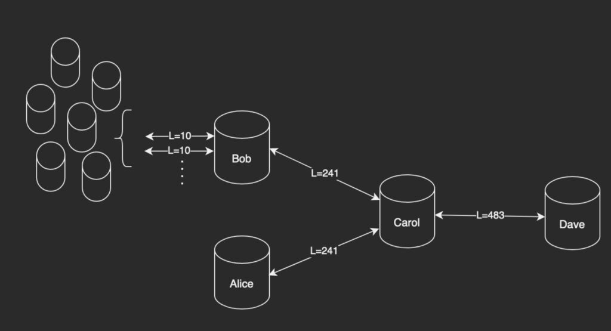

> *作者：BitMex Research*
> 
> *来源：<https://blog.bitmex.com/preventing-channel-jamming/>*

**摘要**：在本文中，BitMEX 受奖者 Gleb Naumenko 介绍了缓解闪电网络中的通道阻塞攻击（channel jamming）的方法。所谓 “通道阻塞”，就是攻击者恶意阻塞闪电网络中的流动性，办法是通过第三方的通道给自己支付，但不公开秘密值，因此这笔支付永远不会完成。Gleb 讨论了这个问题的可能解决方案，既包括短期的修复措施，也包括长期的协议改进。他的结论是，没有一招制敌的解决方案，而且一些高效的缓解方法可能非常复杂、难以实现。因此，我们还需要进一步的研究和讨论。

## 引言

因为闪电网络是一个免许可的系统（没有一个中心点能限制你使用它），它容易受到拒绝服务式攻击（DoS）。通道阻塞（channel jamming）正是这样的攻击的一个例子。

想要缓解通道阻塞而不影响闪电网络的免许可特性并不容易。在本文中，我会概述现有解决方案提议的设计空间。

本文基于许多闪电网络和比特币协议开发者在 2021 年秋天的讨论，是为好奇于闪电网络协议设计和熟知技术的闪电网络用户和追随者撰写的。

## 什么是 “通道阻塞攻击”？

闪电网络是由计算机节点组成的一个网络，这些节点通过支付通道来互帮互助（通常也要求手续费）、完成支付：即使 Alice 和 Bob 没有直接的支付通道，他们也可以使用由彼此间的路由节点连成的路径来传递支付；整条路径上的所有通道的余额都会同步调整。

这样的多跳交易应该具备原子性（要么成功，要么不成功，没有其它状态），不然路由节点就可以拿走资金而不转发支付。多条支付可以分成两个阶段：沿着从支付发送者到支付接收者的路径一路锁定资金，沿着从接收者到发送者的路径传播秘密值从而解锁资金。

通道阻塞攻击背后的主要想法就是通过发起虚假支付且永不完成，从而一直占用路由节点转发支付的能力。在攻击持续期间，因为资金被占用，路由节点就无法再转发其它（诚实节点发起的）支付了。

想要阻塞特定的通道时，攻击者会通过这些通道假装给自己支付，但作为接收者一直不公开秘密值。

## 通道阻塞的类型

有两种类型的通道阻塞攻击：

- 数额阻塞，攻击者锁死目标通道的一大部分容量
- 线程阻塞，攻击者通过让目标通道触发可同时处理的支付笔数上限来锁死其转发能力（我们会在 “成本基准” 一节更详细地解释这一点）

想了解关于通道阻塞攻击的更多信息，请参考：https://github.com/t-bast/lightning-docs/blob/master/spam-prevention.md 。不过，你无需完全理解参考资料中的所有底层细节，不会影响你阅读本文。

## 超时机制是不可行的解决办法

应对阻塞，最显然的解决方案是让路由节点在发现支付长时间卡住而没有完成时取消转发。

不幸的是，一旦支付转发出去了，就不能终止它。终止只能从路由的最后一跳一路回传。这是闪电网络协议保证路由节点的资金安全性的基础部分。

因此，因为最后一跳属于攻击者，他们在愿意停止攻击之前是不会回传终止信号的。

或者，路由节点可以在一开始商量更短的超时时间。但这也不管用，因为攻击者可以更频繁地重复攻击（从每小时发起一次虚假支付变成每分钟发起一次）。

## 难道扣住资金也是一种攻击吗？

闪电网络协议栈并没有明确声称让支付悬在空中无法完成就一定是恶意的，虽然这在有些时候可能就是恶意的，因为闪电网络主要用在低延迟支付中。

但是，这一点在未来也许会改变。举例来说，在[基于闪电网络的谨慎日志合约（DLC）](https://github.com/p2pderivatives/offchain-dlc-paper/blob/master/offchaindlc.pdf)中，锁定资金可能是完全真实的用户活动。

就我的观察，人们对长时间锁定资金（不是终止支付！）是否就是恶意还没有共识，有两种意见：

1. 协议应该遏制长期拖欠的支付
2. 协议应该切换到更灵活的流动性支付方法，将资金锁定的时间也考虑在内

幸运的是，似乎（后面会讨论的）两种最可行的长期解决方案都涉及到某种形式的支付（无论是通过原生的闪电支付，还是声誉代币），所以它们都或多或少适合 #2（只需少量的协议变更），或者只需成为实现 #1 的措施。

与此同时，我们还不知道如何在当前的协议中实现我们的目标：支付的发送者可以假装支付会很快送达，这样我们就既不能因为其支付花费时间超过预期而惩罚 TA，也不能取消超出预期时间的支付。

不过，假如我们最终搞清楚了如何对悬置的支付的收费，可能发送者跟接收者开设直接的通道、支付链上手续费而不是闪电网络的流动性费用，就会常常变成更经济的事。即使这可能意味着更少人会使用 “为锁定的流动性支付” 的特性，我们为了观察结果，也不得不实现这种机制。

## 成本基准

当前的协议已经为阻塞攻击设置了连带要求：攻击者必须开设一条闪电通道，意思是 TA 必须在链上锁定一些资金（资金有机会成本）并为通道的 开启/关闭 支付链上交易费。

但 开启/关闭 通道的复杂度是 O(1)，意思是，无论这个攻击者将阻塞多少流动性、阻塞多长时间，这个成本都是不变的，因此，这个成本对严重的攻击来说是可以忽略不计的（除非攻击需要开启许多通道）。

不过，资金的机会成本，可能足以防止数额阻塞：为了阻塞 X 聪的流动性，攻击者必须锁定 X 从（[环路攻击](https://lists.linuxfoundation.org/pipermail/lightning-dev/2015-August/000135.html)大概可以让攻击的效率提高越 20 倍）。

至于线程阻塞，成本就低得多了。（在当前）每一条通道可以同时处理的支付数量为 483 笔（超过这个数额就不安全了，因为关闭通道的交易无法保护超过 483 个输入）。

因此，攻击者只需要在一条通道中锁定 ` 483 * 最小支付额 ` 的资金，就可以用 483 笔最小支付额的支付阻塞一条通道，不论被攻击的通道本身有多少容量。（攻击者还必须为路由费预留一些资金，虽然并不需要实际支付，因为支付会失败，但还是必须预留，不然支付就无法转发。） 

## 渐进的解决方案

### 提高线程数量限制（由 [**@niftynei**](https://twitter.com/niftynei/) 提出）

如前所述，对支付通道的线程阻塞攻击的机会成本取决于线程的数量限制，而这个限制是从闪电网络协议中推导出来的。

然而，协议可以变更以支持在同一条通道中同时处理超过 483 笔支付。可以通过下列方法来实现：

- 修改闪电网络的链上交易结构（例如，我可以想象一条通道可以用两条互无冲突的交易来关闭，这样线程数量限制就可以翻倍）。可以通过嵌套来实现（举个例子）。
- 修改底层的比特币协议，以支持闪电网络相关的交易使用超过 483 个输入。

这两种解决方案都需要协议研究者付出大量努力来分析和实现，而且让通道阻塞攻击的成本线性增加可能不值得付出这么多的工作量。

### 给线程分类（由 [**@niftynei**](https://twitter.com/niftynei/) 提出）

我们可以为小额的和大额的支付设置两种不同的悬置交易限额。

*一条通道只能容许 483 条悬置支付* 的限制对粉尘支付来说根本就没有意义，因为它们本来也无法在链上申领（尽管协议允许它们存在）。与此同时，将这些粉尘支付与更大量级的支付都计算在线程数量内，也让线程阻塞攻击变得非常便宜。

因此，我们可以为更大量级的支付专设一个限制，同时为粉尘支付施加其它限制。

- 攻击者无法再用粉尘支付对更大量级的支付容量造成线程阻塞。
- 但是可以用更大量级的支付对粉尘支付的容量造成线程阻塞。换句话来说，若要阻塞更大量级支付的路由，攻击者必须锁定至少 ` 483  * 最低粉尘限额  ` 的资金，这时候没准线程攻击会比数额攻击的成本还要高
- 可以用粉尘支付来阻塞粉尘支付的容量（根据新设的粉尘支付的限制数量）

### 对等节点对上一跳施加限制

另一种解决方案是监控入账支付的流量，并根据流量的（直接）来源对等节点施加限制。

这种想法的一个简单实现是 joost 为 LND 开发的一个插件，叫做 “[circuitbreaker](https://github.com/lightningequipment/circuitbreaker)() ”。它可以低于便宜而不复杂的攻击，但可能也做不了更多了，因为支付的匿名性使我们很难断定失败支付的源头在哪里。

考虑如下例子：

假设 Dave 信任 Carol，因为后者的名声不错，因此不施加额外的限制。

Carol 希望保护她通过 Dave 转发支付的能力，因此她分别对 Alice 和 Bob 施加了 241 笔入账支付的限制。现在，Alice 无法防止来自 Bob 通道的支付通过 Dave 转发，反过来也是如此。

同样的逻辑也会传递给 Bob，变成 Bob 对自己的入账支付数量的的限制；但我们假设 Bob 希望开设很多条通道。为了防止这些通道彼此干扰以及限制 Bob 通过 Carol 转发支付的能力，Bob 需要对这些通道施加 241 笔入账支付的**总容量**限制。注意，如果 Bob 拒绝对入账支付施加这样的限制，Bob-Carol 通道就会变得更容易被 Bob 的对手方阻塞；即使 Carol 愿意转发来自 Bob 的支付，她也让 Bob-Carol 通道变得更容易被 DoS 攻击。因此，Bob 必须同样实施这种限制，才能达到限制攻击的效果。

现在，我们假设这个限制并不低，对 Bob 的客户来说已经足够了。在攻击者这边，这意味着要阻塞 Bob-Caorl 通道需要对 Bob 开设许多通道，以争抢 241 的容量限制，让原有的通道只能获得更少的支付笔数容量。最终这可能会变成一种新的，可能更糟糕的 DoS 机会。

当然，Bob 可以基于实际行为（比如有无支付手续费）来调整对攻击者的入账支付限制。但这也没有用，因为现在 Bob 的对手方可以影响 Bob 在 Carol 那里的声誉，而且 Bob 无法阻止他们。而且 Bob 依然无法越过 241 笔入账支付的总容量限制。

显然，最终来说，这种限制只有应用在整个网络中才会起作用。与此同时，通过多跳施加的责任限制不是最优的。

## 根本解决方案

### 预付手续费（由 [**@joost**](http://twitter.com/joostjgr/) 和 [**@t-bast**](https://twitter.com/realtbast) 提出）

这个[提案](https://github.com/t-bast/lightning-docs/blob/master/spam-prevention.md#proposals)背后的想法是但凡尝试了转账就要收费，而不是只对成功的转账收费。这可以通过改变路由协议来实现，路由节点将要求支付发送者以某种方式预付手续费。

这个方案的吸引力可能取决于闪电网络整体的支付失败率，因为要求用户为失败的支付付费可能是非常反直觉的，而且会让用户体验变得更糟。

但另一方面，闪电网络要想成功，就必须让支付失败率变得足够低，用流畅的体验和足够低的时延吸引用户（因为重试需要时间）。因此，围绕这个假设来设计协议又似乎是对的。

与此同时，保持低失败率也不容易，因为通道的余额不是公开信息；如果用更大体量的储备资金和流动性管理来实现的话，手续费又会变得更高。

因此，市场上会出现失败率更高但更便宜的路由选择。

除此之外，要想让整条路径都保持低失败率，就要让每一跳都实现低失败率（一条路径的成功率取决于起最薄弱的一跳），在给定的通道图谱中，可能是无法实现的。

缺点：

- 低失败率但更贵的路由可能是不现实的
- 对于失败率更高但更便宜的路由路径，使用更无感的方式为失败尝试支付流动性费用可能会更好（尤其是支付最终没有敲定的情况下）
- 可能激励路由节点故意让交易失败并敲竹杠（尚不清楚最终的路由经济模型如何工作），或以[别的方式](https://lists.linuxfoundation.org/pipermail/lightning-dev/2021-February/002965.html)打破经济激励。取决于具体的协议

### 支付发送者的声誉系统

除了对上一跳转播维持 DoS 抗性的责任，路由节点也可以对支付发送者采取行动。虽然这听起来有点奇怪，因为假设了支付发送者是已知的；当前，发送者的隐私性是由洋葱路由来保护的，牺牲这种特性可能是不可接受的。

### 权益证书（由 [**@gleb and @ariard**](https://thelab31.xyz/) 提出）

[权益凭证](https://thelab31.xyz/blog/stake-certificates)基于链上资金的所有权启用匿名的证书。换句话来说，使用一个路由节点的资源将需要证明发送者在一条通道中锁定了足够数量的资金（这个 “足够” 是由路由节点来定义的，比如每小时发送 1000 次支付将要求锁定 1 BTC）。

更具体来说，路由节点可能每次都会要求一个证书，并持续跟踪一个证书所有者的活动。

攻击者当然已经锁定了资金，不然都没法使用闪电网络，但拥有证书还可以：

- 让路由节点将来自同一来源的支付关联起来，以侦测攻击（也可能会导致一些去匿名化和审查）
- 基于证书的价值限制来自同一来源的支付

### 声誉代币（由 [**@roasbeef**](http://twitter.com/roasbeef/) 提出）

另一种声誉方案是让路由节点个体基于发送者个体的表现调整其容量。

举个例子，一个路由节点可以发送特殊的代币给一个支付发送者，而这些代币可以在日后为 经过该路由节点的高频支付 “付费”。

如果发送者发起了太多的失败支付，路由节点可以作废这些代币；或者，如果发送者的支付总是成功而且慷慨支付手续费，就增发代币。

### 两相结合

声誉代币的挑战之一是，尚不清楚应该一开始应该如何分发代币。

与此同时，权益证书的缺点在于相同来源的支付会被关联起来。

把两种思路结合在一起也许能同时解决它们各自的问题。流程是：

1. 支付发送者向路由节点出示权益证书，收到 10 个 代币

2. 支付发送者可以使用一个代币来发起一次支付

   2a）如果支付成功，发送者就能多得 1 枚代币

   2b）如果支付失败，这个代币就会作废

缺点：

- 实现起来很复杂
- 理解跟激励相关的问题可以需要大量的研究和真实世界的实验（例如：证书和代币会出现二级市场）

### 预付手续费还是建立声誉系统？

预付手续费和声誉系统似乎是两种不同的思路。

幸运的是，我们不必二选一。路由节点可以在他们的通道宣布建立之时（通过信号位）指定自己希望获得的路由补偿。

它们本身也有许多共同点：

- 加入 网络时锁定在通道中的资金就表示权益，跟证书类代币表示权益的方式类似
- 在尝试支付时要预付手续费，类似于支付之前先要耗费证书类代币

声誉代币的主要缺点在于，它们需要更复杂的协议来启动，而且可能在实质上伤害隐私性。而付出这些代价我们可以得到的是可能在激励上更加兼容的协议，以及一定程度上更好的用户体验；因为 证书/代币 不如比特币那样有价值（至少流动性没有那么强）

## 结论

虽然完全缓解通道阻塞攻击同时保留闪电网络的免信任特性也许是不可能的，但我们已经有主意让攻击变得更难了。

渐进式的解决方案可能被集成到闪电网络的实现中，或者现在节点运营者也可以自主运行，但它们是有限的。长期的根本解决方案则需要额外的研究和广泛的讨论。

希望本文有助于澄清解决方案的设计空间，从而帮助您更高效地推进这些想法。

## 致谢

衷心感谢  Sergei Tikhomirov、Lisa Neigut、Antoine Riard、Joost Jager 和 Clara Shikhelman 审读本文，并向所有为解决通道阻塞攻击贡献想法的闪电网络开发者表示敬意。

（完）