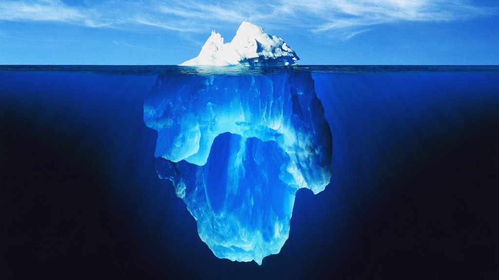

> *作者：nopara73*
> 
> *来源：<https://nopara73.medium.com/privacy-fungibility-anonymity-451d029355f7>*

> 虽然比特币是有史以来最不具备隐私性的系统，但是社区里的每个人都极其重视隐私性。[[来源](https://diyhpl.us/wiki/transcripts/scalingbitcoin/privacy-and-fungibility/)]

这句话并非只适用于像我这样的比特币开发者。这是一个广为人知的普遍现象，叫作隐私悖论（privacy paradox）。人们口口声声说自己非常重视隐私性，他们的所作所为却恰恰相反。

隐私悖论或许有很深远的影响，但它显露出来的只有冰山一角。当我们一头扎进匿名和身份的 “深海” 时，等待我们的将是关于人性和社会的深刻反思。

隐私性是实现自我发展的基本要素。随着全世界人民对隐私性的重视程度与日俱增，各国政府将迎来巨大变革。下一个国际储备货币所具备的同质化特性将推动人类进一步发展。

在本文中，我将探讨**匿名性、同质化和隐私性**的概念，并探究那些即将重塑隐私性未来发展趋势的新技术在心理、地缘政治和经济方面产生的惊人影响。



## 匿名性

我们首先从数学领域开始探究隐私性，因为这是匿名性概念所赖以生存的土壤。匿名性最早在 1998 年的研究论文[《在信息公开时保护隐私性：k- 匿名》](https://epic.org/privacy/reidentification/Samarati_Sweeney_paper.pdf)中正式提出。作者提出了两种对数据进行 k-匿名化的方法：一般化（generalization）和隐匿（suppression）。这里提到的 `k` 代表什么？如果你做了某个行为，另外 `k-1` 个人也做了和你相同的行为，将你隐藏在一个由 `k` 人组成的群体中，那你就是 **k-匿名的**。这个群体就是你的匿名集（**anonymity set**）。 `k` 的值越大，你的匿名程度就越高。`k = 1` 代表一个唯一的身份。因此，匿名性就是团队合作。[匿名性喜欢大隐隐于市](https://www.researchgate.net/publication/228348285_Anonymity_loves_company_Usability_and_the_network_effect)。

在比特币系统中，我们可以通过创建合作型交易来实现一般化，从而得到匿名性。

例如，[Wasabi Wallet](https://wasabiwallet.io/) 通常会将 100 个人聚集起来进行合作和共享交易，即 coinjoin。比特币交易包含输入和输出。输入的作用是花费 UTXO（未花费交易输出），输出是新生成的 UTXO。

Wasabi 钱包帮助用户将他们独一无二的 UTXO 进行 k 匿名。在理想情况下，coinjoin 有 100 个经过 k-匿名的不同输出，即 `k = 100` 。 **这些经过 k 匿名的 UTXO 彼此之间无法区分**。匿名化这一数学工具就是这样实现货币的不可区分性（又称同质化或可替代性）的。

## 同质化

> 货币是有史以来人类讲得最成功的故事。它不具备客观价值……但是之后出现了这些讲故事的高手：大银行家、财政部长等……他们来了，讲了个很有信服力的故事。
>
> —— Yuval Noah Harari [[来源](https://www.ted.com/talks/yuval_noah_harari_what_explains_the_rise_of_humans)]

为了推动人类的繁荣发展，改进货币技术至关重要。

合作（*瞄准、说话、讲故事、写作和货币*）的进步是人类超越其它物种的主要原因。抛开进化树不谈，我们的祖先学会瞄准同一个目标。然后，他们意识到如果不将这些狩猎故事通过口头或笔头的方式流传下来，将会是一件憾事。最后，他们发现了人类合作的圣杯：货币。有史以来第一次，货币使我们可以 …… 打住打住，我们跳步了。

故事在人们日常生活中的各个领域随处可见。它们不只存在于书本、电影和游戏中，还会在你思考、谈话、写作或敲代码时出现。连逻辑性最强、最严谨的科研论文中都有它们的身影。就生物学角度而言，人类生来就与故事密不可分，因为知识和智慧都是通过讲故事世代相传。**故事的出现扩大了人类一生中的合作范围。**

然后，货币出现了：“有史以来人类讲得最成功的故事”。Harari（《人类简史》的作者）认为货币是唯一一个人人都相信的故事。不是每个人都相信上帝、相信民主制、相信人权，而货币却是人们共同的信仰。为什么？

**纵观人类历史，货币让我们首次能够将自己的劳动成实（故事的精髓）抽象成最纯粹的形式：价值**。然后，我们可以将价值保存起来，甚至用来交换其它商品和服务。价值存储的安全性越高，交易摩擦力越小，货币的质量就越高。因此，不断改进货币技术对于推动人类进步而言意义重大。

我们该如何定义最优货币？

早在数千年前，雅典先哲亚里士多德就已明确定义了**良币的特性**。尽管经济学界在细节方面仍有争议，但基本概念是：货币必须是**耐久的、可分割的、稀缺的、稳定的、被普遍接受的、易于转移的、同质的**。

比特币（或另一种密码学货币，但比特币是最有可能的）将结束美元的霸权地位，成为最具价值的货币。除了稳定性、普遍接受性、易于转移性和同质性之外，比特币具备良币的其它所有特性。我将稳定性和可接受性视为元属性。随着市值上涨，比特币自然会获得这两个特性。可移植性同样值得关注。虽然将比特币交易变得便宜又快捷并非易事，但是人们为实现这些目标而付出的智慧不容小觑。

因此，同质性是我们首要关注的特性。最值得我们研究的莫过于比特币的同质性。

> 无论何种形式的货币，它们之所以有用，是因为人们比较有把握自己收到的每一块钱都能毫不费力地花出去。
>
> ——  Alastair Berg [[来源](https://www.researchgate.net/publication/326438277_The_Identity_Fungibility_and_Anonymity_of_Money)]

**同质性有助于提高货币的质量**。

同质性是一把标尺，反映了每单位货币的可互换性和不可区分性。[在其 2019 年的论文中](https://www.researchgate.net/publication/326438277_The_Identity_Fungibility_and_Anonymity_of_Money)，经济学家 Alastair Berg 指出 “关于货币的同质性可降低交易成本的问题已经得到了充分探究*（*[*Brunner and Meltzer, 1971*](https://kilthub.cmu.edu/articles/journal_contribution/The_Uses_of_Money_Money_in_the_Theory_of_an_Exchange_Economy/6708833/1)*；又见* [*Banerjee and Maskin, 1996, p.958*](https://scholar.harvard.edu/files/maskin/files/a_walrasian_theory_of_money_and_barter.pdf)*;* [*Menger, 1892*](https://mises.org/library/origins-money-0)*）*”。

这点并不奇怪。否定同质性就是违背货币的基本属性，这会产生交易摩擦，动摇人们对货币的信仰。Berg 还提到：“法币之所以有用，是因为它有可能被未来的某些交易接受，而非因为它具备任何内在价值或其它用途。”

## 隐私性

货币的同质性能够保障个人的隐私性。

**隐私性指的是个人能够选择是否将自己的身份信息暴露给外界**。在英语中，形容词 “private（秘密的）” 通常被当作形容词 “secret（秘密的）” 的同义词。但是，“secret” 的名词形式 “secrecy（保密）” 不涵盖 “privacy（隐私）” 的含义，因此这个词会造成人们的困惑。[1890 年出现了](https://en.wikipedia.org/wiki/The_Right_to_Privacy_(article))更加合法的定义。这一年，隐私性首次被提议为一项**基本人权**，并且被定义为 “不受打扰的权利”。缺乏同质性的货币剥夺了人们保密财务状况、划定财务生活的边界的自由。因此，**缺乏财务隐私是较差的同质性的直接后果**。

隐私性不只是律师或哲学家的玩具，因为它涉及到个人能力，而且有着很强的心理关联性。

每个人生来都是没有隐私的。之后，在成长过程中，我们学着划定边界，学着区分亲疏远近。[有关儿童的研究](https://www.jstor.org/stable/20014176)表明，儿童在生长过程中会逐渐形成自我概念。

[有关囚犯的研究](https://www.jstor.org/stable/26751641)表明，监狱中出现了隐私发展倒退的情况。在类似监狱的环境中，囚犯的自我概念会严重萎缩到只在乎他们的身体、一些即时动作和几样随身物品。

个人隐私遭到强行剥夺确实很不幸，但是把关注点放到自愿放弃隐私的情况上会更有启发，因为后者似乎频频发生。事实上，我们并非白白放弃隐私：而是用隐私交换了其它东西。简单来说，我们用自己的隐私交换的东西通常都微不足道，看起来就像是我们将自己的个人信息送给了其他人。这也[解释了为何会出现隐私悖论](https://www.sciencedirect.com/science/article/pii/S0736585317302022)：我们的成本效益分析和风险评估能力较差。

虽然出卖自我来交换金钱或其它利益本质上没有错，但是我们必须明白一点，如果我们不是有意识地做出这些决定，那么我们的自我意识并未完全形成。我们不清楚自己的边界在哪儿。我们对自我的了解还不足以决定我们愿意使用哪些个人信息来交换 Facebook 的使用权，或 Facebook 上可以测试你属于哪个霍格沃斯学院的第三方应用的使用权。

> 人与人之间的根本政治分歧是：你的周围应该有几堵墙？终极自由主义者的答案是零，终极保守主义者的答案是 “把墙都建起来！”。
>
> —— Jordan Peterson [[来源](https://youtu.be/LM_7W-fW-ic)]

目前，由于科技进步加快，社会正处于飞速发展时期。这些变化将给我们的隐私性（自由和个人主义）带来什么影响？未来将会如何？[据经济学家 ](https://youtu.be/ePPOjVAcVTk)[David Friedman ](https://youtu.be/ePPOjVAcVTk)[所言](https://youtu.be/ePPOjVAcVTk)，技术发展的趋势是构建一个高度重视隐私性的世界，但不一定如我们所期望的那样。

人类已经发明了**匿名通信**、**匿名货币**和**声誉系统**等技术。这是必然的。**这些技术都是在网络世界建设具备强隐私性的循环经济所必不可少的**。与此同时，在物质世界，我们的隐私性正在遭受侵犯。在物质世界，门和窗帘目前是保护隐私性的最佳手段。面对大规模监控技术的发展，它们又能抵挡多久？

技术让人类的力量变得更加强大。为了避免人类因错误地使用自己新获得的力量（例如，将致命病毒释放到外界）而导致灾难，也许唯一的办法是让所有人每时每刻都互相监督？在物质世界中，或许只有完全透明的社会才能平衡技术赋予我们的力量？

但是，这些都将变得无关紧要。随着网络世界发展（包括沉浸感越来越强的虚拟现实），**物质世界正在逐渐丧失意义**，甚至在很多人眼中已经变得毫无意义。也就是说，人们不会在乎来自物质世界的监视。对他们而言，真正重要的是在网络世界不会遭到监视。

Friedman 的猜想则更进了一步：如果大多数经济活动都发生在线上且不受政府控制，政府将沦为地主。为了实现税收最大化，政府之间会为了争夺公民而相互竞争。主权个人能够**自由选择**想要居住的地方。

> 政府无法对强隐私掩护下的经济活动征税。如果你认为政府更容易获取公民的钱财会让世界将变得更美好，你会觉得这是个缺陷；反之，你会觉得这是个功能。
>
> —— David Friedman [[来源](https://youtu.be/ePPOjVAcVTk)]

## 结语

匿名性是一种用来实现其它价值（如个体隐私性和货币同质性）的数学工具。在经济学中，同质性有助于提高货币质量，进而实现个体隐私性。隐私性对自我发展至关重要。在心理学领域，“自我”这一概念尤为重要，因为我们的隐私性（即，*我们划定边界的能力*）在过去已经发生了变化，现在仍在继续变化，未来还将经历巨变。

**未来，隐私性将带给我们不同以往的挑战**。我预测人们将在网络世界享有较强的隐私性，在物质世界享有较弱的隐私性。随着经济活动从线下转移到线上，物质世界将变得越来越不重要。与此同时，网络世界的重要性将与日俱增。未来，**等待我们的将是一个隐私性更强的世界。**

（完）