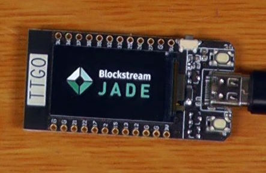
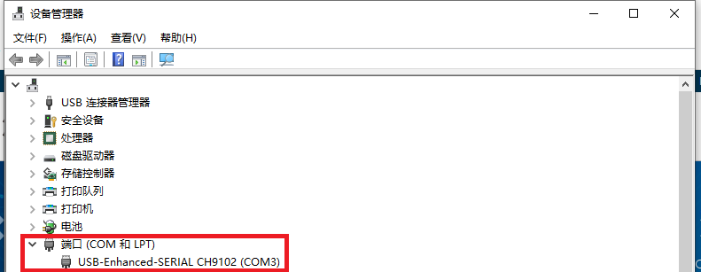
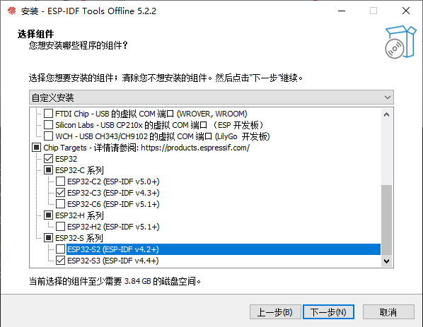
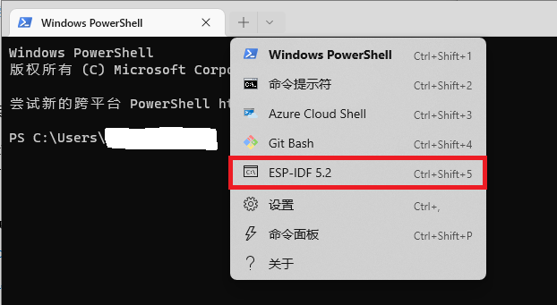

> *作者：Anony*


本文介绍了一种在 Windows 电脑上给 ESP32 开发板烧录固件、从而制作出 Jade-DIY 硬件签名器的方法。



## 简介：DIY 的 Jade

关于 Blockstream 公司推出的 Jade 硬件签名器，Mi Zeng 提供了一份[详尽的评测](https://www.btcstudy.org/2023/03/14/review-blockstream-jade-signer-by-mi-zeng/)。该评测介绍了 Jade 硬件签名器的安全模型，以及一些具有特色的安全功能。

因为 Jade 的固件是完全开源的，我们只需基于与正式版 Jade 相同的硬件，就可以制作出功能相同的硬件签名器（在下文中，我们将分别称为 “正式版 Jade” 和 “Jade-DIY”）。

经过测试，我们发现，尽管某一些 Jade-DIY 在功能上无法做到与正式版 Jade 完全相同（下文就会讲到其中一个原因：硬件基础），但在安全特性上，Jade-DIY 跟正式版 Jade 是一样的。正式版 Jade 所具备的安全特性（如：“虚拟安全芯片”、自我擦除 PIN 码），Jade-DIY 都具有。这为 Jade-DIY 赋予了巨大的吸引力，因为可以使用相当便宜的硬件来制作签名器。

而且，Jade-DIY 在基本功能上非常扎实，绝不逊色于现在市场上主流的签名器。

## 硬件挑选

在 Jade 的 [GitHub 库](https://github.com/Blockstream/Jade)中，有一个[专门的页面](https://github.com/Blockstream/Jade/tree/master/diy)，介绍了可以制作成 Jade-DIY 签名器的硬件。读者需要关注的有两个方面：（1）是否配备摄像头，这也是该页面分类的依据；（2）硬件本身的 USB VendorID 和 ProductID 与正式版的 Jade 是否一致。

后者决定了当我们使用 USB 连接制作好的 Jade-DIY 时，软件钱包会不会将它识别成 Jade。如果不会，则使用起来会更麻烦。不过，这些硬件基本上都支持蓝牙，因此总可以使用蓝牙来连接签名器（如果软件签名器支持的话，比如移动端的 [Green Bitcoin Wallet](https://blockstream.com/green/)）。此外，如果你选择使用配有摄像头的硬件，则总是可以使用 Air-gapped（隔空交互）的交互方式（主要就是扫码），因此不必再介意这个问题。

**本教程只针对没有摄像头的硬件**。在这些硬件中，USB VendorID 和 ProductID 与零售正式版 Jade 一致的有（空格前是品牌名，空格后是型号）：

- LILYGO T-Display
- M5Stack Basic Core
- M5Stack FIRE

出于经济性的考虑，笔者选择了 T-Display。在笔者购买之时，其本身的价格只需 65 元。读者在采购时，应注意不要与 T-Display S3 相混淆。笔者购买的是编号为 Q125 的版本，为使用便利，可以单独购买一个外壳（12 元）。[据说](https://github.com/epiccurious/jade-diy?tab=readme-ov-file#ttgo-t-display)自带外壳的 K164 版本也可以制作成功。

下文就将以 T-Display 为示范。另外两款硬件与 T-Display 使用相同的芯片，因此其刷机流程的相似的。

## 连接硬件

T-Display 的 USB 连接口是 Type-C 型的，读者应另外准备好 Type-C 的 USB 连接线。连接 T-Display 之后，观察其能否正常启动。正常情况下，它会先显示 “LILYGO” 的图标，然后出现 “SD card mount failed” 的警示语。

然后，打开 Windows 的 “设备管理器”，查看 “端口（COM 和 LPT）” 项下是否有 “USB-Enhanced SERIAL CH9102 (COM3)” 一项。如无，则说明未正常连接，应该安装[驱动](https://www.wch.cn/downloads/CH343SER_EXE.html)。下载并安装驱动后，尝试再次连接。

如果你安装驱动后依然无法连接，请尝试换一根 USB 连接线（有一些连接线只有供电功能，而没有数据传输功能）。



> 上面提到的两款 M5Stack 硬件与 T-Display 使用相同的 USBT 芯片，因此可以用相同的方式检验连接。

## 安装开发工具

在[ESP-IDF 的网站](https://dl.espressif.com/dl/esp-idf/)下载开发工具，请下载 “ESP-IDF v5.2.2 - Offline Installer”。打开安装程序后，在选择安装内容的页面，应该：（1）安装 “Powershell 支持”；（2）在 “Chip Targets” 中，至少安装 “ESP32” 和 “ESP32-S3”。（第一项 “Framework” 和第二项 “ESP-IDF 5.2” 一定不能省去）。



安装好之后，尝试在新的 PowerShell 窗口的菜单栏中，点击 “+” 号，选择 “ESP-IDF 5.2”，打开一个 ESP-IDF 环境。如果你的 PowerShell 窗口并不如图所示，则请尝试使用别的方式（比如 “开始” 菜单



## 下载 Jade 源代码

首先，请确保自己安装了 [Git 软件](https://git-scm.com/download/win)。这是一种版本控制工具，可用于下载开源软件的源代码。

在一个你喜欢的文件夹中，打开 PowerShell 窗口，输入以下命令并运行：

```
git clone --recursive https://github.com/Blockstream/Jade.git
```

这行命令会新建一个 “Jade” 文件夹，并下载 Jade 源代码。

接下来是本教程最重要的章节。

## 编译烧录固件

在烧录固件时，可以选择启用或不启用 “Secure Boot”。Secure Boot 的功能是给设备注入一个公钥，并要求烧入的固件具备该公钥的签名。如果烧入的固件不具备有效的签名，则设备会拒绝启动。这是一种有用的安全措施，可以防止自己的设备被他人注入带有恶意代码的固件。Jade 源代码库中的 DIY 指南也推荐启用 Secure Boot 功能。因此，本教程也强烈建议启用 Secure Boot 功能。

下文的 “实验性烧录” 章节将介绍不启用 Secure Boot 的烧录流程；顾名思义，这主要是为了让读者熟悉刷机的流程。而 “安全烧录” 将介绍启用 Secure Boot 的烧录流程。

注意，此处介绍的启用 Secure Boot 的操作是不可逆的，一旦启用，就无法取消。也即此后如果想要更新设备的固件，也必须使用相同的私钥、签名新的固件，才能刷入。弄丢这个签名固件的私钥将无法再给这个设备更新固件。

### 提前准备

**CMD 中的 Python3**

在开始烧录之前，请先打开电脑的 “命令提示符（CMD）”，输入 `python3` 并回车执行。如果它正确识别及执行，应该能在窗口中看到这样的信息：

```
Python 3.12.3 (tags/v3.12.3:f6650f9, Apr  9 2024, 14:05:25) [MSC v.1938 64 bit (AMD64)] on win32
Type "help", "copyright", "credits" or "license" for more information.
>>>
```

如果程序的反应是打开 Windows 商店，说明 CMD 在得到命令 “python3” 时无法正确识别并执行 python 的对应版本，这会导致后续编译中出现一个错误。必须修复这个错误。一种奇怪但有效的办法是在你的 Python 文件夹中复制 “python.exe”，并粘贴到同一文件夹，然后将副本重命名为 “python3.exe”。

> 给出这个提醒是因为在笔者使用的两台 Windows 电脑（系统分别是 Win10 和 Win11）上，都出现了由此引发的编译错误。

**ESP-IDF 运行环境的运行文件夹**

在任意文件夹中打开 “ESP-IDF 5.2” 运行环境；打开之后，它会自动运行一系列环境设置，以保证我们可以使用 ESP-IDF 的功能。运行成功后，它会输出一系列信息，末尾是这样的：

```
Go to the project directory and run:
    idf.py build
```

ESP-IDF 的初始运行环境是其安装文件夹，比如说： `~\Espressif\frameworks\esp-idf-v5.2.2` ，我们需要使用 `cd` 命令，切换到 “Jade” 文件夹。假设你的 “Jade” 文件夹的地址是 `D:\esp\Jade`，那么就在 ESP-IDF 运行环境中输入：

```
cd D:\esp\Jade
```

最终，你的运行环境的开头应该是这样的：`PS D:\esp\Jade>` 。

**OpenSSL**

为了生成足够安全的用于签名固件的私钥，请安装 [OpenSSL 软件](https://slproweb.com/products/Win32OpenSSL.html)。

### 实验性烧录

在位于 “Jade” 文件夹的 ESP-IDF 运行环境中输入以下命令：

```
cp configs/sdkconfig_display_ttgo_tdisplay.defaults sdkconfig.defaults
```

这行命令的作用是从 “configs”文件夹中复制一个配置文件，到 “Jade” 文件夹中。需要复制的配置文件当然是因设备而定的，这里提供的是 T-Display 的配置文件。

> 如果你使用的硬件是 “M5Stack Basic Core”，则命令要改成:
>
> ```
> cp configs/sdkconfig_display_m5blackgray.defaults sdkconfig.defaults
> ```

然后，运行以下命令：

```
idf.py build
idf.py flash monitor
```

第一行命令会将文件夹内的源代码编译成可以烧录进入 T-Display 的固件，第二行则实际写入，并在刷机成功后让 T-Display 重启。

以上就是实验性刷入的过程。你可以把玩一下，看看 Jade-DIY 的功能。

> 如果你在刷机过程中出错，导致 T-Display 无法正常开机、也无法连接电脑，那么可以尝试[这个页面](https://docs.espressif.com/projects/esp-idf/zh_CN/stable/esp32/get-started/flashing-troubleshooting.html)介绍的操作：尝试先断开连接线，然后同时按住机身的三个按钮，然后重新连接电脑。

### 安全烧录

**生成配置文件**

在位于 “Jade” 文件夹的 ESP-IDF 运行环境中输入以下命令：

```
./tools/mkdefaults.py ./configs/sdkconfig_display_ttgo_tdisplay.defaults NDEBUG SECURE
```

运行后，在 “Jade” 文件夹里检查是否有 `sdkconfig`、`sdkconfig.defaults` 和 `sdkconfig.defaults.orig` 三个文件。

使用 “记事本” 打开 `sdkconfig.defaults` 文件，寻找其中是否有这几行：

```
CONFIG_SECURE_BOOT=y
CONFIG_ESP32_REV_MIN_3=y
```

如果没有这几行内容，或者没有上述三个文件，请重复运行上述命令。

**生成签名固件的私钥**

然后，在 ESP-IDF 运行环境中运行以下命令、使用 OpenSSL 软件生成用于签名固件的私钥：

```
openssl genrsa -out ../jade-diy-v2.pem 3072
```

该行会在 “Jade” 文件夹的上级文件夹中生成一个名为 `jade-diy-v2.pem` 的私钥，该私钥将用在固件的签名中。

你可以使用别的文件名称，也可以指定另一个文件夹。但这就需要你回过头修改 `sdkconfig.defaults` 文件中 `CONFIG_SECURE_BOOT_SIGNING_KEY=` 一行中的相对地址。从便利和安全的角度出发，可以按上述命令生成私钥；在完成烧录后，将该私钥移动到其它相对隐蔽的地方；当以后需要升级固件时，再将私钥放回原位、签名固件并烧录。

**生成引导加载程序和固件**

 在 ESP-IDF 运行环境中运行以下命令：

```
idf.py bootloader
idf.py build
```

第一行会生成引导加载程序。该程序负责执行 Secure Boot 的功能。第二行则生成执行实际功能的固件。

在运行第一行命令时，程序可能无法成功运行，因为 `SDKCONFIG_DEFAULTS '~/Jade/sdkconfig.defaults.tmp' does not exist` 。这时候，往往只需再次运行上文 “[生成配置文件](#生成配置文件)” 一节中的命令，就可以生成所需的 `sdkconfig.defaults.tmp` 文件。 

**写入引导加载程序**

在启用 Secure Boot 之后，ESP-IDF 不会再自动刷入引导加载程序，因此，我们需要手动刷入。

在 ESP-IDF 运行环境中运行这条命令：

```
esptool.py write_flash --erase-all 0x1000 ./build/bootloader/bootloader.bin
```

在这里，`--erase-all` 的意思是清空闪存中的全部内容（如果你在此前尝试过实验性烧录，可能需要这个标签）；而后面的 `0x1000` 则代表写入闪存的位置，后面则是待写入的 引导程序的文件位置。

合理的写入位置可能因设备而不同，如果你并不使用 T-Display，请仔细阅读 `idf.py bootloader` 命令运行过程中出现在屏幕上的内容，它将提示你： `Secure boot enabled...`（启用了 Secure boot，因此引导程序不会自动烧录）；再下面就是一行能够执行的命令，包含 `python.exe`、`esptool.py` 字样。可以复制该行命令来代替上面这行命令，也可以在该行命令中找出 `0x` 开头的、表示闪存地址的字符，替换掉上文命令的 `0x1000` 然后执行。  

如果你无法运行这行命令，则你可能是未正确安装 `esptool`，可以尝试运行 `pip install esptool` 来解决。

**写入固件**

在 ESP-IDF 运行环境中运行以下命令：

```
idf.py flash
idf.py monitor
```

在运行第二行时，如果长时间运行不结束，可以同时按下键盘上的 “Ctrl” 和 “]” 键主动结束。看看 T-Display（现在应该叫 “Jade-DIY” 了）能否正常启动。可尝试按下设备顶部的重启按钮。

安全烧录，完成！

## 更新固件

连接 Jade-DIY，在 “Jade” 文件夹下的 ESP-IDF 运行环境中，运行 `python jade_ota.py --noagent` 来更新固件。该过程可能需要安装一些 python 的依赖，使用 `pip install` 来解决。

目前，T-Display 可用的最新固件版本是 `1.0.31`，相对于正式版 Jade 的固件是落后的。

## 操作指南

- T-Display 机身一共有三个按键。在操作 Jade-DIY 时，机身顶部的按钮是 “重启” 键；单独按下机身的两个按钮，可以移动屏幕上的光标；确认选择时，则要同时按下这两个按钮。
- 在初始化 Jade-DIY（“Setup Jade”）时，Jade-DIY  会要求你设置一个 6 位数的数字 PIN 码。该 PIN 码在安全上极为关键。但是，要解锁、使用 Jade-DIY 时，必须先使用一款适配的软件钱包唤起 Jade-DIY，才能输入 PIN 码、解锁。
  - 这样的软件钱包有：桌面端：[Sparrow Wallet](https://sparrowwallet.com/)、[Electrum Wallet](https://electrum.org/)；移动端：[Green Wallet](https://blockstream.com/green/)。Jade-DIY 可用 USB 连接电脑，用蓝牙连接手机。Jade-DIY 的蓝牙功能默认关闭，需要手动开启。
- 连接到软件钱包后，使用体验就跟主流的硬件签名器没有多大区别。当需要签名交易时，交易的详细信息将在屏幕上显示。
- 解锁 Jade-DIY 之后，可以在 “Duerase PIN” 中设置 “自我擦除 PIN 码”。设置好之后，一旦在解锁时输入这个 PIN 码，将删除设备内的所有内容（包括加密的种子词）。
- Jade-DIY 具备绝大多数 bitcoin-only 签名器的功能，单签、多签都不在话下。

## 安全分析

Jade-DIY 的安全模型是什么样的？

在本教程中，笔者介绍了启用 Secure Boot 的刷机流程；Secure Boot 是一项非常重要的安全措施，可以应对 Jade-DIY 被注入恶意固件的风险。这种风险是真实的，目前，几乎所有的硬件签名器都提供了这一方面的防护（比如 Keystone，在升级固件的时候也会校验固件有无签名）。

应用 Secure Boot 之后，经过测试，我们认为 Jade-DIY 的安全性跟正式版 Jade 是一样的。那么正式版 Jade 的安全性又如何？

如本文开头提到的 [Mi Zeng 的评测](https://www.btcstudy.org/2023/03/14/review-blockstream-jade-signer-by-mi-zeng/)所说的，Jade 以 “虚拟安全芯片” 的设计，来处理 “[安全芯片 vs. 开源](https://twitter.com/zengmi2140/status/1616069454772994049)” 的取舍：在加密保存种子词的过程中，Jade 使用了来自一个远程服务器的密钥（与本地的 PIN 码共同加密种子词）。而在解锁 Jade 的过程中，只有提供设置好的 PIN 码，才能让适配的软件钱包跟远程服务器通信、获得这个密钥。（这也是为什么在使用其本身保存的种子词时，必须跟适配的软件钱包一起工作）。

因此，这种模式的安全性，是大于完全不使用安全芯片、也没有额外设计的硬件签名器的（比如较早版本的 Trezor 签名器）。

不过，与使用了安全芯片并附加了自毁机制（拆机自毁、无效 PIN 码输入达一定次数后自毁）的签名器相比，Jade 在应对设备被劫持之后的物理攻击时稍显不如。

总的来说，Jade-DIY 以较低的成本，提供了相当不错的安全性，也提供了足够强大的功能。

开源运动万岁！

## 致谢

感谢 Mi Zeng 在本文撰写阶段给出的有益指引和探讨，当然，文中一切错误由我自己负责。