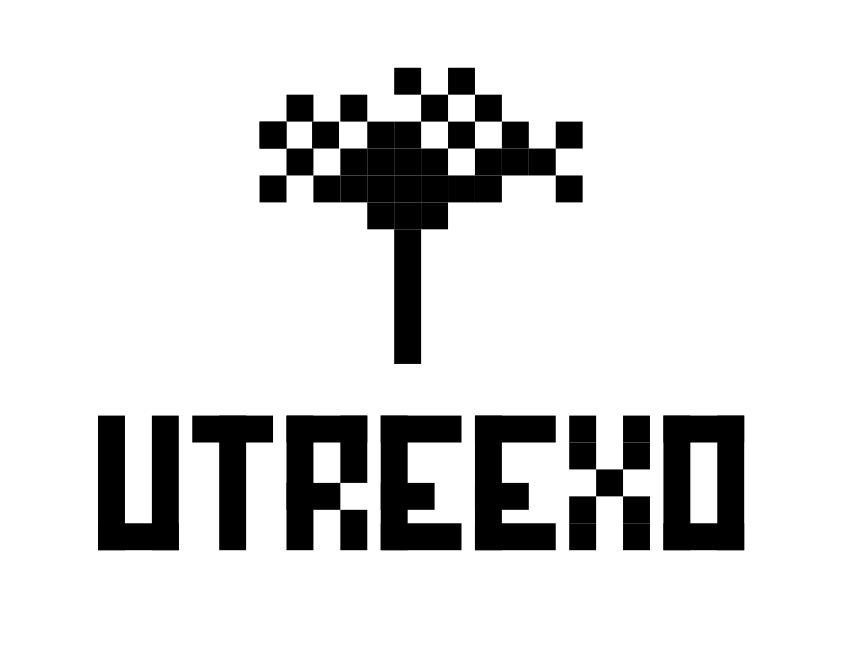
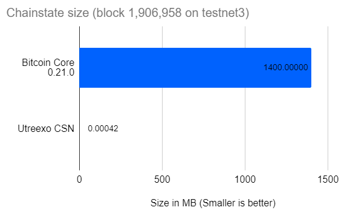
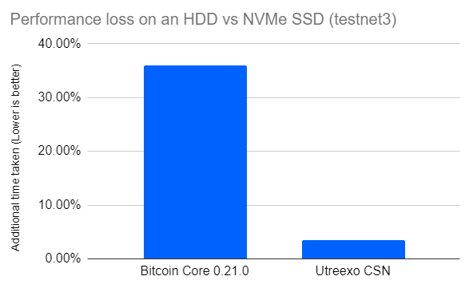

> *作者：Calvin Kim*
>
> *来源：<https://blog.bitmex.com/progress-towards-utreexo-goals/>*
>
> *本文发表于 2021 年 2 月 1 日。*

在 2020 年 7 月放出的最新演示中，我们表示 Utreexo 项目将在 btcd（比特币的一种 Go 语言实现）中实现 Utreexo 累加器。现在，我很高兴能郑重地宣布，这个实现已经准备好发布下一个演示了。在这次发布中，我们可以演示一种叫做 “致密状态节点（Compact State Node，CSN）” 的新型修剪模式。

我在 2020 年 4 月发表的文章 “[ELI5: Utreexo – A scaling solution](https://medium.com/@kcalvinalvinn/eli5-utreexo-a-scaling-solution-9531aee3d7ba)”（[中文译本](https://www.btcstudy.org/2021/12/06/eli5-utreexo-a-scaling-solution/)）中，我陈述了 CSN 可以提供的诸多好处。这些主张包括：

1. 只需下载几千字节就可以成为一个新的全节点，机械硬盘（HDD）同步起来和固态硬盘（SSD）一样快
2. 允许在节点初次加入网络、下载区块时并行化下载
3. 让共识过程可以独立于数据库的实现，从而增强比特币的安全性（[当前比特币软件的数据库](https://github.com/google/leveldb)是谷歌开发的）
4. 不需要实施硬分叉，就可以将 Utreexo 引入比特币网络

按照当前的开发进度，第 3 项和第 4 项好处已经实现了。第 1 项算是部分实现了，因为节点体积进一步削减的瓶颈在于非 Utreexo 的数据。第 2 项好处则还在开发中。

## 为什么好处 # 3 很重要

*通过让共识运行独立于数据库的实现，来加强比特币的安全性（比特币实现当前使用的数据库是由谷歌公司开发的）*

这几年来，提升比特币安全性的一个重要焦点，就是移除比特币的所有**对外依赖**。所谓对外依赖，就是一些并非由比特币开发者编写、但对比特币软件的运行是必要部分的代码。对外依赖在所有安全敏感的的项目中都是要尽可能避免的，因为它们可能是 bug 的来源。这种风险可以通过审核依赖库、维持使用经过审核的代码备份来缓解。但是，这种办法也不是完美的，对外依赖也不如使用比特币开发者直接编写、测试和审核的代码。因此，比特币开发者一直在移除对外依赖（移除对 OpenSSH 代码的依赖就是一例）。

当前，最大的对外依赖就是数据库，因为 **UTXO 集**和区块索引都是存储在数据库中。现在比特币软件使用的数据库来自谷歌，叫做 “LevelDB” 。因此 LevelDB 没有 bug 就对比特币的安全性至关重要。如果 LevelDB 中有 bug，它可能允许某人多重花费同一笔钱，或者导致意料之外的分叉。实际上，在 2013 年，Bitcoin Core 软件中对 Berkeley DB（在 LevelDB 之前使用的数据库软件）的错误运用就导致了旧的 Bitcoin Core 节点在读取 225430 号区块时出错，最终导致了一次意料之外的分叉。

（上面提及的 UTXO 集是当前所有可以花费的比特币资金的数据表示。这个 UTXO 集对比特币安全性是生死攸关的，因为它直接就是比特币共识的一部分；移除对 LevelDB 的依赖可以极大地提升比特币的韧性。）

## 实现好处 #3

总的来说，需要一个数据库是因为 UTXO 集合中有超过 6000 万条 UTXO，而所有 UTXO 都必须被跟踪而且能快速访问，因为缓慢的访问会降低初次区块下载的速度。数据库软件经常用在这种需要快速访问大量微小数据的情形。

不过，有了 Utreexo CSN，我们就完全不需要数据库了。相反，我们只需让 UTXO 的发送者提供该 UTXO 以及相应的 Utreexo 累加器证据，证明该 UTXO 存在即可。因此，我们不再需要在 Utreexo CSN 实现中跟踪一个 UTXO 集。又因为我们不需要跟踪 UTXO 集，我们可以将 LevelDB 从比特币共识的另一个关键部分中移除。

下图是当前的区块验证与 Utreexo CSN 区块验证的区别：

| 当前的区块验证                                               | Utreexo CSN 区块验证                                      |
| ------------------------------------------------------------ | --------------------------------------------------------- |
| 1. 检查工作量证明                                            | 1. 检查工作量证明                                         |
| 2. 针对每一笔交易的每一个输入，在 UTXO 集（LevelDB）中检查其所引用的输出是否存在 | 2. 检查区块中每一笔交易所引用的 UTXO 都有累加器证明并验证 |
| 3. 为每一个输入验证脚本和签名                                | 3. 为每一个输入验证脚本和签名                             |

唯一的区别在于，Utreexo CSN 的区块验证不需要访问数据库。相反，它是验证 Utreexo 证明。

需要做的代码变更非常小，区块验证函数的大部分内容都可保持原样。在检查完累加器证据之后，当前经过验证的 UTXO 数据（为验证当前区块所必需）被转化成现正使用的 UTXO 集缓存结构，叫做 “ UtxoViewpoint”（在 Bitcoin Core 软件中则是 “CCoinsView”），然后传递给现正使用的验证函数。

## 好处 # 4 的重要性

*为比特币引入 Utreexo 不需要分叉*

需要一次分叉来增加新功能是比特币这样的去中心化系统的一个很大的挑战（风险）。在比特币上施行硬分叉基本上是不可能的，因为从启用一个新功能中获得的好处不足与对冲链分裂的风险。软分叉也是很难推行的，因为需要社区的大部分人买账才行。

另一方面，如果一项新功能只需选择加入即可使用，不需要分叉，则这样的功能的开发工作也会变得简单许多。“BIP-152：致密区块转发” 即是一个很好的例子：它被广泛接收了，而且不需要分叉来引入。喜欢致密区块转发功能的用户可以主动开启，又因为这项功能是选择性加入了，其他不感兴趣的人无需做任何变更。

## 实现好处 # 4

这是最容易实现的一个主张，因为在 Tadge Dryjx 第一次写作 Utreexo 论文的时候，这个问题就已经解决了。我们通过使用叫做 “桥节点（bridge node）” 的传统节点来沟通 Utreexo 节点和现有的比特币节点，从而避免软分叉。

在遇到非 Utreexo 节点的连接时，桥节点的表现与当前的比特币全节点没有区别。不过，当 Utreexo 连接连入时，它将在为之提供普通区块的同时提供相应的 Utreexo 证明。

我们的发布文档中也提到，Utreexo 的二进制代码中硬编码了它只会连接到我们运行的桥节点，免得干扰比特币的测试网络。

## 好处 # 1 的重要性

*只需下载几千字节就可以成为一个新的全节点，机械硬盘（HDD）同步起来和固态硬盘（SSD）一样快*

上面提到的 UTXO 集是运行一个全节点的必要前提。不过，随着用户数量的增加以及比特币被分割成越来越小的数额，UTXO 集的体积也日益增大。当前，UTXO 集的大小约为 4 GB，但它还会逐渐扩大，可能会变成普通亲民设备无法处理的规模。如果比特币想容纳更多用户，给 UTXO 集瘦身就是至关重要的。

在当前的比特币节点中，任意一个 UTXO 被区块引用时，节点都要检索出这个 UTXO，无论是从硬盘中检索，还是从内存的缓存中解锁。这就是比特币当前面临的瓶颈之一，因为节点的硬盘速度可能较慢。在剪枝节点（pruned node）中，它更是一种约束，因为当区块被修剪掉，缓存的 UTXO 会写入到硬盘中。结果是剪枝节点在同步时会比不修剪的节点要慢，如比特币开发者 Pieter Wuille 在[此处](https://twitter.com/pwuille/status/1333132452643016704?s=20)所述。

有了 CSN，就不存在这种迟滞了，因为根本没有在硬盘中读取 UTXO 集的需要。结果是，CSN 在不同的存储设备上的表现会一致，不论是 nvme 固态硬盘还是机械硬盘。

## 好处 # 1 的开发进展

“只需几千字节就能运行一个全节点” 尚未实现，因为其它元数据（包括区块头）也又几百 MB 的大小。即时链状态本身很小，要想实现 “几千字节的全节点”，其它数据也显得不可小视。在这一个版本中，我们的最终成果是几百 MB。

跟 Bitcoin Core 相比，只比较链状态的规模的话，就如下图所示：

如你所见，Utreexo CSN 的链状态体积只有 424 字节，因此，对于整个节点的体积来说，基本上可以忽略不记。实际上，用来记录已知对等节点以备在重启时连接的 peers.json 文件，都有 205 kb，是链状态的约 483 倍。

这里还有 Bitcoin Core 剪枝节点和 Utreexo CSN 节点在使用 NVMe 固态硬盘和机械硬盘时候的性能表现。

测试的方法是让被测试的节点连接另一个本地的 Utreexo 桥节点，并且桥节点会从一个单独的 NVMe SSD 上读取数据。做测试的网络是 testnet3，Bitcoin Core 使用了假设有效（assumevalid）模式，设到区块号 186 4000 处；CND 也实现了 assumevalid 模式，并设到区块号为 186 4000 处。测试在 testnet3 达到 190 6000 高度时完成。

我们使用的硬件配置：

- CPU：AMD Ryzen 3600
- 内存：三星 32GB DDR4 2666MHz
- 本地服务节点的 NVMe 硬盘：2TB 闪迪 ULTRA M.2 NVMe
- 测试节点的 NVMe 硬盘：1TB 惠普 SSD EX950 M.2
- 测试节点的机械硬盘：西部数据 Digital WD10EZEX-22BN5A0 1TB 7200RPM

给 Bitcoin Core 节点使用的设置包括：

- -prune=550
- -connect=127.0.0.1
- -disablewallet
- -blocksonly 
- -testnet

使用 Bitcoin Core 时，NVMe 固态硬盘完成测试花了 784 秒，而机械硬盘完成测试花了 1066 秒。而使用 Utreexo CSN，NVMe 固态硬盘完成测试花了 1643 秒，而机械硬盘花了 1700 秒。

注意，当前的 Utreexo CSN 实现上还有许多性能上的优化可以做。它现在比 Bitcoin Core 要慢是因为我们复用了 btcd，而 btdc 本身比 Bitcoin Core 要[慢得多](https://blog.lopp.net/2020-bitcoin-node-performance-tests/)。

## 好处 # 2 的重要性

*让初次区块下载可以并行化*

为避免误解，这里说的 “并行化” 指的是链层面的并行化，也就是一个节点可以同时验证多个范围内的区块，例如：10 0001 ~ 20 0000 和 20 0001 ~ 30 0000 的；并不是指区块层面的并行化（可以同时验证一个区块内的多个签名），因为这个在 btcd 和 bitcoin core 里面都已经实现了。

计算科学中的 “并行化” 指的是可以同时执行多个线程，它可以更好地利用硬件（CPU）的性能，在硬件有资源闲置时可以提高性能。近几年来，由于在提高时钟速度方面的物理限制，CPU 开发陷入了瓶颈。反过来说，比起提升时钟速度，人们更关注核心的数量。软件开发的范式也紧随其后，为了利用更多的 CPU 核心，今天的软件开发也特别强调并行化。

初次区块下载的并行化具有非常强大的潜能，有望在全节点同步上扮演破局者、让个人能够更容易运行一个全节点。更多的节点让比特币网络更难被攻击。在这个意义上，并行化也可以被认为是对比特币的安全性的提升。

## 好处 # 2 的进度

任何区块的验证都基于前一个区块所形成的 UTXO 集。举个例子，如果你要验证 501 号区块，你就需要区块号 500 处的 UTXO 集。不过，要想获得区块号 500 处的 UTXO 集，我们又需要区块号 499 处的 UTXO 集。这个依赖于前序区块处理完之后的 UTXO 集的问题可以一路上溯到创世区块（它是硬编码的）。这解释链层面的并行化的难点。

有了 Utreexo，问题就变得更简单了，因为 UTXO 集只有几百个字节，而不是几 GB。所以我们可以把整个 UTXO 的表示硬编码到软件中，作为并行化验证的起点。

注意，对等节点可能是恶意的，可能会给出一个错误的 UTXO 集。不过，这不会降低我们的安全假设，因为我们只是让多个 CPU 核心从创世区块一路验证到区块号 499 处。我们从区块高度 501 处继续验证，是利用了这些 CPU 一直有闲置的事实。当创世块到 499 号区块的验证完成时，我们就能检查区块来看看该区块与区块高度 500 处的 UTXO 集是否匹配。因此被硬编码的 UTXO 集合表示只是用来加快处理的，所有的事情跟原来一样，都是得到验证的。

为了支持这种类型的链并行化，我码必须支持保管多个需要读写的链状态。保管任意 n 个链状态（哪怕 n 为 2）的主要困难在于要跟踪 n 个 UTXO 集。因为一个 UTXO 集就需要一个数据库和一个相应的缓存，存储在硬盘上以备加速，这会使运行节点的硬件门槛提高许多。不过，因为 Utreexo CSN 消除了对数据库的需要，这也不是一个问题。

保存多个链状态的实现（Bitcoin Core 中的 CChainState，在 btcd 种写作 “Blockchain”）已经在开发了。这件事情对 Utreexo 来说已经大大简化了，因为不需要为每个链状态安排一个数据库，所以我们可以实现保存任意 n 个链状态。

当前，我们还在研究每个链状态要如何处理网络的 p2p 消息。我们一直在尝试不同的方法（设置两个初始区块下载管理器；跟踪哪个链状态请求了哪个区块；等等），但还有许多功夫要花。

## 这个版本的局限性

在当前的版本中，我们还不支持链重组和交易池。因此节点会在 “只下载区块（blocksonly）” 模式下运行，如果出现了链重组，节点就会宕机。这两件事在 Utreexo 库中都还未实现，这就是为什么这个版本只是一个演示。这个版本不支持同步比特币主网，也不应用于管理真正的自己找，因为它还处在带有已知 bug 的早期节点。

## 下一步

就像我们在 “好处 # 1 的进展” 一节里说得，我们会在 Utreexo CSN 上做一系列性能优化。既包括加快 Utreexo 累加器的速度，也包括 btcd 组件的速度。我们现在已经知道了，许多问题一旦修复了就可以加快 CSN 的速度（只是实现和测试问题）。

链重组处理的开发从去年开始，但被搁置了，因为还有其它许多紧迫的问题要处理。重组处理将在不远的将来实现。虽然交易池的实现还未开始，我们已经计划了一段时间了。我完全相信交易池功能将在今年内实现。

当前的 Utreexo 累加器的代码是用 Go 语言编写的。将累加器的代码移植到 Rust 和 C++ 是我们正在做的事。我们不知道这些事情要花多少实现，但我们的代码已经有了骨架，允许我们并行开发了。有很多工作要做，欢迎你来贡献！

（完）