> *作者：KF*
> 
> *来源：<https://www.somethinginteresting.news/p/proof-of-stake-will-not-save-us>*

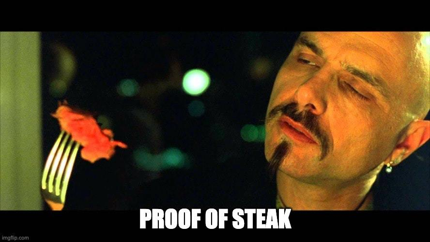

> 密码学货币圈子内外，越来越多人寄希望于权益证明（Proof-of-stake，PoS）既能为我们贡献密码学货币的优点、又能避免工作量证明（Proof-ofwork，PoW）的耗能属性。这种愿望终将落空，因为 Paul Sztorc 在 2015 年就在 “[nothing is cheaper than proof of work](https://www.truthcoin.info/blog/pow-cheapest/)” 一文中讨论过这个问题了。PoS 只是混淆了成本，但不可能消除它们。在此，我想讲讲为什么 PoW 就像民主制：它是最坏的一种办法，但却是唯一能用的。
>
> 本文不讨论密码学货币的安全性是否 “值得” 付出那么大的代价，仅关注 PoS 是不是一个有效率的方法。

## 最好的密码学货币会用最便宜的办法获得安全性

要想合理地比较 PoW 和 PoS 我们需要把成本（碳足迹）和好处（区块链安全性）都考虑进去。所以，我们的问题既可以是 *“要想获得给定的安全性，权益证明的环境成本是否更低”*，也可以是 *“给定成本，权益证明能获得更高的安全性吗”*？这两个问题在逻辑上是等价的。在本文中，我们会采取第二种问法：

> **公理 #1：对环境最友好的密码学货币，应该是购买安全性时效率最高的那个。**

货币不是魔法。货币要流通就必须有一定的安全性，而获得安全性的办法有效率之别；而效率最高的技术，也会有最小的环境碳足迹。这是一个非常有用的思考角度，因为它让我们联想到一条深刻的经济规律：*边际收益等于边际成本*。一条区块链，花费了 X 元在安全上，那就意味着矿工会花费总计 X 元来竞争这个奖励。

> **公理 #2：如果一种密码学货币购买了价值 X 元的安全性，其验证者（为获得奖励）将总计有价值 X 元的花销。**

这是一条牢不可破的关于竞争的经济规律。任何花费少于其所得的矿工，都会被那些愿意花费更多的矿工击败；而任何花费多于其所得的矿工，最终都会破产。一条区块链花费 X 元在安全上，最终总会导致矿工花费 X 元来保卫这条区块链。不同类型的开支的比重可能会变化，但所有开支加起来就会是 X 元。这差别就跟一斤棉花和一斤铁一样。

## 电力只是一部分，不是全部

人们说 “比特币浪费能源” 的时候，他们的意思是需要用电来驱动生产比特币区块的挖矿设备；讽刺的是，一方面，这部分能源显然不是比特币网络运行所用能源的全部，而只是一部分；另一方面，这部分又是最直接用来保护区块链的部分，因此是 *最少* 浪费的。要全面计量比特币的碳足迹，我们也要考虑硬件成本（制造和报废的成本）以及正常的商业运营的成本（要装修一个体面的办公室，还要飞来飞去参加比特币大会）。后面这两类成本更模糊，更难以估计。但要理解整个系统会造成什么影响，它们也是同样重要的。

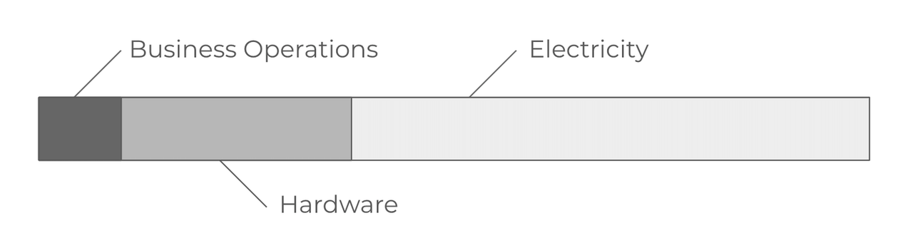

> **公理 #3：要考虑一个系统的碳足迹，你必须考虑验证者开支的所有方面。**

这三类活动，每一种都会有浪费。比特币网络无可避免会出现孤块，那挖出这个孤块的能量就浪费掉了。有些硬件造是造出来了，但运行效率没有做到尽善尽美。有些运营开销是必要的，有些则只是换个地方喝喝茶。一种开支越是与验证区块链的实际工作紧密关联，它换得区块链安全性的效率越高。类似于机器在自由度更少的时候效率会更高：多一个部件就会多一些无用功。经济系统也是同样的道理 —— 结构越多，效率越低。

举个例子：为了与某个大客户打好关系而出差，可以抽象成提高整个业务的效率，因此也对购买安全性有帮助 —— 但它的作用非常间接，而且其购买安全性的效果可能不如在电力上的同等支出。一种密码学货币越是把安全预算直接花在电力上，其安全性就越高；越是把钱花在商业运营商，其安全性就越低。挖矿企业的 CEO 可能对于这家企业自身来说是必要的，但他们对网络的安全性贡献不大。

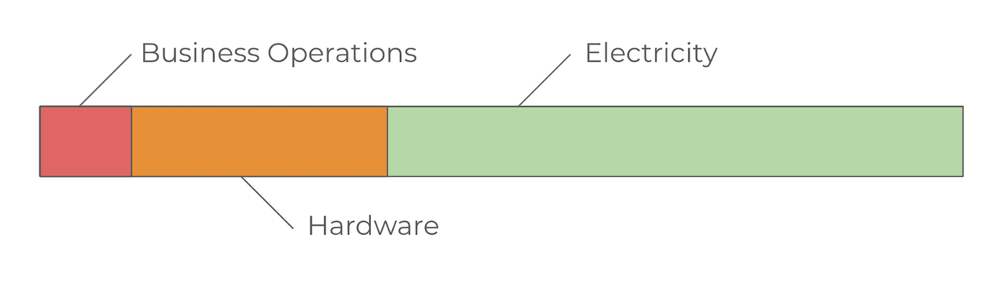

> **公理 #4：一种开支越是与验证区块链的实际行动相关，其购买安全性的效率越高。**

所以，有时候你看到人们讨论 ASIC [1](#note) ，认为它们败坏了一种密码学货币对环境的影响，但实际上刚好相反。挖矿设备的专业化，使得单位硬件能产生更大的算力，也就意味着区块链的安全预算更少花在硬件上，更多花在电力上。这对效率来说是好事 —— ASIC 挖矿在根本上比传统的 CPU 挖矿要更清洁，因为 ASIC 在把能量转化为安全性的时候效率更高（也就是更便宜）。

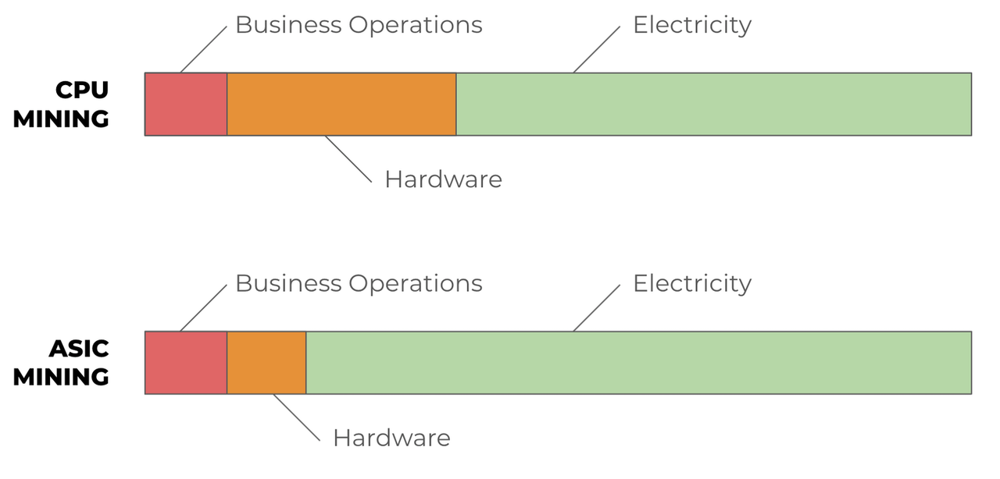

这也是为什么人们误解了 “空间证明（Proof-of-space）” 类的密码学货币（比如 [Chia](https://www.chia.net/)）（它们使用内存而非计算力来验证区块链）对环境的影响。使用硬盘作为产生安全性的稀缺资源并不能降低成本，而只是让区块链的安全预算从电力中拨出、花到了硬件上。如果你仅看电力消耗来衡量密码学货币的碳排放，你会觉得好像我们有了巨大的进步 —— 但如果你把硬件的支出也考虑进去，你会发现这是效率的大损失。

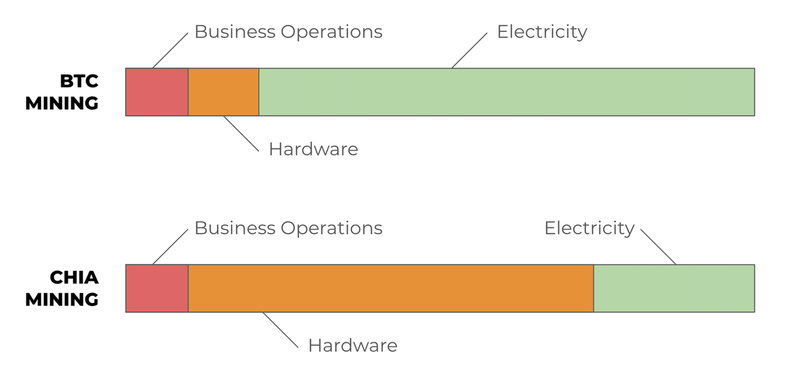

当前世界上有许多闲置的硬盘，因此 Chia 等于是得到了一些补贴。但别指望这会永远持续下去。等到某种密码学货币成功把计算机内存货币化，GPU 上已经发生的事情就会在相关硬件领域重演一遍。更重要的是，最终这个系统会比同等规模但基于 PoW 的系统要差，因为安全预算花在了开发硬件上，而这比直接花在电力上的安全预算的效率低。

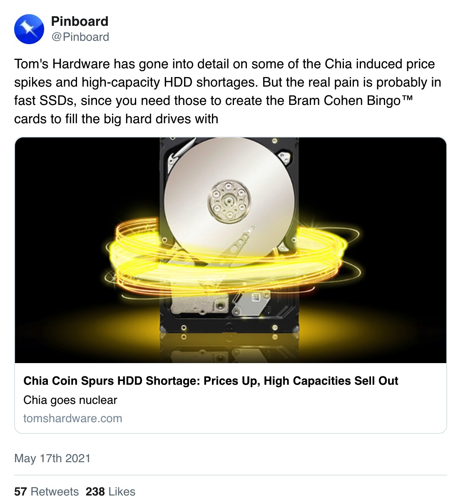

- “ Tom's Hardware 已经报道了 Chia 价格暴涨和大容量机械硬盘的短缺。但更严峻的可能是固态硬盘（的短缺），因为你也需要固态硬盘来制作能够塞满大硬盘的 Bram Cohen BinggoTM 卡” -

> **结论 #1：对环境最友好的密码学货币，就是把安全预算花在与验证工作最紧密的事项上的币。**

## 锁定资本也是有真实开销的真实支出

Chia 和其它使用空间证明的区块链，还是比较容易能跟 PoW 相比较的，因为你很容易想象旧硬盘塞满垃圾填埋场的情景，所以你很容易确信，它们 “真的” 对环境有影响。但是，损失资本也对环境有着真实的影响。因为这些钱可以花在碳捕捉技术和碳效率研究，以及等等事项上。人们 *“感觉”* 它们是免费的（没有消耗的），只是因为人类不擅长思考时间价值（time-value）。如果资本真是免费的，那矿工不用付出任何代价就能获得了。

有时候你还会看到人们主张权益证明从个体角度看也会有浪费，但从社会角度看则是一种节约，就像 Dan Robinson 说的：

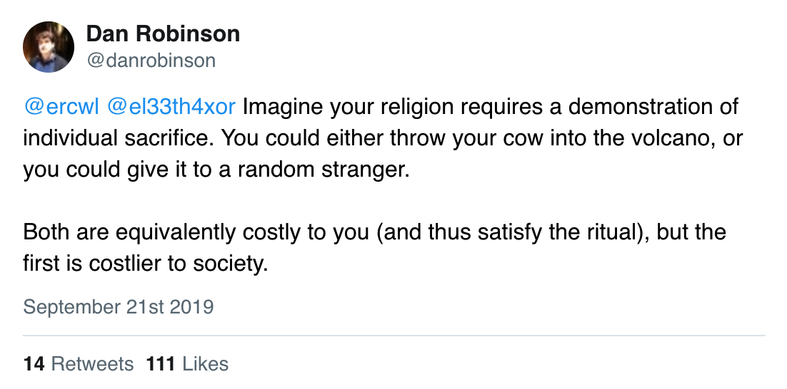

- “假设你的宗教要求你用自己的牺牲来证明你的诚意。你可以把一头牛丢进火山口，也可以把它赠给陌生人。两件事情对你来说开销都是一样大的（因此都能满足戒律要求），但第一种的社会成本更高。” -

事实正好相反。锁定资本对你个人来说不是浪费，因为 PoS 的质押算法会给你补偿 —— 这些资本没有被丢进火山，它为你赚取收益，以其他 ETH 持有者的利益为代价。锁定资本跟把它送给陌生人完全不同，因为根本就没有陌生人接手这些资金。验证者并没有 “把他们的资本平均分发给所有人”，实际上，是每个人都平等地为验证者的工作付了钱（形式是新挖出的 ETH）。而且，感谢公理 #2，我们知道验证者所得的支付 *恰好等于* 这些资金的成本。

另一方面，锁定资本从社会角度看 *就是* 一种浪费，因为这些资本不再能用来建造工厂、资助研究和做一切对社会有利的事。想想 2008 年的金融危机 —— 没有工厂被毁，也没有哪栋房子塌了，没有任何物质资产的损失。后果仅仅是资本损失 ——但这仍然是非常非常沉重的社会代价。资本是信息累积的特殊形式，凝聚的是关于资源最优配置的信息。损失信息与损失可触可见的东西并不相同，但同样是一种损失，甚至还要更糟。

所以，谨记公理 #1 和公理 #2，PoS 和 PoW 的公平比较应该是这样的：

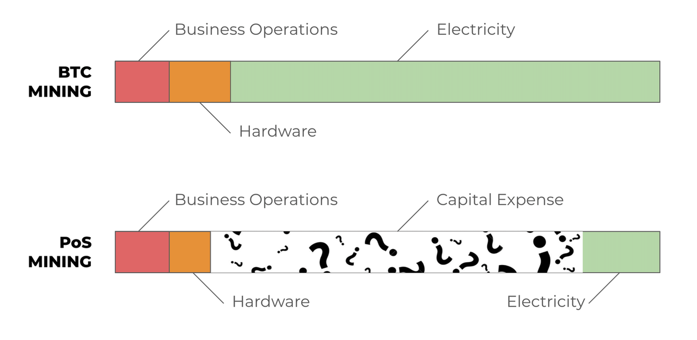

权益证明没有（也不可能）消除矿工的开支，只是把 PoW 系统支出在电力上的部分转成了资本开支。锁定资本的外部性，相比电力消耗的外部性如何，是复杂而微妙的问题 —— 但糟糕的是，PoS 系统的支持者往往假装电力是（系统运行）唯一需要付出的代价：

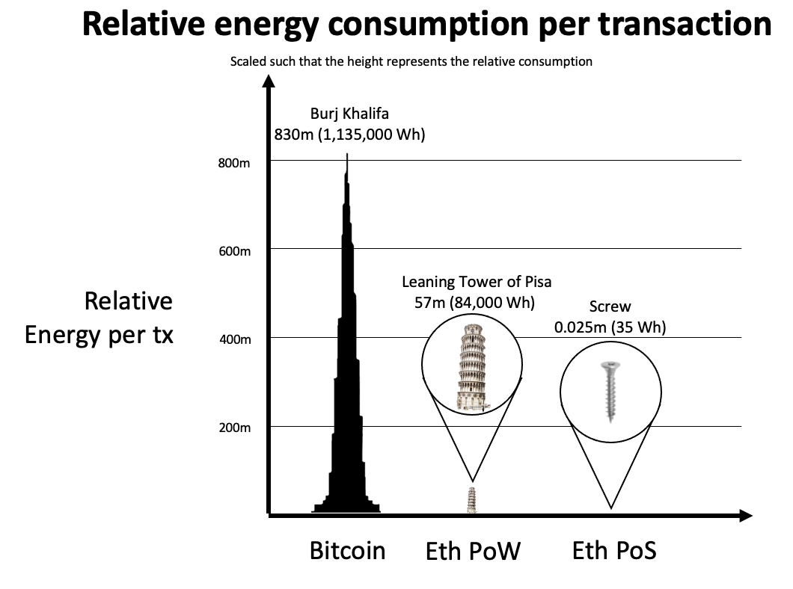

- 该有意误导的比较，摘自以太坊基金会博客。 -

令人失望。以太坊基金会很清楚，“平均单笔交易所耗能源” 是一个完全没有意义的指标，这样使用这个数据是有意欺瞒。关键根本不在于 PoS 系统是否使用了更少的能量 —— 确实更少，但这不是全部。有意义的讨论是：消耗资本更好，还是消耗电力更好？任何支持 PoS 而不讨论资本成本的理论，都在根本上就错了。

## 效率对比：质押 vs. 挖矿

在 PoW/PoS 的辩论中，PoS 支持者常常能占一种便宜：还从未有过完全去中心化的权益证明系统。这也意味着，PoS 支持者们可以任意幻想最终的解决方案可以多么有效率、多么优雅。已知的挖矿算法都不是完美高效的（例如存在 “[自私挖矿](https://www.investopedia.com/terms/s/selfish-mining.asp#:~:text=Selfish%20mining%20is%20a%20strategy,exert%20power%20over%20a%20blockchain.)” 问题），而且，同样没有理由相信 PoS 系统就能做到无懈可击 —— 但是，在解决方案最终完整成型之前，PoS 支持者都不用考虑验证者可能用来欺骗这个系统的 *具体* 策略。

耍弄系统的机会越多，安全预算与实际验证的关系就越松散。因为 “从未有人尝试过真正的权益证明”，我们首先不知道安全预算能多大程度被转化为锁定的资本，更不知道锁仓资本在生成安全性的时候有多高效。根据定义，PoW 是跟验证紧密耦合的，但 PoS，截至撰文直至，还没有得到完整的定义。

> **观察 #1：PoW 与安全性紧密耦合。但尚不清楚 PoS 能做到什么程度。**

## 外部性：质押 vs. 挖矿

假设我们都同意，从安全性效率的角度看，锁定资本和挖矿的效率是一样的，那就只剩下一个问题了，就是 “外部性”。这也是我认为理性讨论的人仍能对其中的权衡关系有所分歧的地方。

短期来看，PoW 系统要跟其它项目竞争使用能源，但从长期来看，它会激励便宜能源的开发和生产，而这会逐渐降低电力的成本，给所有人带来好处（无论是金融用途还是环境保护）。便宜的电力也会催生新技术和更多的生产。

权益证明在短期内要跟其它项目竞争使用资本，但它没法激励创造更多资本，所以它会逐渐提高资本的成本。资本成本更高，意味着项目会更少 —— 更少工厂，也更少研究。

你更喜欢 PoW 的外部性还是 PoS 的外部性，可能取决于你认为是通过投资技术发展来解决环境危机、还是靠节约当前的消费来解决更好 [2](#note)。要拯救地球，我们是该制造更便宜的可再生能源呢，还是应该让所有东西都变得更贵？

> **观察 #2：工作量证明鼓励未来的投资。而权益证明则遏制探索。**

## PoS 甚至没法工作

如我们前面所说，我们还不知道一个充分去中心化的权益证明系统能不能实现。现有的标榜自己为 PoS 系统的密码学货币，基本都依赖于某些中心化的协调者或 “检查点（checkpoint）”。自以太坊从 2015 年启动以来，他们就一直在努力转换成一个完全去中心化的 PoS 系统，而到现在，他们只推出了 Phase 0，只是支持验证者质押而已 …… 你一旦把钱锁进去，就去不出来，也花不了。

关于 PoS 系统能不能做到足够安全，有很多争论（见 “[长程攻击](https://blog.positive.com/rewriting-history-a-brief-introduction-to-long-range-attacks-54e473acdba9)”、“[nothing-at-stake](https://medium.com/coinmonks/understanding-proof-of-stake-the-nothing-at-stake-theory-1f0d71bc027)”、“[工作量跨越时间/权益则相反](https://hugonguyen.medium.com/work-is-timeless-stake-is-not-554c4450ce18)”）。这些都是研究上的开放问题，而不是实现过程中的待办清单。我们不知道还要多长时间才能找出一个好的方案，甚至有没有好的方案都存疑。看看这个 2017 年的帖子：

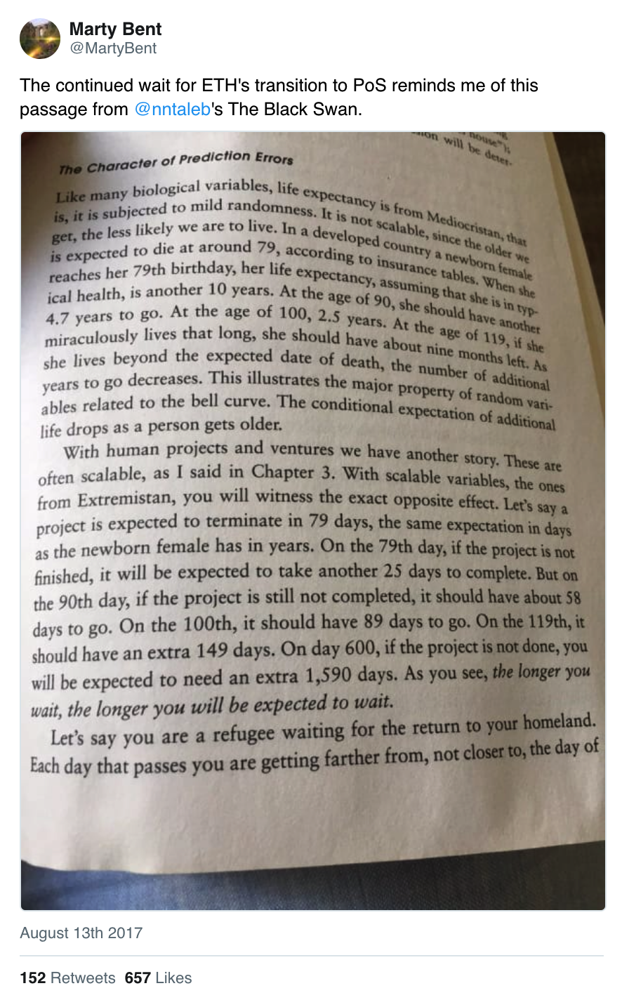

PoS 也许 “能运行”，只不过运行方式是病态的。PoW 会偏爱那些能获得便宜电力的人，并以资本来奖励他们。虽然并不完全平等，但不会陷入正反馈循环。PoS 则偏爱那些能以便宜的代价获得资本的人，并且奖励资本给他们，这就产生了一个循环。有钱的人会变得更有钱，而且越是有钱，想变得更有钱就越简单。

如果权益证明 “可以启动”，但最终结果是所有权力都集中到一小部分超级富有的机构手上，而且他们可以永久控制这个系统，那它就不能解决密码学货币想要解决的问题。那我们还不如继续使用现在这个中央银行和那些 “[从坎蒂隆效应中受益的内部人](https://promarket.org/2020/04/13/the-cantillon-effect-why-wall-street-gets-a-bailout-and-you-dont/)” 组成的系统。我们希望密码学货币能打破这个系统，而不是新瓶装旧酒。

> **观察 #3：工作量证明已经存在，而且证明了自身能继续壮大。但权益证明仍是一个没有解决的问题。**

## 结论

- **公理 #1**：对环境最友好的密码学货币，应该是购买安全性时效率最高的那个。
- **公理 #2**：如果一种密码学货币购买了价值 X 元的安全性，其验证者（为获得奖励）将总计有价值 X 元的花销。
- **公理 #3**：要考虑一个系统的碳足迹，你必须考虑验证者开支的所有方面。
- **公理 #4**：一种开支越是与验证区块链的实际行动相关，其购买安全性的效率越高。
- **结论 #1**：对环境最友好的密码学货币，就是把安全预算花在与验证工作最紧密的事项上的币。
- **观察 #1**：PoW 与安全性紧密耦合。但尚不清楚 PoS 能做到什么程度。
- **观察 #2**：工作量证明鼓励未来的投资。而权益证明则遏制探索。
- **观察 #3**：工作量证明已经存在，而且证明了自身能继续壮大。但权益证明仍是一个没有解决的问题。

遗憾的是，经过详细考察之后，我们知道了 PoS 的大部分 “优点” 都只是看起来光鲜亮丽，而且还有许多重大的公开挑战。至少到目前，它还是一个乌托邦式的幻想，而不是一种现实的选择。而 PoW 虽然有缺点，要想组建一个无需信任中心化权威的网络，却仍然是已知最好的方案（实际上，也是唯一的方案）。

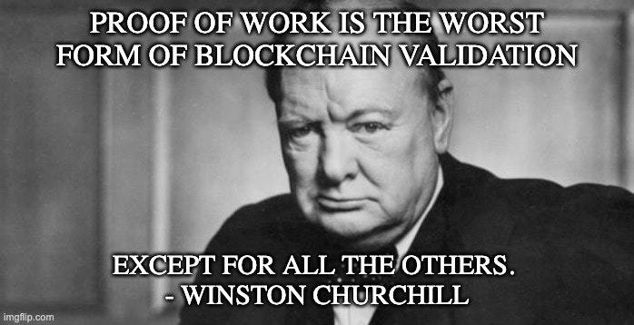

<h3 id="note">脚注</h3>

1. 专用型集成电路：定制化的计算机，但只能做有限类型的计算而不能做别的（专为特定算法的挖矿而研发的 ASIC 因此挖矿效率非常高）。
2. 如果我们现实地看待人性，在全球范围内减少消费的唯一办法就是提高技术或者降低人口。任何主张直接 “减少消费” 的哲学都要么非常幼稚，要么非常可怕。

（完）
