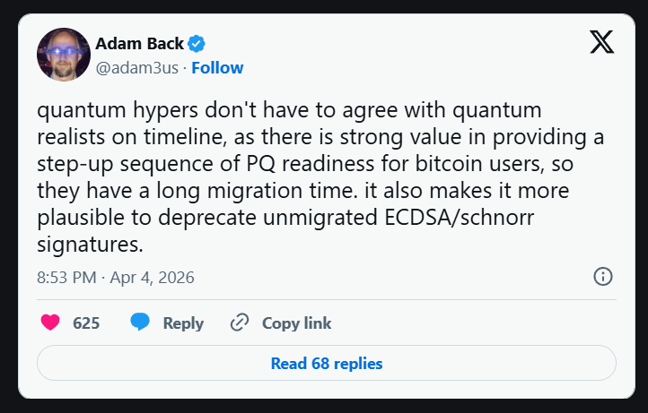

> *作者：Blockstream Team*
> 
> *来源：<https://blog.blockstream.com/quantum-computing-and-bitcoin-eli5/>*

报纸和新闻网站的头条都说量子计算机将会毁灭比特币。真相是：构成比特币安全性的一个部分会受到威胁。Blockstream 的工程师们已经在开发修复措施。

## 什么是 “量子计算机”？

你的笔记本电脑，是用 “比特” 来 “思考” 的：它们就像极为微小的开关，只有两种状态，要么是 0，要么是 1 。这样的电脑作的所有计算，从加载网页到验证比特币交易，归根结底，就是用极快的速度拨动数十亿个这样的开关。

而量子计算机则用 “量子比特” 来思考。比特只有两种状态（0 或 1），量子比特则可以保持这两个数值的某种组合，仅在你测量它时才会分解成一个数值。将许多量子比特组合在一起，它们所能表示的状态的集合就会随着量子比特数量的增加呈指数级膨胀， 而驾驭量子硬件的数学，让我们可以在所有这些状态上同时运行计算，这是传统的计算机无法做到的。

你可以用迷宫来理解。常规的计算机，一次只能尝试一条路径，直到走通了为止。量子计算机却能同时探索许多路径。对某一类数学问题来说，这意味着（量子计算机）解出一个具体问题的步骤会少得多。不过，也并不是所有类型的数学问题都这样；量子计算机只是在一小部分数学问题上有速度优势，而不是全方位碾压。

不能把量子计算机粗暴理解为 “更快的计算机”。它不会让你的互联网浏览器变得更快，也不会让你的视频直播更流畅、文件加载速度更快。它是一种专用的工具，而它擅长解决的问题跟你的比特币密钥直接相关。

## 比特币系统如何实现资金的安全保管

比特币系统使用两种数学来确保你的资金是安全的。

**第一类用于 证明/验证 所有权**。在你转移比特币的时候，你需要用一个秘密钥匙（你的私钥）签名交易，来证明这些比特币是你的。整个网络种的节点都会用一个相关的公钥来检查你的签名。整个系统依赖于一个假设：没有人可以从你的公钥中计算出你的私钥（因此，没有人能伪造你的签名来花费你的比特币）。今天的计算机是做不到的，从宇宙大爆炸算到今天也还算不出来。

**第二类用于挖矿**。每时每刻，比特币矿工们都要竞相找出一个符合条件的哈希值，如今竞争激烈程度已经达到集体每秒尝试数万亿次猜测。这让比特币网络保持运行、防止有人重写交易历史。

量子计算机直接威胁第一类数学，对第二类的影响要更小的多，而且影响的主要是网络的中心化，而不是网络的品性。

## 为什么量子计算机可以改变这个等式

运行 “Shor 算法”，量子计算机可以从一个比特币公钥复原出私钥。然后，使用这个私钥，就可以像真正的主人那样取走比特币，

就想象有这么一把锁。今天的计算机，在可以想象的时间尺度内都打不开这把锁。但足够强大的量子计算机就可以打开。

挖矿使用了另一种数学（SHA-256 哈希允许）。“Grover 算法” 让量子计算机在运行哈希函数时可以获得平方级的加速效果，因此，能够用上量子计算机的大型矿工相比小矿工就会具有优势。这对挖矿行业的去中心化是一个隐患，但不影响比特币网络确认交易的能力。实际上，这种风险比前面说的伪造签名的风险要遥远得多：它所需要的量子计算硬件比攻击 secp256k1（用当前的比特币公钥算出背后的私钥）所需的要大得多，而且 Grover 算法无法很好地并行化，这会限制其理论优势转化为实际性能。

**比特币所面临的量子计算威胁主要跟持有比特币的人有关，跟网络的运行方式无关**。许多报道都弄颠倒了。

## 威胁有多迫切？

量子计算硬件进步很快，但这些数字的意义还要看具体的语境。[IBM 的 Condor 门模型芯片](https://www.scientificamerican.com/article/ibm-releases-first-ever-1-000-qubit-quantum-chip/?ref=blog.blockstream.com) 在 2023 年就达到了  1121 量子比特。 [Google 的 Willow 芯片](https://blog.google/technology/research/google-willow-quantum-chip/?ref=blog.blockstream.com) 在 2024 年 12 月只达到了 105 量子比特，但取得了一个更加重要的成果：它实现了第一种 “低于阈值” 的量子纠错机制，这是研究者们从 1995 年就开始追求的目标。已经能够保存更大的 “中性原子” 数组 —— [Caltech 团队展示了一个长达 6100 量子比特的数组](https://www.caltech.edu/about/news/caltech-team-sets-record-with-6100-qubit-array?ref=blog.blockstream.com) —— 但光凭量子比特的数量无法衡量它在计算上的有用性。

攻破比特币当前使用的共私钥所要求的能力，是远远超过当前的任何硬件的。在 2025 年 5 月到 2026 年 3 月之间出版的研究性论文，将预计需要的要求降低了大概 20 倍：

- 2022 年的估计（来自 [**University of Sussex, 2022**](https://doi.org/10.1116/5.0073075?ref=blog.blockstream.com)）：需要大约 1300 万物理量子比特，才能在 1 小时内攻破一个 256 位的密钥
- 更新后的估计（来自 [**Google Quantum AI, March 2026**](https://arxiv.org/abs/2603.28846?ref=blog.blockstream.com)）：少于 50 万物理量子比特
- 最激进的估计（在尚未证实有效的架构上）：少于 1 万物理量子比特

现有的硬件，与最激进的估计相比也还有很大差距，而且，单看量子比特的数目，最多只是管中窥豹。 [Google 的论文警告称](https://arxiv.org/abs/2603.28846?ref=blog.blockstream.com)， 量子比特数量统计无法反映绝大部分决定一台量子计算机有用性的特征：错误率、保真度（fidelity）、连接性，以及长时间维持纠错状态直至完成计算的能力。差距确实在减少，但并不是所有重要的维度都有同等的进步。

专家们普遍认为，强大到能够攻破密码学的量子计算机还要 10 到 20 年才会出现。[Global Risk Institute 的 2025 报告](https://globalriskinstitute.org/publication/quantum-threat-timeline-report-2025b/?ref=blog.blockstream.com)称，接下来 10 年内出现密码学相关量子计算机的概率在 28 ~ 49% 之间，在该年度报告诞生的 7 年以来最高估计值。Blockstream 公司的首席执行官（也是工作量证明系统的发明者）Adam Back [估计是 20 到 40 年](https://cointelegraph.com/news/bitcoin-quantum-threat-decades-post-quantum-migration?ref=blog.blockstream.com)。

许多机构按照更迫近的估计来安排工作。NIST（国家标准及技术研究所）发布了当前服役的签名标准（ECDSA 和 RSA）的弃用时间表，从 2030 年代末开始。Google 的量子计算机团队已经公开建议各组织迁移敏感的系统，时间表也接近。无论威胁是在 10 年后还是 40 年后到来，计划的时间窗口都能覆盖比特币网络自身的升级周期。

以下是最重要的部分：**比特币网络的升级往往要花费数年时间**。[Taproot 升级花费了大概三年半](https://nickler.ninja/blog/2020/11/29/bip-{schnorr/?ref=blog.blockstream.com)（从邮件组出现第一个激活提议开始算），而后量子迁移可能要花更长时间，因为每一个持币人都需要将自己的钱币移动到新的地址类型，而不能只是升级软件。所以，要从现在就开始准备，而不能等威胁成真时再开始。

## 倒计时已经开始

使用量子计算的攻击者无需等待量子计算机成熟之后再选择攻击对象。一旦一个公钥暴露在区块链上（任何人都可以观察到）—— 无论是陈旧的 P2PK 输出（公钥天然暴露）、任何地址的交易花费脚本，还是存过资金的 Taproot (P2TR) 输出 ——  公钥都会永远记录在区块链上，并且一旦硬件成熟就可以攻击。

这不需要解密。比特币网络并不加密它的共识数据。攻击者只需要等硬件成熟，就可以从一个已经公开的公钥直接计算出它背后的私钥。

安全研究员们在传统密码学中讨论过一种类似的模式，叫做 “现在捕获，以后解密”；[美联储在 2025 年出版的一篇论文](https://www.federalreserve.gov/econres/feds/harvest-now-decrypt-later-examining-post-quantum-cryptography-and-the-data-privacy-risks-for-distributed-ledger-networks.htm)将它称为分布式账本网络的一种额外风险（active risk）。比特币的情形在细节上有所不同（因为本来就没有加密，所有没有东西可以解密），但模式是一样的：现在就可是收集目标数据，以后再攻击。

**数据收集可能已经在进行。窃贼随后就到。**

## 所有比特币都暴露在风险之下吗？

不，并不是所有地址上的比特币都面临等量的量子计算风险。

**有风险的**是那些潜在攻击者可以看到的公钥，包括：

- 早期（2009 ~ 2010）的比特币地址（P2PK 类型）会在地址中直接展示公钥；这里面包括被广泛猜测属于中本聪的 100 万 BTC 。
- 任何已经用来发送过交易的地址，因为花费脚本必然在区块链上揭晓公钥（不管地址本身是什么类型）
- **P2TR（Taproot）地址**，在地址存入资金后就会暴露一个版本的公钥。在设计 Taproot 的时候，这被当成一个可以接受的牺牲，因为量子计算威胁似乎还远。[BIP 360](https://bip360.org/?ref=blog.blockstream.com) 这样的提议的设计出发点就是移除这种暴露。
- 停留在交易池中的交易。它们还未出现在区块链上，但其公钥（暴露在交易的花费脚本中）已经能被观察网络的人看见，因此量子攻击者有机会在矿工确认这笔交易之前计算出能够签名的私钥

[Chaincode Labs 的研究员们在 2025 年 3 月估计](https://chaincode.com/bitcoin-post-quantum.pdf?ref=blog.blockstream.com)，流通中的比特币中大约有 30%（大约 600 万 BTC），其公钥已经暴露。

**暂时安全的**：更老的地址格式，比如 P2PKH、P2SH、P2WPKH、P2WSH，将公钥藏在额外的数学层后面（地址上展示的是公钥的哈希值）。公钥仅在你花费资金的时候才会揭晓。如果你用这样的地址收取了比特币但从未花费过，那么你的公钥还是隐藏的。大约 65% 的比特币放在未揭晓的公钥上。

这种隐藏状态会在你花费资金的时候终结。广播到整个网络的交易会让公钥曝光，足够强大的量子攻击者可以尝试抢在你的交易被确认之前算出能够签名的私钥。P2WSH 地址提供了目前最强的公钥隐藏能力，但一样会在你花费资金的时候结束。

**安全的**：工作量证明和地址派生，以及所有使用 SHA-256 哈希运算将交易们关联在一起的结构。量子算法无法有意义地爆破这些操作。

## 中本聪的钱怎么办？

Adam Back 指出：一个很长的后量子迁移窗口，会让通过软分叉来“弃用未迁移的 ECDSA/schnorr 签名 显得更合情理”。在这种路线下，钱币有数年的时间迁移到量子抗性地址、保持安全；而从未移动过的钱币，不论是因为弄丢私钥还是来自中本聪的钱包，都将变为任何人都不可花费，包括攻击者。Back 还专门反对预先冻结量子脆弱地址的提议，认为这是开发者的越权。

## 解决方案并非最难的部分

密码学部分的解决方案已经有了。在长达 8 年的评估之后，[NIST（美国负责标准化的机构）已经在 2024 年 8 月敲定了第一批三种后量子密码学标准](https://www.nist.gov/news-events/news/2024/08/nist-releases-first-3-finalized-post-quantum-encryption-standards?ref=blog.blockstream.com)。 数学准备号了。**但让比特币网络升级才是难的部分**。

**更大体积的签名意味着更高的链上交易成本**。在 NIST 标准化的后量子签名方案中，签名体积最小的一种（ML-DSA，FIPS 204），其单个签名和公钥的体积之和也达到了大约 3700 字节。比特币当前的 Schnorr 密钥路径花费是 64 字节。这意味着每一笔交易的密码学开销都要膨胀大约 58 倍，并且每个区块能够容纳的交易数量会出现同比例的下降。更大的签名意味着交易的体积更大、手续费也更高（每个人都要承担）。

**比特币改变起来很慢，并且这就是它的本性**。修改比特币协议需要在一个全球的、去中心的网络中达成广泛的共识。但比特币确实升级过。[隔离见证（2017）](https://en.bitcoin.it/wiki/Segregated_Witness?ref=blog.blockstream.com)修复了交易熔融性，提高了可扩展性。[Taproot（2021）](https://en.bitcoin.it/wiki/Taproot?ref=blog.blockstream.com) 带来了更智能的编程能力和更好的隐私性。两种都是被整个网络接受的软分叉。后量子迁徙应该也会按类似的剧本上演，但也将比这两者都复杂得多。

**每个持币人都要行动**。升级比特币的代码不会自动为资金带来量子抗性。每个持币人都需要主动将钱币从旧的地址转移到新的量子安全地址。以比特币当前的吞吐量（大约每秒处理 3 到 10 笔交易），让所有钱币完成迁徙需要花费数月乃至数年时间。

BIP 360 的支持者们指出，即使在乐观的假设之下，全面迁移也要花费数年时间。在社区都同意一个计划之时，这个过程才能开始，而这样的计划还没出现。

## 已经在开发的东西

Blockstream 团队没有袖手旁观。

**Liquid 侧链是一个测试场地**。[Liquid 网络](https://blockstream.com/liquid/?ref=blog.blockstream.com)是比特币的一条侧链，由 Blockstream 公司开发。该侧链使用 [Simplicity](https://simplicity-lang.org/?ref=blog.blockstream.com) 编程语言，这是专门为比特币的安全模型而设计的一种智能合约编程语言。在比特币主网络上，部署新的密码学需要整个网络变更协议。但在使用 Simplicity 的 Liquid 侧链上，同样的功能可以作为一个智能合约来发布，无需整个网络的共识变更，意思是抗量子保护措施可以在几周内推出，而不像比特币那样需要几年来推动一次软分叉。

**这个活的网络上已经出现了第一笔后量子交易**。 在 2026 年 3 月，Blockstream 的研究部门已经在 Liquid 上部署了 “ [**SHRINCS**](https://blog.blockstream.com/blockstream-research-demonstrates-quantum-resistant-transaction-signing-on-liquid-using-simplicity-smart-contracts/)”（一种紧凑的后量子签名方案）。五笔真实的交易得到了广播和确认，创造了在生产环境中的比特币侧链上的第一笔后量子交易。

SHRINCS 在常规操作中产生 324 字节的签名。（如果在富状态模式下重复使用同一个公钥，那么每多签名一次，签名体积就要增加 16 字节）。NIST 标准下最小的签名也要 2420 字节以上。这 7 倍的体积缩减，决定了签名是会占据交易成本的绝大部分，还是在区块链语境下具备实用性。

SHRINCS 仅仅依赖于 SHA-256 的安全性 —— 比特币已经将它用在工作量证明、地址派生和默克尔树中。没有新的密码学假设，全都是比特币已经在使用的假设。许多最初向 NIST 提交的后量子候选方案，都在标准化期间被传统计算机攻破了，这凸显了保守的密码学基础的价值。

[**使用 SHRIMPS 更替硬件签名器**](https://blog.blockstream.com/shrimps-2-5-kb-post-quantum-signatures-across-multiple-stateful-devices/)。2026 年 3 月，Blockstream 的密码学家 Jonas Nick 提出了 SHRIMPS ，专门考虑了硬件签名器的生命周期：你当前在用的设备损坏时、或者你要换用更新一代的产品时，要怎么办。同一个备份最多可以导入到 1024 台设备中，并允许它们独立签名，签名体积是 2.5 KB —— 依然比 NIST 的哈希签名标准（SLH-DSA）小了 3 倍。如果你预计自己会更换硬件签名器，不妨记住，SHRIMPS 是专门为此设计的。 

**通往比特币主网的道路**。Blockstream 的研究部门正在探索 [**OP_SHRINCSVERIFY**](https://bitcoinops.org/en/newsletters/2026/02/06/?ref=blog.blockstream.com) 的设计哲学：提议的这种操作码将使比特币脚本能够直接验证基于哈希函数的后量子签名。这项工作还在公开讨论阶段，还没有形成最终的 BIP 。如果该提议在未来有个版本能够得到采用，持币人将可以逐个为自己的地址增加量子抗性签名花费方式，无需等待整个网络迁移。

这种方法与 BIP 360（支付到默克尔根）（移除了 Taproot 的量子脆弱的密钥花费路径）形成互补。 BIP 360 提供了地址结构。OP_SHRINCSVERIFY 提供了签名验证能力。相得益彰。

**试验场模式**。Liquid 是一个活的金融网络，保护着总计数十亿美元的价值。在  Liquid 上不是新的密码学，可以产生比特币共识升级过程所需要的那种证据。OP_CAT 已经存在于 Liquid 侧链，并且催生了将它加入比特币的 [BIP 347](https://github.com/bitcoin/bips/blob/master/bip-0347.mediawiki?ref=blog.blockstream.com) 提议。后量子密码学也可以沿用相同的模式：在 Liquid 上开发、证明它可以在真实的经济环境中工作，然后用生产环境中的数据形成未来的具体提议。

## 今天可以做什么

- **使用新式的钱包软件**。[Blockstream app](https://blockstream.com/app?ref=blog.blockstream.com) 使用较新的地址格式。在绝大部分地址类型中，你的公钥都是隐藏的（直到你花费资金。
- **避免地址复用**。 绝大部分新式钱包软件，都会自动为每一笔交易生成一个新的地址。如果你现在用的软件没有这个特性，那么请换一个软件。重复使用同样的地址，在未来的量子威胁面前会增加你的暴露面。
- **将资金从旧的、已经暴露公钥的地址转出**。如果你有比特币放在已经花费过的地址上，尤其是旧的纸钱包或者早期交易所的取款地址，请将其中的钱币转移到一个全新的地址。这会让你的资金脱离 “公钥已经暴露” 的情形。
- **关注新闻**。关心 BIP 360 和 OP_SHRINCSVERIFY 的进度。

**给企业的建议**：在长期保管计划中考虑量子计算机的成熟时间。迁移窗口意味着，你在 2026 年作出的决定，会塑造你在接下来 10 年的遭遇。

比特币面临的量子计算威胁是真实的、具体的，不像新闻标题说的那样。但比特币的升级周期以年为单位，而且预计攻破在比特币中服役的密码学所需要的资源在快速下降。准备时间是有的，但需要我们珍惜。

[了解 Blockstream 的后量子研究](http://blockstream.com/quantum?ref=blog.blockstream.com)

（完）