> *作者：Bitcoin Dev Project*
> 
> *来源：<https://x.com/bitcoin_devs/status/2056746372389306854>*


*今年初，Robin Linus 公开了 “Binohash”，一种无需软分叉就能实现交易内省的方法。“量子安全比特币交易（QSB）” 论文沿用了 Binohash，并将其核心的 “ECDSA 谜题” 换成了 “从哈希到签名谜题”。*

*跟随本文，你无需知道什么是 Binohash ，就能理解 QSB，我们会解释一切用到的东西。*

*注意：QSB 并非迁移比特币到量子安全系统的严肃方案。该论文将 QSB 称为 “终极手段”。它值得一读，是因为它运用比特币脚本（Script）的方法。*

<p style="text-align:center">- - -</p>


比特币交易通常使用 ECDSA 算法来签名。

（译者注：这指的是 P2TR（taproot）以前的输出类型。）

这些签名承诺了交易。

只要交易有什么地方变化了，签名自然就失效了。

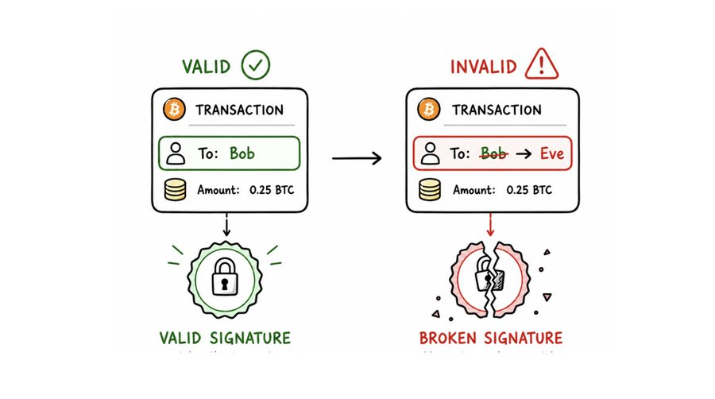

<p style="text-align:center">- 如图：当接收者从 Bob 变成了 Eve，为原交易生成的签名在新交易下无法通过验证。 -</p>


那么我们来看看签名是如何构造出来的。

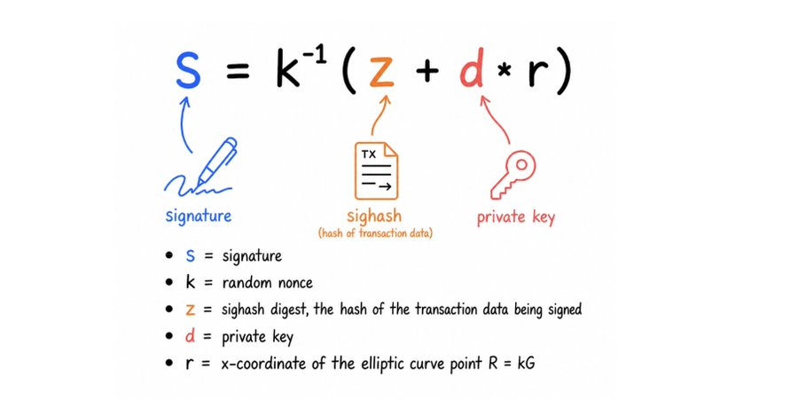

<p style="text-align:center">- s 为签名；k 为一次性的随机数；z 为签名哈希摘要，就是被签名的交易数据的哈希值；d 是签名的私钥；r 是 k 所对应的椭圆曲线点 R=kG 的 x 坐标值 -</p>


请看 `z`：

`s` 依赖于 `z`，`z` 又取决于**交易数据**。

一旦我们改变了交易的内容，`z` 就改变，那么签名自然也就无效（对应没改变的那个 `z` 才有效）。

记住这个，对后面的所有东西都非常关键。

## 量子攻击

因为 “Shor 算法” 【1】，比特币（上述签名机制）在量子计算机面前是脆弱的。

这是因为，量子计算机可以使用 Shor 算法，从椭圆曲线公钥中反算出其私钥。

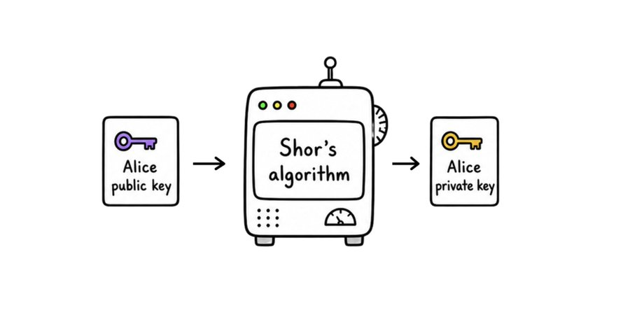

简单举个例子就可以明白：

Alice 想发送 10 BTC 给 Bob 。她使用自己的私钥签名了交易并将它广播出去。

Eva（攻击者）有一台（很强大的）量子计算机。她观察交易池，看到了等待确认的 Alice 的交易。

这笔交易本身公开了 **Alice 的椭圆曲线公钥**。

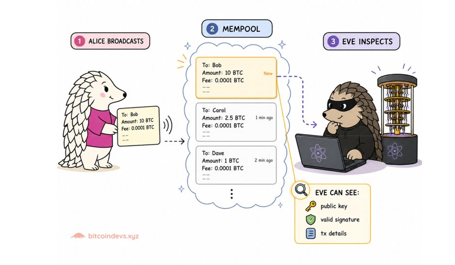

Eva 运行 Shor 算法，从 Alice 的公钥中反算出了她的私钥。

现在，Eva 就可以把 Alice 的资金（UTXO）花费到任何地方去了。她可以使用 Alice 的 UTXO 作为交易的输入（完全是相同的 UTXO），但把输出发送给她自己，而不是 Bob 。

她用 Alice 的私钥来生成签名，然后将交易广播出去。

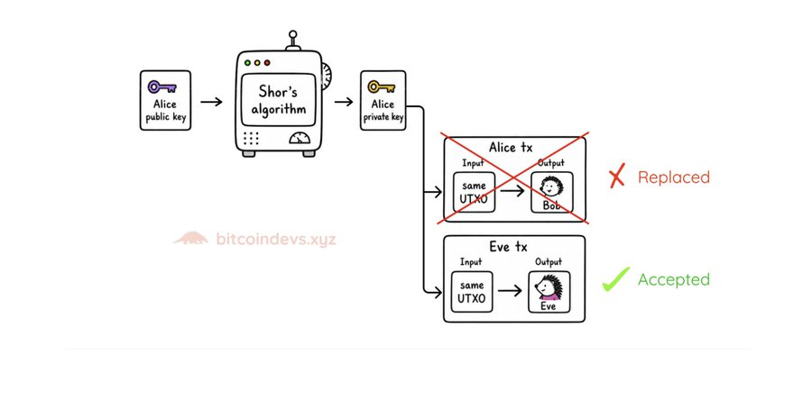

如果矿工先确认了 “Eva 的交易”，那么 Bob 就无法收到这些比特币了。

## 使用哈希函数，而非 ECDSA

如果量子计算机可以打破 ECDSA，我们还能依赖什么呢？

答案：**哈希函数**。

我们用在比特币中的哈希函数不依赖于椭圆曲线。

它们具有 “原像抗性”：给定一个哈希函数输出（哈希值），难以找出它的输入（原像）。

Shor 算法无法逆转一个哈希值。

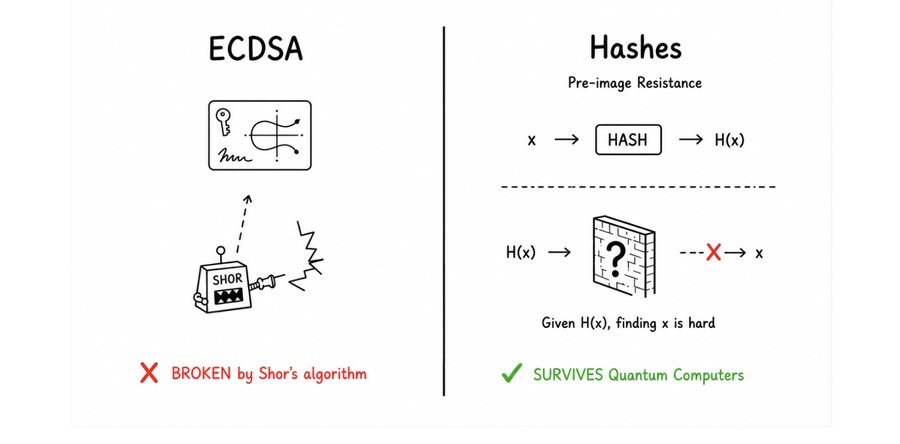

另一种量子算法，“Grover 算法”【2】确实会影响哈希函数，但只是弱化它们。它可以减少暴力搜索需要花费的时间。

使用 Grover 算法，输出为 256 比特的哈希函数的原像抗性将下降到接近于 128 比特。

（译者注：“比特安全性” 的含义是用比特数量（搜索空间的大小）来衡量应对暴力搜索的安全性。如果不使用 Grover 算法，要找出一个 SHA256 哈希值（256 比特）的原像，需要尝试 2^256 这么多数量的输入（暴力搜索 2^256 这个大小的空间），所以我们说它的安全性是 256 比特。）

所以：

- SHA-256：从 2<sup>256</sup> 变成 2<sup>128</sup>
- RIPEMD-160：从 2<sup>160</sup> 变成 2<sup>80</sup>

是若了一些，但是 2<sup>80</sup> 的安全性依然远远超过今天的量子攻击者的能耐，尤其是因为，Grover 算法无法并行化。

## QSB 的策略

QSB 论文建立在这种使用哈希函数来替代 ECDSA 的观念上。

其策略是：

**“消除对椭圆曲线的安全性依赖。仅保留基于哈希函数的安全性。”**

## QSB 的思路

**步骤 1：**从交易中派生一个指纹 `D` 。

**步骤 2：**使用 Lamport 签名算法来签名 `D`（可见我们[关于 Lamport 签名的上一篇文章](https://x.com/Bitcoin_Devs/status/2045140929192006003)）

因为 Lamport 签名是抗量子的，而 `D` 绑定了整笔交易，攻击者若要替换交易内容就必须伪造 Lamport 签名。

为什么这能阻止 Eve 呢？

只要 Eva 改变了交易内容，`D` 就改变，于是需要新的 Lamport 签名，也就是需要秘密的原像，但 Eva 并没有。

这就是 QSB 的核心思路。

但是，步骤 2 是简单的部分。步骤 1（构造 `D`）才是我们真正要做的事。

我们把步骤 1 进一步分解，在下面各节中讲解：

- 交易固定
- 找出 `D`：回合 1
- 找出 `D`：回合 2

## 交易固定

我们先从交易固定开始。

在这个步骤中，Alice 创建一笔交易并 “固定” 它。

意思是：对交易的任何变更都要付出昂贵的代价。

为了实现这种效果，我们需要两种技巧。

### 技巧 1：公钥复原

通常来说，ECDSA 是这样工作的：

**私钥 --> 公钥 --> 签名**

但 ECDSA 也可以反过来【3】：

如果你有：

- 一个签名
- 被签名的消息哈希值 `z`

你就可以复原出公钥：签名 + 消息 `z` --> 公钥

```
公钥 = Recover(签名, z)
```

（这个过程不需要私钥）

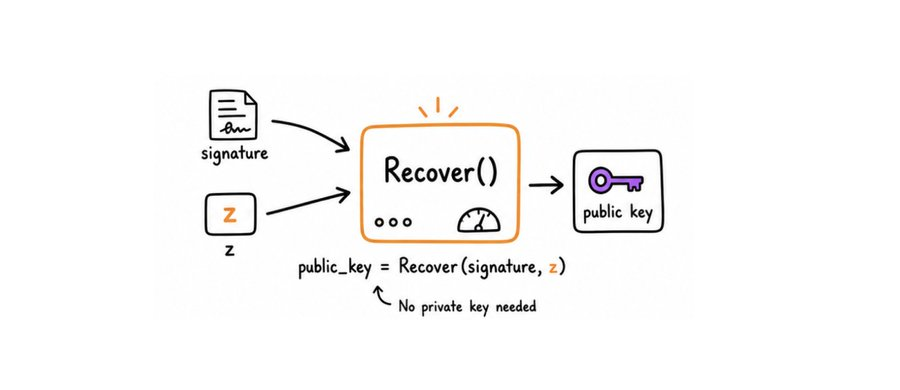

如果你想要更精确的数学表述：

$Q = r^{-1}(s * R - z * G)$

提醒：`Q` 依赖于 `z`，而 `z` 取决于交易数据

*只要我们改变了交易，`z` 就改变，复原出来的公钥也就改变*

### 技巧 2：虚假签名

一个 ECDSA 签名包含两个值：`r` 和 `s`

当使用 DER 编码【0】时，它看起来是这样的：

```text
0x30 <total_len> 0x02 <r_len> <r>  0x02 <s_len> <s> <flag>
```

技巧在于：构造出体积尽可能小的 DER 编码的签名：

- `r` 只有 1 字节
- `s` 也只有 1 字节

这样就得到了 **9 字节长的签名**。

这是一个硬编码的假签名。它满足 DER 编码规则，但是没有人签名了任何东西，它只是看起来像是一个有效的签名。

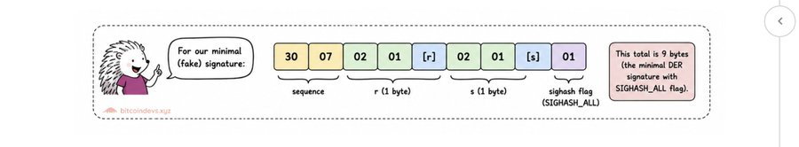

我们就管它叫 “**sig_nonce**” 吧。

```
sig_nonce = 30 07 02 01 [r] 02 01 [s] 01
```

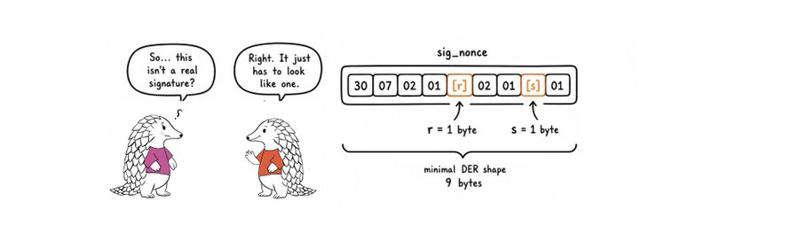

这个 sig_nonce 会被硬编码在资金的锁定脚本中。

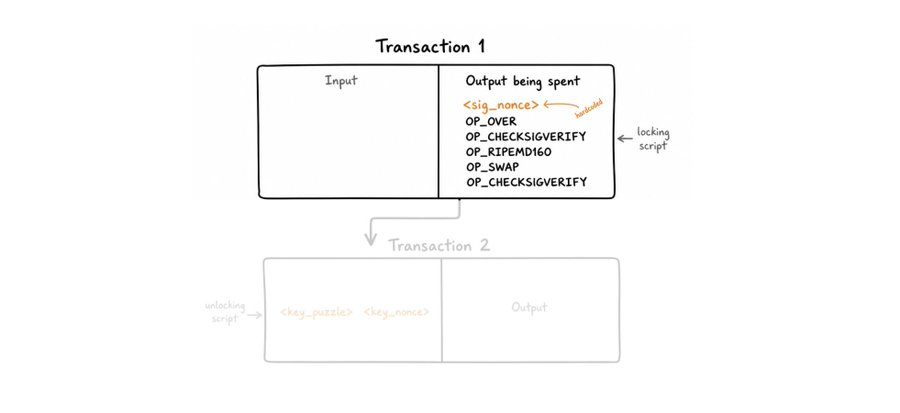

如果上图中的锁定脚本让你感到困惑，别担心。读完本指南，你将能逐行解读它。但现在，唯一值得注意的事情是它的长度：只需 5 个操作码吗，就能固定一笔交易（Binohash\* 需要 13 个操作码）。

\* Binohash【4】 是 QSB 论文的基础。我们将在下一篇文章中讲解。

### 派生 key_nonce

现在，我们将两种技巧结合起来：

1. 公钥复原

2. 虚假签名（`sig_nonce`）

我们在 `sig_nonce` 上使用复原函数 `Recover()` 来计算 `key_nonce` —— 也就是对应于这个虚假签名的公钥：

```
key_nonce = Recover(sig_nonce, z)
```

Alice 使用她给 Bob 支付的交易计算出 `z`，然后计算出 `key_nonce`。她在资金的解锁脚本中提供 `key_nonce`：

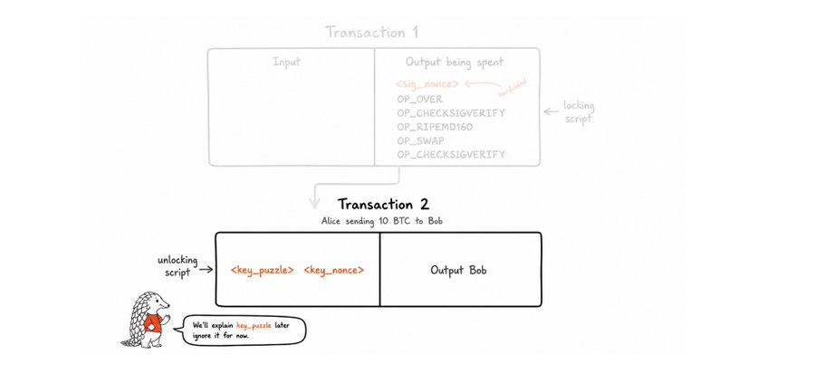

于是，这个 `key_nonce` 就跟这笔交易绑定了。改变任何东西，都将导致 `z` 改变，进而使 `key_nonce` 改变。

### 现在我们到哪儿了？

我们现在退回来，先想一想。

我们的目标是：派生出一个与 Alice 的具体花费交易（支付给 Bob）相绑定的指纹 `D`。要让 Eva 无法替换成另一笔交易（把钱转给她自己而不是 Bob），除非伪造对 `D` 的 Lamport 签名。

为了构造 `D`，我们需要两个东西：

1. **一个取决于花费交易的数值**。一旦改变交易，这个数值也会改变。
2. **让改变交易变得很昂贵**。以至于，没人能轻易尝试数百万个变种来得到跟我们一样的数值。

我们这才解决了上述第 1 个要求。因为 `key_nonce = Recover(sig_nonce, z)`，它是跟交易绑定的。改变任何东西都会导致 `z` 改变，进而 `key_nonce` 改变。

但光这一点，还算不上有用。我们还需要满足第 2 个要求。

### 那么，如何让它变得昂贵呢？

如果没有交易固定的话，Eva 可以这么做：

她看到 Alice 的交易出现在交易池中，动心思想要攻击这笔交易。因为她要改变交易的输出、把钱发给自己（而不是 Bob），她所尝试的每一个变体交易都会给出一个不同的 `z`，从而给出不同的 `key_nonce` 、不同的 `D` 。这样，她可以**便宜地**尝试几千种变体，**看看哪个变体会得到跟 Alice 的原版交易一样的 `D`**。然后，她就可以袭用 Alice 的 Lamport 签名。

Eva 的这种研磨便宜又快捷。

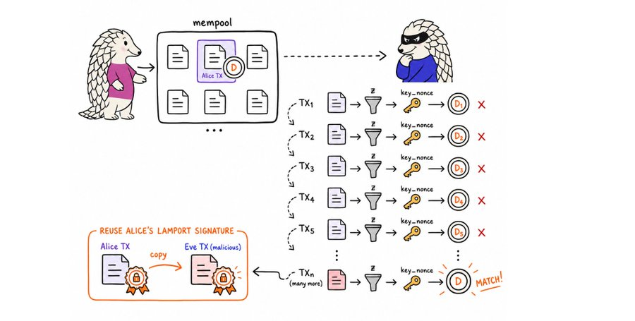

*（我们将在下一篇讲解如何构造 D 。目前，只需知道 Eva 攻击的可能性依赖于能够便宜地搜索交易的变体。）*

我们需要让每一次搜索尝试要付出巨大的计算量。具体来说，每次尝试要运行 <strong>大约 2<sup>46</sup> 次哈希运算</strong> 。

还记得 Alice 在她得解锁脚本中提供的 `key_puzzle` 吗？这就是 “从哈希到签名谜题” 的来源。

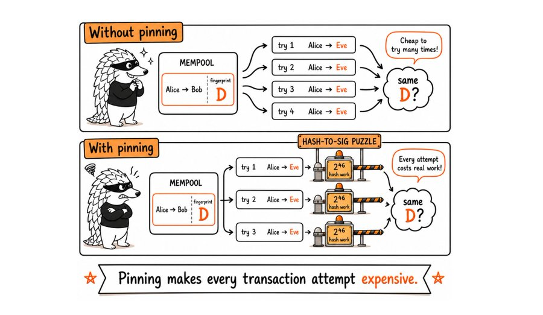

### 从哈希到签名谜题

思路是这样的。

脚本会以 `key_nonce` 为输入，然后用 RIPEMD-160 函数得到其哈希值。

`RIPEMD-160(key_nonce)` --> 看起来随机的 20 字节：

我们把这 20 字节称为 “签名谜题”：

```
sig_puzzle = RIPEMD-160(key_nonce)
```

现在，窍门来了：我们希望这 20 字节的数据（`sig_puzzle`）看起来像以一个有效的 DER 编码的签名。

如我们前面所见，一个 DER 编码的签名有这样的结构：

```
30 [len] 02 [r-len] [r] 02 [s-len] [s] [flag]
```

获得一串看起来像是有效 DER 签名的字符串的概率是非常低的，大约是 <strong>大约 2<sup>46</sup> 分之一</strong>。

所以，绝大部分尝试会失败。

但是，经过许许多多尝试之后，`RIPEMD-160(key_nonce)` 将能产生一段看起来像是有效 DER 编码签名的字节。

这就是谜题。

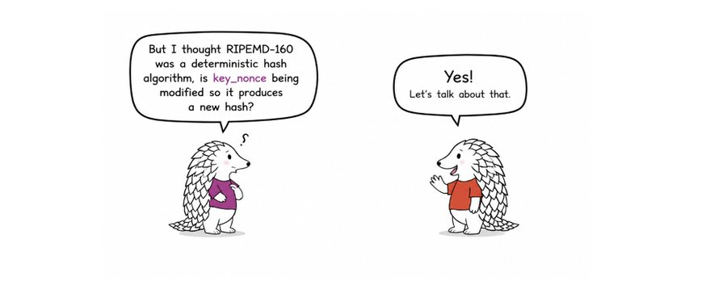

只要 `key_nonce` 保持不变，`RIPEMD-160(key_nonce)` 就总是给出同样的输出。

这个技巧是，Alice 可以改变 `key_nonce`。

再回顾： `key_nonce` 取决于 `z`，而 `z` 取决于交易数据。

所以，Alice 可以调整交易的一些字段，比如：

- nLocktime
- nSequence
- 等等

每一次微调，都会得到：

一笔交易

<p style="text-align:center">-  -</p>


<p style="text-align:center">-  -</p>


<p style="text-align:center">- -> 新的 `RIPEMD -</p>


所以，RIPEMD-160 是确定性的，但 Alice 可以不断给它一个新的输入。

**话是这么说，我们怎么在脚本中检查 DER 编码有效性呢？**

就使用 **OP_CHECKSIG** 作为一个 DER 验证器：

我们给 OP_CHECKSIG 提供 `sig_puzzle`（20 字节），假装它是一个签名：

- 如果 OP_CHECKSIG 通过 --> DER 有效 --> 谜题解决
- 如果 OP_CHECKSIG 不通过 --> 无效 --> 再次尝试

### 结合所有技巧

现在，我们知道自己要找的东西了。

我们要找的是这样一笔交易，其 `RIPEMD-160(key_nonce)` 将看起来是一个有效的 DER 编码的签名。

绝大部分尝试都会失败。

所以 Alice 也不断微调交易，直到某个输出具有 DER 编码签名的形状。

平均来说，需要 2<sup>46</sup> 次尝试。

这就是 “交易固定”。

一旦 Alice 找到一笔能用的交易，任何进一步的变更都意味着要从 0 开始，再次投入大约 2<sup>46</sup> 次运算。

**那么 key_puzzle 呢？**

还记得吗，Alice 的解锁脚本是 `<key_puzzle> <key_nonce>`。

那时候我们说，可以先把 `key_puzzle` 放在一边。

现在，我们可以解释一下它了。

`key_puzzle` 只是另一个复原出来的公钥，就是从 `sig_puzzle` 中复原出来的。Alice 使用同样的 `Recover()` 技巧，提前计算出它： 

```
key_puzzle = Recover(sig_puzzle, z)
```

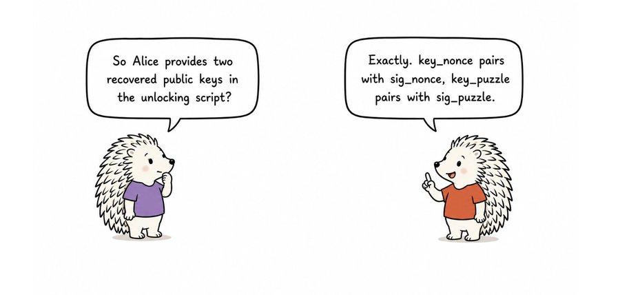


**脚本执行**：

还记得前面的固定脚本吗？我们现在一步步来运行它：

```
解锁脚本：
<key_puzzle> <key_nonce>


锁定脚本：
<sig_nonce>
OP_OVER
OP_CHECKSIGVERIFY
OP_RIPEMD160
OP_SWAP
OP_CHECKSIGVERIFY
```

这个脚本执行两次检查：

- `key_nonce` 与这笔交易绑定。
- `RIPEMD-160(key_nonce)` 是 `key_puzzle` 的一个签名。

来看看每一步执行后，堆栈的状态：

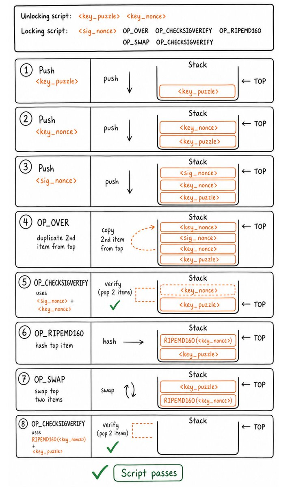

在下一篇，我们将介绍：

- SIGHASH_SINGLE 的 bug
- 150 呆签名
- FindAndDelete
- 找出摘要 D
- 使用 HORS 签名 D

## 参考文献

[0] 

https://bitcoin.stackexchange.com/questions/92680/what-are-the-der-signature-and-sec-format

[1] Peter W. Shor, *Polynomial-Time Algorithms for Prime Factorization and Discrete Logarithms on a Quantum Computer*

[ https://arxiv.org/abs/quant-ph/9508027](https://arxiv.org/abs/quant-ph/9508027)

[2] Lov K. Grover, *A Fast Quantum Mechanical Algorithm for Database Search*

[ https://arxiv.org/abs/quant-ph/9605043](https://arxiv.org/abs/quant-ph/9605043)

[3] Public key recovery from ECDSA signatures 

https://crypto.stackexchange.com/questions/18105/how-does-recovering-the-public-key-from-an-ecdsa-signature-work

[4] Binohash: Transaction Introspection Without Softforks 

https://robinlinus.com/binohash.pdf

（未完）