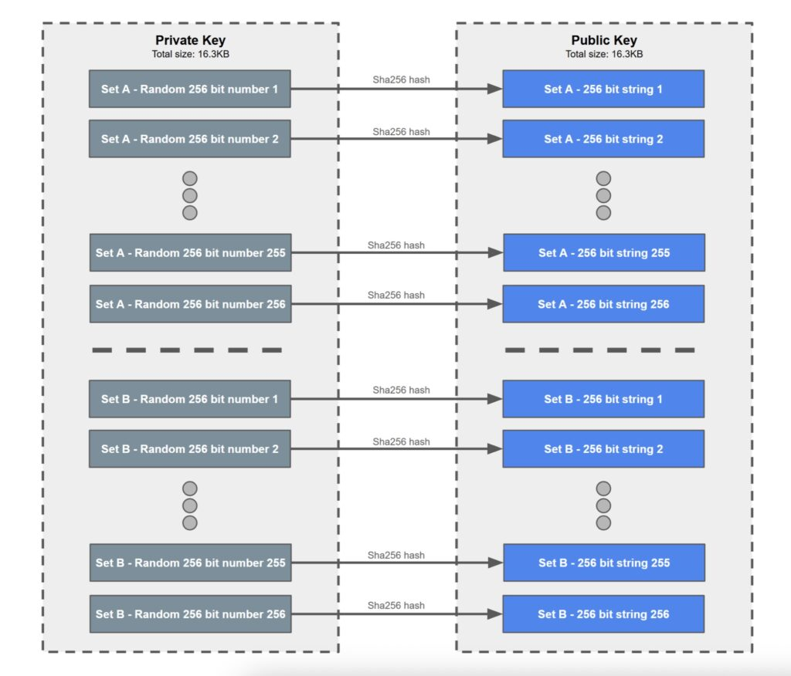
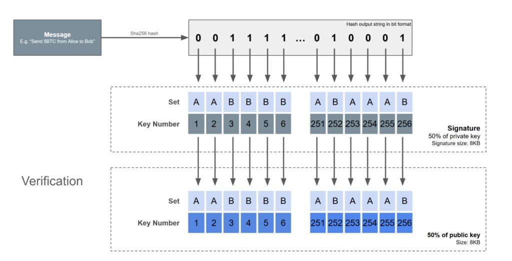
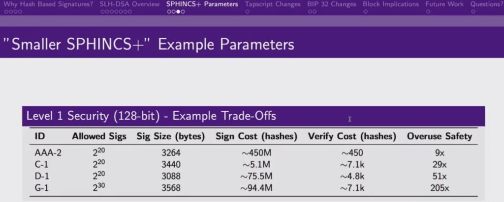

> *作者：BitMEX Research*
> 
> *来源：<https://blog.bitmex.com/quantum-safe-lamport-signatures/>*

**摘要**：我们介绍了 “Lamport 签名”，一种诞生于 1979 年、基于哈希函数的、量子安全的数字签名方案。我们用它来解释，何以量子安全签名可以非常简单、不需要很复杂也不需要新的数学。我们主张，这种基于哈希函数的签名可能正是我们应该选择的道路，如果比特币要采用一种量子安全的签名方案的话。没有确切的理由可以支持量子计算对比特币构成了迫在眉睫的威胁（在未来一段时间内都不能）。不过，我们认为，缓解表面上的量子计算威胁的第一步是，给用户提供花费比特币的量子安全方法。一旦这样的选择可得，一般用户的采用自然会推动下一步。

- 美国数学家和计算机科学家 Lesslie Lamport -

## 概述

“比特币暴露在量子计算机威胁中” 是近期的热门话题。最近甚至有一场[会议](https://pbquantum.com/)，发生在 San Francisco 的 Presidio Bitcoin ，是专门讨论这个问题的。我们认为，人应该尽可能理性行事。我们不理解量子计算，我们也还没有看到任何量子计算硬件实现任何令人印象非常深刻的成果，因此，似乎没什么好担心的。不过，我们也理解，我们的想法对一些人来说可能很可怕；量子计算的发展（在理论上）可能非常迅速。一种普遍的担心是，比特币可能需要升级到一种新的、非常复杂的、有风险的后量子密码学数字签名方案中。你可以读到一大堆听起来非常时髦的方案，包括 [HAWK](https://eprint.iacr.org/2022/1155.pdf)、[SQI](https://sqisign.org/)、[Falcon](https://falcon-sign.info/) 和 [CRYSTALS](https://pq-crystals.org/dilithium/) 。这些新方案也可能有自身的风险，如果我们选择了错误的方案呢？在 2023 年，有[报告](https://cacm.acm.org/news/nist-post-quantum-cryptography-candidate-cracked/)说一种新的后量子密码方案 “[SIKE 算法](https://en.wikipedia.org/wiki/Supersingular_isogeny_key_exchange)” 被传统的非量子计算破解。而且，如果量子计算发展迅猛，以至于几乎没有人理解量子计算，谁能断定这些方案真的是安全的呢？

不过，如果比特币要升级到一种后量子的电子签名方案中，我们完全不需要复杂的、有风险的新技术。回忆一下，比特币的电子签名方案 “椭圆曲线数字签名算法（ECDSA）” 可能是量子脆弱的，因为使用 “[Shor 算法](https://en.wikipedia.org/wiki/Shor's_algorithm)” 可以快速分解质因数。但是，哈希函数，在量子计算面前是非常安全的。SHA256 这样的哈希函数的弱点在于，因为 “[Grover 算法](https://en.wikipedia.org/wiki/Grover's_algorithm)” ，其安全性会下降一个平方级，也就是它将没有 256 比特的安全性，而只有 128 比特的安全性。这似乎基本上没问题了，而且有需要的话，你总是可以使用一个带有足够长输出的哈希函数。

实际上，有一种签名方案是完全依赖于哈希函数的。比如 “[Lamport 签名](https://www.microsoft.com/en-us/research/wp-content/uploads/2016/12/Constructing-Digital-Signatures-from-a-One-Way-Function.pdf)”，诞生于 1979 年。这种方案非常简单，相较于比特币所用的基于椭圆曲线的方案简单很多很多。而且，因为它只依赖于哈希函数，它是量子安全的。因此，如果比特币要加入一种量子安全的签名方案，那不需要依赖于时髦的新型数学，相反，我们只需选择一种基于哈希函数的方案。然后，比特币可以在所有事情上使用哈希函数，挖矿工作量证明和签名，让比特币更加简单。在本文剩下的部分，我们来看看 Lamport 签名的概念以及它是如何工作的。

## Lamport 签名如何工作？

在下面的案例中，我们假设 Lamport 签名使用 SHA256 哈希算法，但是，使用几乎任何哈希函数都可以，不影响它的工作原理。在 Lamport 签名中，一个私钥不像 ECDSA 签名那样是一个 256 比特的随机数，而是两组随机数，每一组都包含 256 个 256 位的随机数。在我们的案例中，我们管这两个集合叫做 “集合 A” 和 “集合 B”。因此，在 Lamport 签名中，一个私钥是 `2 * 256 * 256 = 131072 bits = 16.3 KB`。这 512 个 256 位的随机数，每一个都被哈希，以其结果作为对应的公钥，所以公钥的体积也是 `16.3 KB` 。一个比特币地址可以是所有构成公钥的字符串的拼接的一个 SHA256 哈希值。下图展示了私钥和公钥的对应关系。

要签名一条消息的时候，第一步是哈希这条消息，这时候也使用 SHA256 ，并将输出（哈希值）转为二进制。基于这个二进制数的每一位的数字，决定在签名中包含哪一个私钥 —— 0 对应集合 A、1对应集合 B 。哈希值的第一个比特（第一位）就对应于私钥中的第一个随机数、哈希值的第二位就对应于私钥中的第二个随机数，以此类推。因此，这个签名完全是在整个私钥中随机挑选出 50% 而产生的。

要验证这条消息的时候，所有验证者只需哈希这条消息，然后用哈希值的二进制表示的每一位来确定要用哪一个公钥来验证。再然后，验证者哈希签名中的每一个数字，看看它是否与对应的公钥相匹配。如果完全匹配，那就表明这个签名是有效的。这个签名者需要知道所有的私钥，因为哈希函数是随机的，你没法预测签名需要集合 A 和 集合 B 的哪一块，直到待签名的消息确定。因此，很容易能看出这个方案何以是安全的；验证过程在计算上也非常直接。

### 一次性

Lamport 签名的一个重要弱点是，公钥/私钥 只能使用一次。一旦一笔交易得到签名、发布到了区块链上，50% 的私钥就暴露了。如果再次使用相同的公钥，那么剩余未暴露的私钥中又会有 50% 暴露。从统计学上来说，这意味着整个私钥的 75% 已经暴露了。容易看出，其安全性会随着私钥复用的次数而急剧下降。这意味着，人们可能无法复用地址，这对隐私是好事，但也有一些问题：

- 人们习惯于复用地址
- 如果有人把资金发到了一个已经用过的地址中，会怎么样？
- 该如何实现 RBF ？可以通过加入一个额外的输入、并且只签名这个额外的输入来实现，但这也会带来 UTXO 挑选问题。

### 没有灵活的数学

另一个缺点是，无法像 ECDSA 那样使用灵活的数学技巧。比如，BIP-32 确定性层级钱包，就利用了 ECDS 的特性来允许使用 “xpub（拓展公钥）”；这在只有哈希函数的系统中是无法做到的。

### 体积

另一头房间力的大象是 Lamport 签名的公钥和签名的巨大体积。一个公钥是 16 KB，一个签名是 8 KB，加起来就是 24 KB 。一个比特币区块只能包含几十笔交易，而我们今天一个区块可以包含几千笔交易。不过，所有的量子安全方案似乎在一定程度上都有这个问题。

## SPHINCS+

我们刚刚分析原始版本的 Lamport 签名方案，只是为了演示，为了说明何以一种只依赖于哈希函数的签名方案也能够工作、还能做到量子安全。如果比特币要加入一种基于哈希函数的签名方案，还有一种先进得多的选择。在 1982 年，[Winternitz](https://sphere10.com/articles/cryptography/pqc/wots) 出版了 Lamport 方案的一个变体。Winternitz 方案设计将消息的哈希值分成两半，并将这两个数字映射到私钥的不同部分；会用到更多轮的哈希运算。在 2011 年，更新的变种 [XMSS](https://eprint.iacr.org/2011/484.pdf) 出现；再到 2015 年，另一种基于哈希函数的签名方案的变体 [SPHINCS](https://sphincs.org/) 出现。

SPHINCS+ 可以使用小得多的签名体积，私钥也可以多次使用。这些方案都使用了默克尔树构造，树的顶部是一个 “全局公钥”，因此一般来说，其体积只是 32 字节。如果比特币要采用一种后量子签名方案，可以选用这些带有默克尔树的哈希函数签名方案。因为比特币已经广泛使用了默克尔树，在签名中使用它们也是很方便的。

Lightning Labs 的联合创始人 Olaoluwa Osuntokun 在最近 San Francisco 的量子安全会议上介绍了 SPHINCS+ 签名。在演讲中，他解释了在使用 SPHINCS+ 的时候面临的几种取舍、如何根据我们的优先级实现我们想要的特性。可以调整的参数包含生成签名的哈希开销、验证签名的哈希开销、安全的可复用次数，以及签名的体积。Olaoluwa 表示，参数的调整最终可以让签名降低到 2 KB 大小，似乎是合情合理的。当然，这比当前比特币链上的签名（大约是 70 字节）还是大得多。

- 来源：https://x.com/PresidioBitcoin/status/1945877820657508650 -

## 结论

我们对 ECDSA 所面临的量子威胁并没有很深入的理解，但也找不到要去理解的切实理由。在我们看来，比特币所用的 ECDSA 方案，可能还能保持安全数十年，所以理性的决策可能是按兵不动，直到出现更多能展示量子计算机能耐的具体例子。不过，思考如何能让比特币变得量子安全，可能是有意义的。第一步是创造一种以量子安全的方式花费比特币的方法，这可以是一种基于哈希函数的签名方案。在我们看来，在量子安全的花费方式变得可用、并且被广泛使用之前，讨论冻结易受攻击的资金的计划没有任何严肃意义。如果一种量子安全的花费方法可用并且真的被许多用户采用，那才有参与这种辩论的意义。

当然，如果要添加一种基于哈希函数的签名方案，还有许多工作要做。给定大这么多的签名体积，也就是说，其交易手续费将贵这么多，该怎么让这种量子安全签名方案获得采用？我们又要在区块重量折扣和区块体积限制上故技重施？或者，我们可以用价值的大小而非 交易/UTXO 的数量来统计采用的程度。也许这些量子安全方案会首先被那些持有几千个比特币的实体采用，比如 ETF 供应商和比特币储备公司，他们几乎不发交易。对这些实体来说，额外的交易手续费开销也没什么大不了。个人用户可以将自己的储蓄存放在这些需要 2KB 的签名才能花费的量子安全输出中，而将日常开支放在量子脆弱的输出中。这些日常开支可以通过使用 P2WPKH 输出、避免地址复用来获得相对安全；P2WPKH 也使用哈希函数作为量子防御措施，用户只在交易未确认的时候才会面临风险。

如果量子安全的签名方案能获得足够多的采用，那么讨论缓解量子风险的下一步就会变得容易很多。在我们看来，一旦量子安全的赎回选项存在，最终来说，理性的用户会引导前进的道路。如果他们叔醇素量子安全的输出，那也没什么问题，这是他们的选择。如果采用真的很普遍，我们可以再讨论其他有争议的步骤，比如冻结资金、改变区块重量限制、 BIP-39 种子词量子安全复原方案，以及人们认为有必要的无论什么措施。就让持币人来决定。

（完）