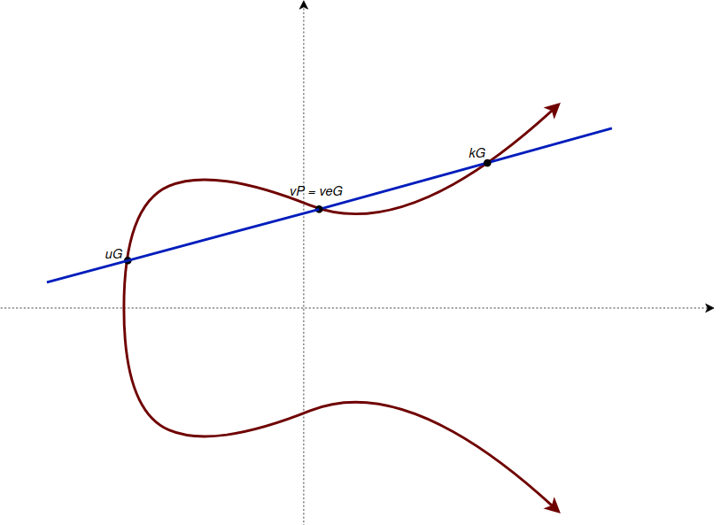

> *作者：ochekliye enigbe*
> 
> *来源：<https://enigbe.medium.com/randomness-signature-scripts-and-transaction-malleability-51f4ee1c2cbd>*

隔离见证的激活带来了一系列的变更，包括对交易不定形（transaction malleability）的修复 —— 所谓交易不定形，就是交易的标识符（整个交易的 **SHA256** 哈希值）会在交易内涵没有变更的情况下改变。一个交易通常包含下面几个字段：版本、交易的输入（包含前序交易的哈希值、输出的索引号、签名脚本、sequence）、交易的输出（包含面额以及公钥脚本）以及 locktime（时间锁）。

这些字段除了**签名脚本**之外都不能改变，不然会使交易作废。在交易被哈希之前，包含解锁脚本的字段会被清空（因为一个签名不能签名自身），因此有可能改变解锁脚本而不使交易的其余部分作废。就因为因为这一点，不同的解锁脚本可以表示同一笔交易。这是为什么呢？

一开始，我以为这跟签名的计算方式有关；用来签名交易的算法中嵌入了随机性。

从我的角度看，理解签名过程的底层数学原理应该会有所启发。因此，在本文中，我会解释我对签名的基本数学的理解、为什么不同的签名（延伸来说是解锁脚本）可以用在同一笔交易上、为什么隔离见证能够修复交易不定形问题。

## 签名的基本数学

签名是一种证明签名者知晓（或者说拥有）一个秘密值（即私钥，记为 e）而无需公开这个值的方法。我们知道，在非对称密码系统中：

$$eG(x, y) = P(x, y)$$

- 等式 1. 使用私钥和生成点计算公钥 -

这里的 **G** 就是生成点，**P** 就是 e 的公钥。

要签名一个交易哈希值时，需要选择一个随机数 **k**，使得：

$$kG(x, y) = R(r, y)$$

- 等式 2. 计算签名 -

我在这里假设了 G 在椭圆曲线上，R 也在椭圆曲线上，因此，可以用曲线上的两个点（以及加法）得出 R 的位置（[加法在一个有限域中是封闭的](https://enigbe.medium.com/about-elliptic-curves-and-dlp-ed76c5e27497)）。这样的点 **(u, v)** 可以由签名者选出，如下图所示：

- 图 1. 椭圆曲线以及曲线上的 uG、vP 和 kG 点 -

$$uG(x, y) + vP(x, y) = kG(x, y)$$

- 等式 3. 离散对数问题 -

$$vP(x, y) = (k - u)G(x, y)$$

已知 *eG = P*，则可以转化为：

$$veG(x, y) = (k - u)G(x, y)\\\\e = (k - u)/v$$

- 等式 4. 签名的目标 -

等式 4 可以理解为离散对数问题（discrete log problem）的另一种形式，因为要么你知道 e，可以选出 k 使得 *（k - u) / v = e* （从而解出 *eG = P*），那么你就只能用暴力尝试的办法来找出成立的 *(k, u, v)* 数组。

在为一笔交易生成一个有效的签名 **S(r, s)** 之时，我们需要：

- 得出交易的哈希值 **z** —— 注意，需要清空解锁脚本并添加适当的[签名哈希标签](https://enigbe.medium.com/signature-hash-flags-f059d035ddd0)
- 选出一个随机数 k
- 计算 *kG = R(r, y)* 并取出其 x 坐标值 **r**
- 计算 s，使得交易的哈希值 z 与私钥 e 可以通过下面的方式选出的 u 和 v 结合成签名：

$$u = z/s; v = r/s \\ s = (z + re)/k$$

r 和 s 就构成了对该交易的一个有效的签名。

## 为什么不同的签名脚本可以用在同一笔交易上

由上可知，任何能够满足上述等式的 k（不能重复使用，对每个签名都是唯一的）、u 和 v 的组合都是对给定签名哈希值 z 的有效签名。从签名者的角度看，这当然很好。因为交易的签名者可以签名同一笔交易许多次，为同一笔交易生成不同的有效签名。签名会被嵌入到交易的签名脚本中，然后广播到网络中。

但是，网络中的一些恶意用户可以在收到广播过来的交易后，稍微改变它、创建出一笔新的、变形了的有效交易；新交易在本质上与被广播的交易没有什么不同，但却具有不一样的交易 ID。这些交易花费同样的输入、给同样的输出转移相同的价值，因此会相互冲突，只有其中一笔才能挖出、加入到账本中。如果变形了的交易被挖出了，原交易会因为花费同样的输入而无法上链。

那么交易可以怎么变形呢？恶意用户可以修改签名脚本的签名格式、为签名脚本加入额外的指令、在签名脚本上使用加密技巧（见 Rosenbaum(2019) ）。基本上，改变了交易的签名脚本，就会改变交易的序列化形式，从而改变交易的标识符。

## 隔离见证与交易不定形的修复

隔离见证提议将签名脚本数据移到另一个字段 —— witeness 字段，并且该字段不会用于计算交易 ID，所以签名脚本字段的变化不会影响交易的标识符。

## 结论

随机性以及每个签名唯一的 k 的选取，让签名者可以让交易数据产生变化。他们可以为一笔交易生成不同的签名，虽然最后只有一个会嵌进解锁脚本中。在隔离见证实施以前，签名后的交易在广播过程中，用户可能会遭遇变形攻击：恶意用户可以修改广播交易的签名脚本字段，从而改变交易的标识符。而有了隔离见证，签名脚本的数据会移到一个不影响交易 ID 计算的字段中，从而消除了变形攻击界面。

**注**：

如有任何反馈，不胜感激。不论是觉得本文有用，还是发现了事实性错误，请不吝在在我的推特 [@engb_os](https://twitter.com/engb_os) 中留下评论。

**参考文献**：

1. Antonopoulos, A. (2017). Mastering bitcoin: Programming the open blockchain
2. Song, J. (2019). *Programming bitcoin: Learn how to program bitcoin from scratch*
3. Rosenbaum, K. (2019). *Grokking Bitcoin*

（完）