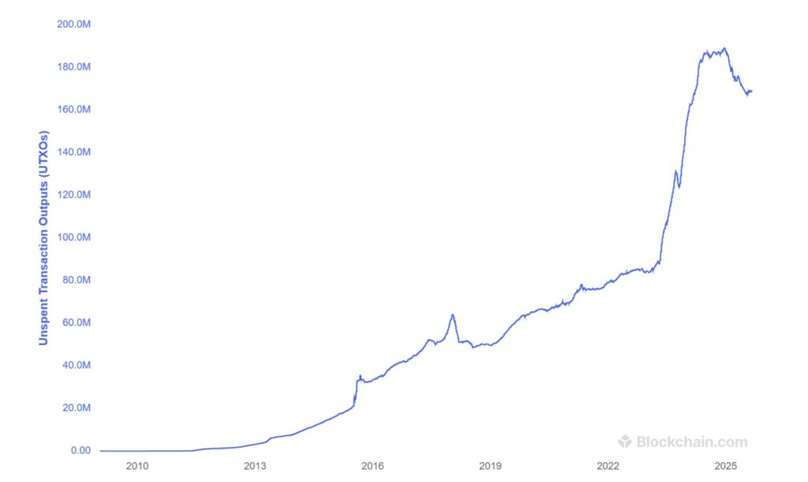

> *作者：BitMEX Reaearch*
>
> *来源：<https://www.bitmex.com/blog/ordinals-impact-on-node-runners>*
>
> 编者注：原文标题为 “Ordinals - Impact On Node Runners（Ordinals 对节点运营者的影响）”，然而，文中讨论的主要对象 “BRC-20” 与 “Ordinals 协议” 并无关联，它与 Ordinals 的唯一共同点在于都使用了 “Inscription” 方法，即在花费隔离见证 v1（Taproot）脚本时，在见证（witness）脚本中使用条件语句向区块链写入裸数据（但实际上并未使用按序数编号的 “聪” 作为绑定 token 的主体 —— 而这是 Ordinals 协议最核心的特点）。因此，在译本中改用此标题。

**摘要**：我们再一次观察了比特币区块链上与 “Inscription（铭文）” 有关的数据。我们要指出，从交易的数量上看，“BRC-20 方案” token 是铭文的主要用法，总计发生了 92.5 百万笔 BRC-20 交易，但只有 2.7 百万个 “Ordinals 协议” 图片 token。不过，如果考虑数据的体积，Ordinals 图片 token 占据的体积与 BRC-20 token 大体相当，大约于 30 GB 。我们解释了，从一个节点运营者的角度看，规模较小的 BRC-20 相关交易，虽然在结构上与普通交易非常相似，负面影响却要大得多。相反，Ordinals 图片的体积更大，也包含更多 “非限定数据”，对节点的资源用量却是中性甚至正面的影响。因此，BRC-20 token 更有可能让一些节点运营者担心。

## 概述

在 2023 年 2 月，当所谓的 “Ordinals 风暴” 还在酝酿之中时，我们就[分析](https://blog.bitmex.com/ordinals-data/)了区块链，制作了我们对该主题的第一份报告。在本文中，我们再次观察了比特币区块链上与铭文相关的数据；尤其是，我们评估了这些数据对运行一个比特币全节点的资源要求造成的影响。

## 分类的铭文数据概述

自 Ordinasls 狂热爆发以来，比特币区块链上出现了大约 97.4 百万个铭文。其中，从数量上看，压倒性多数都与 BRC-20 token 有关，既包含 token 铸造，也包含 token 转移。相反，大约只有 2.7 百万张图片铭刻到了比特币区块链上。详情如下表所示：

| **类型** | **计数**       |
| -------- | -------------- |
| BRC-20   | 92,514,620     |
| 图片     | 2,710,087      |
| 其它     | 2,048,399      |
| 视频     | 100,321        |
| 音频     | 1,525          |
| Pdf      | 634            |
| **总计** | **97,375,586** |

- 铭文数量总计。数据来源：https://dune.com/dgtl_assets/bitcoin-ordinals-analysis -

- 数据来源：https://dune.com/dgtl_assets/bitcoin-ordinals-analysis -

虽然从数量上看，BRC-20 在铭文交易中占据绝大多数，但在数据体积上，情形就复杂一些了。从字节数量上看，Ordinals 图片和其它数据占据了大约 30 GB 的区块空间，稍微大于由 BRC-20 相关交易占据的 27.8 GB 空间。因此，如果从裸数据角度看，图片的影响跟 BRC-20 token 的影响相当。但如果从区块重量（weight）上看，图片受益于见证数据折扣，只占用了 8.9 百万的重量单位，显著少于 BRC-20 token（到目前为止，占用了 13.9 百万的重量单位）。

> 译者注：自 2017 年隔离见证分叉以来，比特币协议使用了一种新的单位 —— weight unit，重量单位 —— 来度量验证一笔交易的资源负担。原本，度量单位是字节，即以交易的字节体积来度量验证它的资源负担；而在隔离见证升级后，即使两笔交易的字节体积相同，如果一笔交易使用了隔离见证输入，另一笔交易没有，其验证负担在客观上也不相同；因此，隔离见证升级通过区分交易本体数据与见证数据，在计算重量单位时给予两者不同的重量乘数，来反映这种验证开销上的差异。具体而已，交易本体的 1 字节换算为 4 重量单位，而见证数据的 1 字节换算为 1 重量单位（也就是所谓的 “见证折扣”）。
>
> 下表中的 “虚拟字节”，是 “重量单位” 的翻版：交易本体的 1 字节换算为 1 虚拟字节；见证数据的 1 字节换算为 1/4 虚拟字节。
>
> 有鉴于此，对照上文和下表，实在不知为何作者在 “重量单位” 和 “虚拟字节” 上居然能使用相同的数字。很可能作者在这两个概念上犯了错误；但是，只要在比较不同对象时使用了相同的概念，则并不妨碍作者在这里得出的结论。

|              | **数据体积（MB）** | 虚拟字节（M） | 手续费（BTC） | 平均费率（聪/vb） |
| ------------ | ------------------ | ------------- | ------------- | ----------------- |
| BRC-20 token | 27,813             | 13,912        | 5,072         | 36.5              |
| 图片及其它   | 29,957             | 8,935         | 2,012         | 22.5              |
| 非铭文交易   | 183,942            | 119,016       | 33,236        | 27.9              |
| **总计**     | **241,712**        | **141,863**   | **40,321**    | **28.4**          |

- 来源：BitMEX Research 。注：数据采集自 2022 年 10 月至 2025 年 9 月 -

## 节点运营成本：理论层面

从节点运营成本的角度看，理论上，更大体积的 Ordinals 图片是更容易验证的，对比同样一单位重量的普通交易来说。这是因为，图片是铭刻在 Taproot 见证脚本的不执行的部分的。因此，这部分不需要验证签名 —— 而验证签名可能是运营一个节点的计算量最大的部分。Ordinals 图片也在另一种角度上有利于扩容，因为这些巨大的图片占用了区块空间，这些区块空间就不能用来扩大 UTXO 集的大小。因此，总的来说，与交易无关的非限定数据的影响可能是积极的，如果完全从验证区块链所需的资源的角度看的话。

相反，BRC-20 相关的交易在特征上更像普通的非铭文比特币交易。BRC-20 交易在体积上更小，而且携带更少的非限定蜀山是，因此从节点运营者的角度看，验证所需的节点资源将跟普通交易大致相当。然而，BRC-20 token 的关键问题在于，从扩容的角度看，它似乎会让 UTXO 集膨胀。主要因为 BRC-20 token 而产生的结果是，UTXO 集的大小因为它从 84 百万个膨胀到了 169 百万个，就发生在从 2022 年 10 月到 2025 年 9 月的铭文狂热期间。这是大约 85 百万个交易输出的增量。UTXO 集的大小是节点运营成本的关键指标，尤其对剪枝节点而言，因此，BRC-20 token 的存在对这些运营中的节点来说是有害的。不仅如此，交易输出不会从见证折扣中获利，因此，BRC-20 token 相关的交易为使用区块空间支付了更高的手续费率（以字节计）。自 BRC-20 协议发明以来，BRC-20 交易支付了超过 5000 比特币的交易手续费。

UTXO 集体积

- 来源：https://www.blockchain.com/explorer/charts/utxo-count -

## 节点验证结果

我们运行了几项测试，形成了一次初始化区块下载。我们使用了一台运行 Ubuntu 操作系统、8 CPU 核心以及 8GB 内存的计算机。该机器使用 1 TB 的固态硬盘以及 1Gb/s 的互联网连接。我们的分析的一个潜在问题是，它的互联网连接速度太快了，使用家用宽带的节点的连接速度会更慢，所以下载大体积的 Ordinals 交易可能会更慢。我们的测试是在 `Bitcoin Core` v29.1 上完成的。这个性能测试的目标是评估节点下载和验证区块的速度有多快、这个速度与区块中的铭文数据的数量有无关联。在下表中，每个点表示一天，X 轴表示每秒验证的（该天所产生的）区块数量，Y 轴表示该天每个区块的铭文数据平均数量，或者说，该天的每个铭文的平均体积。

- - -

使用 `assume valid = 1` 的启动选项所得到的结果（跳过了签名验证）。

**每日的平均每区块铭文数据体积 vs. 区块验证速度（区块数量/秒）**

- 来源：BitMEX Research 。注：数据采集自 2022 年 10 月至 2025 年 9 月，总计 959 天 -

**每日的平均每个铭文数据体积 vs. 区块验证速度**

- 来源：BitMEX Research 。注：数据采集自 2022 年 10 月至 2025 年 9 月，总计 959 天 -

- - -

使用 `assume valid = 0` 的启动选项所得到的结果（未跳过签名验证）。

**每日的平均每区块铭文数据体积 vs. 区块验证速度（区块数量/秒）**

- 来源：BitMEX Research 。注：数据采集自 2022 年 10 月至 2025 年 9 月，总计 959 天 -

**每日的平均每个铭文数据体积 vs. 区块验证速度**

- 来源：BitMEX Research 。注：数据采集自 2022 年 10 月至 2025 年 9 月，总计 959 天 -

- - -

结果可以说是相当不确定的，不过，每一个回归方程都展示了铭文数据的数量与验证速度的正向关系。在点对点网络中通过互联网下载数据时，总是面临许多的随机性，因此，可以理解这些结果表明两者的关系是相当弱的。硬盘的随机问题也可能导致速度便航线。因此，人们也应该对这些结果持一定程度的怀疑，我们发布这个结果，是希望其他人能重复以及改进这个实验。

为什么更多铭文数据会加速验证？理论分析的一个关键部分是，假设区块总是满载的。如果非限定数据取代（挤出）了交易数据，那么这可能就会加速验证。但是，区块绝大部分是满载的，却并不 100% 是满载的。不满载的区块，意味着更多的非限定数据就会拖慢区块验证速度。因此，在这一期间， 2022 年 10 月至 2025 年 9 月，也许这两个因素在一定程度上互相抵消。当 `assume valid` 选项打开时，这个效应应该会比较明显，但平均每区块的铭文数据与验证速度的 R 平方关系仅仅是 0.1% 。因此，本质上没有证据证明两者有相关关系。

这个结果也有一些道理，在于，当关闭 `assume valid` 时，铭文数据体积与验证速度的正相关关系上升了。关闭 `assume valid` 可能是测试这一点的最好方式，因为，一旦你的节点同步到区块链顶端，它就会开始检查签名，这正是绝大多数节点的状态。测试中出现的最强 R 平方值是 11%，出现在关闭 `assume valid`、考察铭文数据平均体积与验证速度关系的时候。这些日度数据可能表明，区块验证会随着铭文数据平均体积上升而加快，而验证时间的变化中有 11% 可以由铭文数据体积变大来解释。

## 结论

上述分析并不表明更大的 Ordinals 图片是好事情、对比特币是正面的。这些图片在长期中可能对系统有负面影响，因为它们可能挤出金融交易，而这又会带来一系列的负面后果。本文中的所有数据可能表明，大体积的 Ordinals 图片可能有一个小型的侧面好处，部分抵消这种可能的负面影响，那就是，区块链内出现更多的非限定数据，在有些情况下，会让运行节点实际上稍微容易一些。

（完）