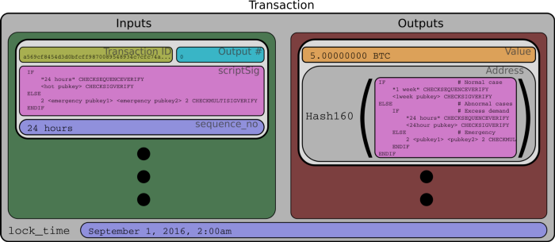

> *作者：Bob McElrath*
>
> *来源：<https://medium.com/@BobMcElrath/re-imagining-cold-storage-with-timelocks-1f293bfe421f>*
>
> *原文出版于 2016 年。*


“冷存储” 指的是让私钥离线保管、使攻击者无法远程访问的技术。大部分比特币交易所都使用这种技术，偶尔会在 “热钱包” 和离线的 “冷钱包” 之间移动资金（用来满足用户的取款需要）。因为需求会变化，交易所不会频繁在两者间移动比特币。

冷存储资产的思维模式跟你到物理世界的可感知事物的直观理解相似，就像黄金、贝壳和股票证书一样。在比特币中，P2PKH（支付到公钥哈希值）地址应用这种思维模式的，只不过私钥可以放在不止一个地方，所以不论你认为比特币放在哪个地方，都是不准确的。这些技术没有得到连贯一致的实现，所以导致了一些众所周知的损失。

相较于中本聪最初的设计，比特币已经改变了很多，最近形成了这些 BIP 中的后面三个。

1. [BIP65 OP_CHECKLOCKTIMEVERIFY](https://github.com/bitcoin/bips/blob/master/bip-0065.mediawiki)（脚本层面的决定时间锁）
2. [BIP68 Relative nLocktime](https://github.com/bitcoin/bips/blob/master/bip-0068.mediawiki)（交易层面的相对时间锁）
3. [BIP112 OP_CHECKSEQUENCEVERIFY](https://github.com/bitcoin/bips/blob/master/bip-0112.mediawiki)（脚本层面的相对时间锁）
4. [BIP113 过去时间的中值作为时间锁计算的端点](https://github.com/bitcoin/bips/blob/master/bip-0113.mediawiki)

#1 是于 2015 年 12 月在比特币主网上激活的，而 #2、3、4 是于 2016 年 7 月 4 日激活的。后面三者被集体称为 “CSV 软分叉”，而且使用它们需要你把交易的版本号设为 2。每个需要托管和移动大量比特币的交易所和其他服务现在都可以利用这些元件来提高安全性、减少偷盗。那么我们来看看这些新功能对冷存储有什么用处。大部分的内容都已经由上面列出的比特币升级提案的正文直接或间接表述了出来。现在软分叉已经激活，是时候该使用更高级的策略了。

在 CSV 软分叉之前，比特币已经有时间锁功能，但几乎没有什么用处。新的这些时间锁允许一个商人：

1. 根据他的时间表移动资金；
2. 注意到资金是否按计划移动，并采取行动。

攻击者的目标是获得一个私钥，以解锁该私钥控制的资金并发送到自己选择的地址。通过恰当地使用时间锁和已经签名的交易（而非私钥），商人可以实现带有多个层级的风险缓冲策略。

## 多样的时间锁


<p style="text-align:center">- 实体保险柜的时间锁在比特币存在之前很久就发明出来了。在古代的西方，一个银行管理员可以在下班的时候锁住保险柜，用时间锁来保证这个金库在下一个工作日上班前无法打开。跟其它伟大的密码金融观念一样，这种技术在其专利于 1831 年到期后很久才得到广泛应用。 -</p>


CSV 软分叉所包含的不是一个，而是至少 *三种* 不同形式的时间锁（这要看你是怎么统计的）。时间锁既可以是 *相对的*，也可以是 *绝对的*。相对时间锁的意思是（打个比方） “这笔交易在其输入得到确认后的 6 个区块内无法上链”。而绝对时间锁的意思是（打个比方）“这笔交易在 2016 年 9 月 1 日凌晨 2 点之前无法上链”。

时间锁中的时间有两种度量方式，一种是 *区块* 的数量，另一种是 *以 512 秒为一段的时间*。区块的生成是随机事件，你不能完全确保一段时间内会有多少个区块挖出，虽然平均来说是每 10 分钟挖出一个区块。因此，CSV 软分叉还允许用户以 512 秒为单位指定时间锁，而链上的时间则以[过去 11 个区块的时间戳的中值](https://github.com/bitcoin/bips/blob/master/bip-0113.mediawiki)计。选择这样做的原因是，512 是 2 的幂，而且很接近比特币的理想出块间隔（600 分钟）。所以，时间锁数据字段（**sequence_no** 和 **lock_time**）可以用两种方式来表达时间，而且可编码的时间长度最大值相当。

**sequence_no** 字段的命名是出于历史原因，但 CSV 软分叉将其重新定义为 *每个输入分设的时间锁*。**lock_time** 字段是属于交易层面的，所以是 *交易层面的时间锁*。不论是哪一种，一笔交易只要在任何一个字段上未解除时间锁，就无法挖出（上链）。

最后，CSV 软分叉还加入了两个新的操作码，**OP_CHECKSEQUENCEVERIFY** 允许用户使用一个输入脚本来检查 **sequence_no** 字段；而 **OP_CHECKLOCKTIMEVERIFY** 允许用户使用脚本来检查 **lock_time** 字段。当用户让一笔支付使用 P2SH（[Pay-to-Script Hash](https://github.com/bitcoin/bips/blob/master/bip-0016.mediawiki)）脚本并在脚本中使用这些操作码，他可以强制让一笔交易的输出在该交易 *挖出* 后的一段时间内无法使用。

现在，我们来设想一下这些新工具可以如何用于交易所这样的服务。我们对这个假想的比特币服务作出如下假设：

1. 这个服务每天都会收到存款，而且会在交易日里多次把资金从热钱包 *移到* 冷钱包。
2. 这个服务偶尔会需要将资金从冷钱包中 *移出*， 以满足用户的取款需求，因此乐于让这些冷存储的资金在一段时间内不可访问。
3. 这个服务将只使用 P2SH 交易，这种交易将使用新的时间锁和多签名条件。

 最后一条引入了比表面上更多的复杂性，因为脚本可能有复杂的执行条件。当比特币被 P2SH 脚本控制时，我们很难确认这些比特币的 “位置”。因此，我们建议你，亲爱的读者，完全抛弃关于 “热比特币”、“冷比特币” 以及 “比特币存放在某处” 的概念。一个比特币输出，在不同的条件下，*既可以被离线的私钥花费，也可以被在线的私钥花费*。

## 时间锁交易的结构

第一种使用时间锁的办法就是为一笔交易指定 **lock_time** 字段，以及/或者 为一个交易输入指定 **sequence_no** 字段 —— 这将迫使我们在签名这笔交易后留存这笔交易一段时间。这种办法很有用，加入我想把这笔签过名的交易交给一个对手，对方将无法在我选定的时间以前广播这笔交易。但是，在保护我们自己的财产时，我们没有对手方，所以需要用别的方式来使用这些字段。



<p style="text-align:center">- 一笔使用 sequence_no 和 lock_time 时间锁（以紫色标记）的比特币交易的结构概略图。执行时间锁的输入和输出脚本以粉色标记 -</p>


第二种方式是使用一个会检查时间锁的脚本。因为在 P2SH 交易中，交易输出的脚本是隐式的，所以我可以要求这个输出 “锁定” 一段时间，而不会在链上被人发现。然后，我们可以使用 IF/ELSE 语句将多个时间锁串联起来，或者规定花费这个输出的“紧急” 方法。我们考虑一个带有紧急解锁路径的简单时间锁交易。这种形式的脚本类似于上面的图片中展示的机械时间锁，保险柜的主人也有一把万能钥匙。

```
OP_IF
  "24h" OP_CHECKSEQUENCEVERIFY OP_DROP
  <hot pubkey> OP_CHECKSIGVERIFY
OP_ELSE
  OP_2 <emergency pubkey1> <emergency pubkey2> OP_2 OP_CHECKMULTISIGVERIFY
OP_ENDIF
```

<p style="text-align:center">- 一个带有紧急解锁路径的 P2SH 脚本 -</p>


这里，我们是在使用 **OP_CHECKSEQUENCEVERIFY**，给热钱包中的资金设置了一个 24 小时的时间锁。这个时间锁保证了这个热钱包无法在 24 小时内花费这笔资金（为了清晰，我们省去了对 “24” 小时的数字编码展示）。上述的脚本会使用 Hash160 计算出哈希值，然后生成出 3Lockedfor24hqWsoQHL7MevXvZTFrxEhi 这样的 P2SH 地址。热钱包向该地址发起一笔支付。当该支付上链之后，这些资金就带上了时间锁（因为上述的脚本）。

在 **OP_IF** 之后的第一条代码路径，要求任何使用  ` <hot pubkey> ` 的签名来花费该地址中资金的交易，都必须将 **sequence_no** 字段设置为形成该目标资金的交易上链的 24 小时之后。而 **OP_ELSE** 之后的第二条路径，则是为紧急情况准备的。在正常情况下，不会需要依赖于这些紧急私钥。这些私钥应该保存在安全的地方。

 相对于支付通道交易，上述交易是 “反向的”，因为其 “常规情形” 和 “罕见情形” 的代码路径刚好相反。在上面这个脚本中，“常规情形” 的代码路径带有时间锁，另一条代码路径对应的是 “罕见情形” 。而在支付通道中，使用时间锁的是 “单方面关闭通道” 的情形。在支付通道中，合作的双方可以来回签名、发送交易，所以不带时间锁的代码路径才是常规情形下的路径。

## 支付给带有时间锁的签名交易

无论是 P2PKH 还是多签名输出，裸露公钥本身就是一件危险的事。任何人只要拿到了这些公钥的私钥，就可以编写交易，将资金发送到自己想要的任何地方。因此，如果我需要持续控制资金，我会希望提前编写一套方案，并强制执行。裸露的公钥是做不到这一点的。光脚本自身也无法强制让未来的交易把资金发送到某个目的地。脚本只验证花费一个输入的能力，但无法影响输出。

因此，我们引入一个新的技巧：我们先把资金发送到一个带有时间锁的脚本中，然后编写一个从 *该交易（该脚本）* 中花费资金的交易、签好名，然后把私钥删掉。这笔交易的最终目的可以是一个热钱包地址，或者是一个使用专门保管的私钥生成的地址，日后我们再把这个私钥导入热钱包中。这样一来，我们就不仅安排好了资金存放的 脚本/地址，还安排了它下一步 *必须* 去什么地方。只要我确定我删除了私钥，这些资金在上述第二笔交易广播之前就是无法偷盗的（因为可以签发交易的私钥已经不存在了），而且还需要等待第二笔交易的时间锁解锁（如果有的话）。我们可以把这种模式叫做 “支付给带有时间锁的签名交易”，或者 “P2TST”。我甚至可以进一步创建出支付的链条，执行更复杂的安排：用连续的带有时间锁的签名交易将所有的输入和输出关联起来，执行更复杂的安排。

在这种模式中，我必须存储所有的中间 TST。为了确保攻击者无法拦截相应的私钥，我可以使用一个[硬件签名设备](https://en.bitcoin.it/wiki/Hardware_wallet)：用这个硬件设备生成一个新的私钥、导出相应的公钥、创建并签名交易，然后重设设备、使之生成一个全新的私钥。这样一来，可以签名的私钥就删除了。 因此，即使一个攻击者控制了生成交易的热钱包服务器，他也无法控制这些私钥，因为硬件模块会拒绝导出。交易所可以定期创建这样的交易，比如每次存入量超过 100 BTC 就执行一次这样的操作。

当运营者想复原锁定的资金时，他就找出并广播对应的签名交易。如果这些 TST 在输入中设置了时间锁，那么这些交易就无法在时间锁解锁前广播出去。如果 TST 的输出设置了时间锁，那么这些输出就无法在 TST 上链之后的一段时间内花费。因此，TST 可以成为一种 “煤矿中的金丝雀”，提醒交易所注意可能的恶意行为。因为攻击者盗取资金的 *唯一* 方法就是获得和广播 TST，运营者可以监控区块链，看自己的 TST 有没有意外出现，有就说明有恶意行为。

当 TST 意外出现时，交易所运营者可以采取行动，比如召集紧急私钥，在下一个时间锁解锁前转移资金。

这个链条的最终目标地址和每一条 TST，都会涉及到一个在该 TST 广播之前没有用处的密钥。即使攻击者拿到了这些公钥的私钥，他们也很难断定自己能不能花费某一些资金，即使 TST 广播之后也不能，因为目标地址是脚本的哈希值，可能包含其它公钥以及当前的 TST 没有包含的花费条件。

TST 是带有这些有趣属性的新工具。我们可以将它们当成是同质化的。一个运营者可以创建许多固定面额的 TST ，然后将它们保管在安全地方，就像对待金条一样。

可能更有趣的是，TST 不是特别敏感。它们不是真正的资金，也不包含对资金的控制权（有控制权的私钥最终在主人手上）。因此，TST 可以放在相对不那么值得信任的托管方手上。也可以备份放在多个地方。但是，它们有效地保护了资金不落入攻击者之手。

上述所有 TST 用到的脚本都带有 “紧急解锁分支”，即使用 IF/ELSE 来避开时间锁的代码路径，或者是带有更短时间锁的路径。所以有人想偷盗资金会被挫败。这些 “紧急私钥” 在正常情况下 *永远不该* 动用，这样才能保障安全。

## 冷存储的未来？

上述时间锁策略的一个缺点是，一旦某一笔使用这种策略的交易被花费，相应的脚本就会大白于天下，从而暴露出运营者的策略。攻击者可能无法获得你的私钥，但知道有一个 3-of-3 的紧急解锁分支可以绕过时间锁，依然是很有价值的信息。

比特币 “很快” 将迎来另一个叫做 “默克尔抽象语法树（[Merkle Abstract Syntax Trees](https://github.com/bitcoin/bips/blob/master/bip-0114.mediawiki)）” 的升级，它将允许你把复杂的布尔表达式（例如上面的脚本）转化成一个默克尔树一样的承诺树。它优点在于，当你使用 MAST 来花费某一笔交易时，只有被执行的代码路径会曝光，其它代码路径不会。所以，运营者可以隐藏其它可能设置的时间锁、紧急解锁分支、它们的结构，网络上的其他人都无法看穿。

我们还应该指出，上面的时间锁脚本，全部都属于 “见证数据（witness data）”，使用 “[隔离见证](https://github.com/bitcoin/bips/blob/master/bip-0141.mediawiki)（SegWit）” 技术可以从交易主体中分离出去。这意味着，这种复杂的脚本使用隔离见证时可以 *在 1MB 的区块大小限制下获得 75% 的手续费折扣*。隔离见证已经在比特币的测试网上几乎，而且很快会在主网上激活。任何开发这种新的冷存储策略的人都应该考虑从一开始就使用时间锁和隔离见证。

时间锁和预先签名且删除了私钥的交易（TST）是强大的新工具，可用于风险管理及防止损失。让我们拥抱这些新工具，并制造比 “热存储” 和 “冷存储” 更好的策略吧，冷热存储感觉起来更像老旧的机械保险柜，对比特币来说可能是不够的。

感谢 Ivan Brightly 和 Joey Fiscella 为本文贡献的有益讨论。

> 译者注：作者在这里提出的思想其实非常接近于后来的 “限制条款（covenant）”。限制条款的意思用作者的话来说，就是 “为脚本赋予限制输出的能力”。而作者则是在当时的比特币脚本限制下，设想了可实现近似效果的方式 —— 删除私钥的预先签名交易。这种中间状态可以当成是我们思考限制条款的起点 —— 在限制条款中，我们到底能获得什么？

（完）