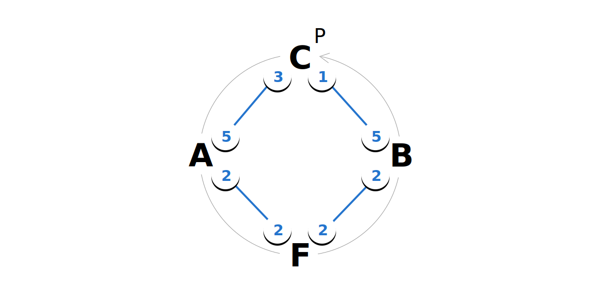
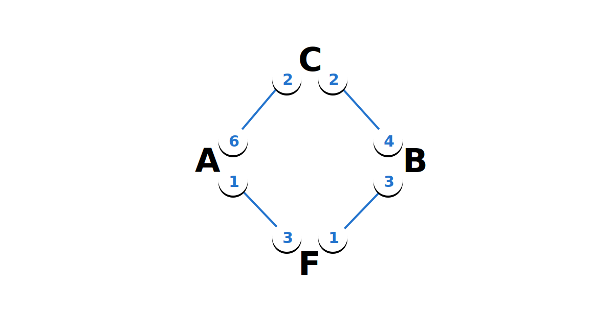
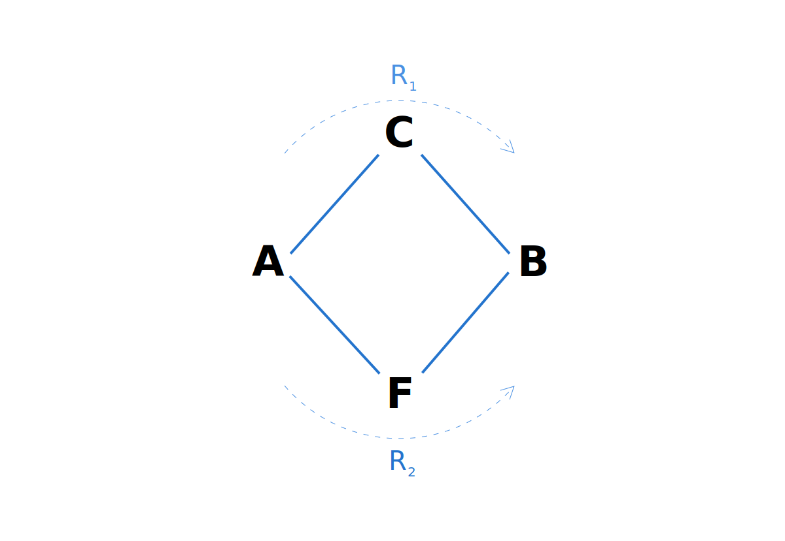
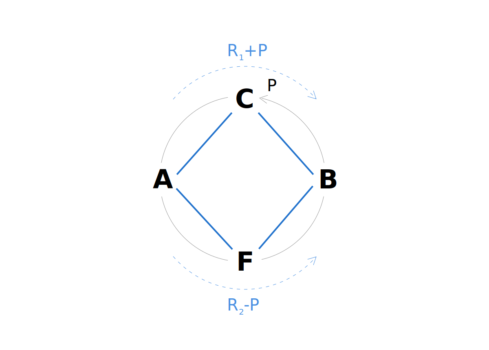

> *作者：Sebastián Reca & Florencia Ravenna*
>
> *来源：<https://blog.muun.com/rebalancing-strategies-overview/>*
>
> *原文出版于 2018 年 11 月。*

中介节点在闪电网络中扮演着关键的角色，他们让用户可以跟自己并无直接通道的对等节点交互。如果没有中介节点，闪电网络将失去绝大部分吸引力。

在之前的文章中，我们已经解释了路由支付会使得中介节点的通道失衡，以及由此引发的通道再平衡需求。我们将 “再平衡（rebalancing）” 定义为一种保证交易路由能力的策略性操作：一个闪电网络的参与者以减少自己在某一通道中的余额为代价，提高自己在另一条通道中的余额。

这篇文章就是对现在闪电网络社区正在讨论的再平衡方案的简介。

要理解这篇文章，你得先熟悉支付通道和闪电网络的基本原理。如果你还不了解，强烈建议你先阅读[这篇文章](https://blog.muun.com/rebalancing-in-the-lightning-network/)。

## 再平衡

Carol 是闪电网络中的一个节点。她跟 Alice 和 Bob 开设了通道，这俩人想相互支付，但并没有直接相连的支付通道。因此，Carol 作为一个中介节点，居中路由支付。

为了路由支付，Carol 必须提前准备好资金，但每次她路由了一笔支付，在她跟发送者的通道中，她的余额增加，而在她跟接收者的通道中，她的余额减少；除去她获得的手续费，增减的数额相同。

路由支付会使 Carol 的通道失衡，一直路由下去，最终她将没有足够多的通道资金来路由支付。到这个时候，Carol 就要再平衡自己的通道了。

- Alice 想给 Bob 支付 2 btc，但 Carol 已经无法路由支付了。她需要再平衡自己的通道 -

## 环路支付

### 简介及好处

“环路支付（Circular payments）” 是一种完全发生在链下的再平衡方法，核心是**一个节点通过一条由支付通道形成的环路来给自己支付**。为了让支付循环起来，至少要有 3 个节点参与其中。

- Carol 可以使用由 Alice、Frank、Bob 和她自己形成的一条封闭路径，按逆时钟方向给自己支付 -

- 在 Carol 跟 Alice 的通道中，Carol 的余额减少 1 btc；而在 Carol 跟 Bob 的通道中，Carol 的余额提高 1 btc。现在她可以帮 Alice 路由支付了 -

环路支付是一种完全在链下处理的再平衡方法，意思是 Carol 无需在比特币链上发送交易就可以完成再平衡。她也不需要支付链上的手续费，也不需要等待交易确认。

而且 Carol 可以准确把控再平衡的时机。她只需按自己喜欢的方向给自己支付即可。

### 缺点

环路支付并不是免费的。因为至少要 3 个节点参与其中，其中一个节点是 Carol 自己，那么 Carol 至少要给两个节点支付路由手续费。环路支付的环路越大，Carol 要支付的节点就越多。

而且，这还得环路先存在并且有足够多的容量才行。Carol 支付的数额最多只能跟这条环路上最小的余额一样多：在 C-A 通道中的 Carol 的余额；F-B 通道中的 Frank 的余额；B-C 通道中的 Bob 的余额。这意味着，再平衡的额度受制于再平衡之时环路的最小 “口径”。环路越长，遇到瓶颈的几率就越高。

如果 Bob 恰好是商家，那么找出一条资金充裕的环路会更难。因为，Bob 收入比支付多；所以或迟或早，所有连接到 Bob 的节点（包括 Carol）都将用尽余额。此时，不论是 Carol 还是其他与 Bob 相邻的节点（比如 Frank），都无法找出一条资金充裕的环路来实现再平衡。

最后，我们来分析一下环路支付对网络的 *路由容量* 的影响。“路由容量” 的意思是给定时刻一个节点可以发送给另一个节点的 btc 总量。

为此，我们要先引入一个 “*原子化多路径支付（AMP）*” 的概念：这种技术可以将一笔支付分割到多个路径中，但同时又是原子化的，也就是说这笔支付要么成功，要么完全失败，不论用到了多少路径。

只要有环路，Alice 就有两种路径给 Bob 支付，而且支付能力是路由容量的总和。

- Alice 可以给 Bob 支付 （R1 + R2） btc。R1 和 R2 分别是路径 A-C-B 和路径 A-F-B 的路由容量。 -

因为环路支付只是重新分配了一条封闭的路径内部的资金，Alice 和 Bob 之间的路由容量并没有变化。虽然 Carol 成功地提高了自己的路由容量，Frank 的路由容量相应减少了。Alice 可以给 Bob 支付的数量没有变化。

- Alice 可以给 Bob 支付 （R1 + R2） btc。（R1+P）和（R2-P）分别是现在路径 A-C-B 和路径 A-F-B 的路由容量， -

请注意，在这些例子中，为了简洁，手续费因素都被忽略了。如果考虑手续费的影响，路由容量实际上改变了，但只改变了手续费的量级。（理想情况下）这个量级对比支付的体量是非常小的，因此我们可以说路由容量没有变化。

## 手续费管理

### 简介和好处

“手续费管理（fee management）” 也是一种完全在链下实现的再平衡方案：**节点使用手续费作为一种机制，激励支付往某个方向进行并捕获它**。具体的策略有很多：比竞争路径收取更少的手续费、整条路径完全不收取手续费，甚至可以给予小额补贴（有时候被称作 “负手续费”）。

这种办法可能造成 Bob 和 Carol 之间的双赢。Bob 在使用某条路径时获得手续费折扣，而 Carol 平衡了自己的通道。

手续费管理是在链下发生的，所以不需要支付链上手续费，也不需要等待主链确认交易。同时，如果仅仅小额的激励就足以让 Bob 选择 Carol 的路径，这个策略对 Carol 来说可能是免费的。

### 缺点

手续费管理更多只是一种可能，而不是可靠地解决通道平衡问题的办法。Carol 没法控制再平衡的时机，她最多只能在特殊情形下增加自己被特定的支付选中作为路由者的概率。

而且这是一种竞争性的策略，会给实现的复杂性带来两个重大影响。

其一，它要求 Carol 完全知晓其他节点的手续费设置，并且情报能实时更新。现在，她要基于 Frank 的手续费设置来调整自己的手续费设置。与此同时，这个策略也只有在 Bob 也知道每条路径的路由手续费信息时才能奏效。在一个大家都更重视隐私的网络中，节点可能无法获得这些信息。

其二，我们不清楚这种办法要消耗多少资金，因为小幅度的折扣可能没有效果。举个例子，如果 Bob 刚好是个商家，很有可能 Frank 和 Carol 都想要路由 Alice 给 Bob 的支付。Frank 和 Carol 有可能进入价格战，最终变成负费率。

最后，这种再平衡方案无法解决网络的路由容量不足的问题。它的作用情形恰好相反：一笔支付至少有两条路径可用，而某个节点可以通过路由支付来调整自己的通道。

## 通道拼接

### 简介和优点

“通道拼接（Splicing）” 是一种链上的再平衡方法：**节点在单笔交易中关闭通道又再开启通道**，从而改变锁在通道中的余额。当这样做的节点锁入更多资金，我们称为 “加长（splice in）”；如果减少了锁定的资金，就叫 “剪短（splice out）”。

- Carol 关闭自己跟 Alice 的通道，再开启一个新的，锁入了 2 btc，也就是解锁了 1 btc -

- Carol 关闭了自己跟 Bob 的通道，然后重新开启一个，锁入了额外的 1 btc -

使用通道拼接时，Carol 只需要考虑自己临近的节点，而且可以直接忽略网络的其它部分正在发生什么事。不需要使用另类的路径，因为整个过程只涉及发送者、接收者和中介节点。这就意味着，哪怕在连接很少、资金不充裕的网络中，通道拼接依然有用。

而且，Carol 只需获得她跟相邻节点的信息，凭此就足以决定要在什么时候执行再平衡。下图展示了为什么通道拼接在 Bob 是商家的时候依然有用。

- 在 Carol 再平衡以前，Alice 可以通过路径 A-C-B 给 Bob 支付，路由容量为 1 -

- Carol 再平衡之后，A-C-B 路径的路由容量变成 2 -

### 缺点

虽然通道拼接比起用两笔交易来关闭、重新开启通道要方便得多，但它依然要在网络中广播交易、支付链上手续费并等待交易确认。

因为这一点，通道拼接可能会变成昂贵的再平衡方法。在比特币牛市期间，链上手续费可能会变得很高，直接影响再平衡操作的成本。

## 结论

环路支付、手续费管理和通道拼接，并不是相互排斥的方案，**它们可能会在闪电网络中共存**。它们在不同的层面上工作，适应的网络环境也不同。

也许，最重要的区别是，**通道拼接可以实际上改变网络的路由容量**。因此，我们早晚要实现通道拼接。

相反，环路支付和手续费管理，也许只能作为推迟拼接的策略。可能要在网络内部的连接更多、资金更加充裕的时候，才能看到它们。

在下一篇文章中，我们会详细考察通道拼接的原理、成本以及它对路由费的影响。

（完）