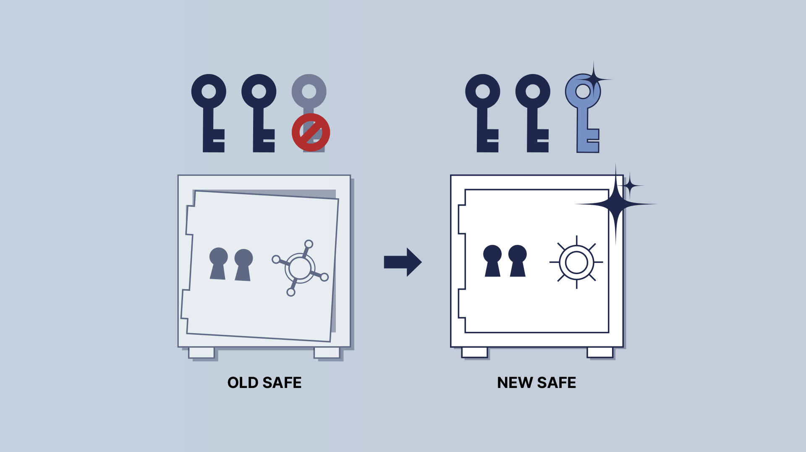
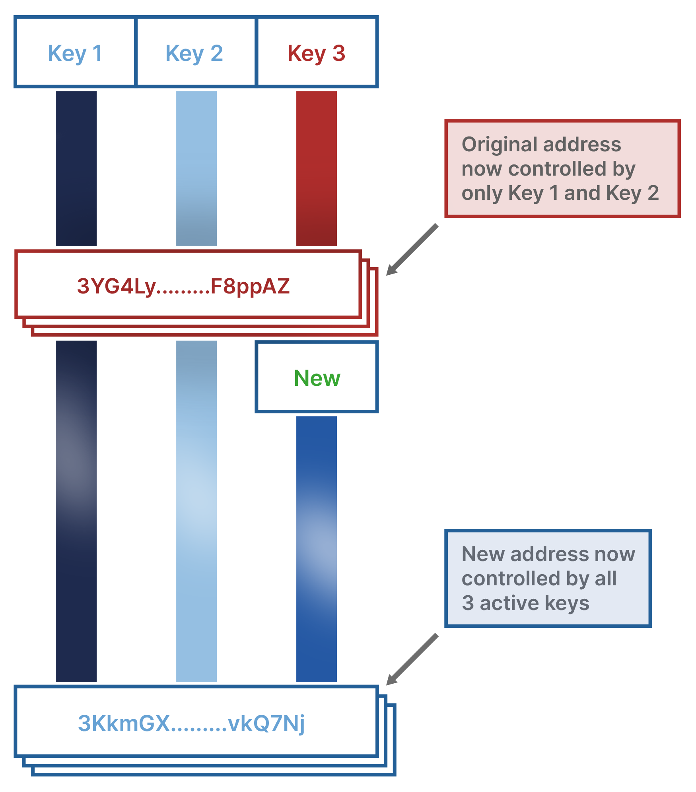
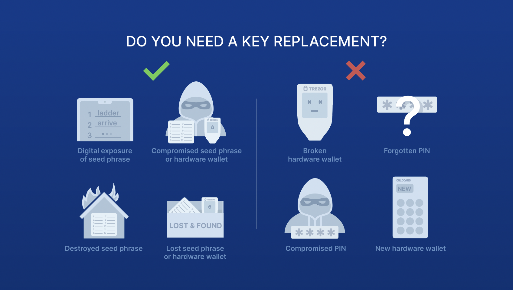

> *作者：Tyler Campbell*
> 
> *来源：<https://www.unchained.com/blog/replace-key-multisig-wallet>*

使用多签名钱包并自己持有密钥来保管比特币，可以帮助消除单点故障：即使组成你的钱包的其中一个密钥丢失了、毁坏了、失盗了，你这边也有容错机制，你依然能花费自己的比特币。然而，一旦发生了这种情况，能够 “花费” 自己的比特币是一回事，但保持这个钱包的 *健康* 又是另一回事。如果你的多签名钱包的其中一个密钥因为某个原因而不安全了，你应该尽快替换掉这个密钥。反之，尝试替换一个 *没有必要* 替换的密钥则可能带来不必要的风险。

## 如何替换多签名钱包中的密钥？

在我们考虑什么时候有必要替换密钥时，先看看如何替换密钥，也是有好处的。

### 生成一个新密钥 —— 以及一个新保险柜

把你的多签名钱包想象成一个电子保险柜，而你持有这个保险柜的钥匙。我们假设使用 2-of-3 多签名钱包，类比过来，就是你的保险柜有两个钥匙孔、三把兼容的钥匙。这三把钥匙中的任意两个，都可以打开这个保险柜，然后你就可以取出其中的比特币。

如果某人偷走了你的其中一个钥匙，或者你弄丢了它，那么你就会想替换掉这个钥匙，这样事情才不会失控。

如果你弄丢了一个实体保险柜的钥匙，或者你想换一把钥匙，随便买一把新钥匙是不行的，它跟你的保险柜又对不上！如果随便一把钥匙都能打开你的锁，那你这个锁本身就没有任何意义，不是吗。

所以，必要的步骤是，你得用剩余的两把钥匙先打开这个旧的保险柜、把里面的东西转移到一个**新的保险柜**才行，并且，要确保这个新的保险柜能够用你原先的两个没有暴露的钥匙以及一个**全新的钥匙**打开。这就是多签名钱包密钥替换背后的原理。

### 如何创建一个新的多签名钱包装置

我们设想一种最常见的密钥替换场景：一个 2-of-3 的多签名钱包，组成它的密钥编号为【1】、【2】、【3】；现在编号为【3】的密钥需要替换，而我们生成了一个新的密钥，编号为【4】；现在我们的目标是将密钥【3】替换成密钥【4】。

为了完全替换密钥【3】，我们需要先使用密钥【1】、【2】、【4】创建一个新的多签名钱包。一旦这个新的多签名钱包构造出来了，资金就可以从旧钱包（使用来自密钥【1】和【2】的签名）转移到新的多签名钱包中。换句话说，你将资金从旧的、已经不够安全的保险柜转移到新的、足够安全的保险柜。

记住：在你给一个多签名钱包装置替换其中一个密钥时，你是在（使用一个新的密钥）创建一个全新的钱包！这意味着，你的旧的多签名钱包中的任何地址，都跟这个新的密钥无关，也**并不**使用这个新密钥来保护。

出于这个原因（以及其它原因），你最好：

1. 仅在真的有必要的时候才替换密钥；这个 “有必要” 的时机，我们会在后文详述。
2. 如果你替换了密钥，务必从旧钱包中转出**所有**资金到新钱包。
3. 记得在交易所和其它平台更新白名单地址。

##  什么时候需要替换密钥？

如果你认为自己已经陷入了可能需要替换密钥的情形，请先深呼吸。多签名钱包的好处之一就是它的容错属性。即使组成你的钱包的其中一个密钥已经不安全了，也不是世界末日。

多签名钱包装置中的每一个密钥都有两个组成部分：一个硬件签名其，以及一个[种子词](https://unchained.com/blog/why-you-should-always-secure-your-seed-phrase-four-unexpected-errors/)备份。在我们的 [2-of-3 多签名装置](https://unchained.com/blog/why-2-of-3-multisig/)案例中，这意味着总共有 6 个敏感物件 —— 3 个硬件签名器，以及 3 个种子词备份 —— 需要确保安全；此外，还有一个描述钱包配置的文件。如果是联合保管的 2-of-3 多签名钱包，则总共有 4 个敏感物件 —— 2 个硬件签名器和 2 个种子词备份 —— 需要确保安全，外加一个钱包配置文件（第三个密钥由托管伙伴持有）。

种子词备份是每个密钥最敏感的组成部分，因为它是[你的密钥的可直接阅读的表示形式](https://unchained.com/blog/what-is-a-bitcoin-seed-phrase/)，它能生成你用来 花费/保管 你的资金的所有私钥。而硬件签名器，虽然也存储着种子词并让你可以用来签名比特币交易，但它通常带有 PIN 码作为额外的物理安全层。

我们来看你的密钥失去安全性的最常见情形。

### 暴露的种子词

一个 “暴露的种子词” 就意味着这个种子词可能已经被（意料之外的）第三方看到了。比如，假如你用一个电子文件来存储种子词，然后用某种互联网通讯工具来传输这个文件；又或者你把种子词拍成了照片，然后用互联网来传输这张照片；或者，别人直接拿到了你的种子词实体备份；这都意味着这个种子词成了一个暴露的种子词。

**电子暴露风险**

绝大部分硬件签名器都会在生成种子词时鼓励你保存一个实体备份，但新用户不理会这一建议、选择用电子设备来保存种子词的情形，是非常常见的。

硬件签名器被专门设计为在[一个安全的环境](https://unchained.com/blog/bitcoin-what-is-a-secure-element/)下生成种子词，而与更不安全的、带有互联网连接的设备相互隔绝。生成种子词之后，立即在另一个非专门设计的设备中存储它，会使这个种子词暴露在电子存储媒介的可能故障以及恶意软件（比如键盘监控器）的风险之下。更糟糕的是，你可能要在已经存入大额资金（到该密钥所生成的钱包）之后，才会发现它已经暴露了。

如果你使用了电子存储媒介来保存你的种子词，你应该假定这个密钥已经暴露了，所以，你**需要**替换掉这个密钥。

**弄丢种子词**

弄丢种子词是说，要么你没法确定它的下落，要么，你已经无法使用它了。也许你检查了一遍家里的保险箱，发现种子词没在里面；也许你在旅行中弄丢了一些东西。

不管是哪一种情形，你都要假设这个种子词已经暴露了，所以**需要**替换掉这个密钥。

**种子词被盗**

幸运的是，如果你使用了一个合适的多签名与之，耽美单个种子词被盗不会导致资金损失。当然，被盗就必须被认定为已经丢失和暴露了。

你**需要**替换掉这个密钥，因为窃贼只需再偷盗你的一个密钥，就能拿到你的比特币（假设他们也拿到了你的[多签名钱包密钥配置](https://unchained.com/blog/what-is-a-multisig-wallet-configuration-file/)文件，或者在联合托管商处登录的证书）。

### 硬件签名器被劫持

类似于种子词暴露，如果你的硬件签名器丢失或失盗，你也必须在多签名钱包中替换掉它所存储的那个密钥。即使这个签名器带有 PIN 码，可以阻止别人立即获得其中的密钥，你也应该假设这个密钥已经暴露了，尤其是，已经有案例表明，某些设备允许攻击者完全绕过 PIN 码防护。

**丢失硬件签名器**

如果你无法确定你的设备的下落，你就无法知道其中的种子词是否已经暴露，或者未来会不会暴露。

这时候，你应该假设其中的种子词已经暴露，所以你**需要**为你的多签名钱包装置替换掉这个密钥。

**硬件签名器被盗**

如果你的设备在你的保管位置不翼而飞，被你在定期检查中发现（我们一直建议你每个季度检查一词）；或者，在你旅行期间从你的私人物品中消失，你的硬件签名器都有可能被盗了。

这时候，你应该假设其中的种子词已经暴露，所以你**需要**为你的多签名钱包装置替换掉这个密钥。

## 何时 *不需要* 替换密钥？

对于一个密钥来说，实体的种子词备份是最敏感的东西，如果你有理由认为自己的种子词已经丢失或暴露，那么你需要替换掉这个密钥。但是，通常，也有一些情形，是你无需替换密钥的。实际上，在这些情形中，替换密钥可能比不替换的风险更大。

在不必要时替换密钥所带来的部分风险和代价包括：

- **交易手续费**：替换密钥意味着你要把所有资金从旧的多签名钱包的地址中移动到新的多签名钱包的地址中，这需要让区块链网络确认你的交易，因此要支付区块确认手续费。
- **移动大额的比特币**：在转移比特币时总有出错的可能，而换用新钱包可能需要移动大额的比特币。
- **钱包配置文件**：你的多签名钱包配置文件也应该保存在安全的地方，而替换密钥意味着也要替换它（即访问这个安全位置）。
- **白名单地址**：任何你可能在某个交易所或其它服务中使用的白名单或者 “固定” 地址（属于你的旧钱包），都必须更新成来自新钱包的地址。

出于这些原因，你应该要理解，什么时候是不必替换密钥的。所有这些情形的共性在于，它们只跟你的签名器有关，而不影响你的种子词备份。

### 硬件或软件故障

如果你的硬件签名器完全损坏了（比如遇上了火灾或者水灾），或者因为不知道确定原因的软件或硬件故障而变成了砖头（例如在固件升级中出错，或者因为 USB 接口故障，或者是显示屏无法显示），你都可以将种子词导入一个新设备。只要你的备份还是安全的，就没有必要替换密钥。

如果你只是签名器设备损坏，种子词备份还是完好保管的、没有暴露，那么你可以安全地假设自己的种子词没有暴露、硬件签名器也没有遭到劫持，所以**不需要**在多签名钱包中替换这个密钥。

### 弄丢或忘记 PIN 码

类似地，如果你只是忘记了在一个设备上设置好的 PIN 码，你可以将这个设备恢复为出厂状态，然后重新导入种子词；或者，你也可以买一台新设备，然后导入种子词。（译者注：注意，这里的两种做法的安全性并不等同，如果你是换用新的硬件签名器，应确保清空了旧的签名器（即复原为出厂状态））。

只要你的种子词备份还是完好保管的、没有暴露，那么你可以安全地假设自己的种子词没有暴露、硬件签名器也没有遭到劫持，所以**不需要**在多签名钱包中替换这个密钥。

### PIN 码暴露

如果你的 PIN 码暴露了，但没有人拿到了你的签名器，那么你不必认为这台设备已经丢失或失盗。（译者注：但应该更新 PIN 码，以防止未来有人拿到这个签名器，使你的种子词暴露。）

你可以安全地假设种子词和签名器都没有暴露，所以**不需要**替换这个密钥。

### 更新设备

另一种常见的、你不需要替换密钥情形是，换用新的硬件签名器。BIP39 种子词标准在所有著名的比特币硬件签名器上都是受到支持的，所以你可以导入给定密钥的种子词到新设备中。最好的习惯是通过在新设备来确认你的多签名钱包地址、执行一笔小额花费，来确保密钥被正确导入了。（译者注：确保正确导入种子词后，旧的签名器应该清空，否则你将增加多一个敏感物件。）

只要你的种子词备份还是完好保管的、没有暴露，那么你**不需要**在多签名钱包中替换这个密钥。

## 如何替换密钥？

如果因为上面解释的原因，你的自主保管的多签名装置需要替换一个密钥，有一套标准的流程可以遵循，无论你使用什么比特币钱包软件。我们将 2-of-3 多签名钱包作为案例，你需要遵循以下通用的步骤：

1. 在一个新的硬件签名器上生成一个新的替换密钥
2. 妥当地备份这个新的种子词（到纸上或者金属板上）
3. （在钱包软件中）使用这个新密钥以及原来的两个没有暴露的密钥创建一个新的多签名钱包
4. 执行测试：向该多签名钱包存入小额资金、花费这些资金，以确认这个多签名钱包已经构建好了
5. 使用原来的两个没有暴露的密钥，将资金从旧钱包转出、发送到新的多签名钱包的地址
6. 确保从钱包软件中下载了这个新的多签名钱包的钱包配置信息并备份；最后，更新你在交易所或其它服务商用到旧钱包地址的白名单

完成上述步骤之后，两个未暴露的密钥以及那个已经暴露的密钥就只控制着已经没有资金的旧钱包；而这两个未暴露的密钥以及新生成的密钥控制着新钱包。

## 如何避免在未来需要更换密钥？

最好的情形当然是，总是确保不需要用上密钥替换方法。你的安全模型的具体情形取决于许多变量和取舍，但一般来说，你应该保证你的种子词备份被安全地保管在分散的位置，并且只有你知道的、信任的人能触及你的签名器设备。

若要学习如何保管种子词备份和硬件签名器，请看我们的《[种子词保管终极指南](https://unchained.com/blog/how-to-store-bitcoin-seed-phrase-backups/)》、《[纸张、金属板和其它种子词保管方法指南](https://unchained.com/blog/seed-phrase-backup-methods-recording-paper-metal/)》。如果你是 Unchained 的客户，请看我们的操作安全性指南中的种子词和签名器[保管建议](https://unchained.com/blog/wp-content/uploads/2022/01/Unchained-Operational-Security-Guide.pdf)。

（完）