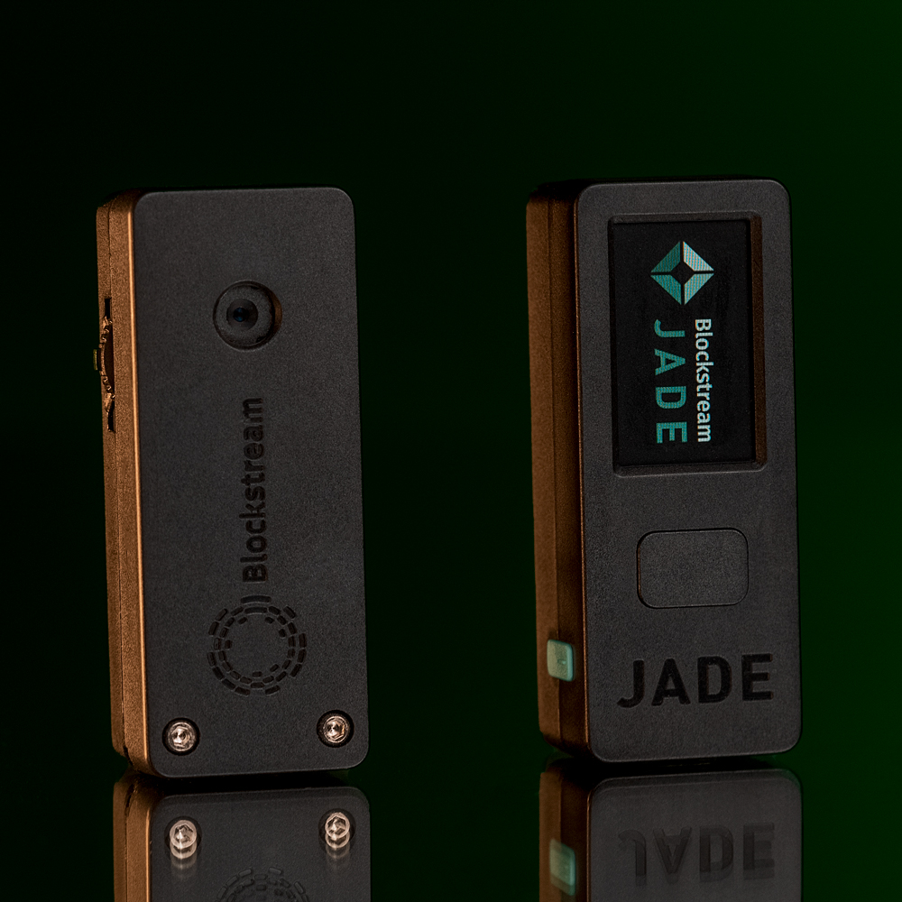
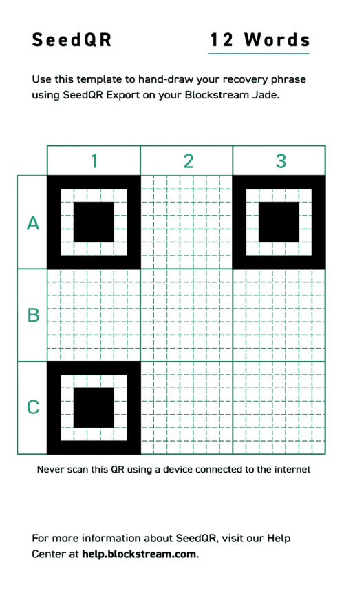
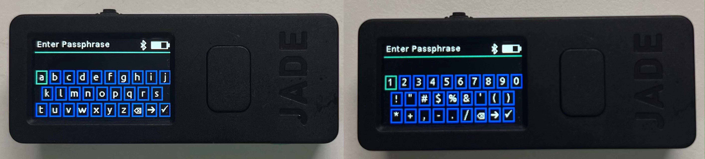

> *作者：Mi Zeng*

声明：本评测基于 0.1.45 版本的 Jade 固件，使用的硬件为厂商送测，厂商对本评测并无内容干涉。

## Jade 简介
[Jade](https://blockstream.com/jade/) 是一款由 Blockstream 公司开发和制造的硬件钱包，仅支持比特币以及 Liquid 侧链的资产。它具有小巧的体积（60mm x 24mm x 17mm），自带摄像头和一块支持全彩显示的 1.14 英寸 LCD 屏幕，支持蓝牙、USB 以及光学扫码的交互方式。在撰写本文时，Jade 的价格为 65 美金。

### Jade 亮点速览
* 内置摄像头，支持完整的 Air-gapped 交互流程
* 支持 BIP85，可用作子助记词派生工具
* 完全开源，消除了受信任第三方 —— 安全芯片
* 支持 SeedQR 的助记词导入模式
* 目前唯一支持 Liquid 资产的硬件钱包
* 支持 PSBT，提供了对比特币多签的良好支持

## 安全性
安全性是评价一款硬件钱包最重要的指标，本节将分三个方面来评价 Jade 在安全性上的设计。

### 私钥的生成
在私钥生成的过程中，最重要的就是随机性的来源。根据 Jade 的[官方文档](https://help.blockstream.com/hc/en-us/articles/9640569620761)，除了内置的随机数生成器外，Jade 还通过其摄像头拍摄的多张图像、环境温度、电池状态等多个独立的熵源来为私钥生成的过程提供足够的随机性。

而对于不信任硬件钱包自带的私钥生成程序的用户来说， Jade 提供了计算最后一位助记词的辅助功能。用户可以使用[这篇教程](https://btcguide.github.io/setup-wallets/paper) 中介绍的方法，将打印好的 2048 个 BIP39 助记词纸片置于任何方便轻松摇晃混合小纸片的容器中，从中抽出 23 个小纸片作为前 23 位助记词，再利用 Jade 来替代 [SeedPicker](https://seedpicker.net/calculator/last-word.html) 这类网页工具计算最后一位助记词。借此以完全离线的方式来创建助记词，实现彻底去信任化的私钥生成。

遗憾的是，Jade 没有提供通过掷骰子来创建助记词的功能。许多 BTC-Only 的钱包都提供了这一功能，使得自行生成真实随机数的过程更加便利。

### 私钥的保存
不同硬件钱包在私钥保存的设计上各有不同，大多数硬件钱包都采用安全芯片来保存私钥，以增加攻击者破解的难度。但由于安全芯片是个闭源组件，因此采用安全芯片的硬件钱包无法做到完全开源。少部分钱包为了完全开源而舍弃了安全芯片，但因此更容易被物理攻击。我曾在这条[长推特](https://twitter.com/zengmi2140/status/1616069454772994049)中分析过不同硬件钱包在私钥保存设计上的取舍。

Jade 舍弃了安全芯片保存私钥的方案，保持了完全的开源设计。它的方案是将加密后的私钥存放在 Jade 本地的加密闪存当中，而用于加密私钥的密钥本身由用户设置的 PIN 码和远程服务器共同生成，详细原理见[这份文档](https://help.blockstream.com/hc/en-us/articles/9639949755673)。这种独特的安全模型有别于其它任何品牌的硬件钱包。

用户只有在 Jade 上输入正确的 PIN 码，并与远程的服务器建立连接后，才能解密私钥，从而使用钱包。（用户可以自行搭建远程服务器来消除对 Blockstream 服务器的信任。）

这样做的好处是即便攻击者拿到了 Jade 实体，也无法通过物理攻击来直接获取私钥。攻击者需要破坏的除了 Jade 本机的加密闪存，还有远程的服务器。而该设计的弊端就是在每次解锁 Jade 时，除了在 Jade 上输入 PIN 码外，还需要通过 蓝牙/USB/扫码通信 等方式与远程服务器交互，才能完成解锁。这使得 Jade 的解锁流程相较于其他硬件钱包都要更加麻烦，影响了使用体验。

#### SeedQR
如果不希望在解锁时需要与远程服务器连接，用户也可以在每次打开 Jade 时选择直接输入助记词来进入临时钱包，当设备关机后，输入的助记词会自动清空。Jade 本身不保存通过这一方式输入的助记词。

这一方式使用起来更加麻烦，因为输入助记词的过程费时费力。为了改善助记词的输入体验，Jade 添加了对 SeedQR 的支持。[SeedQR](https://github.com/SeedSigner/seedsigner/blob/dev/docs/seed_qr/README.md) 是一套将助记词转换成二维码的规则。用户可以在开启 Jade 后扫描 SeedQR，进入临时钱包。如果选用 SeedQR 的方式来导入钱包，那么如何安全地保存助记词二维码，是用户需要面临的另一个问题。

#### Wallet-Erase PIN

Jade 支持用户设置一套独立的 PIN 码 —— Wallet-Erase PIN。当用户在遭到物理威胁被强迫解锁 Jade 时，通过输入这套 PIN 码，可以在解锁钱包时自动删除钱包内部的助记词。

### 交易的签名和信息验证
#### Air-gapped
Air-gapped 意为硬件钱包在与联网设备交互时不通过诸如 USB、蓝牙、NFC 等任何有线/无线的连接方式，而使用摄像头或 SD 卡在联网设备和硬件钱包之间进行数据交互。

除了通过 SeedQR 或助记词导入临时钱包外，Jade 开机后还提供了两种解锁方式，分别为连接模式解锁和 [QR-PIN 模式](https://help.blockstream.com/hc/en-us/articles/10731523559193)解锁。通过 QR-PIN 模式解锁或临时钱包的方式可使 Jade 进入完全 Air-gapped 的工作模式。在该模式下，Jade 利用摄像头和二维码实现与联网设备之间的数据传递，完成诸如交易签名、公钥导出，多签钱包导入、收款地址验证等操作。

#### Anti-Exfit
在交易签名阶段，Jade 引入了一种名为 [Anti-Exfit](https://help.blockstream.com/hc/en-us/articles/9641573399961-What-is-Anti-Exfil-and-how-does-it-work-) 的安全措施。该措施是为了防止被黑的硬件钱包使用被操控的 nonce 值来签名交易，从而造成私钥的泄漏。Anti-Exfit 的大致原理是在生成 nonce 的过程中利用计算机/手机提供的部分随机数据，而不单纯依靠硬件钱包本身来生成 nonce 值。感兴趣的读者可以看[这篇文章](https://blog.blockstream.com/anti-exfil-stopping-key-exfiltration/)。

目前只有 Jade 和 Bitbox 提供了这类安全功能。但由于执行该功能的过程中需要直接与联网设备通信来保证 nonce 的随机性。因此就当前固件版本的 Jade 而言，Anti-Exfit 和 Air-gapped 不可兼得。

#### 信息验证
在硬件钱包上直接验证交易的详细信息对于安全来说至关重要，这确保了你正在签名的内容没有被恶意篡改。用户可以通过 Jade 的屏幕直接验证交易的目标地址、金额和手续费，但无法验证找零地址。Blockstream 的工程师对此给出的回复是：Jade 会自动验证找零地址是否属于用户私钥，如有错误将出现提醒。

### 其他安全措施
#### BTC-Only
Jade 是一款 BTC-Only 的钱包，仅支持 BTC 以及比特币的侧链 Liquid 上的资产。不过需要说明的是，支持的币种单一并非功能性上的缺陷，而是安全性上的优势。这能减少代码的复杂度，避免因支持 altcoin 而引入的额外攻击面。

### 安全性上的遗憾
Jade 没有 Micro SD 卡槽，这意味着固件的升级依然需要通过有线/蓝牙的方式进行，无法实现全流程的 Air-gapped，用户也无法便利地自行验证所升级的固件。

## 功能性
作为一款硬件钱包，Jade 在基本的钱包功能上是合格的。同时，Jade 完美支持比特币多签，可以存储多签钱包的配置文件，轻松处理 PSBT 文件，兼容多款比特币钱包软件。

除此之外，Jade 还支持了一些小众的特色功能。

### BIP85 种子管理器
Jade 在最新版的固件（0.1.45）中增加了对 BIP85 的支持，使其成为了目前少有的支持该功能的硬件钱包之一。利用 BIP85 种子生成工具，钱包可以通过一套主助记词加一个索引号派生出多套种子助记词，且这些子助记词之间互无关联，不可逆推出主助记词。当用户在其它设备或软件上需要创建钱包时，可以利用这项功能来生成助记词，需要备份对应的索引号即可，实现一套主助记词加一系列索引号备份全部的钱包。

### Passphrase 单词表
除了可以通过直接输入任意字符作为 passphrase 外，Jade 还提供了名为 [wordlist](https://help.blockstream.com/hc/en-us/articles/15444563903129-Which-passphrase-settings-should-I-use-) 的 passphrase 输入模式。选用该模式后，输入 passphrase 时 Jade 会根据用户输入的字母来匹配潜在的 BIP39 单词，提供给用户选用作为 passphrase，提高输入效率。

### 扫码验证地址
Jade 不支持直接在硬件钱包上查看地址列表。当需要验证手机/计算机上的收款地址是否正确时，只能使用 Jade 的摄像头扫描收款地址的二维码。如果地址有效，Jade 上会显示出该地址的派生路径，否则会提示地址未验证。

对于 Air-gapped 的钱包而言，该方式的好处是不需要在硬件钱包的地址列表中挨个查找和软件上相匹配的地址来进行验证。比如当收款地址路径为 m/84'/0'/0'/0/30 时，在 Coldcard 上需要进入地址列表找到第 30 个地址，然后与计算机上的地址进行比对。而在 Jade 上只需要扫描收款地址二维码，Jade 会自动核验该地址是否有效。

### 离线 OTP 管理器
Jade 内置了 OTP 管理功能，可以将 Jade 作为一款离线的 2FA 验证器（例如常见的谷歌验证器）来使用。但在实际日常使用中，解锁 Jade 查看 OTP 的过程比起利用手机软件要麻烦得多，因此笔者认为该功能聊胜于无。倘若 Jade 能支持 Fido2/U2F 来作为硬件密钥使用，将会是一个更具实际使用价值的功能。

### Liquid 支持
Jade 是目前唯一一款支持 Liquid 侧链的硬件钱包。不过该功能需要与 Blockstream 推出的软件钱包应用 Green 搭配使用，且当前只支持通过 Green 来创建 Liquid 多签钱包，而无法创建单签钱包。

## 使用体验

### 便携性
Jade 体积小巧，且内置了一块 240 mAh 的锂电池。配合蓝牙或扫码的交互方式，外出可搭配手机使用，便携性十足。

### 兼容性
除了可以通过蓝牙或有线的方式搭配 Blockstream 自家的软件钱包 Green 使用外，Jade 也支持导出扩展公钥，通过 USB 数据线或二维码光学通信的方式搭配[主流的比特币软件钱包](https://help.blockstream.com/hc/en-us/articles/9601453403801)使用。当前兼容的钱包有 BlueWallet、Electrum、Keeper、Nunchuk、Sparrow 和 Specter，覆盖比较全面。略有遗憾的是，Jade 尚不支持和 Wasabi 搭配使用。

### 交互体验
#### 光学交互
Jade 在硬件配置上最大的亮点是其内置了一枚摄像头，使其可以通过扫码交互的方式实现完全离线的交易流程。

摄像头在 Jade 上的用途很多，包括：
* 解锁 Jade 时通过扫码的方式与远程服务器通信
* 签名交易时通过扫码的方式与联网的观察钱包传递交易签名信息
* 通过 SeedQR 的方式导入临时钱包
* 扫描收款地址的二维码来验证地址有效性
* 在私钥生成的过程中提供随机性的熵来源

笔者测试了 Jade 和 Nunchuk、Keeper、Sparrow 三款钱包的交互体验，利用摄像头来执行 Air-gapped 的交易签名流程。在使用的过程中，需要不断调整摄像头和二维码的间距来提高扫码的成功率，个别情况下遇到过扫码难以成功的情况。总体而言没有大的问题，属于合格水平。

#### 输入体验
**拨杆操作**
Jade 整个机身上一共三个按键：可左右拨动的拨杆、确认键、电源键。后两者与其它诸多硬件钱包无异，拨杆则是 Jade 上的独特设计。通过左右拨动拨杆，可以快速在屏幕上移动选项，实现功能的选择或内容的输入。比起左右按键的方式，拨杆操作要更加快捷高效。

**全键盘模式输入**
当需要在 Jade 上执行输入字符的操作时（比如助记词或 Passphrase 等），Jade 会在屏幕上显示全键盘的字母表，用户通过拨动顶部的拨杆来选择字符输入。作为对比，大多数硬件钱包在输入字符的时候是按照顺序显示单个字符来以供用户选择的。Jade 这种全键盘字母表的形式更加高效，这是笔者在非触屏的硬件钱包上体验过的最方便的字符输入模式。

## 结论
Blockstream Jade 是一款没有明显短板的硬件钱包。在 Jade 身上，可以看到 Blockstream 团队对安全与开源的独特思考，对 bitcoiner 需求的精准把控，以及关于用户体验的设计巧思。值得一提的是，Jade 还在不断通过固件更新的方式引入新的功能和交互体验（比如最新的固件加入了 BIP85 和 QR PIN 解锁模式），这让笔者对该产品之后能实现的功能抱有更高的期待。

在我看来，这是一台专门为 bitcoiner 设计的硬件钱包。它的竞争对手其实不是 Ledger 或 Trezor，而是 Coldcard、Keystone（BTC-Only 版）、Passport 和 SeedSigner。考虑到 65 美金的售价，Jade 显得十分具有性价比。如果你不愿意为了安全芯片而向开源妥协，在寻找一款可玩性高的硬件钱包，且能够接受略微繁琐的解锁流程，那么 Jade 无疑是一百美金以内最值得购买的硬件钱包。

（完）