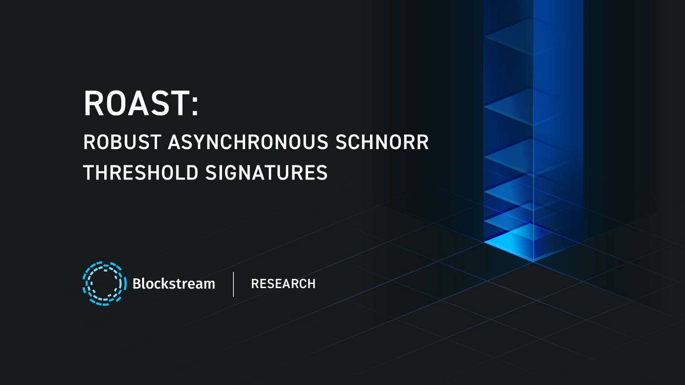

> *作者：Tim Ruffing，Elliott Jin，Jonas Nick*
> 
> *来源：<https://medium.com/blockstream/roast-robust-asynchronous-schnorr-threshold-signatures-ddda55a07d1b>*

让比特币和 Liquid 变得更加隐私和更有效率，是我们 Blocksteam Research 的根本目标。具体来说，我们实现这一目标的办法就是让不同类型的交易在区块链上看起来尽可能相似：如果他人无从分辨来自多签名钱包、闪电网络和其它Layer-2 应用的交易和普通的交易，那分析区块链数据和跟踪用户的支付自然就会变得更加困难。

我们以往在这个方向上的贡献包括：[MuSig](https://blog.blockstream.com/en-musig-a-new-multisignature-standard/)、[MuSig-DN](https://medium.com/blockstream/musig-dn-schnorr-multisignatures-with-verifiably-deterministic-nonces-27424b5df9d6) 和 [MuSig2](https://medium.com/blockstream/musig2-simple-two-round-schnorr-multisignatures-bf9582e99295)；它们都允许仅用一个 [BIP340](https://github.com/bitcoin/bips/blob/master/bip-0340.mediawiki)（Schnorr 签名）公钥来表示 “n-of-n” 的多签名钱包（2-of-2，3-of-3，等等），所以从表象上来说，它们就像是仅有一名用户使用、只能发起常规链上支付的普通钱包。为了让 “t-of-n” 多签名钱包（1-of-2、2-of-3、3-of-5，等等）实现类似的效率和隐私性，Chelsea Komlo（来自滑铁卢大学和 Zcash 基金会）和 Ian Goldberg（滑铁卢大学）提出了 [FROST](https://eprint.iacr.org/2020/852) 门限签名方案。

“t-of-n” 多签名钱包是 Blockstream 的 [Liquid Network](https://blockstream.com/liquid/) 的核心，因为这是一条由分散式的参与者联盟运行的[侧链](https://blockstream.com/assets/downloads/pdf/liquid-whitepaper.pdf)。具体来说，这些参与者负责运行一个联盟式的钱包，该钱包当前使用一个 “11-of-15” 的多签名设置来持有被锚定（也即被转移到 Liquid 侧链上）的比特币。当一个 Liquid 的用户想要解除锚定，也即将 Liquid bitcoin（L-BTC）转回比特币主链上时，联盟就要创建一笔交易，将资金从联盟钱包发回用户的地址。如果使用比特币内置的多签名支持，11-of-15 的联盟钱包在使用时需要广播全部 15 个公钥和全部 11 个签名，手续费会非常高。使用 FROST 协议就能解决这个问题。

但是，为了使用 FROST 协议签名交易，至少要有 11 位联盟成员配合并交换多条消息。如果合作失败，例如，因为网络条件不好、某签名者离线或者主动搞破环，整个过程就会失败，又得重来一遍。这对联盟钱包所用的自动化签名软件来说并不是最优的，因为即使至少 11 个签名者有意愿签名，它也不能可靠地产生一个签名。

[ROAST](https://eprint.iacr.org/2022/550.pdf)（强健的异步 Schnorr 门限签名，RObust Asynchronous Schnorr Threshold signatures）是我们对这个问题的解决方案。ROAST 是一个简单的封装器，围绕着 FROST 这样的门限签名而实现。它可以保证，只要诚实签名者的数量达到阈值，就一定能获得有效的签名，即使有签名者从中作梗、网络延迟任意高也不例外。我们的[经验性能评估](https://github.com/robot-dreams/roast)表明，ROAST 可以扩展到相当大的签名者群体，例如 67-of-100 的、签名者分散在几大洲的设置，也能支持。即使 33 个恶意签名者尝试阻塞签名（例如，发送无效响应或者完全不响应），其余的 67 个诚实的签名者依然能成功在几秒内产生有效的签名。想了解这套协议的深度介绍和详细描述，请阅读[我们的完整论文](https://eprint.iacr.org/2022/550.pdf)。

ROAST 是 [Tim Ruffing](https://twitter.com/real_or_random?lang=de)（Blockstream 公司）、[Viktoria Ronge](https://www.chaac.tf.fau.eu/person/viktoria-ronge)（埃尔朗根-纽伦堡大学）、[Elliott Jin](https://twitter.com/robot__dreams?lang=de)（Blockstream 公司）、[Jonas Schneider-Bensch](https://twitter.com/jonschben)（CISPA 赫尔霍兹信息安全中心）和 [Dominique Schröder](https://twitter.com/doschroeder)（埃尔朗根-纽伦堡大学）的联合研究成果。

我们以这篇论文的节选作为结束，是有关 Frostland（直译为 “极寒之地”）的传说，它呈现了 FROST 所需的沟通步骤，以及 ROAST 背后的直觉。

## Frostland

在遥远的冰冻之国，有一个民主委员会负责立法。宪法规定，要通过一个新的法案，需要在 13 名委员会成员中有 7 名委员同意。不熟悉冰冻之国文化的读者可能会以为，这个民主流程的主要困难是在委员会中求取多数，而签名只是个手续。

但是，在冰冻之国，签名是一件难事。冰冻国人对自己的美学传统非常自豪。13 位委员，每一个都拥有一个独一无二而且美丽的水印，一个法案只有在书面文件凑齐所有支持者的水印（而且没有其他人的水印）时才是有效的。

因此，签名流程要这样安排：找出委员会中的多数，制造足够数量的纸张，每张都印上支持派委员的水印（但不包含其它委员的水印），然后在印有水印的纸上写好法案的内容，最后，从各委员处收集对法案的签名。但是，如果支持派的成员之一没有在最后一步中提供签名，例如她要不限期离开自己的办公室，那整个流程就作废了。具体来说，也不可能要求其它委员来签名，因为纸张上印着这个捣蛋鬼的水印（而没有可以代替她签名的委员的水印）。所以唯一的办法就是从头开始一个全新的签名流程，重新找出委员会中的多数，重新走一遍制造纸张、印上新的一组水印的流程。

这使得签名过程非常复杂，所以委员会雇佣了一名秘书来协助执行这个过程。然而，这个秘书无法提前知道哪位委员会支持被提议的法案。久而久之，一些委员会通过破环签名程序来阻止其他委员通过法案，而且即使表态了支持也会拒绝签名。最糟糕的时候，所有 13 名委员都表示支持某法案，但实际上只有不超过 7 名委员真正签名。

这个可怜的秘书有几个选择：其一，TA 可以选出 7 位声称要支持法案的委员，制造带有他们的水印的纸张，然后准备法案文书的一个副本，并要求这些委员签名这个副本。即使任何一个委员主动拒绝签名（比如给出一个错误的签名）并因此迫使签名程序中断，秘书也可以找出这个搞破坏的委员，在议会上弹劾 TA，并将该人替换成一位新成员，并准备新的一个文书副本（也要制造带有新的一组水印的新纸张）。不过，冰冻之国有个非常死板的规定，每个委员在签名或拒绝一个方案之前，都有无限长的审核时间，所以整个签名流程可能非常耗时。某些烦人的委员可以在法案前坐上一整天、假装仔细检查副本有无错误，而秘书也吃不准这个委员最终会签名还是会一直坐下去。结果，签名程序还是会搞得很漫长，甚至搞不下去。

其二，这个秘书可以为每一个 7 人组合准备一份专门的法案副本，并要求委员在每一份带有自己水印的副本上签名。虽然这个流程不会再被卡住了，但这个秘书也精通组合数学，知道这种做法是不可持续的，因为 TA 需要为此准备总计 1716 个副本（13 取 7）。

一种解决办法是，秘书采取这样一个流程：在开始阶段，把所有承诺要支持法案的委员都集中在议会大厦。秘书有委员的名单，当至少有 7 位委员到场（这也正是签名流程启动的条件）时，秘书就把 7 个委员叫到办公室，并把名单上相应的名字划掉。然后 TA 取出印有这 7 位委员水印的纸张，写下法案的副本，然后要求这些委员签名。等这些委员都签完名，他们就离开办公室，等待下一次召唤，同时秘书也会把他们的名字在名单上再加回来。

秘书很容易看出这个流程会成功，而且不需要太多法案的副本：只要至少 7 位委员是支持这个法案并且诚实行事的，那么，在任何时间点，秘书都知道这 7 位委员最终会签名当前这个副本，然后被重新添加回名单上。因此，秘书总能确信，这 7 位委员会在未来某个时间点重新被加回名单，所以签名的流程不会被卡住。而且，因为这些委员只有在正确签名前一份副本后才能签名新的一份副本，每个委员每次都最多只能阻拦一次签名。因此，即使有 6 位委员作梗，最多也只能导致一份法案被推延 6 次。最后，法案的第 7 份副本将被分配给诚实的委员会成员，他们会完成签名并产生一个正确签名的法案。

（完）