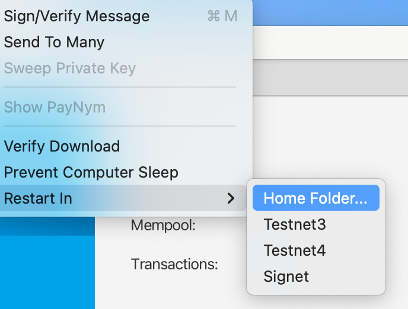
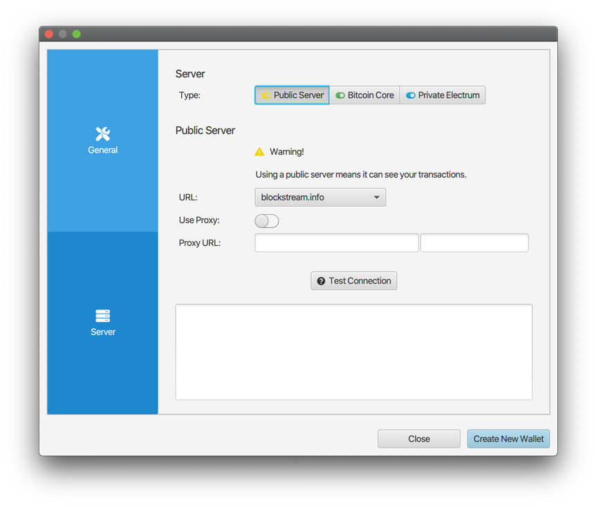
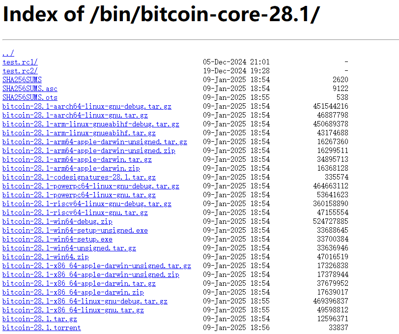

> *作者：Anony*


在接触新的 软件钱包/硬件签名器 的时候，先尝试在比特币的测试网上使用（而不是直接存入主网上的有价资产）是一个好习惯。本文就简单介绍一些使用比特币测试网的实用建议。

## 测试网的类型

顾名思义，测试网就是用来测试的，其网络不一定能长久存在，其中的测试用比特币也没有价值。

当前，适于个人用户使用的公开测试网有三个：testnet3、testnet4 和 signet 。前两者都使用 PoW 机制来产生区块，signet 则使用固定的网络运营者的签名。

不论你使用哪一个测试网，其测试币跟其它网络都是不互通的，所以，不论你要领取测试币（见下文），还是要转发测试币，都必须先确保网络的同一。

testnet3 伴随着 Bitcoin Core 0.7 版本的发布而诞生，已经运行了 15 年。由于测试网上的出块难度较低，一方面使其出块速度不稳定，另一方面则使其容易遭受 “[时间扭曲攻击](https://www.btcstudy.org/2024/10/16/what-is-time-warp-attack-and-how-does-it-work-in-general/)”；testnet4 正是为解决这些问题而推出的。

目前，testnet3 的区块链体积已膨胀得非常厉害，因此，如果你尝试下文所述的 “在本地同步测试网区块链” 方法，则明确不推荐再同步 testnet3 。应该考虑同步 testnet4 或 signet。但如果你尝试的是使用 “公开的测试网服务端”，则不必顾虑这些问题。

## 公开的测试网服务端

对个人用户来说，这是最便利的方法。

通常来说，优质的比特币软件钱包会有专门的测试网支持，并且允许用户手动配置为软件提供区块链数据的后端，因此，我们就可以直接使用公开的测试网服务端。

以桌面端的 [Sparrow 钱包](https://sparrowwallet.com/)为例。

打开 Sparrow 钱包的主界面之后，在左上角的 “Tool（工具）” 选项中选择 “Restart in ...”，在选项卡中，你可以看到它支持的测试网类型，在上述三种中选出其中一个即可：



> 注：在老款的 Sparrow 钱包中，你只能看到 “Restart in Testnet（重启为测试网模式）” 的选择，而不能进一步选择使用哪个测试网。这时候使用的是 testnet3 。

重启之后，在左上角的 “File（文件）” 选项中选择 “Preference（偏好）”，然后在纵向的卡片中选择 “Server（服务端）”，就可以打开这样的界面：



<p style="text-align:center">- 图片来自 <a href="https://sparrowwallet.com/docs/quick-start.html#sparrow-server-setup">Sparrow Wallet 说明书</a> -</p>


可选的服务器类型（“Type”）有三种，第一种 “Public Server（公开服务端）” 就是我们这里说的公开的测试网服务端。可在下方的 “URL” 选项列表中选择你要使用的站点。

随后你就可以在 Sparrow 中根据自己的测试需要新建钱包。（请注意，务必不要使用跟主网钱包相同的种子词。）

请注意：虽然可以通过公开服务端来使用测试网，但我们明确不建议以相同方式使用主网。因为这会危害你的隐私性。如 Sparrow 的钱包警告所述：公开的服务端可以看到与你的钱包相关的所有交易；只要愿意，服务端就可以通过进一步的信息侦察将你的钱包去匿名化（比如，通过你的 IP 地址、IP 地理位置、钱包操作习惯，等等）。

## 测试网水龙头

新建钱包之后，测试币要从哪里来呢？答案是从各种 “水龙头（Faucet）” 网站领取。你可以根据自己使用的测试网类型，在搜索引擎中搜索 “bitcoin <你选择的测试网> faucet”。

请注意，不论使用什么样的水龙头网站，都不应该提交除了你的测试网钱包地址之外的任何信息，也不要被诱导去点击其它内容或下载其它软件。

这里仅列举两个水龙头网站：

- testnet4：
  - https://testnet4.info/
- signet：
  - https://signet.dcorral.com/

在获得测试币之后，一个好习惯是，在测试完成之后，将测试币打回给水龙头。比如上面的 testnet4 水龙头网站，就给出了这样的返还地址。

## 本地运行测试网节点

除了使用公开的测试网，你还可以自己运行一个测试网节点，这会给你更大的测试自由度。

本节就假设读者要在 **Windows 系统**上运行 Bitcoin Core，然后同步测试网区块链。

### 下载合适的 Bitcoin Core 版本

首先，你要在 [Bitcoin Core 的发行页面](https://github.com/bitcoin/bitcoin/releases)中寻找并下载合适的版本的软件。较新版本的 Bitcoin Core 都可以同步 signet，但如果你想同步 testnet4 ，就必须使用 28.0 之后的版本。

在各个操作系统中可执行的二进制文件要从如下形式的网站中下载，请留意发行页面中各版本的发行说明：

```
https://bitcoincore.org/bin/<bitcoin core 的版本>/
```

如果你要下载 Bitcoin Core 28.1，则你要打开这个网站：https://bitcoincore.org/bin/bitcoin-core-28.1/ 。



在这里，以 `bitcoin-28.1` 开头的是可在各操作系统以及 CPU 指令集上运行的软件的 压缩包/二进制文件。假设你是 Windows 系统（并且是 64 位的），就可以从带有 `win64` 字符的安装文件中选一个你喜欢的。如果你习惯使用有操作窗口的界面，可以选择 `.exe`，否则 `.zip` 可以说更加便利。下文我们假设会使用 `.zip` 来安装（并在命令行窗口中运行）。

除了安装文件，这里有另外两种相当关键的文件，一是 `SHA256SUMS`，另一种是 `SHA256SUMS.asc`；前者包含的是下面各安装文件的哈希值，后者则是一些开发者对前者的密码学签名。这两者，就构成了用户可以自己验证所下载的软件确乎是开发者所编写的、没有被篡改的工具。

当你下载好了安装包之后，请务必一并下载者两个文件，并且，**千万不要忘记验证这里的密码学签名**！

假设你在 Windows 系统下，

- 在存放安装包的位置，按住键盘 “Shift” 按键，使用鼠标右键打开 “终端（Terminal）” 或者 “Powershell”，然后输入以下命令，获得安装文件的 SHA256 哈希值：

  ```
  Get-Filehash .\<安装文件的名称>
  ```

  （小提示：输入安装文件名称的开头几个字符之后，按下键盘的 “Tab” 键就可以自动补全名称。）

  然后，请用记事本打开 `SHA256SUMS` 文件，看看这个哈希值是否在其中、与你所下载的安装文件相对应。

  - 如果不对应，则务必不要使用这样的安装文件！

- 然后，使用 GPG 命令来验证 `SHA256SUMS.asc` 中包含了你所知的开发者的公钥对 `SHA256SUMS` 文件的密码学签名：

  ```
  gpg --verify ./SHA256SUMS.asc
  ```

  - 注意，验证的前提是你已经获得了一些开发者的公钥。你可以在这个页面中找到：https://github.com/bitcoin-core/guix.sigs/tree/main/builder-keys 。将其中的 `.gpg` 文件保存在某个位置后，可以在该位置打开终端，然后使用 `gpg --import ./<公钥文件名>` 来为 gpg 验签程序导入公钥。
  - 如果验证成功，输出信息会包含 “Good signature（完好的签名）” 这样的语句。
  - 如果验证不成功，不要使用你下载到的安装文件！

### 其它准备

- 当你将 `.zip` 中的文件（即可运行的 Bitcoin Core 程序文件）解压到一个位置之后，要将该位置下的 `bin` 位置设为 “环境变量”。

  - 在 Windows 系统的搜索框中搜索 “编辑环境变量”，在弹出的窗口中点击 “环境变量（N）...”，在 “... 的用户变量” 栏中双击 “Path”，然后选择 “新建”，输入`<Bitcoin Core 程序存放位置>/bin`，按下 “确定” 保存。

- 新建一个名为 “bitcoin.conf” 的文件，在其中输入以下内容：

  ```
  signet=1
  server=1
  datadir=<某个你希望存放区块链数据的位置>
  ```

  这将使你的节点在启动后同步 signet。如果你尝试同步 testnet 4，则要这样写：

  ```
  testnet4=1
  server=1
  datadir=<某个你希望存放区块链数据的位置，比如 D:\bitcoin-blockchian>
  ```

  这个文件即是我们常说的配置文件。

- 将上述文件存放到如下目录：

  ```
  C:\Users\<你的用户名>\AppData\Roaming\Bitcoin
  ```

  必须存放到这个目录。

完成如上准备之后，你就可以在任意位置打开终端，然后输入 `bitcoind`。按下回车之后，你的节点就将启动，开始同步测试网。注意，关闭终端窗口将导致 Bitcoin Core 停止运行；如果你需要停止运行，推荐先使用 `bitcoin-cli stop` 命令，然后再关闭相关的窗口。

你也可以输入 `bitcoin-qt`，这样会打开一个更直观的操作窗口，并且关闭起来也更加简单。

使用 `.exe` 完成安装的用户也可以遵循相似的配置流程。

### 使用 Sparrow 连接 Bitcoin Core

如前一章所述，Sparrow 允许手动配置服务端。在可选的三种服务端类型中，“Bitcoin Core” 指的就是本地的节点。

你需要手动输入一些参数，以保证 Sparrow 正常连接。

- 在 “URL” 的第一个栏，输入 `127.0.0.1`；在第二栏输入 `38332`（signet）或者 `48332`（testnet4）。
- 在 “Data Folder（数据文件夹）” 的第一栏输入你在配置文件给 `datadir` 设定的值（在上述例子中是 `D:\bitcoin-blockchian`）
- 在 “Authentication” 中，选择 “Default”
  - 如果你在配置文件中设定了 “rpcuser” 和 “rpcpassword”，则需要选择 “User/Pass” 并将两者的对应数值填入。

输入完成后，你可以点击 “Test Connection” 来测试能否成功连接。成功连接后，你就可以开始测试硬件签名器啦。

其它支持手动配置服务端的软件钱包也可以用类似的流程实现连接。

（完）

