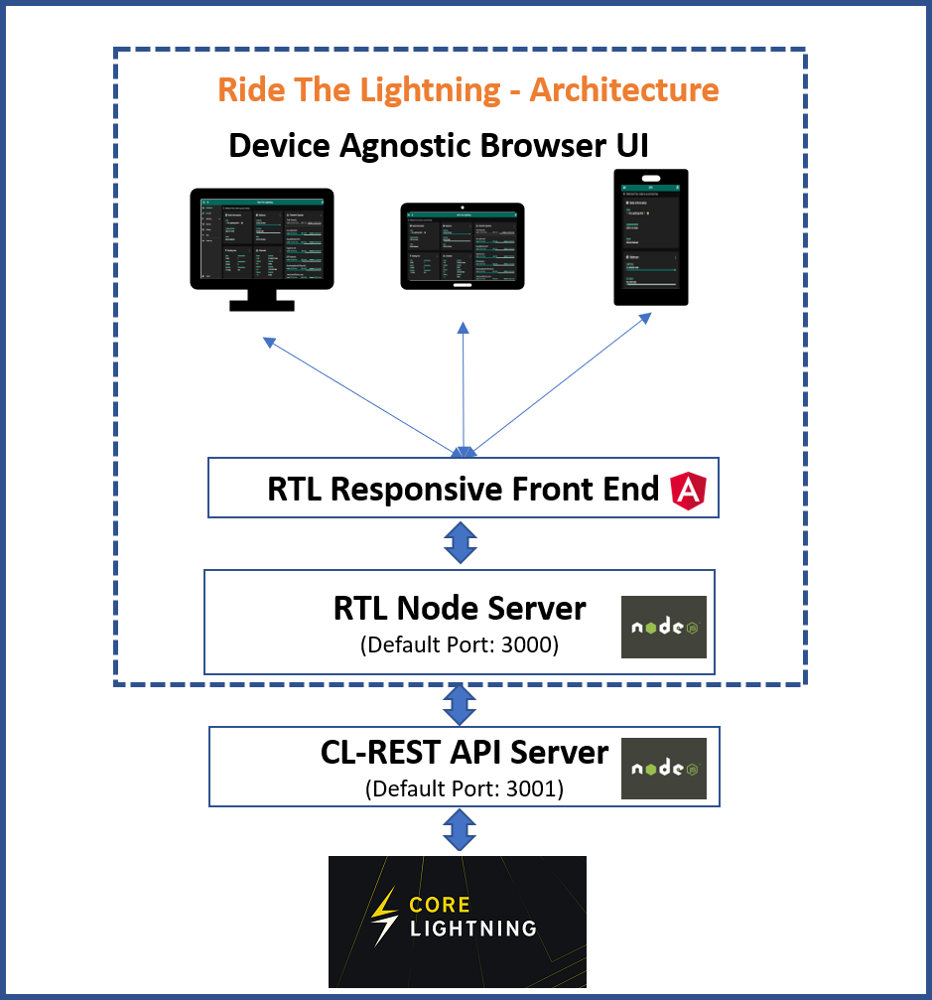
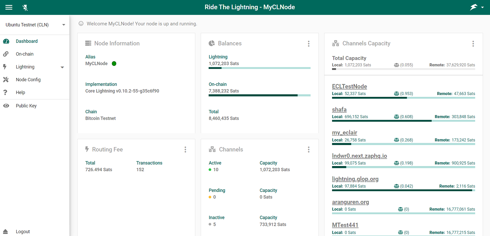

> *作者：Anony*


本文总结了笔者安装 [Core Lightning 客户端](https://github.com/ElementsProject/lightning)并为之配置一种前端管理界面 [RTL](https://github.com/Ride-The-Lightning/RTL) 的经验，希望能为尝试自己动手运行全天候在线节点的读者提供一些帮助。

## 闪电节点的功能

可用于跟其它节点开通可以几乎无限次相互支付的闪电通道，以及转发闪电网络上发生的其它人的支付。

在一条闪电通道内发生的支付，只需要得到参与这条通道的双方的确认，无需被其他人知晓，也无需得到区块链的确认，因此，它具备极快的支付速度。

而后者则意味着，当某人要给另一个人支付时，他们不一定需要有直接相连的通道，只要支付方能够找出一条由闪电通道前后相接、触达接收方的路径，并且路径上的通道的既定方向都有足够多的余额，就能够像接力赛跑一样，将支付转发过去。

因此，对使用者来说，闪电网络是一种开销很低、非常实用的支付工具；而闪电节点就是用户使用闪电网络的工具（用来自动化执行对用户有意义的安全操作）。

## 为什么要运行全时在线的个人节点？

需要首先指出的是：如果你只想作为一名普通的闪电网络用户，偶尔享受它带来的便利，你并不需要运行一个全天候在线的个人节点。移动端的自主保管钱包（比如：[Phoenix](https://phoenix.acinq.co/)、[Breez](https://breez.technology/)）实际上也是完整的闪电节点，只不过因为移动端的电池限制，它不会全天候在线。但闪电通道的时间锁限制，也意味着它并不需要全时在线，只要你定期（比如每两周一次）打开闪电钱包同步一下比特币网络，你的资金依然是安全的。

那么，运行自己的闪电节点有什么好处呢？

1. 可以为闪电网络贡献流动性（帮助转发支付），并在转发过程中得到一些手续费。但手续费收入非常小，不必期待可以从中获得很多收入。
2. 可以获得更好的隐私性。在使用移动端钱包时，你的对等节点很容易知晓你的收款情形（因为你并不全天在线，因此通过你们的通道的支付不太可能是转发给别人的）。一种很好的处理方式是，运行一个全时在线的节点（并开设多个通道），然后用你的移动端钱包远程控制它，或者与之建立支付通道，这就使得为你转发支付的中间节点无法断定支付的最终目的地。
3. 全时在线意味着你有最充足的时间响应通道对手的欺诈行为，因此其安全性也是最好的。

## 如何选择闪电网络客户端？

当前主流的闪电网络客户端有：[LND](https://github.com/lightningnetwork/lnd)、[Eclair](https://github.com/ACINQ/eclair) 和 [Core Lightning](https://github.com/ElementsProject/lightning)，它们是使用不同的编程语言编写的，设计上的重点也有所不同。

目前，市场占有率最高的是 LND 客户端，这得益于它的编程语言（Go 语言，非常容易为不同的硬件平台和操作系统编译出能够运行的软件），以及简明易懂的说明书。

但在功能上，Core Lightning 更加强大，而且性能更好。它采用了完全模块化的实现，并且带有一个插件系统，允许第三方的插件使用闪电节点中的核心数据。

具体对比可以看看[这篇文章](https://www.btcstudy.org/2023/03/27/what-are-the-differences-between-lnd-and-cln/#%E6%94%AF%E4%BB%98-%E2%80%94%E2%80%94-%E9%9A%90%E7%A7%81%E5%92%8C%E5%8F%AF%E9%9D%A0%E6%80%A7)。

## 运行个人节点最简单的方法？

毫无疑问，使用开箱即用的软件套件是最好的。比如，[Umbrel](https://umbrel.com/) 和 [RaspiBolt](https://raspibolt.org/) 都为树莓派电脑提供了专门的操作系统，这样的操作系统可以一键安装比特币客户端和闪电网络客户端，对不了解技术的用户最为友好。Umbrel 和 [RaspiBlitz](https://raspiblitz.org/) 都支持一键安装 Core Lightning 客户端。

> 注：为什么要提到 “树莓派电脑” 呢？这是因为，出于节点全天运行以及数据敏感的特性，使用单独的一台设备来运行节点（而非运行在 工作电脑/家庭电脑 上）是更好的选择。而在可选的设备中，树莓派电脑有可能是最便宜的。一个成本说明可见[这个帖子](https://github.com/btc-study/OP_QUESTION/discussions/5)。

下文将介绍不使用这样的套件、自己手动安装的流程。

## 背景及方法

笔者将使用命令行工具，在自己的树莓派 4 电脑上安装 Core Lightning 客户端，并使用 RTL（Ride The Lightning）作为控制这个节点的前端。

硬件：

- 树莓派 4 （ 8 G 内存版）

操作系统：

- Raspberry OS（32-bit）

软件：

- Bitcoin Core（安装方法可见[这个教程](https://www.btcstudy.org/2021/11/08/how-to-run-a-bitcoin-full-node-and-lightning-node-on-a-raspberry-pi/)；本文假设已安装好 Bitcoin Core 并完成同步；）
- Core Lightning
- RTL

## 安装及运行 Core Lightning

### 安装 Core Lightning

Core Lightning 的说明书的 [Installation](https://www.btcstudy.org/2021/11/08/how-to-run-a-bitcoin-full-node-and-lightning-node-on-a-raspberry-pi/) 部分列举了为各种软硬件平台编译出能够运行的二进制文件的方法。虽然说明书指出可以为树莓派交叉编译（即在其他平台上编译出树莓派电脑能够运行的二进制文件），但笔者已成功在树莓派上按照 Ubuntu 系统的编译流程成功编译并运行。

需要用命令行运行如下安装步骤：

1. 安装依赖

   ```
   sudo apt-get update
   sudo apt-get install -y \
     autoconf automake build-essential git libtool libsqlite3-dev \
     python3 python3-pip net-tools zlib1g-dev libsodium-dev gettext
   pip3 install --upgrade pip
   pip3 install --user poetry
   ```

   复制所有命令后在命令行窗口内粘贴，它会自动运行每一行，只有最后一行需要手动按回车键确认。

2. 复制 Core Lightning 的源代码并检查版本：

   ```
   git clone https://github.com/ElementsProject/lightning.git
   cd lightning
   git checkout v22.11.1
   ```

   第一行命令会从 Github.com 复制 Core Lightning 的源代码，它会形成一个名为 lightning 的文件夹。第二行会移动到这个文件夹中。第三行的作用是检查代码的版本。

   如果你的设备连接 Github.com 有问题，你需要想想其他办法。比如在能够访问 Github.com 的设备上[下载 Core Lightning 代码库的压缩包](https://github.com/ElementsProject/lightning)，然后传输到树莓派 4 电脑上。也可以尝试搜索 Github 镜像。

3. 编译二进制文件：

   ```
   pip3 install --upgrade pip
   pip3 install mako
   pip3 install -r plugins/clnrest/requirements.txt
   ./configure
   make
   sudo make install
   ```

   这里值得注意的是：（1）笔者没能成功运行第三条命令（带有 “requirements.txt” 的那条），但并不妨碍后续的成功编译。这条命令的意思是根据这个 `.txt` 文档的内容安装依赖，但所安装的都是 python 语言的库，并不是 C 语言（Core Lightning 的编程语言）的库。

   （2）在这个过程中，笔者遇到的最常导致过程中断的问题是执行文件的 `权限不够`，解决方法是先运行：`chmod +x <目录>/*`，表示给某个目录下的所有文件添加执行权限；然后继续执行被中断的命令。

完成了上述所有步骤之后，Core Lightning 就安装好了。尝试运行：

```
lightningd --network=bitcoin --log-level=debug
```

> **2024 年 5 月 7 日更新**：
>
> 此处 `log-level` 标签的作用是指定日志的详尽程度，一共分为：io、debug、info、unusual、broken 五个等级，详尽程度依次递减。`debug` 较为详尽，并不适合日常运行；日常运行可以使用 `info` 模式。

你会在屏幕上看到程序打印出许多信息，表示一个闪电节点已经启动。请确保你的 Bitcoin Core（`bitcoind`）在运行，否则这条命令可能失败。

接下来，我们要尝试配置 Core Lightning 的两个部分：`lightningd`（Core Lightning 闪电节点后台）以及 `lighting-cli`（Core Lightning 闪电节点命令行控制工具）。

### 配置 lightningd

我们要使用配置文件 `.conf` 来指引我们的 Core Lightning 程序，比如它将运行在哪个网络上、要记录哪些日志信息。

你可以自己建立一个配置文件，也可以使用存储在默认位置（`<你的用户名>/.lightning`）的配置文件（名为 `config`）。

Core Lightning 的说明书表明有[许多选项](https://docs.corelightning.org/docs/configuration)是可以配置的，但在这里，我们选择尽可能少用配置。例如：

```
network=bitcoin

bitcoin-rpcuser=<你在 bitcoin core 的配置文件中指明的 rpc 用户名>
bitcoin-rpcpassword=<你在 bitcoin core 的配置文件中指明的 rpc 口令>

lightning-dir=<你用来存储闪电节点资料的位置> # 默认为 `<你的用户名>/.lightning`

log-level=info #可选
```

第一行告诉 lightningd，它将运行在比特币主网上。而后续两行跟 rpc 相关的信息，则是告诉它， 为了跟 Bitcoin Core 通信，它要使用什么样的用户名和口令；这两行必须与 Bitcoin Core 配置文件中的一致，否则它就无法使用 Bitcoin Core 了。`lightning-dir` 以及 `log-level` 都是可选项。

其余配置选项可见上述说明书。

> **2024 年 5 月 7 日更新**：
>
> 可在配置文件中用专门的一行 `daemon` 表示使用后台模式运行，同时使用专门一行 `log-file=<日志存储位置>` 来指定日志应当输出到哪里。如此就可以避免在命令行窗口中打印日志（这会造成内存负担），也不会因为命令行窗口关闭而导致节点停止运行。日志的详见程度参见上一节。

在配置文件内写入配置内容后，尝试运行 lightningd。如果你的配置文件就放在默认位置，那么你只需：

```
lightningd
```

而如果你的配置文件有专门的位置，则需要：

```
lightningd --conf=<你的配置文件的位置>
```

> 出于便利，我们可以设置一下快捷方式：
>
> ```
> sudo nano ~/.bashrc
> ```
>
> 在最底部添加一行：
>
> ```
> alias lightningd='lightningd --conf=<你的配置文件的位置>'
> ```
>
> 保存并退出后，运行以下命令：
>
> ```
> source ~/.bashrc
> ```

确保 lightningd 正常运行之后，我们配置 lightning-cli。

### 配置 lightning-cli

实际上，配置 lightning-cli 的目的只是为了让它能正常跟 lightningd 通信，从而我们能够使用它来控制自己的闪电节点。因此，如果你在上一步的配置中没有改变配置 `lightning-dir`（闪电节点资料的存储位置）的话，**你就不需要额外的配置**。

而如果你改变了 `lightning-dir`，则你必须在运行 lightning-cli 时带上这个参数，才能控制 lightningd，例如：

```
lightning-cli --lightning-dir=<你为 lightningd 配置的存储位置> listfunds
```

出于便利，我们可以像上一步中那样，将 `alias lightning-cli='lightning-cli --lightning-dir=<你为 lightningd 配置的存储位置>'`加到 `.bashrc` 文件中，从而免去复杂的输入，直接使用。

更多的 lightning-cli 命令，可见[此处](https://github.com/ElementsProject/lightning#using-the-json-rpc-interface)。

综上，我们已经安装好了 Core Lightning，并可以运行其后台程序 lightningd 了，还可以用 lightning-cli 来控制这个闪电节点。

在运行 lightningd 的时候，使用 lightning-cli 的命令来检查它是否能正常工作，例如：

```
lightning-cli listfunds
```

## 安装及运行 RTL

如上所述，我们可以用 lightning-cli 来控制 lightningd，包括但不限于接收链上资金、开启通道、发起闪电支付，等等。但是，它毕竟不是一个特别清晰的界面，操作起来也不够方便。于是，我们使用 RTL 来充当我们管理自己的 Core Lightning 闪电节点的前端。

为了使用 RTL，我们要在设备上安装两个软件：[Cl-REST](https://github.com/Ride-The-Lightning/c-lightning-REST) 和 [RTL](https://github.com/Ride-The-Lightning/RTL)。它们的作用和通信架构可见下图：



### 安装 Node.js

Cl-REST 和 RTL 都要求我们先在设备上安装 Node.js 运行时环境。虽然这两个软件的代码库的超链接都指向了 [Node.js 的正式网站](https://nodejs.org/en/download/releases)，但实际上，它们并不要求我们安装最新版本的 Node.js 。而且，有一种特别简单的方法可以在树莓派上安装 Node.js 。

用命令行运行如下命令：

```
sudo apt update
sudo apt install nodejs build-essential -y
nodejs --version
```

最后一行将告诉你，你所安装的 nodejs 的版本。

### 安装及配置 CI-REST

运行如下命令：

```
git clone https://github.com/saubyk/c-lightning-REST
cd c-lightning-REST
npm install
```

第一行是从 Github.com 下载 Cl-REST 的源代码，并将它们放到一个名为 `c-lightning-REST` 的文件夹中。第二行是移动到这个文件夹。第三步是使用 npm（nodejs 软件包管理）来安装这套软件。

安装完成之后，我们要配置 Cl-REST，实际上，就是通过配置文件来告诉它，要如何跟 lightningd 通信。

在 `c-lightning-REST` 文件夹内，有一个名为 `sample-cl-rest-config.json` 的文件，提供了其配置选项的模板，形式如下：

```json
{
    "PORT": 3001,
    "DOCPORT": 4001,
    "PROTOCOL": "https",
    "EXECMODE": "production",
    "RPCCOMMANDS": ["*"],
    "DOMAIN": "localhost",
    "BIND": "::"
}
```

这里的各个参数的意思，在 Cl-REST 的 Github 库的[介绍文件](https://github.com/Ride-The-Lightning/c-lightning-REST#configuration-parameters)中有述。

假如你在配置 lightningd 时没有改变过 `lightning-dir`，那么你可以直接使用这个模板文件；但如果你改变了，则需要增加一行：

```
"LNRPCPATH": "<你所定义的 lightning-dir>/bitcoin",
```

要把它放在括号内，单独成一行，并跟其它行使用相同的缩进。总之就是保持相同的形式。

使用如下命令来编辑 `sample-cl-rest-config.json` 文件：

```
nano sample-cl-rest-config.json
```

编辑完成后，使用 `ctrl + o`（写入功能），将文件保存为 `cl-rest-config.json`。

保存成功后，使用命令行来运行 Cl-REST，这会让软件开始跟 lightningd 通信，并成为一个 API 服务端：

```
node cl-rest.js
```

屏幕上会有信息告诉你它已经开始运行了。必须保持它的运行，才能使用 RTL 。

就剩最后一步了！

### 安装及配置 RTL

老样子，我们从 Github.com 拉取软件的代码，并使用 npm 来安装它：

```
git clone https://github.com/Ride-The-Lightning/RTL.git
cd RTL
npm install --omit=dev
```

同样地，在 RTL 文件夹内，也有一个 `Sample-RTL-Config.json`，是 RTL 的配置选项的模板，是这样的：

```
{
  "multiPass": <password required for accessing RTL>,
  "port": "3000",
  "defaultNodeIndex": 1,
  "dbDirectoryPath": "<Complete path of the folder where rtl's database file should be saved>",
  "SSO": {
    "rtlSSO": 0,
    "rtlCookiePath": "",
    "logoutRedirectLink": ""
  },
  "nodes": [
    {
      "index": 1,
      "lnNode": "Core Lightning Testnet # 1",
      "lnImplementation": "CLN",
      "Authentication": {
        "macaroonPath": "<Modify to include the path of the folder with access.macaroon>",
        "configPath": "<Optional - Config file path for core lightning>"
      },
      "Settings": {
        "userPersona": "OPERATOR",
        "themeMode": "DAY",
        "themeColor": "PURPLE",
        "bitcoindConfigPath": "",
        "logLevel": "INFO",
        "fiatConversion": false,
        "unannouncedChannels": false,
        "lnServerUrl": "https://<cl-rest api server ip address>:3001"
      }
    }
  ]
}
```

这里面重要的有几行：

- `lnImplementation`，值应为 `CLN`。这是为了告诉 RTL，节点软件是 Core Lightning
- `macaroonPath`，由 Cl-REST 生成的 macaroon 文件的存储位置。假设 RTL 和 Cl-REST 运行在同一个设备上，那么值应该是 `<Cl-REST 的软件位置>/certs`。
  - 使用了这一行之后，下面的 `cofigPath` 的值可以留空，避免冲突。
- `lnServerUrl`，Cl-REST 服务端的网络端口。端口号（引号后的部分）可以在 Cl-REST 的配置文件中找到。假设 RTL 和 Cl-REST 运行在同一个设备上，并且没有在 Cl-REST 配置时改动过端口号（`"PORT"`）那么值应该是 `https://127.0.0.1:3001`。
- `dbDirectoryPath`，存放 RTL 数据的位置。
- `multiPass`，访问 RTL 的口令。当 RTL 成功运行后，你可以在浏览器访问本地的一个网络端口来使用 RTL，届时就要输入这个口令。

修改之后，将完成的配置保存为 `RTL` 文件夹下的 `RTL-Config.json` 文件。

然后，你就可以在命令行启动 RTL 了！在 RTL 文件夹内使用命令：

```
node rtl
```

屏幕输出的信息将告诉你，你要访问哪个网络位置来使用 RTL，一般来说，是 `http://localhost:3000`。在你的浏览器地址栏里输入这个地址试试吧！

你将看到这样的一个界面：



它将告诉你，你的 Core Lightning 闪电节点的信息，例如：你有多少条通道、有多少链上资金、你的通道容量，应有尽有！从此，你可以使用清爽的图形界面来控制自己的节点了！

（完）