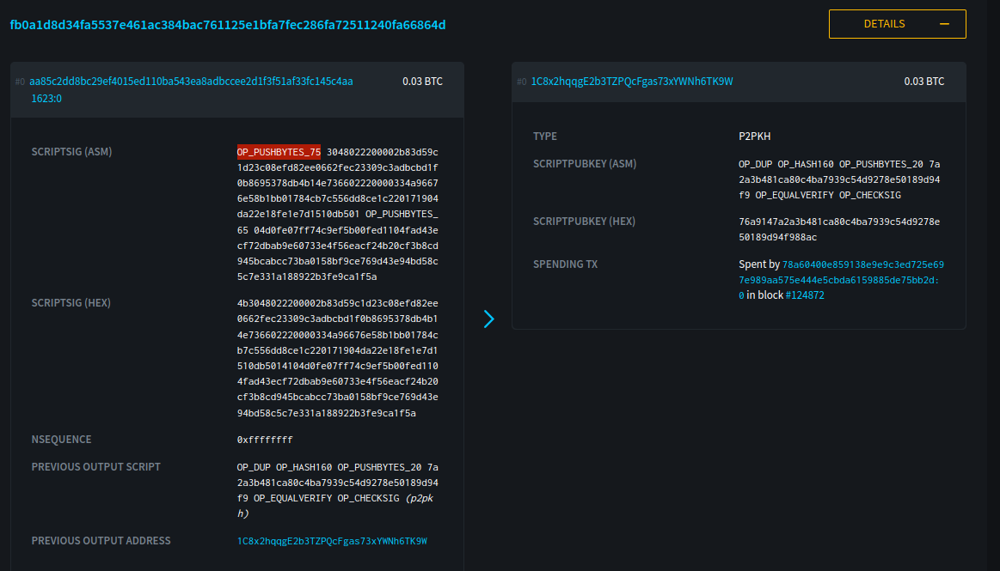
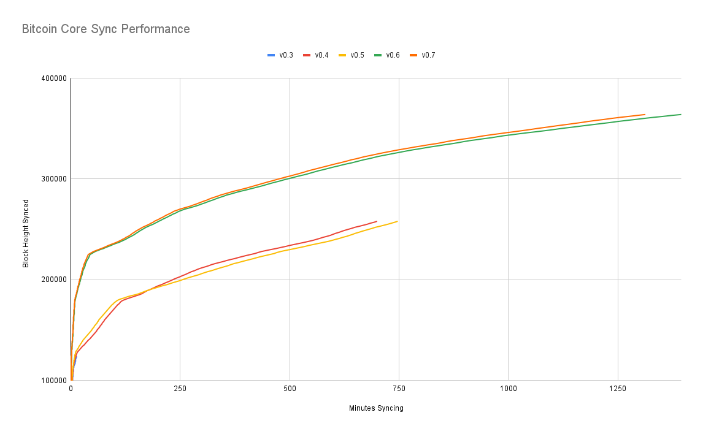
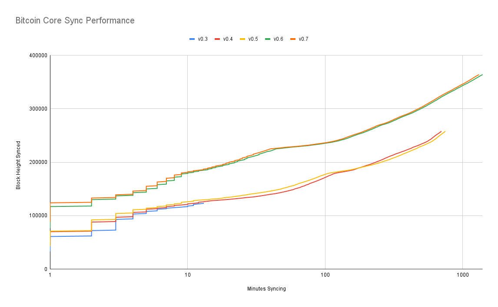

> *作者：Jameson Lopp*
> 
> *来源：<https://blog.lopp.net/running-bitcoin-core-v0-7-and-earlier/>*


本文是我对所有 Bitcoin Core 发行版本的[历史同步性能的研究](https://blog.lopp.net/bitcoin-core-performance-evolution/)的其中一个结果，也是[构建真正老旧的版本的挑战](https://blog.lopp.net/building-bitcoin-core/)（难以找到编译好的二进制文件）的成果。

注意，如果你计划使用这些版本的 Bitcoin Core 来同步区块链，你会用得很艰难。我不是第一个探究这件事情的人：在研究期间，我发现，Sjors Provoost 曾在 2017 年运行类似的实验，也有文字记录。

[旧版 Bitcoin Core 客户端的性能 – Sjors Provoost](https://sprovoost.nl/2017/07/22/historical-bitcoin-core-client-performance-c5f16e1f8ccb/?ref=blog.lopp.net)

## 探究同步过程中的错误

没有一个 v0.8.0 以前的版本可以同步到现在的链顶端，里面的原因多种多样。

**v 0.3**：在区块高度 12 4275 处停止同步，传出这个错误：

```
ERROR: ConnectInputs() : fb0a1d8d34 VerifySignature failed
InvalidChainFound: invalid block=0000000000004939267f 
height=124276  work=6613870563198902508
```

乍一看，[这](https://blockstream.info/tx/fb0a1d8d34fa5537e461ac384bac761125e1bfa7fec286fa72511240fa66864d?ref=blog.lopp.net)并不是一笔特别奇怪的交易。但是，如果我们检查[这个比特币地址](https://blockstream.info/address/1C8x2hqqgE2b3TZPQcFgas73xYWNh6TK9W?ref=blog.lopp.net)的花费历史，我们可以看到花费者构造过[好几笔](https://blockstream.info/tx/9173744691ac25f3cd94f35d4fc0e0a2b9d1ab17b4fe562acc07660552f95518?ref=blog.lopp.net)奇怪的[交易](https://blockstream.info/tx/ceb1a7fb57ef8b75ac59b56dd859d5cb3ab5c31168aa55eb3819cd5ddbd3d806?ref=blog.lopp.net)，有几百个 “0 价值” 的输出。可以不夸张地假设，这是一个技术人员在尝试破坏网络。

最后，让我惊讶的是这个输入的签名的大小。75 字节是签名的最大上限，大部分 P2PKH 的交易的签名都是 71 ~ 73 字节。



你可以通过下面这篇文章来了解比特币交易签名的历史；要指出的是，如果你尝试使用更新版本的 OpenSSL（1.0.0p / 1.0.1k）来验证早期链上出现的签名，你会遇到错误，因为 [DER 验证](https://lists.linuxfoundation.org/pipermail/bitcoin-dev/2015-January/007097.html?ref=blog.lopp.net)更加严格而且会拒绝特定类型的编码。

[比特币中的签名体积的变化](https://b10c.me/blog/006-evolution-of-the-bitcoin-signature-length/?ref=blog.lopp.net)（[中文译本](https://www.btcstudy.org/2023/12/12/evolution-of-the-bitcoin-signature-length/)）

解决方法是：要么使用一个更旧版本的 OpenSSL 来构建 Bitcoin Core，要么在开始构建之间[手动应用这个代码补丁](https://github.com/bitcoin/bitcoin/commit/488ed32f2ada1d1dd108fc245d025c4d5f252783?ref=blog.lopp.net)。一开始我有些困惑，因为 [gitian builder](https://github.com/devrandom/gitian-builder?ref=blog.lopp.net) 使用 Ubuntu 10.04 虚拟机作为构建环境，我以为应该是搭配了较老的（兼容）版本的 OpenSSL 的 …… 但是，Andrew Chow 指出，[他们在 2015 年向后移植（backport）了这个 OpenSSL 补丁](https://lists.ubuntu.com/archives/lucid-changes/2015-January/014490.html?ref=blog.lopp.net)。

**v0.4 和 v0.5** 都在区块高度 25 8354 处停止了同步，传出错误：

```
EXCEPTION: 11DbException       
Db::put: Cannot allocate memory       
bitcoin in ProcessMessage()       

ProcessMessage(block, 901212 bytes) FAILED
received block 0000000000000023e872
REORGANIZE
```

这是值得注意的，因为看起来 25 8355 是第一个达到 900 KB 大小的区块；在此之前，几乎所有挖出的区块都只达到 250KB 的默认 “软顶”。

**v0.6** 在区块高度 36 4670 处停止同步，并传出错误：

```
EXCEPTION: 11DbException       
Db::put: Cannot allocate memory       
bitcoin in ProcessMessages()       

ProcessMessage(block, 999787 bytes) FAILED
received block 000000000000000001d3
```

这也有类似的地方，因为看起来区块 36 4671 是第一个达到 1MB 的区块。

**v0.7** 在同一区块停止同步，但报错日志不同：

```
received block 00000000000000000221
ERROR: ConnectBlock() : UpdateTxIndex failed
InvalidChainFound: invalid block=00000000000000000221  height=364671
ERROR: SetBestChain() : SetBestChainInner failed
ERROR: AcceptBlock() : AddToBlockIndex failed
ERROR: ProcessBlock() : AcceptBlock FAILED
```

我猜测 v0.4 ~ v0.7 都是因为相同的原因而停止的，但那是什么原因呢？是 “BDB 锁问题”吗（该问题导致 2013 年出现了[一次意料之外的链分裂](https://bitcoin.org/en/alert/2013-03-11-chain-fork?ref=blog.lopp.net)）？[根据这些指令](https://bitcoin.org/en/alert/2013-03-15-upgrade-deadline?ref=blog.lopp.net)，我尝试创建一个文件 `~/.bitcoin/DB_CONFIG` ：

```
set_lg_dir database
set_lk_max_locks 537000
```

但每个版本都依然卡在相同的区块高度。[事实证明](https://bitcoin.stackexchange.com/questions/81485/bitcoind-0-5-3-stuck-at-block-364-670-what-to-do/112947?ref=blog.lopp.net#112947)，你**还**需要配置 `set_lk_max_objects` ，**而且**，最初的推荐数值（537000）还不够高（如果你想同步到区块 70 0000 的话）。下面的 `~/.bitcoin/DB_CONFIG`数值对我的机器奏效了：

```
set_lg_dir database
set_lk_max_locks 1000000
set_lk_max_objects 1000000
```

## 性能结果

你可以看我的[粗糙同步结果](https://docs.google.com/spreadsheets/d/12p2aP_yeQSeNysS_2qVI7mtPHVPyMs_2Spv3drrKlcw/edit?usp=sharing&ref=blog.lopp.net)。



你几乎看不见关于 v0.3 的数据，因为它跟 v0.4 和 v0.5 几乎一模一样，最终都在区块高度 12 4000 处崩溃。下面是一个对数版本，可以看得更清楚一些。



值得一提的是，在区块 19 0000 处有一个转折点，从此处开始，v0.4 的性能开始好于 v0.5。我把握最大的猜测是，这是 “检查点” 的结果。Bitcoin 0.3.2 引入了一种叫做 “检查点” 的机制来保证新的全节点不会在初期区块下载期间花费大量时间来验证不在已知最佳链上的竞争区块，从而阻止拒绝服务式攻击。

Bitcoin 0.5.0 基于这些检查点来加速同步，办法是跳过最近的检查点以前的区块链上的签名验证。你可能会说，“你没搞错吧？你不是可以通过配置 `assumevalid=0` 来强迫节点验证所有签名吗？”确实可以，但这个设定对早于 v0.14 的 Bitcoin Core 没有任何作用。（v0.14 是[这个配置参数第一次引入](https://bitcoincore.org/en/2017/03/08/release-0.14.0/?ref=blog.lopp.net)。）

因此，我认为，v0.5 整体上比 v0.4 要更慢，而且，早期的同步性能测试实际上是 作弊/不公平的比较。

## 老版本 vs. 新版本

那么，最新的 v22 版本与这些老版本相比，性能上有多大提升呢？

同步到区块 12 4000：

- v22 比 v0.3 快 17 倍

这些区块都是空的，所以性能上的差别不是那么明显，但若同步了更多区块链，就会显著起来。

同步到区块高度 25 8000：

- v22 比 v0.4 快 77 倍
- v22 比 v0.5 快 83 倍

同步到区块 36 4000：

- v22 比 v0.6 快 40 倍
- v22 比 v0.7 快 38 倍

## 前向兼容性很难

你可能经常听到一种说法：你可以运行非常老旧版本的比特币软件，它依然能跟现在的网络兼容。当然，真正的答案要复杂得多、微妙得多。为了让很老版本的比特币软件同步到现在的链顶端，你需要对软件作一些变更。另一个棘手的地方是，如你缩减，并非所有在共识上重要的代码都是由比特币开发者编写的 —— 有些时候是第三方的库，而且这些库也会随时间变更，从而让软件构建的流程自身变成可能导致共识失败的原因！

（完）