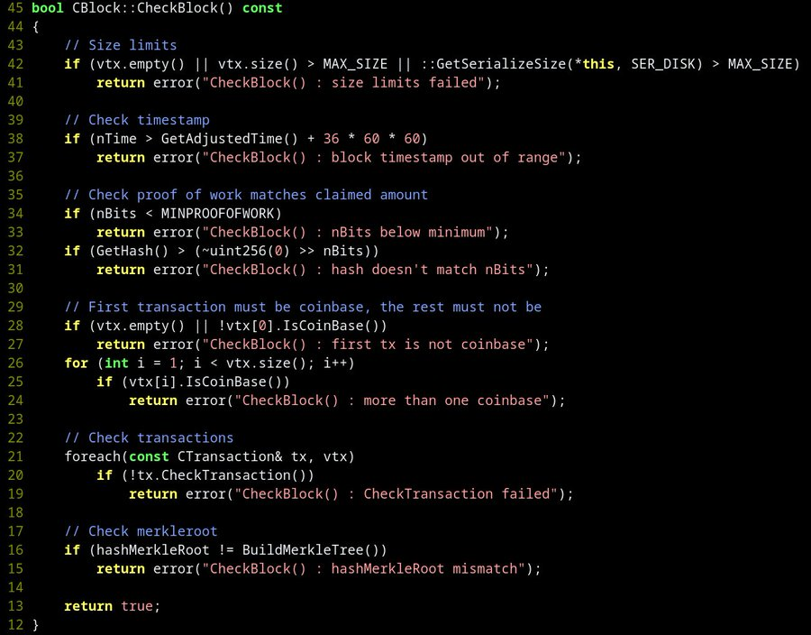

> *作者：Amir Taaki*
> 
> *来源：<https://x.com/Narodism/status/1844017533336142025>*

中本聪编写的代码是不常见的。他有很多怪癖。我们可以通过对比他和其他人的代码来找出他，只是还没有这么做过。

在我第一次读到他的代码时，我就认为 “中本聪不是个程序员），因为他的代码非常奇怪。他不遵循哪个时代最新的常见代码规范。

他大量使用了锁（那时候锁还不流行）。他使用了匈牙利命名法（Hungarian notation），当时已经没人使用了。他写的函数递归像意大利面一样糊，而且从不使用对象来封装进程。他也集中于 Windows 编程。

> 译者注：
>
> - “锁” 是多线程编程中的一种工具，用于防止多个线程竞争修改同一个数据。
> - “匈牙利命名法” 是一种变量命名规则，通过将变量的类型以小写字母作为变量名开头来帮助记忆其类型和用途。
> - “递归” 指的是让函数调用自身的函数编写方法。
> - “对象” 是一种编程方法，指的是把一类数据及其使用方法（函数）打包成一个专门的类型，通过将变量定义为某类型下的实例来约束该变量的用法。

所有这些都指向一位较为年长的人，可能并不是一位软件开发者，而来自相邻的领域，比如工程学或物理学。他的白皮书也体现出，其背景更像是带有实用关切的人，而不是一位数学家。

代码本身是非常独特和个性化的，自身就包含了风格。对代码的分析会告诉我们一切。

你甚至可以比较来自 2008 年的代码和 2010 年的代码，而且中本聪写代码的方法并没有改变。实际上，你可以看到代码从概念验证变成了细致地操纵中本聪自己的节点。

每当有人说某某是中本聪的时候，我的第一反应总是 “你给我看看他写的代码吧”。这应该成为我们的默认立场。

但没有比特币程序员多么在乎这个（也包括我自己）。我们都忙于实际工作。我猜我们都尊重中本聪君自己的愿望。甚至写这篇展示可以如何找到他的文章，都让我感觉像是背叛。

公平地说，Peter Todd 处理得很好，并没有冒领荣誉。

（译者注：此处应指在 2024 年出版的一部纪录片中，创作团队指称 Peter Todd 就是中本聪，而 Peter 以讥笑的方式否认。）

更多链接：

- [https://x.com/francispouliot](https://x.com/francispouliot_/status/1106026078135611392)

- 2008 年的比特币代码：[bitcointalk.org](https://t.co/5oFWD6e6lN)

- [bitcoininsider.org](https://t.co/b7xEtUYv5K)

- - -

[nullc](https://www.reddit.com/r/Bitcoin/comments/1fzfme7/comment/lr6jyjd/)：

…… 比特币的代码是非常专业的，而且与常规的商业软件相比，缺陷异常少。说编写代码的人是业余人士是站不住脚的。

这看起来是初级开发者，或者还没学会区分与自己风格不同的代码和差代码区别的人，所作的之处。人们可能只是想通过贬低中本聪来吹捧自己，或者继续一种常见的误解：如果你在某件事情上做得很好，那么你别的事情通常都不如人。反例很常见。

唯一可以批评比特币早期代码的重要错误就是，代码没有模块化，但是，早期代码只有区区 3 万行代码的极小体积，尝试模块化会带来许多的复杂性，以及可能得 bug。所以早期代码只是恰如其分地做了作者希望它们做的事。后来，当人们尝试拓展这份代码的时候，就改成了更加模块化的形式。

[Amir](https://x.com/Narodism/status/1844700040607977555)：

我的批评并不是风格上的，而是架构上的。当时人们已经开始迁移到 reactor 和事件驱动的架构上（比如 nginx）。中本聪关于比特币脚本的代码是不可反序列化的，从而除非解析它们，否则无法形成静态分析。代码从头到尾会规律地交换字节序（字节的编码方式）。没有清晰的调用图，而且锁会在少数地方形成递归。我还可以继续列举。