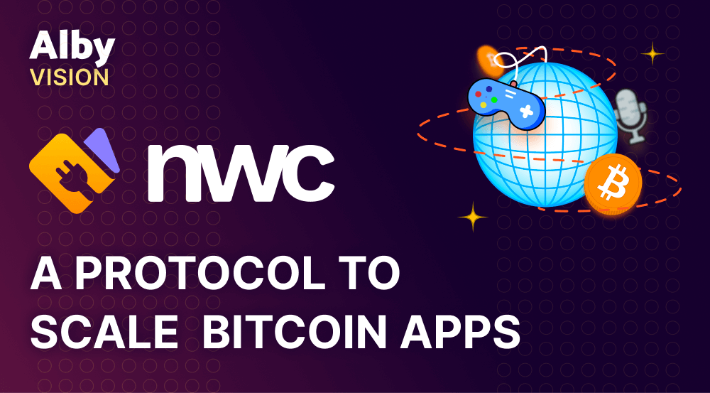
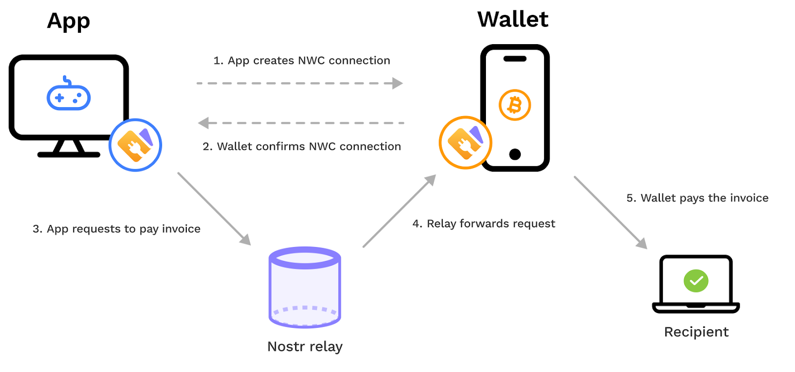

> *作者：Alby*
> 
> *来源：<https://blog.getalby.com/scaling-bitcoin-apps/>*

当前，在应用中集成比特币闪电钱包需要开发者付出繁重的劳动，主要是因为这些钱包提供的接口花样百出。结果是，开发者只能两者取其一：

要么，你在应用中从头开始开发一个完整的钱包，这需要付出拓荒开发的大量工作，还需要保证持续运营（其中包括用户支持） …… 这还不包括在涉及资金转移服务时的可能监管问题。

要么，你被要求为当前市场上的每一种比特币闪电钱包都开发一个单独的集成。这种不必要的摩擦增加了应用的负担，而且对用户基数较小的小众钱包不利 —— 因为开发者不太可能为之开发集成。

这对用户来说又意味着什么呢？要么，用户无法容易使用 App，因为他们的钱包不受支持；要么，就被迫放弃自主保管、把钱存到托管式应用中。

显然，需要一种标准化、开源的协议来创造一种托管式钱包和应用的用户已经熟悉的用户同一，同时保持你对资金的控制权。

## NWC：比特币应用的沟通层

“[NWC](https://nwc.dev/?ref=blog.getalby.com)” 是 “Nostr Wallet Conncet” 的缩写，它是一套开放的协议，允许比特币闪电钱包与 app 之间的持续互动。

- NWC 概览 -

用户可以直接在 app 中初始化连接，然后调用启用了 NWC 的钱包来确认连接；或者，在 app 中扫描一个 QR 码，或者复制一个链接到 app 中。一旦链接建立，app 就可以通过某个 Nostr relay 来请求闪电支付。

（译者注：尽管 NWC 的介绍一直沿用上图，但图中关于初始化连接的描述可能已经过时了。当前的 [NIP47 Nostr Wallet Connect](https://github.com/nostr-protocol/nips/blob/master/47.md) 明确要求，用户应该先在启用了 NWC 的钱包中生成链接，然后将该链接传入 Nostr app；上一段的介绍中，“使用 app 扫描 QR 码/复制链接到 app 中” 的描述应该被认为是更加准确的。）

NWC 继承了 Nostr 的知名优点：简单且永续可用的、服务于应用的通信层。这让通信可以绕过许多障碍，并且消除了需要使用 TOR 或暴露闪电节点到公网中的需要，因为所有的通信默认是加密的。

NWC 最初由 Amethyst 和 Alby 背后的开发者推出，已经为有志打造一流支付体验的开发者准备好了一切。它的特性包括：通过 BOLT11 或 keysend 发起 单路径/多路径 支付、请求账户数据以显示交易列表、账户余额、检查成功支付。

本质上，它让每个人都能打造自己的接近原生的钱包体验，而无需自己开发钱包。NWC 已经显示出是极为轻量的协议，每个希望支持比特币的 app 都可以集成；而且它是开放的，每个人都能提交贡献。

## NWC 如何扩大比特币应用的开发和采用

NWC 保证了生态系统层面的互操作性和公平的竞争环境（它没有供应商锁定效应），它的目标只有一个：给予开发者打造最佳比特币支付体验的工具。此外，NWC 还提供了：

### 毫不费力的连接

用户可以即时连接钱包、创建一个钱包账户。一切都是为了快速而简单的连接、让电子货币的使用体验更加流畅。欢迎来到钱包连接的快车道。而且，虽然 NWC 使用了 Nostr 的转发技术，用户完全不需要关心 Nostr 密钥。每个 app 都可以建立在 NWC 上、吸引所有可能的用户。

### 一键支付

App 可以提供流畅的应用内交易，无需 QR 码，更不必打开其它应用来确认支付。这可以保持用户的专注，保证高转化率、高交易量 —— 这是每一个应用开发者的梦想。

### 无需托管

托管用户的资金很快会转变成监管上的噩梦。最后，开发者关心 KYC 规则会多过关心自己的 app 本身。NWC 让用户可以自己选择钱包。结果是，app 将完全充当支付协调者的角色，不会触及用户的资金。开发者因此可以摆脱噩梦。

### 可配置的访问权

用户自己控制一切。无论是设置时间限制、分配预算，还是设置有区别的访问权，用户都可以自己定制。

### 多平台兼容性

NWC 是平台独立的，可以在不同操作系统、设备和钱包中够做。即使是跨设备、跨应用的冒险，也不会遇到问题。这种多样性消除了所有限制，让 app 可以瞄准更加广泛的用户。

## 为开发者提供难以预见的机会

人们越来越担心托管式钱包会主宰闪电支付领域。在提供流畅的应用内支付体验上，托管钱包依然领先，因为闪电节点在执行支付时就要在线。但 NWC 允许用户自带钱包，让行业可以从托管式支付转向非托管式支付。

许多 app 都已经用上了 NWC 。[Damus](https://damus.io/?ref=blog.getalby.com) 和 [Amethyst](https://play.google.com/store/apps/details?id=com.vitorpamplona.amethyst&ref=blog.getalby.com) ，都有数十万用户，他们实现了 NWC ，为 app 添加原生的支付体验，而不强制用户使用哪款钱包。今天有谁不喜欢在 Nostr 社交网络上打赏呢？

[prism](https://www.makeprisms.com/?ref=blog.getalby.com) 正在推动可以设想建立在 NWC 上的应用场景的边界。他们的 “Reward（红包）” 功能让用户可以创建和分享一笔比特币奖励，任何拥有闪电地址（lightning address）的人都可以领取；而 “Split payment” 功能让创建者只需几个配置步骤就可以奖励高达 100 位关注者，而且不需要预付存款。

其它应用场景包括基于订阅的支付，来自 [Flash](https://paywithflash.com/products/?ref=blog.getalby.com) 和 [Mutiny+](https://blog.mutinywallet.com/solving-subscriptions-on-bitcoin-one-zap-at-a-time/?ref=blog.getalby.com)（没错，比特币的月费支付也成为可能了）；基于时间间隔的条件式支付，来自 [ZapPlanner](https://zapplanner.albylabs.com/?ref=blog.getalby.com)，可以定期（或基于任何其它事件）给拥有闪电地址的人支付。还有 [Bitcoin Connect](https://bitcoin-connect.com/?ref=blog.getalby.com)，这个库让开发者可以添加定制化的支付按钮、并使用一行 HTML 代码来连接钱包。这只是所有可能性的一小部分。

NWC 为自主保管铺平了道路，但因为它是一个开放的协议，所以 app 可以用它来连接非托管钱包，也能用来连接托管钱包。这也是为什么你会看到所有类型的钱包实现都有了支持它的例子，比如 [Umbrel](https://umbrel.com/?ref=blog.getalby.com)、[Start9](https://start9.com/?ref=blog.getalby.com)、[Mutiny](https://www.mutinywallet.com/?ref=blog.getalby.com)、[Alby](https://getalby.com/?ref=blog.getalby.com) 和 [Strike](https://strike.me/?ref=blog.getalby.com) 。不管怎么说，给用户提供连接到其它应用的简单方式，有助于提高用户的粘性。随着 NWC 创造出公平的竞争环境，我们一定会看到更小、更专注于某些应用场景的钱包在细分市场中获得公平的市场份额。

## 参与比特币应用开发的下一个阶段

新的、陌生的技术，和围绕托管的监管不确定性，都阻碍了应用的快速发展。[NWC](https://nwc.dev/?ref=blog.getalby.com) 的吸引力证明了，让比特币变得对开发者更加友好，是有好处的，可以带来创新的繁荣。

NWC 是一项开放的标准，旨在让比特币支付成为主流。通过大幅削减打造支付提要的复杂性，它降低了应用开发者的入场门槛，也将 app 进入市场的时间从几个月缩减到几天，还能节约宝贵的资源。

从 app 生态系统的角度刊，NWC 是连接消费者、他们的钱包、第三方 app 的技术架构。这套协议让开发者可以创建无缝连接用户的钱包账户的 app —— 无论是为了访问账户和交易数据，还是发起支付，以及尚不为人知的其它可能。不管怎么说，它是一个可以释放开发者创造力的开放标准，[值得你尝试](https://nwc.dev/?ref=blog.getalby.com)。

（完）