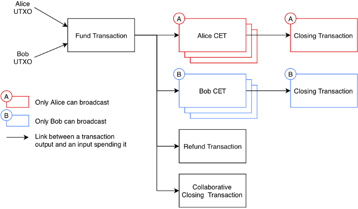
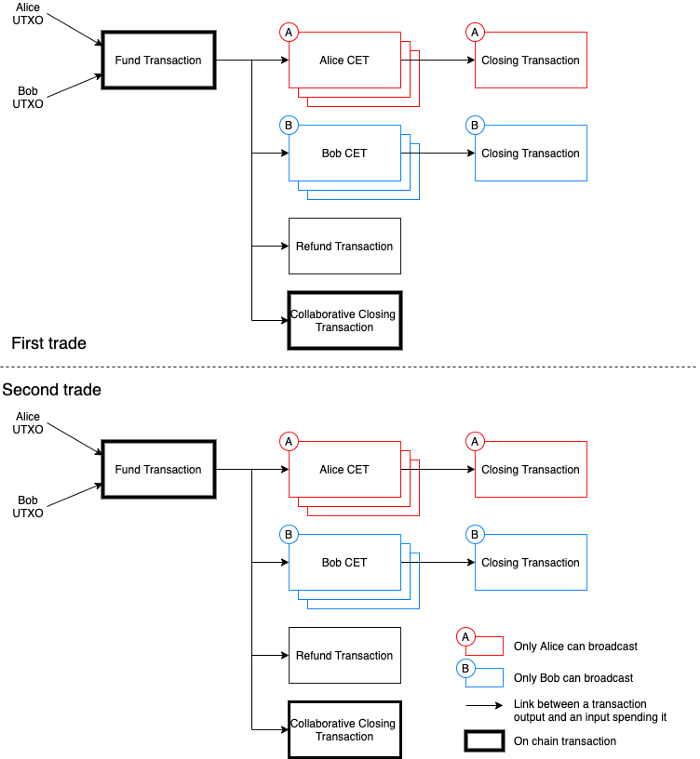
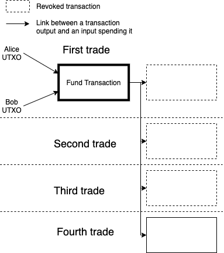
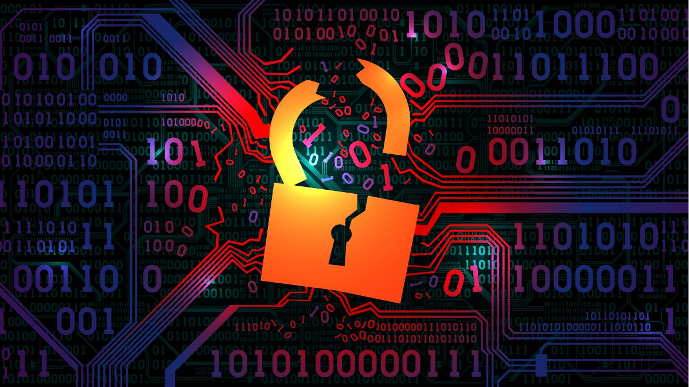
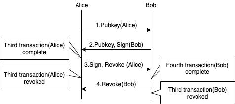
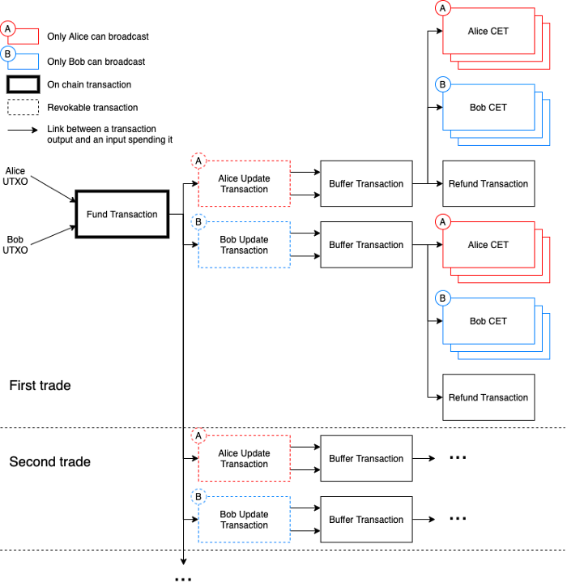
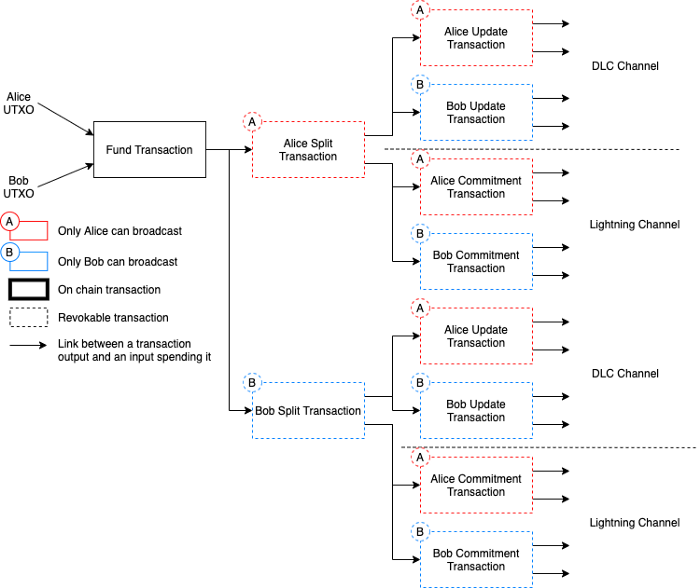

> *作者：Ichiro Kuwahara*
> 
> **论文：[谨慎日志合约通道及其闪电网络集成](https://github.com/p2pderivatives/offchain-dlc-paper/blob/master/offchaindlc.pdf)**

## Part-1：链下的谨慎日志合约

> *原文地址：<https://medium.com/crypto-garage/scaling-dlc-part2-free-option-problem-with-dlc-ff939311954c>*

Crypto Garage 一直在开发点对点的衍生品项目，希望能基于 MIT 数字货币计划（Digital Currency Initiatives）研究员 [Tadge Dryja](https://medium.com/@tdryja) 提出的 “[谨慎日志合约（DLC）](https://dci.mit.edu/smart-contracts)” 开发出点对点的金融合约平台。我们已经跟 [Blockstream](https://medium.com/crypto-garage/p2p-protocol-based-crypto-asset-derivative-settled-in-bitcoin-on-discreet-log-contracts-13c823448ae8) 和 [Skew](https://medium.com/crypto-garage/skew-crypto-garage-trade-peer-to-peer-bitcoin-settled-s-p500-derivatives-f9958db011dd) 操作过 DLC。我们也在跟 [Suredbits](https://suredbits.com/) 和其他优秀开发者开发 [DLC 规范](https://github.com/discreetlogcontracts/DLCpecs)。

DLC 让两方可以使用比特币区块链和信息断言机（oracle）来建立一个金融合约，而且无需向断言机公开合约的存在。任何基于区块链的系统，都要面临一个挑战，就是可扩展性（处理速度），所以减少链上交易的数量总是好的，参与者也将能享受到更低的交易费。我们已经放出了一篇论文，提出了[在链下更新 DLC 的机制（我们称为 DLC 通道）以及将它们集成到闪电网络的方法](https://github.com/p2pderivatives/offchain-dlc-paper/blob/master/offchaindlc.pdf)。在本系列文章中，我会概要讲解该论文提出的解决方案。

- 图 1. DLC 交易 -

在一个 DLC 合约到期后，如果双方想一起再创建一个 DLC 合约，他们需要先发交易关闭已经到期的合约，再发交易开设一个新合约。这是浪费，因为它需要至少额外 2 笔链上交易（一笔用于关闭旧合约，一笔用于给新合约充值）。

所以，如果双方要执行两个连续的合约，总计需要在链上广播 4 次，如图 2 所示。

- 图 2. 连续的 DLC 合约 -

所以，如果有一种办法能让双方拥有一个通道，只要通道内的余额还允许，双方就可以保持已建立的合约，那可谓皆大欢喜。如图 3 所示：

- 图 3. DLC 通道内的连续合约 -

创建这样的通道比乍看起来要难，因为要保证没有任何一方既能执行旧合约的结果，又能执行最新合约的结果（这样他们会从中挑选一个对自己最有好处的）。所以我们把这个问题称作 “免费期权（free option）” 问题，但它不应该跟原子化互换（automic swaps）的 free option 问题相混淆。

在[下一篇文章](https://medium.com/crypto-garage/scaling-dlc-part2-free-option-problem-with-dlc-ff939311954c)中，我们会具体解释  DLC 通道的免费期权问题。

## Part-2：DLC 的免费期权问题

> *原文地址：<https://medium.com/crypto-garage/scaling-dlc-part2-free-option-problem-with-dlc-ff939311954c>*

在本系列的上一篇文章中，我概要地讲解了 DLC 交易并提到了 DLC 的免费期权问题。在本文中我描述这个问题的细节。如果两方在一个 DLC 通道中执行连续的合约，他们需要 “撤销” 前一个合约的交易，以保证恶意的参与者也不会尝试使用旧状态来关闭通道。我们以图 4 为例，第三轮合约的交易需要在第四轮合约建立前撤销。

- 图 4. DLC 通道中的连续合约（译者注：原文此处为 “图 1”，为保持与上文的连续性，改为 “图 4”，不再赘述。） -

### **一种稻草人协议**

图 5 展示了在 Alice 和 Bob 之间建立第四轮买卖并撤销第三轮买卖的交易的简化协议。他们先交换用来构建第四轮合约交易的公钥，以及这些交易的签名，最后是交换用来撤销第三轮合约交易的秘密值（撤销机制与闪电网络所用的无异，如 [BOLT #3](https://github.com/lightningnetwork/lightning-rfc/blob/master/03-transactions.md#revocationpubkey-derivation) 所述）。

- 图 6. Alice 和 Bob 之间的一种稻草人协议 -

### **问题**

假设 Bob 在图 6 所示的第三步之后拒绝响应，因为收到了 Alice 的签名消息，Bob 既可以从旧合约的交易中选出一笔来广播，也可以从最新一轮合约中选出交易来广播。Alice 则相反，因为已经撤销了旧合约的交易，所以没法广播旧合约的状态，只能在断言机发布新一个可以决定新合约结果的签名时，广播新合约的结果。（注意，她没法广播断言机发布签名之前的任何状态，因为其秘密值已经暴露了。）而 Bob 现在拥有了一种期权，既可以使用旧合约的状态关闭通道，也可以在断言机发布签名后使用新合约的状态关闭通道，全凭他自己高兴。

这就是所谓的 “免费期权” 问题（不要与原子化互换的 free option 问题相混淆）。

### **那为什么闪电网络的支付没有这种免费期权问题呢？**

注意，闪电网络的支付没有这个问题。在闪电网络中，有发送者和接收方，因为最新的状态总是对接收方更有利，接收方没有理由使用旧状态来关闭通道。

但 DLC 通道则相反，在更新通道的状态时，没人知道下一个新状态对谁更有利。因此，恶意的参与者可以保留旧的交易和最新的交易，选出好处更大的一笔来关闭通道。

[这里](https://bitcoin.stackexchange.com/questions/81406/order-of-exchanging-revocation-keys-during-lightning-transactions)有一份在闪电网络的撤销机制的概述。

在[下一篇文章](https://medium.com/crypto-garage/scaling-dlcs-part3-how-to-avoid-free-option-problem-with-dlcs-c4592a69559e)中，我会解释如何避免这个问题。

## Part-3：如何避免 DLC 通道的免费期权问题

> *原文地址：<https://medium.com/crypto-garage/scaling-dlcs-part3-how-to-avoid-free-option-problem-with-dlcs-c4592a69559e>*

在[上一篇文章](https://medium.com/crypto-garage/scaling-dlc-part2-free-option-problem-with-dlc-ff939311954c)中，我概述了 DLC 通道的免费期权问题。在这篇文章中，我会讲解如何避免这个问题。

为了解决免费期权问题，我们提出了加入一笔更新交易（update transaction）和一笔缓冲交易（buffer transaction）的想法。这些交易的加入，让双方都可以在旧合约过期后、安全地重新进入一个合约。

- 图 7. 链下的 DLC 交易 -

更新交易是可以撤销的，意味着在其相关的秘密值被分享之后，广播更新交易的一方要冒失去所有资金的风险。（类似于闪电网络的惩罚机制）

如果 Bob 不分享能够撤销旧交易的秘密值，更新交易就成了 Alice 的一个对策：Alice 可以使用它来关闭通道，得到相应于最新合约结果的余额。（译者注：由于此时新一轮的合约还未建立，这个 “最新” 应指最后一个已经结束的合约。）

而缓冲交易则用来防止某一方在新合约完全建立后尝试关闭通道。举个例子，如果 Alice 广播了更新交易、又同意进入一个新合约，Bob 就可以广播缓冲交易，来强制执行合约。也就是说，关闭通道的唯一办法就是使用其中一条 CET（DLC 合约结算交易）（或者退款交易）。另外，上面说的情形都是双方无法合作的情形。如果双方愿意合作，Alice 和 Bob 可以合作发起关闭交易，以充值交易的输出为输入，合理地分割资金。依靠在协议中加入这两种新交易，Alice 和 Bob 可以在 DLC 通道内持续创建合约，只要还有余额。此外，他们也知道，无论如何，总可以是用最新状态来关闭通道。

（译者注：参考论文，我们把更新交易和缓冲交易说得再清楚一些。首先，更新交易有两个输出，数额上对应着上一轮合约的结果，两个输出都可以被双方的 2-2 多签名花费，其中第一个输出可被（持有该更新交易的）己方的撤销密钥使用，也可在一段时间后被己方使用；第二个密钥可被对方在一段时间后使用。其次，缓冲交易（以 2-2 多签名）使用更新交易的两个输出作为输入，得出一个可以被 CET（结算交易）消费的输出。由此，在合约更替期间，如有一方广播上一轮的更新交易，则另一方可以广播对应的缓冲交易并导致双方以上一轮合约的结果结算；如有一方广播新一轮的更新交易，同样会以上一轮合约的结果结算。）

在[下一篇文章](https://medium.com/crypto-garage/scaling-dlc-part4-integrating-dlc-channels-in-the-lightning-network-cb60eed5c283)中，我会讲解如何在闪电网络中集成 DLC 通道。

## Part-4：如何在闪电通道中集成 DLC 通道

> *原文地址：<https://medium.com/crypto-garage/scaling-dlc-part4-integrating-dlc-channels-in-the-lightning-network-cb60eed5c283>*

在上一篇文章中，我解释了 DLC 通道和相关的 5 种交易类型。本文将讨论如何在闪电网络中集成 DLC 通道。

我们提议的 DLC 通道在结构上类似于闪电网络通道，我们也相信，DLC 将能从闪电网络已经完成的研究和开发中受益。同样地，通过在闪电网络中集成 DLC 通道，如果双方已经有闪电网络通道、又想执行一个 DLC，他们就不需要在区块链上广播一笔新的充值交易。

为将 DLC 通道与闪电通道相结合，我们设计了一个 DLC 通道和闪电通道的状态更新互不影响的结构，如下图所示。

- 图 8. 图解 DLC 通道和闪电通道分离的交易结构 -

我们加入了一笔隔离交易（split transaction），将充值交易的资金在 DLC 通道和闪电网络通道间分割。两个通道都可以独立更新，只要它们不占用更多的额度。如果 Alice 和 Bob 希望调整闪电通道和 DLC 通道的比例，他们可以更新隔离交易（取消上一笔隔离交易并创建一个新的）。

### 相关工作

另一种整合 DLC 通道的办法是在闪电网络通道的承诺交易中使用一个额外的输出，这个输出可以作为一个 DLC 的充值输入。 Bedna ́r 和 Pickhardt 就提议使用[这种方案](https://hackmd.io/@lpQxZaCeTG6OJZI3awxQPQ/LN-DLC)。

虽然这样做能减少交易的数量，这意味着每当需要更新闪电通道时，所有跟 DLC 有关的交易也需要重新构造、签名和交换。

以上就是 DLC 扩容系列的全部了。这个领域还处在研究阶段，我们预计未来会有更多讨论来提炼它。如果你对这个研究主题有兴趣，请联系我们：[info@cryptogarage.co.jp](mailto:info@cryptogarage.co.jp)。同时，我们也在跟很棒的开发者撰写 [DLC 规范](https://github.com/discreetlogcontracts/dlcspecs)。如果你有兴趣，请看看我们的成果、加入进来。

（完）