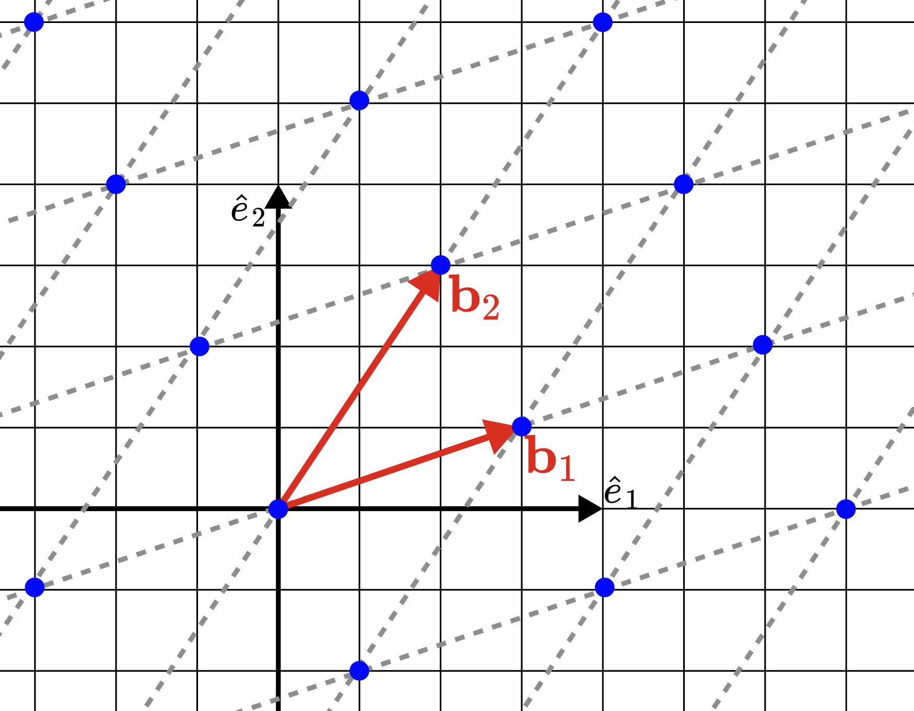
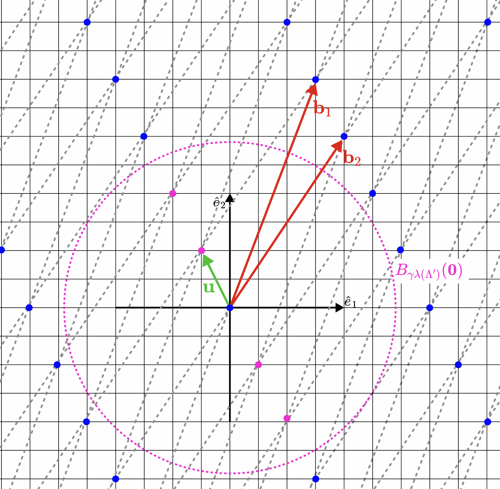
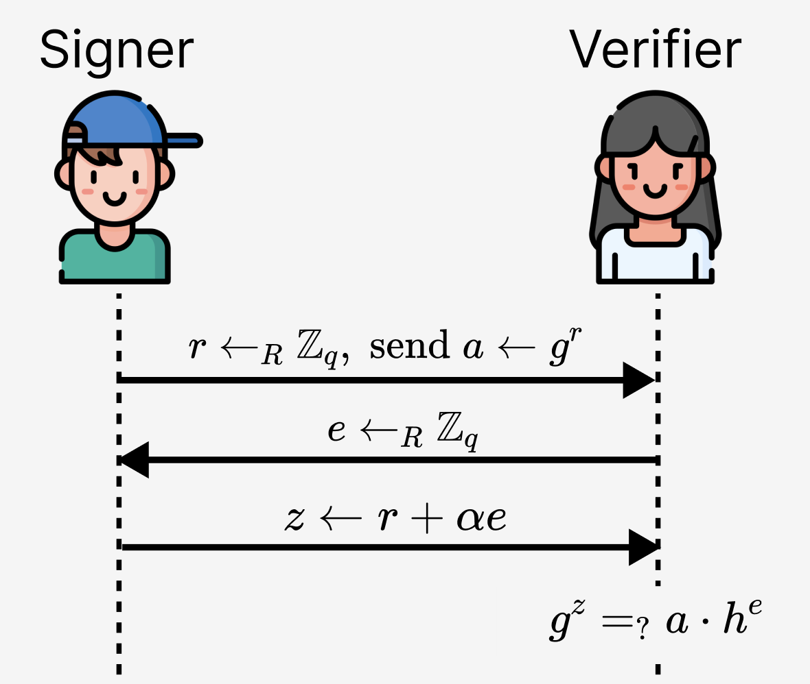
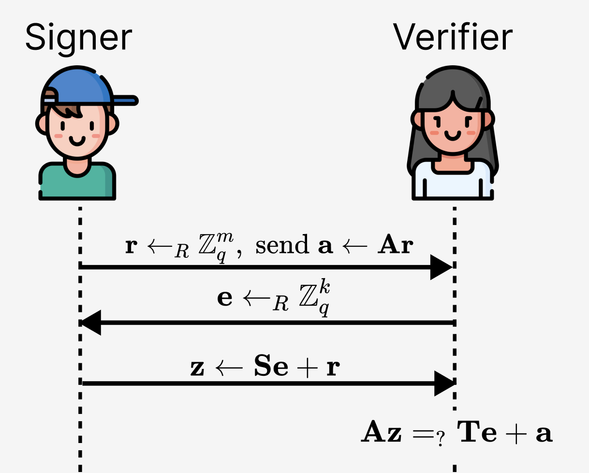
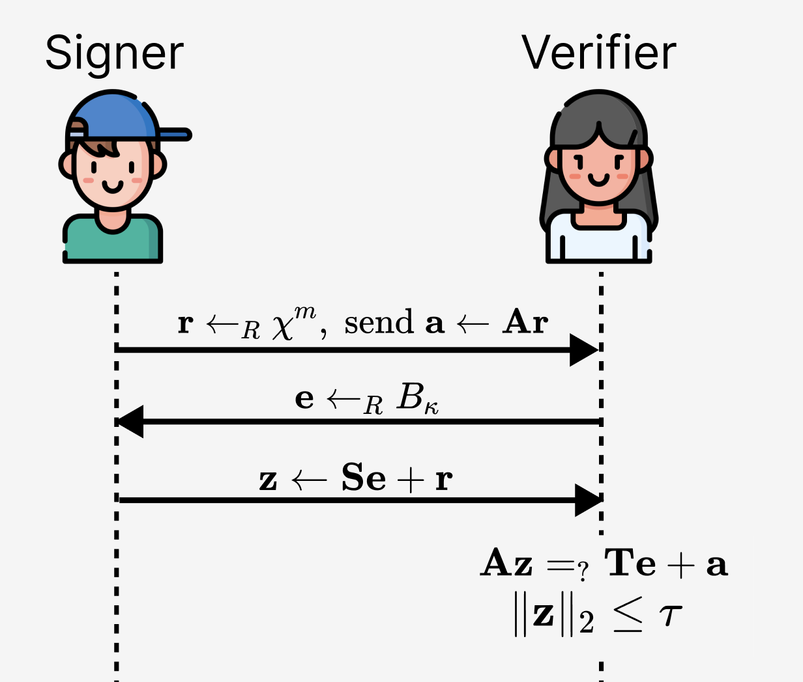
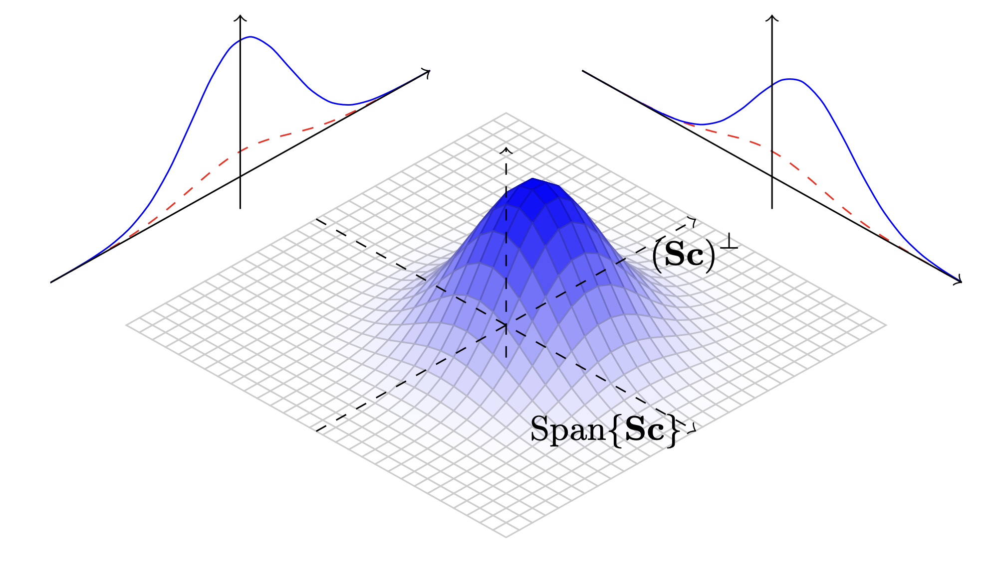
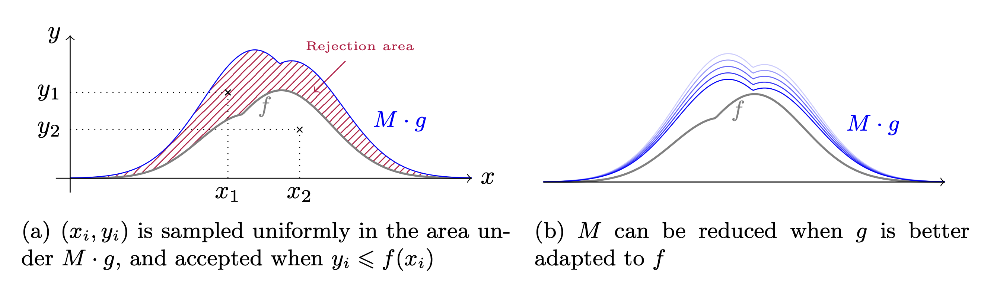
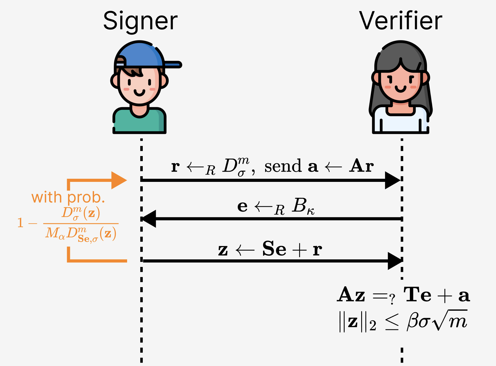

> *作者：Dmytro Zakharov*
> 
> *来源：<https://hackmd.io/@ZamDimon/rk3uMfpjbx>*

> **致谢**
>
> 本本部分基于我在 [Blockstream 研究部门](https://x.com/blksresearch)工作期间形成的研究。感谢大家支持我并给我研究这个课题的机会。
>
> 格外感谢 Jonas Nikc，细致地审核本文并给出了非常有用的建议；还有 Mykyta Redko，注意到了本文的解释中的几个重要的错误。

## 引言

因为 Google Quantum AI 团队的[最新论文](https://quantumai.google/static/site-assets/downloads/cryptocurrency-whitepaper.pdf)出版，围绕第一台 “有密码学意义的量子计算机（CRQC）” 何时问世的讨论又开始升温（直白地说，在有些地方甚至变成了一种恐慌）。观点差别很大，但有一个点似乎是每个人都同意的：我们需要尽快迁移到量子安全的算法。

当然，需要这样做的，包括大量已在服役的协议；尤其是，在比特币（以及广义的区块链领域），自然而然的第一步就是构造一种后量子的（PQ）安全电子签名方案。然而，哪怕是这第一步，也涉及许多争议：现在有许多备选的 PQ 方案，但他们都（a）在某些指标上显著差于 “零散对数（DL）” 构造（至少是 16 倍）；（b）底层的安全性假设通常更少得到研究（相比于前量子的同类方案）。

目前为止，PQ 签名主要有两种类别：*基于哈希函数的*，以及 *基于格的（lattice-based）*。关于基于哈希函数的密码学，Blockstream 已经形成了非常丰富的分析和研究： 比如说，由 Jonas Nick 和 Mikhail Kudinov 撰写的《[为比特币考虑基于哈希函数的签名方案](https://eprint.iacr.org/2025/2203)》，以及由 Jnoas Nick 提出的 [SHRIMPS](https://delvingbitcoin.org/t/shrimps-2-5-kb-post-quantum-signatures-across-multiple-stateful-devices/2355) 方案。现在，轮到基于格的构造了！

> **重要提醒**
>
> 我们注意到还有基于编码的（code-based）构造，但它们的公钥和签名的体积都太大了：举个例子，一个重要的（前）NIST 候选方案 [LESS](https://csrc.nist.gov/csrc/media/Projects/pqc-dig-sig/documents/round-2/spec-files/less-spec-round2-web.pdf) 的公钥体积最小是 13.9KB 。也就是说，从目前来看，似乎不是比特币的可行选项。

### 本文的课题

如前所述，我们准备分析基于格的签名方案背后的基本想法。尤其是，在读完本文之后，读者可以获得对一种叫做 “带中止的 Fiat-Shamir 变换（*Fiat-Shamir with aborts*）”（也叫 “*拒绝采样* ”）的关键技术的坚实理解；这种技术用在 Dilithium 以及（比如说）许多基于格的证明系统（proving systems）中（参见《[基于格的积证明](https://eprint.iacr.org/2020/517.pdf)》）。令人惊喜的是，这种技术与基于离散对数假设的传统 Schnorr 签名构造非常相似。在本文中，我们会提供一套基础的工具，帮助读者理解基于格的方案，希望能让读者更容易进入这个密码学领域。

更具体一些，在本文中，我门将从著名的论文《[无陷门的格签名](https://eprint.iacr.org/2011/537.pdf)》出发，理解作者 Lyubashevsky 所提出的构造；该文可能是整个格密码学领域影响力最大的一篇论文。

## 对格的基本介绍

### 格

先介绍一下我们的研究对象。我们定义 $m$ 维的 “格（lattice）” $\Lambda \subseteq \mathbb{R}^d$ 为一组独立的线性向量 $\mathbf{b}_1,\dots,\mathbf{b}_m$ 在 $\mathbb{R}^d$ （d 维实数空间）上的所有整数线性组合（其中 $m\leq d$），也即：

$$
\Lambda \triangleq \left\lbrace \sum_ {i=1}^m \lambda_ i\mathbf{b}_ i: \lambda_ 1,\dots,\lambda_ m \in \mathbb{Z} \right\rbrace.
$$

为了更直观地理解这个东西，这里给出一个具体的例子：下图是一个二维（$m=d=2$）的格。

*<strong>图 1</strong>.一个二维格的例子，它由向量 $b_1 = (3, 1)$ 和 $b_2 = (2, 3)$ 张成。得到的格 $\Lambda$ 是一组蓝色的点。*

我第一次读到这个定义时，忍不住怀疑 “这么直截了当的定义，能搞出什么有用的东西呢？” 但是，在密码学家们注意到格是许多计算困难问题的根域以前，格就已经被证明在数学上是有用的，至少可以追溯到 18 世纪。事实上，格是自然而然出现在许多领域的，比如数论（number theory）和球堆积（sphere packings）问题（两者都或多或少与基于格的和基于编码的密码学有关）。

> 注：
>
> 有时候我会听到这样一种说法：“相比于基于哈希函数的密码学，格太不成熟了”。然而，这是一种概念错乱，因为早在哈希函数被发明（可以追溯到大概 1950 年）之前，格就已经被使用和研究了:) 不过，格确实比哈希函数拥有更丰富的代数结构。虽然这可以带来更高级的密码学协议（例如：多签名或 SNARKs），我们还是要谨慎对待其安全性。

### 密码学中的格问题

**基于格的密码学**围绕着一些假设展开，这些假设可以归约（reduced）为解决格 $\Lambda$ 上的一些难题。反过来，这些问题，在当前，被认为哪怕是量子计算机也难以求解。现在有许多这样的假设，比如：最短向量问题（**SVP**）、最近向量问题（**CVP**）、有限距离解码（**BDD**）、格同构问题（**LIP**）、决定性最短向量问题（**GapSVP**），等等。

在本文中，我们只会介绍其中一种假设。

**（近似的）最短向量问题（$\gamma$-SVP）**。目标是找出格 $\Lambda$ 上的一个 “非常短” 的向量。我们可以（相对容易地）证明 $\Lambda$ 包含这个 *最短的* 向量（即，存在 $\mathbf{u} \in \Lambda$ 使得 $\Vert\mathbf{u}\Vert=\min_{\mathbf{v} \in \Lambda}\Vert\mathbf{v}\Vert$，其长度我们记作 $\lambda_1(\Lambda)$ ，但是，找出这样一个向量，被认为甚至对量子计算机也是一个难题。我们把这个问题称为 “**SVP**” 。

然而，想要基于这个 “裸” **SVP** 开发出实用的协议，几乎是不可能的。于是我们放宽要求：假设我们接受其范数值小于 $\gamma\lambda_1(\Lambda)$ 的向量，只需因子 $\gamma>1$ 。可以证明，这样一个修改过的问题，对哪怕是较大的因子也依然足够难，比如 $\gamma=\mathsf{poly}(\sqrt{d})$ 。这个修改后的问题，我们称为 “$\gamma$-**SVP**”。（译者注：“范数（[norm](https://en.wikipedia.org/wiki/Norm_(mathematics))）” 是将向量空间内的向量映射成实数的函数。或者说，每种范数都对应着一种定义向量长度的方式，可以将范数值理解成长度。）

这个问题可以用下图来演示。

*<strong>图 2.</strong> 解释 $\gamma$-**SVP** 。假设格 $\Lambda'$ 是由向量 $\mathbf{b}_ 1=(3,8)$ 和 $\mathbf{b}_ 2=(4,6)$ 张成的（顺带说一句，它是在上文的 图 1 中定义的格 $\Lambda$ 的子格。它的两个最短向量是 $\mathbf{u}=(-1,2)$ 和 $-\mathbf{u}$ ，两个向量的长度都是 $\lambda_ 1(\Lambda')=\sqrt{5}$ 。在这个近似版本的 $\gamma$-**SVP** 中， $\gamma$ 约等于 **2.61**，只需要找出长度短于 $\sqrt{34}$ 的向量就可以了（在图中以紫色的圆圈标注了其范围）。比如说，$\mathbf{u}'=(2,-4)$ 的长度是 $\sqrt{20}$ ，是这个近似 **SVP** 的解，但不是标准 **SVP** 的解。*

### 短整数解

虽然可以直接基于格假设来构造密码系统（比如说，*Hawk* 就是这样做的），但一般来说，我们使用另一种假设（它可以规约为格假设）。最著名的例子是 “*短整数解*（*SIS*）” 和 “*带错误学习*（*LWE*）”。出于本文的目的，我们只讲前者。

假设有线性方程 $\mathbf{Ax}=0$，其中 $ \mathbf{A} \in \mathbb{Z}_ q^{n \times m} $ （$A$ 是一个 $n \times m$ 的整数矩阵）。求出这个等式的解，是容易的（例如，通过 “高斯消元法（Gaussian elimination）”）。但是，假设我们还要求解 $\mathbf{x} \in \mathbb{Z}^m$ 是 “短的”，即 $\Vert\mathbf{x}\Vert_ {\infty} < \beta$ （其中 $\Vert\mathbf{x}\Vert_ {\infty} := \min_ {i \in \lbrack m \rbrack} \vert x_ i \vert$ ，是 $\mathbf{x}$ 的 $\ell^{\infty}$ 范数值），且 $\beta \ll q$ ，这就成了短整数解问题的一个实例，记作 $\mathsf{SIS}_ {q,n,m,\beta}$ ；并且，在精心挑选的 $q,n,m,\beta$ 之下，它甚至对量子计算机也非常非常难。

(译者注：不知为何，作者在这里使用的 $\ell^{\infty}$ 范数的定义似乎与常见定义不同，常见定义是取元素的最大值，从而短整数解的要求是向量在任一维度上的值都小于 $\beta$ 。)

*习题 1.* 证明只要 $m>\frac{n\log q}{\log(1+\beta)}$ ， $\mathsf{SIS}_{q,n,m,\beta}$ 就存在解。

此外，我们用 $S_{\eta}$ 来表示 “短” 向量的集合，也即：

$$
\begin{equation*}
    S_{\eta} := \lbrace\mathbf{x} \in \mathbb{Z}^n: \Vert\mathbf{x}\Vert_{\infty} \leq \eta\rbrace.
\end{equation*}
$$

#### 非齐次 SIS

这一假设的一个重要微调是考虑同一等式的非齐次版本（non-homogeneous version）：$\mathbf{Ax}=\mathbf{t}$ 。这个修改允许我们考虑决定性假设，而不是搜索假设。具体来说，我们引入 “*非其次短整数解*（**ISIS**）” 假设，声称区分下面两种分布 $D_0$ 和 $D_1$ 是计算难题：

- $D_0$：从 $\mathbb{Z}_q^{n \times m} \times \mathbb{Z}_q^n$ 中随机选出一个样本
- $D_1$：随机采样 $A \gets_R \mathbb{Z}_ q^{n \times m}$ ，采样一个短的向量 $\mathbf{s} \in \mathbb{Z}^m$（即 $\Vert\mathbf{s}\Vert_ {\infty} < \delta$ ），计算 $\mathbf{t} \gets \mathbf{As}$ ，然后输出元组 $(\mathbf{A}, \mathbf{t})$ 。

我们可以证明，当背后的 $\beta$ 和 $\delta$ 有适当的关联时，**ISIS** 等价于 **SIS** 。这个假设允许我们开发出以下密钥生成方法：

- *私钥* 是矩阵 $\mathbf{S} \in S_{\eta}^{m \times k}$ ，由短元素组成。
- 公钥 是 $\mathbf{T} := \mathbf{AS}$ ，其中 $\mathbf{A} \in \mathbb{Z}_q^{n \times m}$ 是随机采样出来的。

*习题 2.* 证明从公钥复原私钥的问题等价求解 **ISIS**（假设 $k=\mathsf{poly}(n)$ ）。

**与格的关联**

你可能会想：说好的格呢？这跟格有啥关系？能塞进这篇博客的一种解释是：对于矩阵 $\mathbf{A}$ 的 $\mathsf{SIS}_{q,n,m,\beta}$ 实例，可以定义出这样的格：

$$
\begin{equation*}
    \Lambda_A^{\perp} = \lbrace\mathbf{z} \in \mathbb{Z}^m: \mathbf{Az} = 0 \ (\text{mod} \ q)\rbrace.
\end{equation*}
$$
*洞见*：求解 $\mathsf{SIS}_{q,n,m,\beta}$ 等价于求解恰当 $\gamma$ 下的 $\gamma$-**SVP** 。这从 $\Lambda_A^{\perp}$ 的定义中就能看出来：这个格中的任何一个向量，都是 $\mathbf{A}\mathbf{x}=0$ 的解；如果我们从想求解这个格的 **SVP**，本质上就是在寻找这个等式的短整数解，这正好就是 **SIS** 的要求。

## 带中止的 Fiat-Shamir 变换

### 动机

我们已经看到了，基于格的假设使我们可以为公开的矩阵 $\mathbf{A}$ 和一个 “短” 矩阵 $\mathbf{S}$ 构造出单向的映射 $\mathbf{S} \mapsto \mathbf{AS}$ 。这有点类似于在一个循环群 $\mathbb{G}=\langle a \rangle$ 中，映射 $s \mapsto a^s$ 也是单向的，只要离散对数假设成立。这引导我们问出这样一个问题：

>我们能否 “重新创造” 出 Schnorr 签名协议，之补充不用群乘法映射 $s \mapsto a^s$ ，而使用 $\mathbf{S} \mapsto \mathbf{A}\mathbf{S}$ ？

可以证明，答案是可以！只不过并不像看起来那么简单，这也是 “带中止的” 这个前缀的来源。在本节中，我们会看看如何让这种想法成真。

### Schnorr 签名方案

事不宜迟，我们先回顾 Schnorr 签名是怎么工作的。描述一个签名方案意味着定义以下三种程序：

- $\mathsf{KeyGen}(1^{\lambda}) \to (\mathsf{pk}, \mathsf{sk})$ ：生成密钥对；
- $\mathsf{Sign}(\mathsf{sk},\mu) \to \mathsf{sig}$ ：使用私钥 **sk** 签名消息 $\mu$ ，从而产生签名 **sig** ；
- $\mathsf{Verify}(\mathsf{pk},\mu,\mathsf{sig}) \to \lbrace0,1\rbrace$ ：基于公钥 **pk** 和消息 $\mu$ ，验证签名 **sig**  。

Schnorr 签名可以说是离散对数假设之上的最优雅、高效和简单的签名方案，现在已经在比特币上得到积极应用。不过，我们最好还是从 *Schnorr 身份鉴别协议* 开始。具体来说，假设一个 **q** 阶的群 $\mathbb{G}$ ，是由 $g \in \mathbb{G}$ 生成的；然后，为了证明签名人知道对应于公钥 $h \in \mathbb{G}$（其中 $g^{\alpha}=h$）的私钥 $\alpha$ ，他参与如下的交互式协议：

*<strong>图 3.</strong> Schnorr 身份识别协议，基于密钥对 $(\alpha,h)$*（*其中 $h=g^{\alpha}$*）

（译者注：交互的过程是：签名人取出随机数 r，将其在群上的对应值 a 发给验证者；验证者取出随机数 e 发给签名人；签名人用 r 和 e 以及私钥计算 z，交给验证者。）

*Fiat-Shamir 变换* 允许签名人通过使用哈希函数 $\mathsf{H}: \mathbb{G}^2 \to \mathbb{Z}_q$ 派生出 $e$ 来避免与验证者交互。具体来说，签名人计算挑战值 $e \gets \mathsf{H}(h,a)$ ，这就产生了 “证据” $(e,z)$ 。最后，想要开发出 *签名方案*，可以把消息 $\mu$ 也放进挑战值 $e$ 的推导中。所以，$\mathsf{Sign}(h,\mu)$ 是这样的：

- 为随机的掩饰标量 $r \gets_R \mathbb{Z}_q$ 构造承诺 $g^r$ ，与上面的身份识别协议一样；
- 计算出挑战值 $e \gets \mathsf{H}(\mu,a)$ ；
- 计算标量 $z=r+\alpha e$ ，它遮掩了底层的秘密值 $\alpha$ ；输出 $(e,z)$ 作为一个签名 。

最后，验证者检查通过 $e=_?\mathsf{H}(\mu, g^zh^{-e})$ 来检查签名 $(h,\mu,\sigma)$ 。

### 尝试 #1：“格” Schnorr 签名

因为我们已经发现 $\mathbf{S} \mapsto \mathbf{AS}$ 看起来很像前量子的同类 $\alpha \mapsto g^{\alpha}$ ，所以，我们试试直接把这个单向映射放到 Schnorr 身份识别协议中，如 *图 4* 所示。沿着前面提到的思路，这种尝试是自然而然的第一步（我们将 **r**、**a** 和 **e** 立体化，这样矩阵乘法就有了意义）：

*<strong>图 4.</strong> “格” Schnorr 身份识别协议的第一次尝试，密钥对为 $(\mathbf{S},\mathbf{T})$（ $\mathbf{T}=\mathbf{AS}$，其中 $\mathbf{T} \in \mathbb{Z}_q^{n \times k}$ 、$\mathbf{A} \in \mathbb{Z}_q^{n \times m}$ 且 $\mathbf{S} \in \mathbb{Z}_q^{m \times k}$ ）。*

首先，这个方案在形式上正确吗？我们把所有东西都代入验证等式里看看：

$$
\begin{equation*}
    \mathbf{Az} = \mathbf{A}(\mathbf{S}\mathbf{e}+\mathbf{r}) = (\mathbf{AS})\mathbf{e}+(\mathbf{A}\mathbf{r}) = \mathbf{Te}+\mathbf{a}.
\end{equation*}
$$

因此，这个方案是形式正确的。但它可靠吗？完全不行。你可以找出这个方案失败的许多情形。比如说：

1. 给定 $\mathbf{a} \in \mathbb{Z}_q$ ，很容易从承诺等式 $\mathbf{a}=\mathbf{Ar}$ 中找出 **r** 。实际上，这只是在 $\mathbb{Z}_q$ 上求解线性方程。
2. 即使假设承诺 **a** 是绑定的，找出能够满足方程 $\mathbf{Az}=\mathbf{Te}+\mathbf{a}$ 的 **z** 也是可以做到的，*哪怕你不知道私钥 **S*** 。再说一次，这只是在得到任意的 **e** 之后求解线性方程。

看起来，我们在这一点上卡住了。

### 尝试 #2：缩小一切

注意，“尝试 #1” 是不安全的，因为我们很容易就可以伪造 **z** ，并且很容易就能从 **r** 中找回 **a** 。因为它们只是这些线性方程所对应的系统的 *随意* 的解。如我们在 **SIS** 假设中看到的，我们要让 **z** 和 **r** 都 “短”，才能修复这个协议的可靠性。所以这次尝试我们就以此为目标。我们将从一些 *短* 分布 $\chi^m$ 中随机采样 **r**（设想在 $\mathbb{Z}_ q$ 上有一些概率分布 $\chi$ ，从中采样出来的一个值的 $\ell^{\infty}$ 范数值会限制在较小的 $\varepsilon \in \mathbb{Z}_ {>0}$ 内）。让 **z**（以及 $\mathbf{r}+\mathbf{Se}$ ）变短会更难一些：虽然现在 **r** 已经是短的了，我们还要保证 **Se** 也是短的。结果是，因为 **S** 已经是小的值，我们需要保证 **e** 既是短的，**e** 的可能取值集合 *又* 足够大。具体来说，我们将从集合 $B_ {\kappa}$ 中采样：
$$
\begin{equation*}
    B_{\kappa} := \lbrace \mathbf{x} \in \mathbb{Z}_q^k: x_i \in \lbrace 0,\pm 1 \rbrace \ \text{且非零的 $x_i$ 的数量是 $\kappa$}\rbrace .
\end{equation*}
$$
诚实地说，这个集合完全是凭空出现的（就像基于格的密码学中的许多东西一样）。使用这个集合的理由大概是这样的：

- 我们希望挑战值的集合足够大；这个集合符合这个条件（见下文的 *习题 3* ）；
- 我们希望这个挑战值集合中的元素都足够小；显然这个也符合，因为对于每一个 $\mathbf{e} \in B_{\kappa}$ ，都有 $\Vert\mathbf{e}\Vert_{\infty}=1$ ；
- 最好，我们希望哈希成 $B_{\kappa}$ 的实现尽可能简单：这个也成立，因为 $B_{\kappa}$ 中的元素可以视为一种三元字符串（ternary string）。

*习题 3.* 证明挑战值集合 $B_{\kappa}$ 的两种属性：（a）$B_ {\kappa}=2^{\kappa} \binom{k}{\kappa}$ （即，这个集合非常大）；（b）对于任意的 $\mathbf{S} \in S_ {\eta}^{m \times k}$ ，我们有 $\Vert \mathbf{Se} \Vert _ {2} \leq \eta \kappa \sqrt{m}$ ，其中 $\Vert \cdot \Vert _ 2$ 表示标准的欧几里得范数（即，对于要进入 **z** 的计算的 **Se** 的范数值，我们有很好的边界）。

现在，因为 **e** 和 **r** 都是短的，所以 **z** 也是短的。因此，为了防止敌手发送较大的的 **e** 和 **r**，我们需要检查 $\Vert \mathbf{z} \Vert _ 2$ 足够小（即，小于某个阈值 $\tau$ ；你可以理解为 $\tau:=\max_ {\mathbf{e} \in B_ {\kappa}} \Vert \mathbf{Se} \Vert_ 2 + \mathbb{E}_ {\mathbf{r} \sim \chi^m} \lbrack \Vert\mathbf{r}\Vert_ 2 \rbrack$ ，但这跟我们当前这个层面的讨论无关）。

有了这些修改，我们的第二次尝试是这样的：

*<strong>图 5.</strong> “格” Schnorr 身份识别协议的第二次尝试，密钥对为 $(\mathbf{S},\mathbf{T})$（ $\mathbf{T}=\mathbf{AS}$，其中 $\mathbf{T} \in \mathbb{Z}_q^{n \times k}$ 、$\mathbf{A} \in \mathbb{Z}_q^{n \times m}$ 且 $\mathbf{S} \in \mathbb{Z}_q^{m \times k}$ ）。*

这个方案正确吗？是的，理由跟 “尝试 #1”一样。

那它可靠吗？嗯哼，我们来看看一些 “简单” 的攻击：

- 我们能找出短的 **r** 使得 $\mathbf{Ar}=\mathbf{a}$ 吗？者等价于求解 ISIS，因此似乎在计算上是不可行的。
- 那我们能找出短的 **z** 使得 $\mathbf{Az}=\mathbf{Te}+\mathbf{a}$ 吗？（即，在不知道 **S** 的前提下）再一次，这是 ISIS 问题的实例，也是难以求解的。

所以 …… 现在我们能说这个方案是可靠的了吗？

不行！ :- (

不过，其中的理由非常地微妙，而且在证明安全性的过程中会更容易发现。这里是一个简单的解释：回顾一下，计算 **z** 的全部用意在于 “遮掩” 背后的秘密值 **S** 。但是，我们能说 **z** 和 **S** 是相互独立的吗？不见得。

> 注：
>
> 如果你在尝试回忆 Schnorr 签名的安全证明，以下解释可能更让你满意：回忆一下，EUF-CMA（选择明文攻击下存在性不可伪造）的证明由两部分组成：（a）模拟诚实签名人；（b）使用 “分叉引理（forking lemma）” 来抽取背后的秘密值。在 *图 5* 中，完全不清楚该如何执行（a）：具体来说，就是从哪里取样 **z** 。即使我们知道 **z** 的分布，它也可能取决于 **S** ，这就会让模拟出问题。

出于这个理由，我们需要让 **z** 和 **S** 是相互独立的。但要怎么做呢？可以证明这样一种想法会有用处：

> 在生成一对候选的 $(\mathbf{e},\mathbf{z})$ 之时，先检查得到的 **z** 是不是 “足够好”。如果不是，那就丢掉它，再来一遍签名流程。

这就是这个范式叫做 “拒绝采样”或者 “*带中止的* Fiat-Shamir 变换” 的原因：如果我们对生成的数值不满意，就中止签名流程的执行。但是，对于 **z** 来说，怎样才算 “足够好”？为此，我们要选出一种具体的分布 $\chi$ ，要求它能产生一些有用的属性，然后看什么时候，**z** 和 **S** 的统计距离（statistical distance）是可以忽略的。

### 离散高斯分布

如果你觉得挑战值空间 $B_{\kappa}$ 的选择是随意的，那么我要说，这才是我开始学习基于格的电子签名时真正觉得 *完全* 随意的东西。引入在格 $\Lambda \subseteq \mathbb{R}^m$ 上的**高斯分布** $D_{\sigma,\mathbf{v},\Lambda}^m$ ，其宽度参数（标准差）为 $\sigma \in \mathbb{R}_ {>0}$ ，平均值为  $\mathbf{v} \in \mathbb{R}^m$ ，如下：

$$
\begin{equation*}
    D_ {\mathbf{v},\sigma,\Lambda}^m(\mathbf{z}) := \rho_ {\mathbf{v},\sigma}^m(\mathbf{z})/\rho_ {\mathbf{v},\sigma}^m(\Lambda) \ \text{其中} \ \rho_ {\mathbf{v},\sigma}^m(\mathbf{z}) := \exp(-\Vert \mathbf{z}-\mathbf{v} \Vert_ 2^2/2\sigma^2).
\end{equation*}
$$

（译者注：“高斯分布” 即 “正态分布”。）

这里，我们要滥用记号，用 $\rho_{\sigma}^m(\Omega)=\sum_{\mathbf{w} \in \Omega}\rho_{\sigma}^m(\mathbf{w})$ 来表示一个离散集合 $\Omega \subseteq \mathbb{R}^m$ 上的分布。我们在索引中省略了 $\Lambda$ 和 $\mathbf{v}$ ，当它们分别是 $\Lambda=\mathbb{Z}^m$ 和 $\mathbf{v}=0$ 的时候。

想必这个定义需要一些解释。这里的关键想法是，我们想让在格 $\Lambda$ 上的每一个点 **z** 出现的概率与 $\exp(- \Vert \mathbf{z}-\mathbf{v} \Vert_ 2^2/2\sigma^2)$ 成比例。为了将它变成一种有效的概率分布，我们需要将所有的概率除以一个归一化常数（normalization constant）$\sum_ {\mathbf{w} \in \Lambda}\exp(- \Vert \mathbf{w}-\mathbf{v} \Vert_ 2^2/2\sigma^2)$ 。

原理上，之所以得名 “*离散* 高斯分布”，正是因为它与连续的高斯分布非常相似（它们的密度为 $e^{-\Vert \mathbf{z}-\mathbf{v} \Vert^2/2\sigma^2}/\int_{\mathbb{R}^m}e^{-\Vert \mathbf{z}-\mathbf{v} \Vert^2/2\sigma^2}\text{d}\mathbf{z}$ ；在连续分布中，分母中的积分是容易计算的）。此外，如果你看过这种分布的形状，那马上就会认出这是标准的多元高斯分布：

*<strong>图 6.</strong> 2D 的离散高斯分布。图片取自论文《 [Lattice Signatures and Bimodal Gaussians](https://eprint.iacr.org/2013/383.pdf)》，作者是 Ducas、Durmus、Lepoint 和 Lyubashevsky 。*

**为什么要使用离散高斯分布？**

我认为，“为什么要选择这种具体的分布” 的答案，就类似于问为什么要在统计学中使用连续高斯分布。这是一种自然而然地选择，因为，它在多种操作下都有良好的属性（例如，可以运行傅里叶变换（Fourier transform）和卷积（convolutions）；离散高斯分布之和在统计上接近于单个离散高斯分布，等等）。

不过，在我们的问题（让 **z** 和 **S** 在概率上独立）中，我们需要的是离散高斯分布的两种属性。

**属性（A）**（*从 $D_{\sigma}^m$ 中采样出短向量的概率是压倒性高的* ）。对于任何 $\beta>1$ ，都有：
$$
\begin{equation*}
    \text{Pr} \lbrack \Vert \mathbf{z} \Vert_2 > \beta \sigma \sqrt{m} \ \vert \ \mathbf{z} \gets_ R D_ {\sigma}^m \rbrack < \beta^me^{m(1-\beta^2)/2}.
\end{equation*}
$$

**属性（B）**（*中心高斯分布和非中心高斯分布的比值几乎总是有界的* ）对于任何 $\mathbf{v} \in \mathbb{Z}^m$ ，只要 $\sigma=\alpha \Vert \mathbf{v} \Vert$ ，就有：
$$
\begin{equation*}
    \text{Pr} \lbrack D_ {\sigma}^m(\mathbf{z})/D_ {\mathbf{v},\sigma}^m(\mathbf{z}) < e^{12/\alpha+1/(2\alpha^2)} \ \vert \ \mathbf{z} \gets_ R D_ {\sigma}^m \rbrack > 1 - 2^{-100}.
\end{equation*}
$$

这两种属性的证明都要用到大量数学。见，例如 [Lyubashevsky 的原创论文](https://eprint.iacr.org/2011/537.pdf)第四章。我们将进一步用 $M_{\alpha}$ 来表示这个 “魔法” 常量 $e^{12/\alpha+1/(2\alpha^2)}$ 。

*习题 4.* 假设 $\alpha>1$ ，问 $M_{\alpha}$ 的可能范围？

虽然我认为 *属性（A）* 是符合直觉的（我们将在稍微超过 1.0 的 $\beta$ 上使用它），你可能还是会好奇，为什么我们需要 *属性（B）*？接下来这一节就要解释它。

### 拒绝采样

现在，我们设 *图 6* 中的 $\chi^m := D_{\sigma}^m$ 。那么 **z** 具体是如何分布的？因为 $\mathbf{z}=\mathbf{Se}+\mathbf{r}$ ，且 $\mathbf{r} \sim D_{\sigma}^m$  是中心离散高斯分布，所以 **z** 将是 “有偏的（biased）” 高斯分布 $D_{\mathbf{Se},\sigma}^m$ ，带有一个小小的偏移向量为 **Se** 。

这就是为繁体所在：**z** 的分布依赖于小小的偏移量 **Se** ；因此，通过观察使用同一个 **S** 的多个 **z**，敌手就有可能获得关于 **S** 的信息。

要是我们能够消除这个偏移量就好了 …… 那么下面这个引理就来救场了：

**引理.** 令 $f$ 和 $g$ 为两种概率分布，其所有可能取值的集合（support）为 $\Omega$ ；对于所有的 $z \in \Omega$ 和一些固定的常量 $M \in \mathbb{R}_{\geq 1}$ ，满足 $f(z) \leq Mg(z)$ 。那么，以下这种分布（称为 $\widetilde{f}$ ）跟分布 $f$ 是一样的：

1. 随机采样 $z \gets_R g$ 。
2. 以概率  $f(z)/Mg(z)$ 输出 $z$ ，否则回到步骤 1 。

基本上，这个引理的想法是，如果 $f$ 就是我们的 “目标分布”，而 $g$ 是 “真实分布”，那么只要在 $f$ 和 $g$ 的各点之间有一个良好的不等式，我们就能通过抛弃来自 $g$ 中的一些样本来模拟 $f$ 的分布，并且是以独立于所采样的值的概率。

这个过程有一个很好的视觉表示如挼下（跟 *图 7* 一样，取自 BLISS 论文，真的是非常好的图示）。假设 $f$ 和 $g$ 满足引理中的不等式，那么 $Mg$ 就会高出 $f$ 。然后，用两步形成拒绝采样：先从 $Mg$ 中选出点；然后，如果它低于 $f$ ，就接受它。

*<strong>图 7.</strong> 拒绝采样流程演示。图片取自论文《 [Lattice Signatures and Bimodal Gaussians](https://eprint.iacr.org/2013/383.pdf)》，作者是 Ducas、Durmus、Lepoint 和 Lyubashevsky 。*

这个引理有没有让你想起一些事情？关键技巧是这样应用这个引理：

1. 我们的 “目标” 分布 $f$ 是无偏的（unbiased）离散高斯分布 $D_{\sigma}^m$ ；
2. 我们的 “真实” 分布 $g$ 是有偏的高斯分布 $D_{\mathbf{Se},\sigma}^m$  。

我们能不能应用这个引理？*属性（B）* 正是关键所在：我们有一个魔法常量 $M_{\alpha}$ 使得 $D_{\sigma}^m(\mathbf{z}) \leq M_{\alpha}D_{\mathbf{Se},\sigma}^m$ 以压倒性的概率成立！（而且，我们容易可以从 $\Vert\mathbf{Se}\Vert_2 \leq \eta\kappa\sqrt{m}$ 这个事实中确认 $\alpha$ ：见 *习题 3* ）。

> 警告
>
> 小心驶得万年船，引理必须被调整的使不等式 $f(z) \leq Mg(z)$ 以压倒性的概率 $1-\varepsilon$ 出现。然后，我们可以证明，在这种情况下，分布 $\widetilde{f}$ 与分布 $f$ 的统计距离将是 $\varepsilon/M$ 。

### 尝试 #3：Lyubashevsky 签名

最后，为了修复 *图 2* 中的方案，我们只以概率 $D_{\sigma}^m(\mathbf{z})/M_{\alpha}D_{\mathbf{Se},\sigma}(\mathbf{z})$ 接受 $(\mathbf{e},\mathbf{z})$ 。这就修复了整个方案，见下图。

*<strong>图 8.</strong> 修复基于格的 Schnorr 协议（本质上就是来自 Lyubashevsky 论文的原创方案）。*

**安全证明骨架\***

> 注：
>
> 以下部分可读可不读。

回忆一下，为了证明一个签名方案是安全的，我们需要（a）模拟一个诚实的签名人；以及（b）使用分叉引理来抽取一些难以计算的问题的实例的解。

步骤 *（a）* 是拒绝采样引理的一种简单应用：我们不是直接采样 $\mathbf{r} \gets_R D_{\sigma}^m$ 、计算挑战值 $\mathbf{e} \gets \mathsf{H}(A\mathbf{r}, \mu) \in B_{\kappa}$ 、输出候选 $(\mathbf{e}, \mathbf{z}:=\mathbf{Se}+\mathbf{r})$ ，而是先采样 $\mathbf{z} \gets_R D_{\sigma}^m$ 和 $\mathbf{e} \gets_R B_{\kappa}$ ，并将随机断言机（random oracle）重新编程为 $\mathsf{H}(\mathbf{Az}-\mathbf{Te},\mu) \gets \mathbf{e}$ 。

步骤 *（b）* 假设敌手可以按不可忽视的概率 $\delta$ 输出一个有效的签名 $(\mathbf{z},\mathbf{e})$ ，根据分叉引理，TA 可以按概率 $\propto \delta^2$ 输出另一个有效的签名 $(\mathbf{z}^*,\mathbf{e}^*)$ 。并且，背后的随机性是一样的，即：
$$
\begin{equation*}
    \mathbf{Az} - \mathbf{Te} = \mathbf{Az}^*-\mathbf{Te}^*.
\end{equation*}
$$
使用事实 $\mathbf{T}=\mathbf{AS}$ ，可以得到 
$$
\begin{equation*}
    \mathbf{A}((\mathbf{z}-\mathbf{z}^*)+\mathbf{S}(\mathbf{e}^*-\mathbf{e})) = 0,
\end{equation*}
$$
其中 $(\mathbf{z}-\mathbf{z}^*)+\mathbf{S}(\mathbf{e}^*-\mathbf{e})$ 是线性方程 $\mathbf{Ax}=0$ 的一个短的解。因此，我们构造出了一种归约，将签名解释为求解一个近似的 SIS 实例。

**性能**

坦白说，前述方案是非常低效的。在原版论文提出的参数下，签名的体积是 19.9KB ，而公钥的体积是 128KB 。不过，上面展示的想法在许多方面都可以优化。尤其是：

- 几乎所有签名都不使用 $\mathbb{Z}_q$ ，而是使用环 $\mathbf{R}_q := \mathbb{Z}_q \lbrack X \rbrack/(X^d+1)$ ，其中 $d$ 是 2 的幂。这个环之所以高效的理由就超出本文的范围了。

- 可以选择不同于离散高斯分布的另一种分布。比如说 [BLISS 签名方案](https://eprint.iacr.org/2013/383.pdf)提出双峰高斯分布，其它方面则几乎原样照搬上述构造。得到的签名体积是 5.6KB ，公钥体积是 7KB 。不幸的是，这套方案被证明在[侧信道攻击](https://eprint.iacr.org/2017/505.pdf)下不安全

  如果我们将离散高斯分布改成一种均匀分布，就得到了 [Dilithium](https://eprint.iacr.org/2017/633.pdf) 方案。不过，可以预料，拒绝采样的思路将有很大不同（在一定意义上是简化了）。

## 下一步

在本文中，我们分析了基于格的电子签名方案的一种关键范式： 带中止的 Fiat-Shamir 变换。虽然它出现在许多构造中（并且被大多数论文暗中使用），还有一种范式叫做 “先哈希后签名（*Hash-and-sign*）”是理解 [*Falcon*](https://falcon-sign.info/falcon.pdf) 和 [*Hawk*](https://eprint.iacr.org/2022/1155.pdf) 的前提。这些方案直接利用了格的及合约：先把消息 $\mu$ 哈希成 $\mathbb{Z}^{2n}$ 上的点，然后使用格的一些秘密几何特征来转化这个点（在 *Hawk* 上，私钥是具体的格的短的基向量（basis） **B**，而公钥是其平方形式 $\mathbf{B}^{\top}\mathbf{B}$ ；在 Falcon 上，公钥是格的基，而私钥是其正交格的基。

这些方向持续吸引着学术界和产业界的注意力，这也不无道理。我们正在主动探索这些想法，未来的博文也会回到这些想法上。

（完）