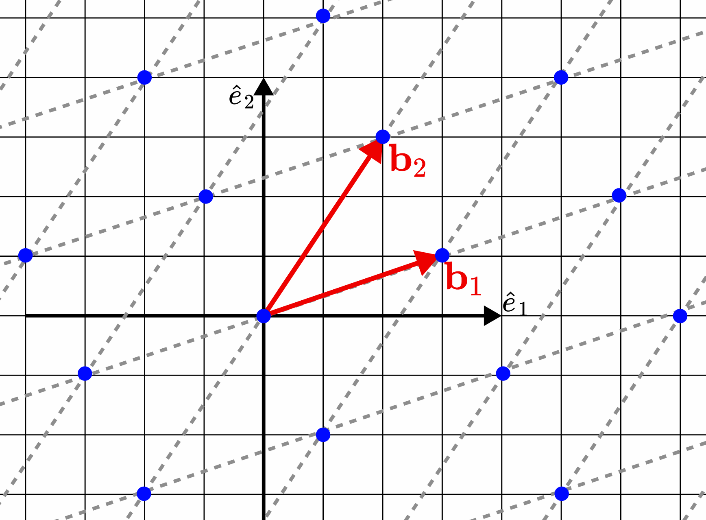
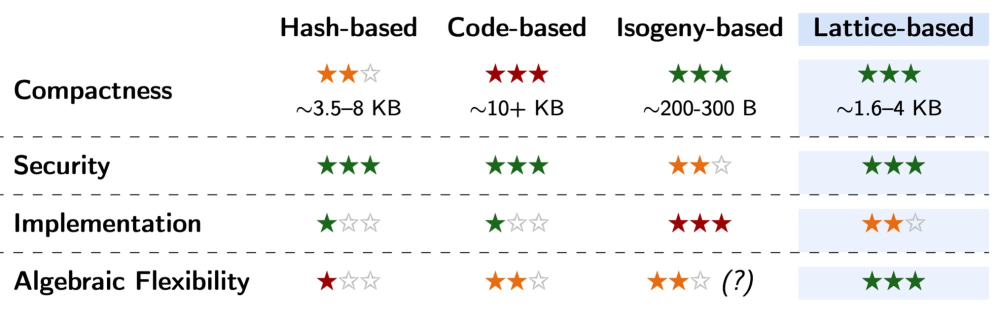

> *作者：Blocksteam Team*
> 
> *来源：<https://blog.blockstream.com/schnorr-but-with-vectors-lattice-based-signatures-explained/>*


*<strong>提醒</strong>。本文为我们的深度研究文章和课程的配套性介绍。想知道全面的技术解释，请阅读[我们的研究报告](https://hackmd.io/@ZamDimon/rk3uMfpjbx?ref=blog.blockstream.com)、观看我们的[课程](https://www.youtube.com/watch?v=AMepMAqwY-M&ref=blog.blockstream.com)。*

由于论述量子计算的 [Google 量子 AI 论文](https://quantumai.google/static/site-assets/downloads/cryptocurrency-whitepaper.pdf?ref=blog.blockstream.com)出版，围绕关于 *有密码学意义的量子计算机*（CRQC）的问世时间的讨论也日益集中。虽然对问世时间的预测多种多样，密码学社区中的共识是清楚的：我们现在就要开始准备和调查量子安全的密码学算法。

首要任务是选择一种量子安全的电子签名方案，以取代我们今日在比特币上使用的量子脆弱的椭圆曲线密码学。但是，想要超越 Schnorr 和 ECDSA，并不只是切换成另一种算法那么简单。比特币社区当前关注的是两个主要的问题：*如何* 安全地执行迁移；以及，我们要迁移到 *哪一种* 后量子（PQ）方案。本文只关注后面这个问题，希望找出最有前景的一种后量子签名家族。

以下是我们对当前的后量子领域的观察。这些观察也回答了为什么 Blockstream 集中研究 “基于格的（lattice-based）” 密码学，以及这些签名方案是怎么工作的。

## 后量子时代

关于后量子签名，密码学家们通常关注四种（据说）量子计算机难以打破的困难性假设。

**1. 基于哈希函数的密码学**。这类方案的安全性依赖于无法逆推哈希函数的假设。在我们今日使用的所有密码学原语中，这些假设被认为是最稳定的。

此外，带状态的方案（例如 [SHRINCS](https://blog.blockstream.com/shrincs-324-byte-stateful-post-quantum-signatures-with-static-backups/)）实现了非常紧凑的签名，只有 324 字节；但这种紧凑型的代价是细致的状态管理。相反，避免这种状态管理负担的结果是一种最终签名提及相对较大的无状态签名。不论是哪一种，它们都受困于代数不灵活性：也就是说，开发例如高效的多签名和门限签名这样的变种，目前看起来是不可能的。

Blockstream 已经形成了一份对此种密码学的集中研究，见《[*为比特币研究基于哈希函数的签名方案*](https://eprint.iacr.org/2025/2203.pdf?ref=blog.blockstream.com) 》（作者是 Mikhail Kudinov 和 Jonas Nick）以及  《[*SHRIMPS*](https://delvingbitcoin.org/t/shrimps-2-5-kb-post-quantum-signatures-across-multiple-stateful-devices/2355?ref=blog.blockstream.com) 》（作者是 Jonas Nick）。现在，我门转向考虑基于格的方法，它能解决前面提到的一些问题。

**2. 基于格的密码学**。此类方案的安全性与叫做 “*格*（lattice）” 的数学对象的特定问题有关。这类对象从 18 世纪开始就得到了数学家的研究。你可以把一个 格 想象成一个由无数点构成的点阵，就像下图所示。正如你把椭圆曲线上的两个点 “相加” 就能产生（同一椭圆曲线上的）第三个点，你也可以把这个点阵上的两个点相加，得出同一格上的另一个有效点。



那么，你可以提出一些关于这个格的问题，比如说：在这个点阵上，最短的两点间距离是多少？或者，如果你在平面上随机选出一个点，那么离这个点最近的格点是哪一个？对于恰当设定的格，量子计算机 —— 在不知道这个格的几何学底层细节时 —— 被认为难以回答所有这些问题。

相比基于哈希函数的方案和体积更小的无状态签名， 格的主要特性就是代数灵活性（algebraic flexibility）。 我们会在下一个章节中更具体解释这一点。

**3. 基于编码的密码学**。“纠错码（error-correcting codes，ECC）” 是这个领域的另一种被广泛使用的数学工具。比如说，你可能已经听过它，因为它在后量子证明系统比如 ZK-STARKs 中有自己的所有。不过，当前的基于 ECC 假设的签名方案都是不实用的（相比基于哈希函数的和基于格的竞争对手），因为最终的公钥和签名的体积太大。一般来说，这些对象的体积会轻松超过 10 KB；NIST 候选方案 [LESS](https://csrc.nist.gov/csrc/media/Projects/pqc-dig-sig/documents/round-2/spec-files/less-spec-round2-web.pdf?ref=blog.blockstream.com) 就是这种情况。

**4. 基于同源的密码学**。这类密码学可以产生比前述候选方案都要更小的公钥和签名。比如说，[SQISign](https://sqisign.org/?ref=blog.blockstream.com) 的公钥和签名总计大小为 213 字节（做个对比，Schnorr 签名方案是 96 字节），令人印象深刻。只是，其背后的数学依赖于非常新的代数几何学（algebraic geometry）概念。在密码学里面，复杂性常常是安全性的敌人，因为这些繁琐的集合结构可能遮掩了微小的漏洞。在我们集合集成这类方案到比特币之前，这些方案还需要大量时间来做压力测试。

如你所见，上述四种范式都有自身的取舍：签名体积、安全性稳健性，以及灵活性，可以综合成下图



总结一下，（现在的）基于编码的签名，对于比特币的严格的区块空间约束来说太庞大了。基于同源的数学是紧凑的，但是非常难以安全地实现，而且依然有诸多争议。基于哈希函数的签名是非常安全的，也得到了充分的理解，但它们在代数上是 “死板的”。

从比特币的久远未来着眼，**基于格的密码学**成为了可以说最均衡、最有前景的的候选之一。

## 为什么要格签名？代数灵活性

为了理解为什么格密码学对比特币有吸引力，我们需要看看让现在的比特币签名方案（Schnorr 和 ECDSA）非常高效的因素。

当前，比特币上的签名方案的安全性依赖于 “离散对数（Discrete Logarithm，DL）”难题。DL 方法的一个重要好处在于，它有一个非常好的数学结构。比如说，你要结合两个私钥，它们的公钥的结合也是可以预测的：

```
[x + y].G = [x].G + [y].G
```

这种几何上的 *同态* 属性，正是比特币开发者们得以开发出多签名（比如 [MuSig2](https://eprint.iacr.org/2020/1261?ref=blog.blockstream.com)，来自 onas Nick、Tim Ruffing 和 Yannick Seurin）、门限签名、层级式确定性派生以及 “适配器签名” 这些高级协议的原因。

*哈希函数*（比如 SHA256 和 BLAKE）则正好相反， 它们就像随机搅拌器一样。如果你有一个哈希函数 *H*，把两个输入加在一起，不会得出它们的哈希函数输出之间的任何关系：`H(x+y)` 不会等于 `H(x)+H(y)`。虽然缺少这种结构正是让哈希函数具备安全性的原因，它也使得我们极难在上面开发高级协议。

不过，格，还给了我们这样的数学结构。格密码学不是在某条椭圆曲线上用标量去乘以某个点，而是将数字的网格（矩阵）与一列数字（向量）相乘。如果你有一个公开的矩阵 **A** 和两个秘密值 **x** 和 **y**，那么 `A(x+y) = Ax + Ay`（就像离散对数背景下的 `(x+y)G=xG+yG` 一样）。

这里有一个重要的提醒：在格密码中，我们通常使用 *短* 的秘密值。在我们结合格等式时（比如，计算 `x+y`），“聚合后的”秘密值的长度会增加。但只要我们妥善控制这些误差的大小，上述结构化特性就依然成立。这意味着，格有望实现高级的协议改进，比如后量子多签名、零知识证据以及机密资产。

## 格签名如何工作：带有向量的 Schnorr

只要你能理解比特币上的 Schnorr 签名，你就 50% 理解了一部分格签名，比如 [*Dilithium*](https://eprint.iacr.org/2017/633.pdf?ref=blog.blockstream.com) 。这种最主流的格签名设计使用了一种技术，我们戏称为 “带有向量的 Schnorr 方案”。

在传统的 Schnorr 签名中，使用私钥 `x` 的签名流程是这样的：

1. 选出一个随机数 `r`
2. 为该数字创建一个 “承诺”
3. 哈希这个承诺和待签名数据，得出一个随机挑战值 `e`
4. 使用这个挑战值来遮掩你的私钥，产生最终的响应值 `z = r + xe`

在基于格的签名方案中，我们运行一摸一样的步骤，只是使用矩阵和向量。等式看起来是相似的：比如说，许多对格签名的早期研究都使用等式 `z = r + Se`，其中 `S` 是一个秘密矩阵，`e` 是挑战向量，而 `r` 是一个随机向量。

### 拒绝采样\*

这里有一个很大的安全性问题。为了让格等式对量子计算机来说难以求解，向量 `z` 和 `r` 中的数字都必须较小（这就是所谓的 “*短整数解* ” 难题）。

但是，在我们计算 `z = r + Se` 时，它在签名 `z` 和背后的秘密值 `S` 之间创造了一种统计依赖性（a statistical dependence）（在 Schnorr 签名上不是这样，因为 `r` 和 `e` 可以是任意的）。如果一个攻击者能够收集到足够多你的签名，TA 将注意到其中的统计学偏移，从而也许能揭晓你的私钥。


为了解决这个问题，格密码学使用了一种聪明的技巧，叫做 “**带抛弃的 Fiat-Shamir 变换**”（也叫 “拒绝采样（rejection sampling）”。

这个想法非常简单：在签名人生成签名 `z` 之后，他们先检查加上私钥后是否使这个值发生重大偏移。如果这个签名看起来 “有偏倚（biased）”、有可能泄露私钥（如上图所示），他们就丢弃这个签名、用一个新的随机数再次尝试（生成签名）。这个过程会重复多次，直到最终的签名能够完美遮掩这个私钥（如上图的虚线所示）。

**提醒**。在实践中，中间的 **Se** 自身就是一种随机分布。不过，在原理上没有什么区别：分布的偏移会泄露关于背后的秘密值 **S** 的一些信息，所以我们必须消除偏移（这也是因为，可以证明很简单就能做到这一点）。

## 下一步

基于格的密码学是深奥话题，也是后量子密码学中的有前景的方向，远远不止是替代当前的数字签名方案。它提供了数学基础，让我们可以确保比特币的量子安全性，同时有望升级到更为高效的聚合方案和门限方案。

想要更深入的解释，包括 “离散高斯函数” 背后的数学、最短向量问题、拒绝采样，请阅读我们的[研究报告完整版](https://hackmd.io/@ZamDimon/rk3uMfpjbx?ref=blog.blockstream.com)，并观看完整的[视频演示](https://www.youtube.com/watch?v=AMepMAqwY-M)。

（完）