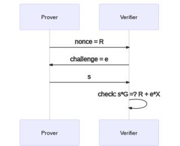

> *作者：Nadav Kohen*
>
> *来源：<https://suredbits.com/schnorr-security-part-1-schnorr-id-protocol/>*
>
> *[前篇中文译本](https://www.btcstudy.org/2021/11/20/introduction-to-schnorr-signatures-by-suredbits/)*

在我们 Schnorr 签名系列的[上一篇文章](https://suredbits.com/introduction-to-schnorr-signatures/)中，我们介绍了 Schnorr 签名的定义，并尝试通过按步骤探究其设计选择、最终推导出其定义，帮助大家建立对 Schnorr 签名工作原理的直观理解。在本文中，我们会走得更深一些，通过从另一个角度推导 Schnorr 签名来论证其安全性。

<strong>Schnorr 签名系列</strong>

<a href="https://suredbits.com/introduction-to-schnorr-signatures/">What are Schnorr Signatures – Introduction</a> 
<a href="https://suredbits.com/schnorr-security-part-1-schnorr-id-protocol/">Schnorr Signature Security: Part 1 – Schnorr ID Protocol</a> 
<a href="https://suredbits.com/schnorr-security-part-2-from-id-to-signature/">Schnorr Signature Security: Part 2 – From IDs to Signatures</a> 
<a href="https://suredbits.com/schnorr-applications-musig/">Schnorr Multi-Signatures – MuSig</a> 
<a href="https://suredbits.com/schnorr-applications-scriptless-scripts/">Scriptless Scripts – Adaptor Signatures</a> 
<a href="https://suredbits.com/schnorr-applications-batch-verification/">Batch Verification</a> 
<a href="https://suredbits.com/schnorr-applications-threshold-signatures/">Schnorr Threshold Sigantures</a> 
<a href="https://suredbits.com/schnorr-applications-frost/">Flexible Round-Optimized Schnorr Threshold – FROST</a> 
<a href="https://suredbits.com/schnorr-applications-blind-signatures/">Schnorr Blind Signatures</a> 
<a href="https://suredbits.com/the-taproot-upgrade/">Taproot Upgrade – Activating Schnorr</a>

本篇和下一篇博客给出的论证并不是一个完整的或者说非常严格的论证。相反，我的目标是介绍完整的安全性证明中包含的大部分观念，让不那么懂技术的读者更直观地感受 Schnorr 签名的安全；并为有兴趣并且有毅力的读者研读严格的证明打一些基础。也就是说，我希望这里的 Schnorr 安全性论证能说服信任我的读者，即使我跳过一些底层的细节并主张它们会运作良好。读完这篇博客和下一篇博客（还有前一篇），你应该能更深入地理解 Schnorr 签名时什么、它们如何工作，为什么它们是安全的。

有了这些理解，本系列博客的剩余篇章会关注 Schnorr 签名的多种调整版本，它们会为比特币和其它项目开启不计其数的使用场景。不过，也要说一句，不是非得理解 Schnorr 的安全性，才能探究后面这些场景。

在你开始阅读之前，建议你先熟悉[上一篇博客](https://suredbits.com/introduction-to-schnorr-signatures/)的内容，因为本文非常依赖上一篇文章揭示的属性。我同样建议你先熟悉上一篇文章提到的前置主题（[模运算](https://www.khanacademy.org/computing/computer-science/cryptography/modarithmetic/a/what-is-modular-arithmetic)、[哈希函数](https://nakamoto.com/hash-functions/)、[公钥和椭圆曲线](https://hackernoon.com/what-is-the-math-behind-elliptic-curve-cryptography-f61b25253da3)）。

最后一个提醒，我完全能够预料，读者若要让这些论证烂熟于胸，需要反复阅读这篇文章：涉及到具体的论证时，这是正常情形；在撰写本文的准备过程中，我阅读和重读了许多安全论证，不知多少遍！

## Schnorr 身份认证协议

就像上一篇文章一样，我们假设，在我们生活的世界里，椭圆曲线上的离散对数问题（Discrete Log Problem）是难解的，即，假定 x 是一个很大的数，而 G 是椭圆曲线上的一个点，那么由 x*G 的值很难反推出 x；因此，我们使用 `x * G=X` 作为一个公钥，对应于私钥 x。这一次，我们不会尝试直接构造一个数字签名方案，我们先卖出一个更小、更自然的一步：使用公钥作为身份证明。不管怎么说，只要从公钥中很难复原出私钥，那就总会有某种办法，可以使用私钥来作为一种形式的口令 ——— 只有知道这个私钥的人，才能使用这个身份。

也像上次一样，我们先来思考一个身份证明协议需要什么样的特性。直觉上来说，我们希望一套身份证明协议是一场证明方和挑战方之间的对话 —— 证明方希望证明自己的身份（即它们拥有某个私钥），而挑战方就像代价日常使用的网站一样，要求你输出口令来证明你的身份。但这里的一个关键区别是，我们不希望挑战者能够知道你的私钥，不然他们就能冒充你的身份，乃至盗走你的比特币！我们经常信任网站不会冒用我们的口令，但我们不想把私钥交给任何人！

更正式地说，一套身份证明协议就是一个验证者（即挑战者）和一个证明者（想证明自己身份的一方）之间的对话，其特性是：

1. 如果证明者真的知道那个他们想证明自己拥有的私钥，那么验证者应该能够被硕鼠 —— 协议的这种属性叫做 “完整性”
2. 如果证明者并不知道他们想证明自己拥有的私钥（即证明者想冒充他人），那么验证者应该能发现这种欺诈 —— 这种属性叫做 “可靠性”
3. 如果验证者完全按照协议说的做，并成功被说服了，他们不会从中增进对证明者所证明的私钥的任何了解 —— 这种属性叫做 “诚实验证者零知识性”（HVZK）（它是真正的零知识属性，也就是我们在讨论 零知识证明/ZKP 时候所指的那种属性，的一个更弱的版本）

你可能会想到，为了让这套协议既能说服验证者，又能保证（诚实的）验证者不会从中获得任何信息，参与的双方要各自生成一个随机数：证明者的随机数用来向验证者隐藏自己的私钥；验证者的随机数则用作某种形式的讨战，因为我们不想让证明者控制整个过程，换句话说挑战者的挑战要能破坏冒充者的尝试。我们把证明者的随机数设为 k 而验证者的随机数设为 e。

就像在上一篇博客里我们推理的那样，我们希望结合证明者的私钥 x 和验证者挑战值，然后我们想用证明者的随机数来隐藏这个值（否则它会泄露私钥）。我们试错了一番，最终找出了下面的结合方法：`s = k + e * x`，它先结合了挑战值 e 和证明者的私钥 x，又加入随机值 k，把这个值隐藏了起来。

同样地，就像我们的上一篇博客一样，给定 R 和 s，验证者可以用下列等式来检查：

$$s * G =? R + e * X$$

这个 s 是验证者和证明者之间沟通的关键，但在证明者说出这个值之前，双方必需先交换他们的随机数。那谁先来呢？似乎是挑战者在后给出随机数合理一点，不然的话，证明者先知道了这个挑战值，就可以使用一个并非随机的值来绕过挑战。因此，我们的身份协议将遵循以下流程：

1. 证明者生成一个随机数 k，并发送 `R = k * G` 给验证者
2. 验证者生成一个随机数 e，并发送给证明者
3. 证明者使用私钥 x 计算出 s 并发送给验证者
4. 验证者检查 `s * G =? R + e * X`，若成立就接受；若不成立就拒绝

我们现在可能在直觉上认为，这个过程，也就是 “Schnorr 身份协议”，给出了（零知识地）证明私钥所有权的有效方法，但了获得更深入的理解，我们依次考虑上面说的三种属性。

## Schnorr 身份证明协议的安全性和正确性

### **完整性**

这个 ID 协议最容易验证的属性就是完整性。如果验证者是诚实的（真的知道那个私钥），那么 TA 可以生成一个随机数 k 并收到一个随机数 e，TA 将总是能够计算出验证者会接受的 s。也即 `s = k + e * x` 总是能够通过验证者的检查。换句话说，根据我们建构这个协议的方法，显然诚实的验证者总是能说服验证者自己拥有这个身份。

### **可靠性**

但如果 证明者不诚实/出现了冒充者，怎么办？我们的 ID 协议可靠吗？ 为了证明可靠性（以及对付冒充者的安全性），我们这里要使用离散对数（DLOG）问题的 “困难性” 来论证冒充者也很难成功。复习一下，DLOG 问题就是从一个公钥计算出其私钥，也即给定椭圆曲线上的一个点 `X = x * G`，计算出 x。我们会主张，这两个问题之间的联系就是密码学家一直在用的 “化约法”。只要解决 B 的算法能够转化成解决 A 的程序，问题 A 就可以化约成问题 B；这也证明了问题 A 不会比 B 更难解。如果我们能成功化约，那就意味着只要 A 是安全的，B 就是安全的，因为如果 B 有漏洞，A 必定也有漏洞。具体来说，我们希望建构从 DLOG 问题到 Schnorr ID 协议的化约关系，方法是将冒充行为（对 Schnorr ID 协议的攻击）转化为对 DLOG 问题的攻击。

假设有某个黑盒子（你不知道里面到底是什么），可以在一个 Schnorr ID 沟通过程中以一定的概率 p 成功冒充给定的公钥 X。这就意味着这个黑盒子可以吐出某个值 R，接受某个挑战值 e，然后吐出能以 p 的概率被接受的 s。

我们想用这个黑盒子来解决 DLOG 问题，也就是说，我们想证明它解出私钥 x 的概率是不可忽视（non-negligible）的（如果其概率是不可忽视的，那这个协议就是不安全的）。如果我们能成功，那就意味着 Schnorr ID 协议是有漏洞的，我们的公钥也是；但我们知道这不可能成功（至少可以强烈相信这一点），所以我们也可以相信，Schnorr ID 可以对付冒充者。

所以，我们如何使用这个黑盒子来计算私钥 x 呢？回想上一篇文章的 “Nonce 不可以重用” 一节。我们发现，给定两个正确的 s 值，我们就能计算出私钥 x！所以，你可以认为我们的黑盒子试图冒充自己拥有公钥 X，并在 Schnorr ID 交互中给出一个值 R。我们已知无论给出什么挑战值 e，它都能以 p 的概率成功通过检查。所以，考虑向黑盒子提供两个不同的挑战值，e1 和 e2，这个黑盒子为这两个数值创建有效 s 的概率分别为 p，那么，直觉上来说，这个黑盒子能够同时通过这两个挑战的概率是 p2（我跳过了一些细节和统计学论证，但这个可以容易证明是对的）。但是，如果这个黑盒子能够成功冒充 X、使用同一个 R 在两次不同的挑战中生成有效的 s，那它必定能够从这两个 s 值中计算出私钥！换句话说，如果这样的能够打破 Schnorr ID 协议的黑盒子真的存在的，而且成功概率不低，那我们就能把它转化成一个可以从它所冒充的公钥中计算出私钥的程序。因此，我们可以把任何对 Schnorr ID 协议的冒充攻击都化约成对 DLOG 问题的攻击！

### **诚实验证者零知识**

现在，我们已经知道这个协议是完整而且可靠的了（在 DLOG 假设之下），最后一个需要论证的属性是 HVZK。复习一下，我们说过，这意味着一个遵守协议的验证者 “无法增进对证明者尝试证明自己拥有的私钥的任何了解”。但这个表述非常模糊，一个人怎样才能证明自己拥有这样的东西呢？我们首先必需提出一个更正式的定义来捕捉这个观念。

在密码学中，我们经常使用 “模拟器（Simulator）” 的概念来捕捉这个 “泄露知识” 的情形。本质上，如果一方可以自己模拟参与沟通的另一方，我们就说 TA 在这场沟通中 “没有学到任何东西（增加知识）”。为了更具体一些，我们就以 Schnorr 身份证明协议为例。在这个语境下，一次沟通有三个值 (R, e, s)，只要验证者（只知道 X 而非 x）能够 生成/模拟 这些沟通数值，使之与真正的沟通数值无从分别，那我们就说这个协议是 HVZK 的。

回想上一篇文章的 “直观来看，Schnorr 签名如何工作？” 一节的末尾，我们发现，如果被承诺的消息（在我们现在的场景中就是 e）完全独立于其它东西，那么，“我们就可以生成任意的 s 值并以此计算 R 值（用到的完全是公开的信息），最终生成有效的 (R, s) 。”具体来说，一个尝试模拟证明者的验证者可以随机选择一个 s 和一个 e 然后计算 

$$R = s * G – e * X$$

由此得到的 (R, e, s) 也是一个有效的沟通。注意，这不是说任何人都可以运行这个模拟程序来冒充一个公钥，因为我们所生成的摹本是 *不按顺序* 地确定这三个元素才能计算出来的。这使我们能创建看起来很真的摹本，但并不能用来帮助冒充者，因为在实际的协议执行中，R 只能是最先给出的，不能最后算出来。

但只证明了我们能模拟任何对话还不够，我们还想证明，我们的模拟与真正与证明者发生一场对话是无从分别的。要看出我们这里生成的对话摹本与真实对话是无从分别的，我们可以假设一个有效的对话 (R, e, s) ，然后考虑每一种方法生成相应摹本的概率（一种方法是实际与证明者交谈，另一种方法是模拟）。

如果我们与真实的证明者交谈（而且我们是 *诚实的* 验证者），他们选择的 R 就是随机的，我们的 e 也是（因为我们都 *诚实地* 遵守协议），而且 s 将是一个确定的值。所以我们获得这个摹本的概率等同于我们随机选出两个正确数值的概率（即对话中选出的 R 和 e 恰好等于我们的摹本的数值）。相反，如果我们通过随机选择 e 和 s 然后计算有效 R 的方法来模拟，我们最终得到的生成这个摹本的概率也是相同的，也等于刚好选出这两个数值的概率。

因此，我们知道了，一个诚实的验证者可以模拟出一个证明者，或者说生成出一个摹本，使之与真实对话无从分别。这意味着，验证者与真实证明者的交互，没有向 *诚实的* 验证者暴露任何新信息，因为验证者可以从对话摹本中学到的任何信息，都可以从自己计算的假摹本中获得，而无需证明者真的存在！（译者注：换言之，有证明者存在的真对话，跟验证者自己模拟的假对话，对验证者来说也无从分别，所以证明者的参与没有暴露任何新信息。）

在这篇文章中，我们研究了 Schnorr 身份证明协议，并证明了它是完整、可靠而且诚实验证者零知识的。在下一篇博客中，我们会将这套身份证明协议转化为一套签名协议，并使用我们在这里证明的安全属性来证明 Schnorr 签名是安全的！

（完）

> *[后篇中文译本](https://www.btcstudy.org/2021/11/24/schnorr-security-part-2-from-id-to-signature/)*