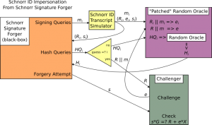

> *作者：Nadav Kohen*
>
> *来源：<https://suredbits.com/schnorr-security-part-2-from-id-to-signature/>*
>
> *[前篇中文译本](https://www.btcstudy.org/2021/11/22/schnorr-security-part-1-schnorr-id-protocol/)*

在我的[上一篇博客](https://suredbits.com/schnorr-security-part-1-schnorr-id-protocol/)中，我们为论证 Schnorr 签名的安全性打了基础。我们发现了 Schnorr 身份证明协议并证明了它是安全而且形式上正确的（具体而言，就是完整、可靠、诚实验证者零知识）。你要是没看[上一篇博客](https://suredbits.com/schnorr-security-part-1-schnorr-id-protocol/)，这篇很有可能看起来会云里雾里。所以先去看看呗。

在本文中，我们会将身份证明方案转化为一套签名方案，并论证我们的转换的结果会是一个正确的签名协议，从而完成对 Schnorr 签名安全性的论证。

完成论证之后，Schnorr 签名系列的剩余部分，我们会探究 Schnorr 签名的多种调整方案，它们能用来为比特币开发许多很酷的协议和应用场景！

<strong>Schnorr 签名系列</strong>

<a hef="https://suredbits.com/introduction-to-schnorr-signatures/">What are Schnorr Signatures – Introduction</a> 
<a href="https://suredbits.com/schnorr-security-part-1-schnorr-id-protocol/">Schnorr Signature Security: Part 1 – Schnorr ID Protocol</a> 
<a href="https://suredbits.com/schnorr-security-part-2-from-id-to-signature/">Schnorr Signature Security: Part 2 – From IDs to Signatures</a> 
<a href="https://suredbits.com/schnorr-applications-musig/">Schnorr Multi-Signatures – MuSig</a> 
<a href="https://suredbits.com/schnorr-applications-scriptless-scripts/">Scriptless Scripts – Adaptor Signatures</a> 
<a href="https://suredbits.com/schnorr-applications-batch-verification/">Batch Verification</a> 
<a href="https://suredbits.com/schnorr-applications-threshold-signatures/">Schnorr Threshold Sigantures</a> 
<a href="https://suredbits.com/schnorr-applications-frost/">Flexible Round-Optimized Schnorr Threshold – FROST</a> 
<a href="https://suredbits.com/schnorr-applications-blind-signatures/">Schnorr Blind Signatures</a> 
<a href="https://suredbits.com/the-taproot-upgrade/">Taproot Upgrade – Activating Schnorr</a>

## 从 Schnorr 身份证明到 Schnorr 签名

上一篇博客应该已经说服了你，Schnorr 身份证明协议是一个有效且安全的身份证明协议，因为它是完整的、安全的（在离散对数难题假设下），并且是诚实验证者零知识的。所以，在这个我们假想的世界里，不仅椭圆曲线上的离散对数问题被发现是难解的，我们还发现了利用这个事实来使用公钥、标记个人身份的方法。但现在，我们希望再迈出一步，创建一种数字签名方案。我们的身份证明协议看起来已经很接近于一套签名协议了，所以我们决定尝试将它调整一下、转变成一套签名方案。

在身份证明协议和签名协议之间，有两个关键区别，也正是我们要修改的地方：

1. 签名协议是非交互式的（non-interactive），但身份证明协议是一场当下进行的沟通。
2. 身份证明协议只需让证明者能证明自己知道一个私钥，但签名还需承诺一条被签名的消息。

为了处理第一种区别（将 Schnorr ID 协议这样的交互式协议转化为非交互式的协议），一种常见的修改方法是以哈希函数来替换挑战者。具体来说，如果在一个交互式协议中，验证者/挑战者 在接受和拒绝（证明）以外的唯一角色，就是提供随机挑战值的话，我们就可以用哈希函数的输出来替代挑战值（因为哈希函数被假设是一种理想的函数）。但是，这些哈希函数要以什么数据作为输入呢？我们使用现有的语境（context）作为哈希函数的输入，也就是拿我们迄今为止讲过的所有东西都作为输入、使用哈希函数来产生挑战值，从而解除对挑战者的需要。这种修改被称为 “Fiat-Shamir 变换”。现在，我们有了一种非交互式的身份协议：

1. 证明者生成一个随机数 k，然后以 `R = k * G` 作为语境
2. 证明者计算 `H(R)`，也即语境的哈希值，以此作为随机挑战值 e
3. 证明者使用私钥 k 和 e 计算出 s，并公开 (R, s) 作为身份证明
4. 任何验证者都可以通过检查 `s * G =? R + H(R)*X ` 来决定接受或拒绝证明 

我们剩下要做的事情是让这l个非交互的协议也承诺一条消息。我们只需为语境加入那条被签名的消息，就可以了！结果就是一个签名协议：证明者生成随机数 k、计算 H(R, m) 作为挑战值、计算 `s = k + H(R, m) * x` 并发布 (R, s) 作为签名。验证者可以通过检查 `s * G = R + H(R, m) * X` 是否成立来校验签名。是不是看起来有点眼熟？这就是 Schnorr 签名方案！

最后要注意的一点是，一般来说（就像 [BIP 340](https://github.com/bitcoin/bips/blob/master/bip-0340.mediawiki#Default_Signing) 定义的那样），签名者的公钥 X 也要放到语境中参与哈希计算。想知道为什么这对比特币来说很重要，请阅读 [BIP 340](https://github.com/bitcoin/bips/blob/master/bip-0340.mediawiki#design) 的 “Key prefixing（以公钥为前缀）” 部分。

## Schnorr 签名的安全性

所以，很容易地，我们现在有了理解 Schnorr 签名的另一种方式：它是一种身份证明协议的修改版。但是，这种角度会有助于我们证明它的安全性吗？当然啦，我们现在不仅有了另一种直观理解 Schnorr 签名的角度，我们还知道了它跟一种我们已经证明其安全性的协议有明确的关联！所以，现在我们要做的就是，论证因为 Schnorr 签名与（安全的）Schnorr ID 协议有这层关系，所以 Schnorr 签名也必然是安全的。

但首先，说一种签名方案是安全的，到底是什么意思呢？第一种我们能自然联想到的属性仍然是 “完整性”，即，如果一个签名者真的知道一个私钥 x，那么 TA 的签名应该能让任何验证者信服。而 Fiat-Shamir 变换并不会影响这种属性，因为能够正确参与 ID 协议的人总能够生成有效的签名。

第二种我们想要的属性还是 “可靠性”，即，不知道 x 但想冒充的人无法生成有效的签名。在讨论数字签名时，可靠性也常常被称为 “不可伪造性”。这个属性也没有受到 Fiat-Sharmir 变换的影响，因为我们的论证是把 ID 协议的可靠性化约为离散对数问题，对签名来说也是一样的（在哈希函数有效的情况下）。

但我们实际上想要的是一个比普通的 “不可伪造性” 更强的属性，我们想要的是：*即使伪造者知道目标私钥的任意个之前生成的签名*，也无法伪造签名。这种属性通常被称为 “EUF-CMA”，就是 “选择明文攻击下的存在性抗伪造性”（Existential UnForgeability under a Chosen Message Attack）。

我们要通过将对 Schnorr 签名的攻击化约成对 Schnorr ID 协议的攻击（我们已经知道了如何将对 Schnorr ID 协议的攻击化约成对离散对数问题的攻击），从而证明 Schnorr 签名满足 EUF-CMA 属性。

这次我们使用的黑盒子是一个 EUF-CMA 伪造者，它会请求许多签名作为输入，然后以一定概率 p 输出一个有效的的伪造签名。我们准备使用这个黑盒子来实现对 Schnorr ID 协议的冒充攻击（我们已经知道，能够实现冒充这种攻击的，都能攻击离散对数问题）。

我们假设所用的哈希函数是一个随机数断言机（Random Oracle）（详见 “[随机数断言机模型](https://en.wikipedia.org/wiki/Random_oracle)”），它也是个黑盒子，获得一个输入之后就产生一个输出。我们的假设是，给它同样的输入，它会得出同样的输出；不论给它什么样的输入，其输出都是随机的。换句话说，这个黑盒子就是一个函数，可以凭输入给出输出，但输入和输出之间没有任何联系（它所包含的只是一些随机的箭头，从输入指向一个看起来杂乱无章的输出）。

这其实是对哈希函数应该如何工作的一种合理联想，因为它包含了我们对密码学安全哈希函数的所有预期。不过，随机数断言机模型的用法，可能并不是大家直觉的那样。所有哈希计算都会被替换为对一个随机数断言机的查询请求，而返回的值也并不需要是真正随机的，只要对发起查询请求的人来说是随机的就行。举个例子，如果有两方 Alice 和 Bob 参与一个协议，Bob 生成了一个随机值 r，那我们可以用 r 来响应 Alice 的随机数断言机查询请求。说它反直觉，是因为它完全不同于哈希函数的工作情形，但当我们使用随机数断言机模型来论证时，我们不是在使用一种真实的哈希函数，我们是在设想一种可以吐出随机数的奇幻断言机。换句话来说，使用随机数断言机模型的安全证明，更多只是对被证明的事物安全性的启发式联想，而非严格的数学证明。

因此，要证明 Schnorr 签名的安全性，我们的 “给定事实”（也即假设）的列表要包含：哈希函数可以被准确地刻画为一个随机数的断言机；离散对数模型是困难的。但是，这就是证明 Schnorr 签名安全性所需的全部假设了！（像 ECDSA 这样的方案还需要其它假设）。比特币已经在使用这两个 “给定事实” 了（当然还有其它假定），所以看起来 是完全可以接受的。这就是我们要用来证明 Schnorr 签名安全性的模型。

啰嗦完这些，就到了我们期待已久的时刻啦，证明 Schnorr 签名是安全的！我们先过一遍大体的流程，然后再填充一些细节。

首先，我们来审视一下这个能够以不可忽视的概率伪造 Schnorr 签名的黑盒子。在它生成伪造签名之前，它可以按自己的想法选择多条消息，为它们请求签名（这是因为我们假设攻击者是可以获得这些信息的）。在请求完签名之后，它开始计算伪造签名，而在此计算期间，它也被允许多次查询随机数断言机（这也是我们模型化哈希函数的方式）。完成所有的签名请求和随机数查询请求之后，它可以生成一个伪造签名，这个伪造签名通过检查的概率为 p。这就是我们假设的黑盒子，而我们想用它来构造一种可以在 Schnorr ID 协议中冒充公钥 X 的机器。

分两步走：首先，我们初始化我们的黑盒子：为它的每一次起始查询模拟签名，并在它每一次查询随机数断言机时提供随机数。其次，这个黑盒子的其中一次随机数断言机查询将会是计算 H(R, m)，而且我们会把这个 R 发给我们的 Schnorr ID 挑战者，T后者会负责回应一个随机数 e。我们反过来拿这个 e 作为断言机查询 R||m 的结果，最后，我们用这个黑盒子得到了一个有效的伪造值 s，它将能通过 `s * G = R + e * X` 的检验，而这个检验恰好就是当 e = H(R, m) 时 Schnorr 签名和 Schnorr ID 协议所需通过的检验！

当然，这个论证跳过了一些关键细节。我们如何模拟签名，使之能满足这个黑盒子的第一步骤？我们如何确保第二个阶段中所有的随机数断言机查询的响应都满足随机数断言机模型的规则？我们如何知道哪一次随机断言机查询会包含我们的消息和 R 值？要回答这些问题，我们需要形成一个细节更充分的论证。

我们的黑箱子（Schnorr 伪造者）需要为具体的一些消息请求目标私钥的签名，于是我们用 mi 来表示第 i 条消息。我们（尝试使用这个黑箱子来冒充 Schnorr ID 的人）回应以一系列伪造的随机的 Schnorr ID 摹本，我们模拟的第 i 个签名表示为 (Ri, ei, si)，这些摹本的计算方式如上一篇文章所述。我们会使用这些模拟出来的摹本，以及我们查询随机数断言机的能力，来模拟签名。具体来说，我们把未来任何对 Ri||mi 的随机数断言机请求都映射到 ei，然后返回 (Ri, si) 作为对黑盒子签名请求的回应。

这一阶段结束后，黑盒子会转而查询随机数断言机（查询完了之后就是（尝试）伪造签名）。

我们跟踪每一次查询请求并给出回应，确保：如果黑盒子两次请求同一个数的哈希值，我们就返回同一个哈希值；如果它请求 Ri||mi 的哈希值，我们就返回 ei  。现在，我们就可以开始攻击需要我们先出示一个 R 的 Schnorr ID 挑战了。

黑盒子的其中一次随机数断言机查询是请求 R||m 的哈希值（这些查询是为了伪造签名）。我们先提前随机猜测哪一次的查询会包含 R 和 m，而且我们猜测成功的概率是不能忽视的（如果黑盒子要查询随机数断言机 Q 次，我们会有 1/Q 的几率成功）。我们不会给这个查询请求返回一个真正的随机数，相反，我们会先把这个猜测的 R  提交给 Schnorr ID 挑战者；挑战者会返回一个随机数 e，我们再把这个随机数返回给黑箱子，作为它查询 R||m 哈希值的结构。这个回应会被接受，因为 e 是一个随机数，所以黑箱子是没法分辨我们和真正的随机数断言机的区别的。现在，当黑盒子产生了一个伪造的 s 时，这个 s 有 p 的概率能通过检查，所以， s 也有 p' 的概率（一个不可忽视的概率）是对 Schnorr ID 挑战者的有效回应！这个不可忽视的概率小于 1，因为我们要猜测黑盒子对断言机的查询内容（我在这里也跳过了许多细节）。

总而言之，给定一个 Schnorr 签名伪造器黑盒，我们可以使用模拟的 Schnorr ID 摹本来启动它，然后我们可以观测它的伪造签名计算过程（具体来说就是它请求哈希值的过程），然后合理猜测它会在伪造签名计算中使用哪个 R 值和 m 值；最后，我们可以使用这个猜测来启动 Schnorr ID 协议，让挑战者返回一个随机挑战值，我们再把这个随机挑战值当成 R||m 的哈希值告诉黑盒子，使之产生有效的伪签名；然后我们就能拿这个伪签名 s 作为对 Schnorr ID 挑战者的有效回应，成功伪装！因此，如果这样的黑盒子存在（它能以不可忽视的概率伪造 Schnorr 签名），我们可以用上述的程序作为一种化约方法，把它构造成可以攻击 Schnorr ID 协议的黑盒子。反过来，这个黑盒子又能以不可忽视的概率攻击离散对数问题，如上一篇博客所述（为同一个 R 值伪造两个签名，在相当长的一段时间后，将能攻破私钥）。因此，在随机数断言机模型中，如果离散对数签名难解，那么 Schnorr 签名就是 EUF-CMA 的，对比特币也足够安全！

我希望这份啰嗦的论证能让读者相信，Schnorr 签名是安全的，并且你能准确理解这个称述到底意味着什么。如果你有问题，欢迎你来提问：你可以加入我们的 slack 群并在 cryptography 频道中提问，或者你可以问问你身边的数学大神、在聊天室或者推特上提问，你也可以给我或者你知道的其他人写邮件，等等。如果你想找一些进阶阅读材料，深入学习不遗漏任何东西的 Schnorr 安全性证明，我个人推荐两篇我在准备这一系列博客时最常阅读的材料：

- Waxwing 的同主题[博客](https://joinmarket.me/blog/blog/liars-cheats-scammers-and-the-schnorr-signature/)
- [Boneh-Shoup](http://toc.cryptobook.us/) 第 18 和 19 章

我撰写这个系列博客的目标之一是帮助直接阅读技术内容（比如上述两篇材料）有困难的读者打一些基础。另一个目标则是用尽可能简单的术语来呈现 Schnorr 安全性证明，以触达比上述两篇材料的读者更广泛的人群，尽管我也知道，这样的严格论证中有需要复杂之处是没有办法跳过的。

现在我们已经非常熟悉 “盗版” Schnorr 签名了，这个系列博客剩余的部分会回过头来，更随意地看看 Schnorr 签名协议的无数变种，以及它们能如何为整合了 Schnorr 签名的比特币打开许多酷炫的应用！

（完）

> *[后篇中文译本](https://www.btcstudy.org/2021/11/29/schnorr-applications-musig/)*