> *作者： Greg Walker*
> 
> *来源：<https://learnmeabitcoin.com/technical/script>*

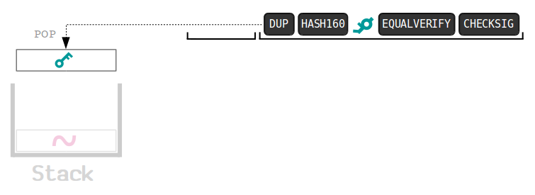

**Script**（大多数时候都被直译为 “脚本”）是比特币所用的一种微型编程语言，用于为比特币交易的[输出](https://learnmeabitcoin.com/technical/output)提供一种 *锁定* 机制。

- 每个输出都带有一个[锁定脚本](https://learnmeabitcoin.com/technical/scriptPubKey)。
- 为了解锁一个输出（即将它用作一笔交易的[输入](https://learnmeabitcoin.com/technical/input)时），必须提供一个**解锁脚本**。

如果完整的脚本（解锁脚本 + 锁定脚本）是有效的，相应的输出就会 “被解锁”，可以花费了。

## 什么是 Script 语言？

Script 是一种非常基础的编程语言。它由两种类型的对象组成：

- **数据（Data）** —— 例如：*公钥* 和 *签名*；
-  ` 操作码（OPCODE） `  —— *操作* 数据的简单函数。

这里是比特币的一个标准的 P2PKH（支付到公钥哈希值）脚本的简单图示：

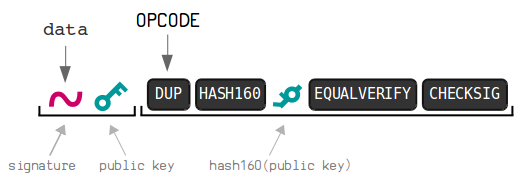

>  提示：这里有一份[操作码的完整清单](https://en.bitcoin.it/wiki/Script#Opcodes)。

## 如何运行 Script 语言？

> **整个脚本从左到右运行。在运行时，它使用一种叫做 “堆栈” 的数据结构。**

1. **数据**总会被 *推入* **栈中**。

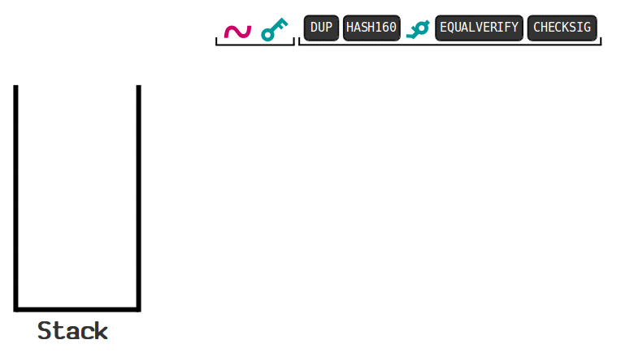

2.  ` OPCODE ` 可以把栈中的元素 *弹出* 并做一些操作；操作完后，有时候会把新的元素 “推入” **栈中**。

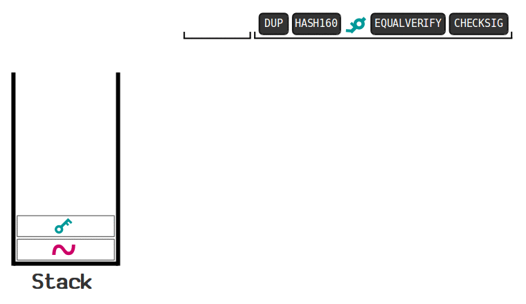

- ` DUP ` 操作码会复制栈顶的元素  -

## 什么样的脚本是有效的？

**栈顶的元素是  ` 1 ` （或者更大的数值）且栈中只余一个元素**则表明这是一个有效的脚本。

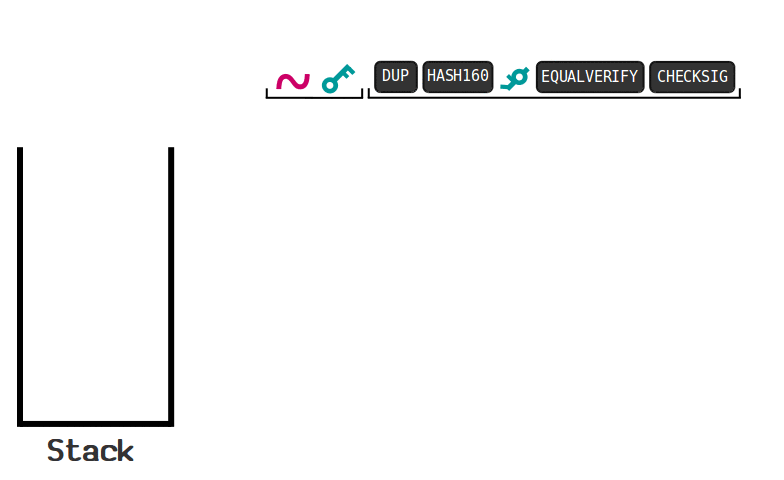

> 出现下面四种情况则说明一段脚本是无效的：
>
> 1. 最终的堆栈中**空无一物**。
> 2. 栈顶的元素是 ` 0 ` 。
> 3. 在执行结束后，**栈中剩余超过 1 个元素** <a href="#note1" id="jump-1">1</a>。
> 4. 脚本**过早退出**（例如[纯数据](https://learnmeabitcoin.com/technical/nulldata)脚本中的  ` OP_RETURN ` )。

## 在哪里可以找到脚本？

交易的每一个**输出**中都放置了一个**锁定脚本**：

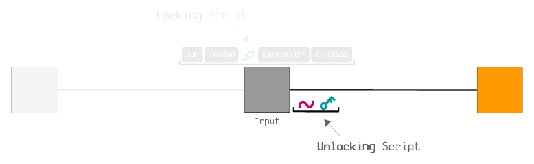

而交易的每一个**输入**都必须提供一个**解锁脚本**：

每个节点都会把解锁脚本和锁定脚本前后拼接起来并运行，以保证自己验证了脚本。

> **解锁脚本先行！**
>
> 虽然 ` 解锁脚本 ` 是在 ` 锁定脚本 ` *之后* 提供的，在运行两者时我们会**先运行**解锁脚本。
>
> 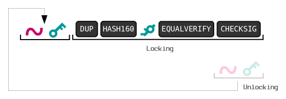

## 为什么我们要使用 Script 语言？

- **问**：为什么不直接使用公钥和签名的组合，把所有这些 ` 操作码 ` 和堆栈抛在一边呢？
- 答：因为你可以使用 ` 操作码 ` 的 *不同组合* 创建**不同类型**的锁。

### 1. 数学谜题

为了花费这个输出，你需要提供**和为 8 的两个数字**。

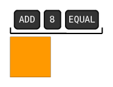

- 可能是世界上最不安全的锁定脚本 -

### 2. 哈希谜题

在这里，你只需要提供一个可以**得出（跟锁定脚本中）相同的哈希值**的数据，就可以花费这个输出。

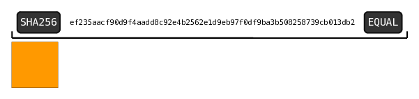

### 3. 哈希碰撞谜题

这是一种很酷的锁。你需要提供[两段可以得出相同哈希值的数据]()，才能解锁它。

换句话说，这是一种激励人们去发现 “[哈希碰撞](https://bitcointalk.org/index.php?topic=293382.0)” 的锁。

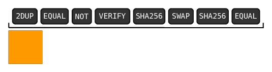

- 使用这个脚本锁定的比特币可以在这里找到：<a href="https://learnmeabitcoin.com/explorer/address/35Snmmy3uhaer2gTboc81ayCip4m9DT4ko">`35Snmmy3uhaer2gTboc81ayCip4m9DT4ko`</a>。但是，脚本本身是使用 P2SH 锁定脚本封装过的，所以你看不出原本的锁定脚本（有人来解锁时才会曝光）。 -

> [这些锁定脚本是不标准的](https://bitcointalk.org/index.php?topic=293382.0) <a href="#note2" id="jump-2">2</a>。虽然这些脚本是有效的（可以被挖出），但标准的 Bitcoin Core 节点不会转发这些脚本的交易，所以一般而言它们很难被挖出。

## 标准的脚本

虽然我们可以使用 ` 操作码 ` 的不同组合产生多样的锁定脚本，但大部分节点只会转发少数 “标准脚本” 的交易：

- [P2PK](https://learnmeabitcoin.com/technical/p2pk)（支付给公钥）
- [P2PKH](https://learnmeabitcoin.com/technical/p2pkh)（支付给公钥哈希值）
- [P2MS](https://learnmeabitcoin.com/technical/p2ms)（支付给多签名）
- [P2SH](https://learnmeabitcoin.com/technical/p2sh)（支付给脚本哈希值）
- [纯数据脚本](https://learnmeabitcoin.com/technical/nulldata)

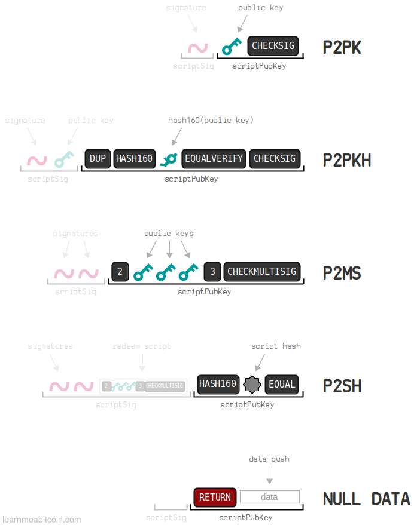

> 为什么节点不转发非标准的脚本呢？
>
> 我知道，这令人遗憾。
>
> 但是，不是所有的 ` 操作码 ` 的组合都经过测试。所以如果节点会转发非标准的脚本的交易，可能产生一种攻击：**有些人会通过发送需要花费很长时间来验证的脚本来轰炸网络** <a href="#note3" id="jump-3">3</a>。这会 “塞爆” 节点、让网络停止运行。
>
> 另一方面，标准的脚本经过了充分的测试、可被快速验证。
>
> 所以，不转发非标准的交易只是一种**安全措施**。
>
> > **非标准的脚本是有效的，只是不会被 积极转发**。
> >
> > 虽然非标准的交易不会在节点间转发，但依然可以得到区块的确认。不转发非标准的交易是因为节点可能在很短时间内收获大量的交易，但一个区块只能包含有限数量的交易。
> >
> > 所以，如果你像发起一笔使用非标准脚本的交易，你要么需要把交易直接发给矿工，要么你就需要自己挖矿了。

## 总结

Script 是一种微型的编程语言，用在比特币中，为比特币交易的输出提供锁定机制。

- 每个输出都有一个 “锁定脚本”。
- 为了花费一个输出，你必须在交易中提供 “解锁脚本”。

当一个节点收到了一笔交易时，它会将解锁脚本和锁定脚本拼接起来并运行。如果脚本运算完后栈顶的元素为  ` 1 ` 并且栈中没有别的元素，那么这个脚本就是有效的，这个输出可以被花费。

> “脚本” 只是一个 “断言（predicate）”。实际上它只是一个结果要么为真、要么为假的方程。但 predicate 是一个很长而且很罕见的词，所以我就叫它 “脚本” 了。
>
> —— [中本聪](https://bitcointalk.org/index.php?topic=195.msg1611#msg1611)

## 参考文献

- [bitcoin.it/wiki/Script](https://en.bitcoin.it/wiki/Script)
- [The Bitcoin Script language (pt.1)](http://davidederosa.com/basic-blockchain-programming/bitcoin-script-language-part-one/)
- [Hash Collision Script (bitcointalk.org)](https://bitcointalk.org/index.php?topic=293382.0)

### 脚注

1.[如果堆栈中最终留下多个元素，这个脚本是有效的吗？](https://bitcoin.stackexchange.com/questions/92039/is-a-script-spendable-if-multiple-items-are-left-on-the-stack) <a href="#jump-1">↩</a>

2.[ ` 是标准脚本吗？ ` ](https://github.com/bitcoin/bitcoin/blob/master/src/policy/policy.cpp) <a href="#jump-2">↩</a>

3.https://bitcoin.stackexchange.com/questions/73728/why-can-non-standard-transactions-be-mined-but-not-relayed/ <a href="#jump-3">↩</a>

