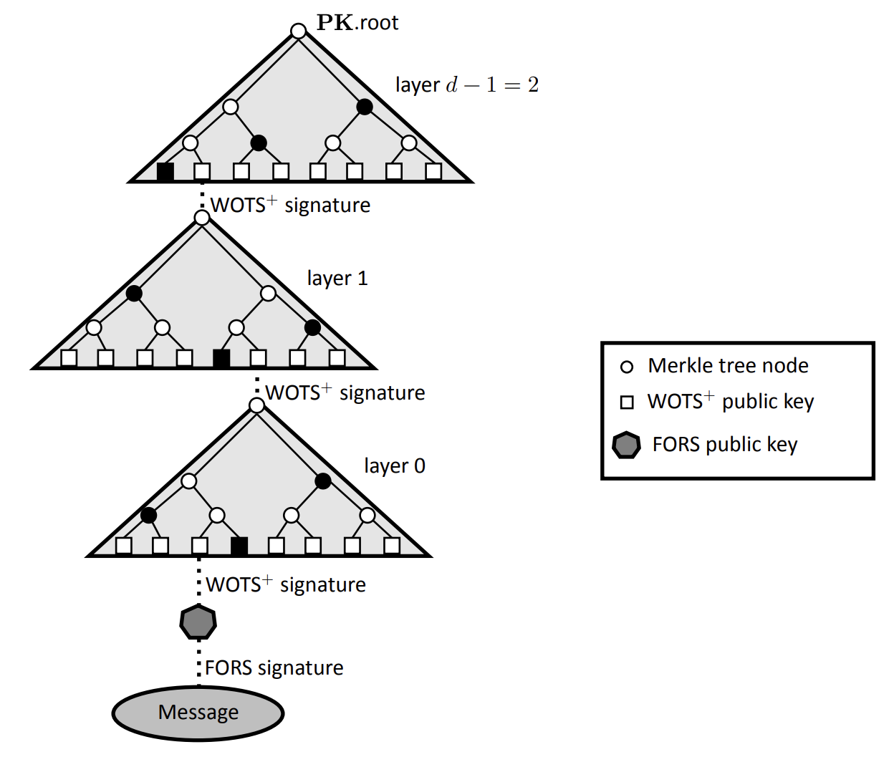
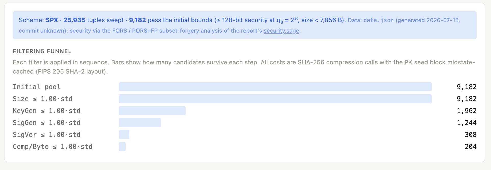
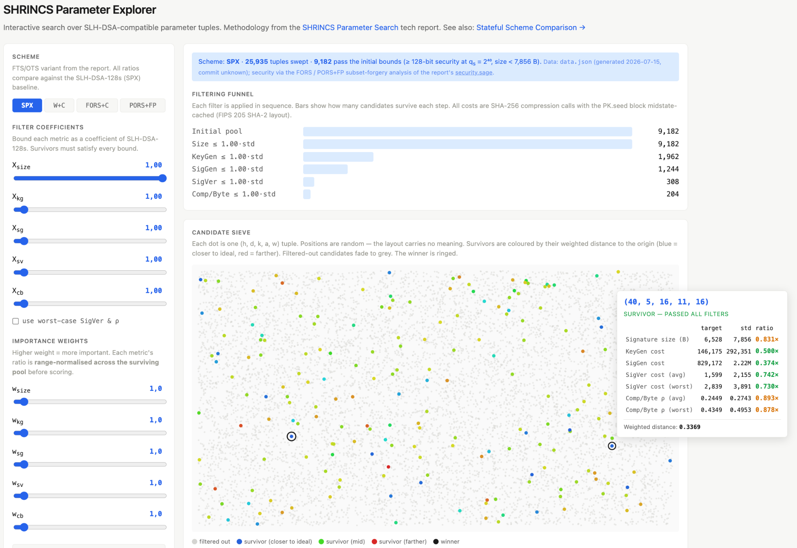

> *作者：Blockstream Team*
> 
> *来源：<https://blog.blockstream.com/searching-for-shrincs-parameters/>*

比特币交易受 Schnorr 签名或 ECDSA 签名的保护，但两者都建立在椭圆曲线密码学之上。足够强大的量子计算机能够从一个暴露的公钥反算出它背后的私钥、然后花费掉该公钥所保护的比特币资金。没人知道这样的机器何时会到来、会不会到来，但迁移比特币到新的密码学将历时数年，我们必须在威胁成真之前打好基础。

想要多方面了解量子计算对比特币的影响，可阅读 [Blockstream 的 “量子计算” 网页](https://blockstream.com/quantum/?ref=blog.blockstream.com)。

[SHRINCS](https://delvingbitcoin.org/t/shrincs-324-byte-stateful-post-quantum-signatures-with-static-backups/2158?ref=blog.blockstream.com) 是一种基于哈希函数的签名方案，由 [Blockstream Research](https://blockstream.com/research/?ref=blog.blockstream.com) 提出，作为比特币的一种实用的抗量子选项。在这种方案种，一个公钥有两种签名路径：(1) 紧凑的带状态路径，用于日常使用，其签名体积为 324 字节，每多生成一个签名就会膨胀大约 16 字节；(2) 无状态的备用路径，即使签名人弄丢了自己的状态，也依然能签名，只是所生成的签名体积更大。它的安全性完全依赖于 SHA-256 哈希函数，这是比特币系统在挖矿和地址中已经依赖的原语。Blockstream 的研究总监 Jonas Nick 在这篇[文章](https://blog.blockstream.com/op_checkshrincs-a-hash-based-signature-opcode-for-post-quantum-bitcoin/)中深入讨论该方案的设计。

每一种基于哈希函数的签名方案都有一组参数，决定签名的形式、体积以及基本函数（密钥生成、签名生成、签名验证）的开销，每一种参数选择都有优缺点。在比特币上，因为签名字节会占用区块空间，并且签名需要被整个节点网络验证，而且签名还需要在资源受限的设备（比如硬件签名器）上生成，这些参数选择决定了一种后量子签名方案是否实用。SHRINCS 背后的设计抉择就是找出最小的签名体积，同时让它在比特币应用场景中保持实用。

在本文中，我们将展示我们如何在 25935 个候选中披沙沥金，得到一种其无状态签名比 SLH-DSA 小大约 **25%**、且在签名生成和验证上便宜一些的方案。我们也开发了一个[开源浏览器](https://blockstreamresearch.github.io/SPHINCS-Parameters/site/?ref=blog.blockstream.com)，从而每个人都能验证我们的选择。

## 无状态备用路径的几何学

[SPHINCS+](https://sphincs.org/?ref=blog.blockstream.com) 签名方案用到了多层的[默克尔树](https://help.blockstream.com/education/glossary/merkle-tree?ref=blog.blockstream.com)（即所谓的 “hypertree”），以少量次数签名（FORS）作为叶子。这些层级通过一次性的 Winternitz 签名粘合在一起。NIST 在  FIPS 205 中将 SPHINCS 标准化为 “SLH-DSA” 方案，下文我们会沿用这个名字。

- <a href="https://nvlpubs.nist.gov/nistpubs/FIPS/NIST.FIPS.205.pdf?ref=blog.blockstream.com">SLH-DSA</a> 的 hypertree 结构 -

（译者注：如图所示，每一棵默克尔树都以 WOTS+ 公钥作为叶子，通过默克尔树聚合成一个公钥；通过让高层树的叶子 WOTS+ 公钥来签名低层树的树根，相当于认证一组新的 WOTS+ 公钥，形成多层的 hypertree 结构；最后，以 WOST+ 公钥来签名一个 FORS 公钥，FORS 公钥再生成对消息的签名。不过，FORS 公钥也是由多个默克尔树组成的 : ) 。）

### 参数

这样的 hypertree 的 “几何结构” 是由 5 个参数定义的：

1. **h** —— 整个 hypertree 的高度。签名预算（一个公钥可以安全地生成的签名数量）是由 h 决定的，是 **2h**。但 h 越大，最终签名的体积就越大。
2. **d** —— hypertree 树的层数。d 越小，最终签名的体积就越小。与此同时，因为更小的 d 会让每一层的树都变高，所以密钥生成和签名生成的成本都会指数上升。
3. **k** —— FORS 树的数量。每一棵 FORS 树都会增加安全性，但也会增加签名的体积。
4. **a** —— FORS 树的高度。存在同样的取舍：a 越大，满足相同安全性量级所需要的树越少，但会增加密钥和签名生成的复杂性。
5. **w** —— Winternitz 参数。更大的 w 意味着更少的哈希链条，因此签名会更小。但这样一来，每个链条都会变长，从而密钥和签名的生成需要更多次数的哈徐运算。

SLH-DSA 定义了多种参数集合，我们以 **SLH-DSA -SHA2-128s** 作为我们的基准，其 `(h, d, k, a, w) = (63, 7, 14, 12, 16)` 。我们准备（在特定范围内）筛选上述参数，找出更高效的候选。

### 要求与约束

在搜索之前，我们固定了四项要求：

1. 安全性不能落到 128 比特以下（以满足 NIST 安全等级 1）。
2. SLH-DSA 的结构保持不变（相同的算法、哈希函数、寻址，等等）；我们只改变参数。
3. 签名预算不应低于 240（对链上应用场景和 L2 协议都实用）。
4. 签名必须小于 SLH-DSA -SHA2-128s 签名（7856 字节），否则就没有意义。

对于每一组候选，我们都计量：(1) 签名体积；(2) 密钥生成开销；(3) 签名生成开销；(4) 验证开销；(5) 按签名字节平均的验证开销。开销以 SHA-256 压缩调用的次数为单位，假设 PK.seed 的中间状态（midstate）已被缓存（这是 FIPS 205 允许的事），所以哈希两个子节点会消耗一次压缩调用。

### 搜索

我们的筛选覆盖了 $h \in [40, 50]$，$d \in [2, 25]$，$k \in [6, 24]$，$a \in [8, 20]$，$w \in \lbrace 16, 32, 256 \rbrace$ 。因为 d 必须整除 h（每一层的默克尔树都有相同的高度），这给了我们总计 25935 个候选。再考虑上述要求，则留下了 9182 组候选。问题是：“其中哪个是最实用的呢？”

我们的方法包含两个过滤步骤（细节见此[报告](https://blockstreamresearch.github.io/SPHINCS-Parameters/site/report.pdf?ref=blog.blockstream.com)）。第一步是，我们定义每个性能维度的边界：我们使用 `X_*` 系数来描述（相对于  SLH-DSA 的）边界，候选方案的性能结果必须落在边界以内。比如说，`X_kg = 2.0, X_sg = 0.75` 应该读作 “密钥生成开销不能超过 SLH-DSA 的 2 倍；签名生成开销应该便宜至少 25% ”。五个边界按顺序应用，从而我们可以看出哪个候选会在哪个维度上失败。

第二步则是加权的距离计算。每个性能维度都被表达为相对 SLH-DSA 对应数值的比例，然后用户定义哪个维度更重要（是密钥生成的复杂性呢，还是签名验证的开销，等等），办法是为每个指标赋予一个权重。我们的浏览器选择与零点的加权距离最小者为胜出者（在所有维度上，都是越接近 0 越好）。

### 结果

因为我们的目标是找出指标接近 SLH-DSA 的最小签名，我们给签名体积赋予了最大的权重，然后找出了两个有前景的候选方案。

| **指标 / 签名**       | **SLH-DSA** | **C1 (45,5,10,13,16)** | **C2 (45,5,8,16,16)** |
| --------------------- | ----------- | ---------------------- | --------------------- |
| **Signature size, B** | 7,856       | 5,776 (0.74x)          | 5,712 (0.73x)         |
| **KeyGen, C**         | 292,351     | 292,351 (1.00x)        | 292,351 (1.00x)       |
| **SigGen, C**         | 2,218,483   | 1,707,512 (0.77x)      | 3,034,618 (1.37x)     |
| **SigVer, C**         | 2,155       | 1,550 (0.72x)          | 1,546 (0.72x)         |
| **SigVer, C/B**       | 0.496       | 0.48 (0.98x)           | 0.48 (0.98x)          |

\* C 是成本，以 SHA-256 压缩函数调用次数为单位；B 是字节数量。

候选方案 1 (C1) ，签名体积为 5.7 KB，体积小于 SLH-DSA 且签名和验证都更便宜。C2 则进一步节约了 64 字节，但签名成本是（SLH-DSA 的） 1.37 倍，当签名复杂性并非首要关切时，这是合理的。

## 带状态的签名路径

带状态的部分更加难以分析。无状态的部分可以视为仅仅是一种备用选项，但带状态的签名的几何学是由应用场景塑造的。绝大部分用户可能会更喜欢 UXMSS， [eXtended 默克尔签名方案（XMSS）](https://datatracker.ietf.org/doc/html/rfc8391?ref=blog.blockstream.com)的采用不对称默克尔树的变种（XMSS 是 SHRINCS 带状态签名的核心），因为它可以做到签名体积最小（大于等于 324 字节；签名的体积会随已经生成的签名的数量逐个递增 16 字节）。对于闪电网络或者矿工来说，使用同一个公钥支持尽可能多的签名次数并保证签名体积是常数，是有用的，所以 XMSS 及其多树变种 [XMSS-MT](https://eprint.iacr.org/2017/966?ref=blog.blockstream.com) 看起来更好（依然远远小于无状态签名）。此外，用户还有不同的装备，可以加速密钥生成、为快速签名启用高效缓存和并行化。

所以，我们没有提供或建议任何具体的候选，但让你可以在浏览器中直接对比它们。我们使用了相同的方法：浏览器根据 SLH-DSA 的指标来对比候选方案，并根据可欲的权重找出 “最接近的” 候选。  

## 浏览器

我们开发了一个[开源的网站](https://blockstreamresearch.github.io/SPHINCS-Parameters/site/?ref=blog.blockstream.com)，用于分析候选的签名方案。用户可以设定边界和权重，找出最优的候选。

*小插曲：这些数字是压缩函数调用的模型计数，不是基准测试，尽管能有效为候选方案排名，却不能告诉你实际需要执行多长时间。但用户可以自己运行 SLH-DSA 方案，然后乘上从网站得到的系数，获得足够贴近现实的估计。*

## 后量子的比特币

无论我们选择什么参数，都不可能让基于哈希函数的签名跟今天的 [Schnorr 签名](https://help.blockstream.com/education/glossary/schnorr-signatures?ref=blog.blockstream.com)一样小（64 字节）。SHRINCS 的带状态签名从 324 字节（5 倍大小）开始增长，而无状态备用路径签名接近 5.7KB（大约 90 倍）（这是经过我们筛选的结果）。这个鸿沟，正是将无状态路径仅用作备用机制的原因。

当然，备用路径的成本也很重要：相比 SLH-DSA，我们的候选将签名体积减少了大约 2 KB ，并且在验证成本上节约了 28% 。

没有哪个参数是非此不可，而且带状态的签名尤其依赖于如何使用一个地址。我们的浏览器网站是开源的，所以钱包开发者、协议研究者，材质任何人都可以使用它：看看匹配你的应用场景的边界和权重，看看哪个候选会胜出。这个浏览器支持为结果分享 URL（[这个](https://blockstreamresearch.github.io/SPHINCS-Parameters/site/?ref=blog.blockstream.com#x=0.74,1,1.5,1,1)就展示了我们的筛选）。如果你的权重产生了一个你认为更好的候选，我们很希望能看看它。

要了解更多：

- 使用你自己设定的边界和权重来[探索候选空间](https://blockstreamresearch.github.io/SPHINCS-Parameters/site/?ref=blog.blockstream.com)
- [阅读这份技术报告](https://blockstreamresearch.github.io/SPHINCS-Parameters/site/report.pdf?ref=blog.blockstream.com)，了解整个研究方法
- [阅读 SHRINCS 提议](https://delvingbitcoin.org/t/shrincs-324-byte-stateful-post-quantum-signatures-with-static-backups/2158?ref=blog.blockstream.com)（[中文译本](https://www.btcstudy.org/2026/03/25/shrincs-324-byte-stateful-post-quantum-signatures-with-static-backups/)）

（完）