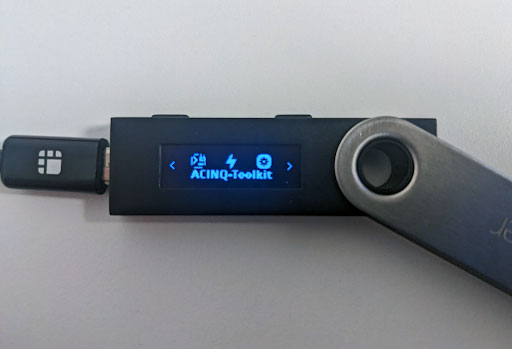

> *作者：ACINQ*
> 
> *来源：<https://acinq.co/blog/securing-a-100M-lightning-node>*

**摘要**：ACINQ 是闪电网络的主要开发团队之一，也是一个重要的运营者。闪电网络是建立在比特币上的一个开放的支付网络。在运营闪电节点是，私钥需要是 “热的”（一直在线），这就成了一个重大的安全挑战。

在经过几年的研究和开发之后，我们最终选择了 AWS Nitro Enclaves（一种隔离的计算环境） 以及 Ledger Nano（一种带有可信赖的显示屏的签名设备）。我们认为，这种装置在安全性、灵活性、性能以及（运行专业的闪电节点的）运营复杂性取得了最好的平衡。

## 1. 背景

闪电网络是一个快速、可扩展的、信任最小化的开放网络，由转发交易的节点组成。究其本性，这些节点都是可以在互联网上触达的，它们实时处理交易，并保存控制着资金的私钥。一个闪电节点本质上就是一个热钱包，也就是一类已知是黑客首要攻击目标的软件。

节点运营者的活动多种多样，冒风险的资金不一定是运营者自己的资金。比如，如果运营者是传统的交易所或者托管式钱包的话，可能是用户的资金。在我们这个案例（路由节点和自主保管钱包的供应商）中，冒风险的是我们自己的资金。

我们已经开发出了一种开源的闪电节点实现，[Eclair](https://github.com/ACINQ/eclair)，它是专门为大负载工况设计的。Eclair 是用 Scala 语言编写的，运行在 JVM 上。基于 Actor 模型，Eclair 可以容易扩展到处理大量的支付通道和高交易规模。我们在之前一篇博客中已经详细介绍了 [Eclair 的架构](https://acinq.co/blog/eclair-architecture)。

Eclair 也是 [ACINQ 自有节点](https://amboss.space/node/03864ef025fde8fb587d989186ce6a4a186895ee44a926bfc370e2c366597a3f8f)背后的支撑；当前，这个节点管理着几百个 BTC 和数以万计的通道。我们预计，着两个数字，以及风险层级，都会在未来几年急剧上升。我们从一开始就知道，安全性事关我们事业的生死，这也是为什么我们很早就开始研究这个题目 —— 从大约四年前开始。

前面三年，我们为一种现成的 “HSM（硬件安全模块）” 编写一个完整的闪电实现。我们成功了，几乎就要发布它。但然后我们就遇到了 [AWS Nitro Enclaves](https://aws.amazon.com/ec2/nitro/nitro-enclaves/)，并且发现它对我们来说是一个更好的解决方案，几乎全方位胜出。所以我们改变了方向，设计了一种原创的解决方案，引入一个 Ledger Nano 硬件来做身份验证操作；现在，我们可以愉快低在 Nitro Enclaves 上运行 Eclair。

## 2. 范围与假设

我们要尝试对抗什么情形、保护什么东西？

我们需要能够对抗下列故障：

- 生产环境中的服务器被攻破（包括 root 权限）
- 开发用途和管理用途的 个人电脑/笔记本电脑 被攻陷
- 云服务的管理员身份和运营者身份被攻陷

而以下这些故障不在我们思考范围内：

- 闪电网络协议漏洞
- Eclair 软件漏洞
- 比特币节点的 “日蚀攻击（eclipse attacks）”
- 拒绝服务式攻击

## 3. 关于闪电网络

闪电网络是一个由支付通道组成的网络，只要甲节点能找到通往乙节点的网络路径，就可以给乙节点支付。

支付通道锚定在比特币区块链商，但通过通道发起的支付并不需要记录在比特币区块链商，这就是它被称为 “链下支付” 的原因。这也是闪电网络能够扩展到几乎无限的吞吐量的原因。

当 A 要通过节点 B 和 C 给 D 支付时，实际上发生的事情是：A 给 B 支付、B 给 C 支付、C 给 D 支付；然后，在设计上，闪电网络协议保证了这些次级支付要么会一起成功，要么会全部失败。所以，在这场支付中，B 和 C 只是中间人，但并不是 *需要信任* 的中间人。

- 从 A 到 D 的闪电支付 -

在闪电网络的语境中， B 和 C 就叫 “路由” 节点，这正是我们的 ACINQ 节点做的事情：**我们并不发送和接收支付，我们永远只转发支付**。

## 4. 在 HSM 中实现的闪电节点

### 4.1 保护私钥

保护一个闪电节点到底有多难呢？显然就是保护几个私钥而已，对不对？不尽然。但我们先假设做到这样就足够了。

说到保护密钥，硬件是首屈一指的。硬件签名模块（HSM）就是为了这个目的而存在的。你可以将 HSM 理解为一张很大的智能卡，可以插入你的服务器。幸好，闪电网络协议所用的密码学方法也是高度标准化的，现成的 HSM 就有支持这些操作的。

一种简单的设计是这样的：

- 步骤 1：隔离保存私钥 -

这看起来直截了当，但马上就会遇到一个问题：我们的节点运行在 AWS 上，而且我们没办法给他们的服务器插入一张物理卡片。我们需要自主保管这个卡片，但另一方面，我们也不希望失去云服务（比如 AWS）所提供的灵活性（Eclair 软件包自身就是一种分布式应用）。这将我们导向分离式部署：

- 步骤 2：在数据中心之间分离式部署 -

现在，我们无法直接让 HSM 盲目低签名 Eclair 发送给它的东西。记住，我们的出发点是，我们的服务器可能会被攻破。需要在什么地方附加一些背景，但我们还必须走得更深一些。

### 4.2 保护支付

我们放大看看在闪电网络上路由支付到底会发生什么。如前所示，对每一笔转发的支付，都会有转入的部分和转出的部分。

- 从节点运营者的视角出发 -

要解决的问题似乎是非常直接的：我们只需要保证，**对每一笔转出的支付，都有一笔相匹配的转入支付**。

为了合理评估，这个 HSM 需要知道更多东西，最重要的是，它必须理解什么是闪电支付。换句话说，我们需要在 HSM 内实现闪电网络协议的一个子集。

即使我们已经做出了两种闪电网络实现（一种使用 Scala 语言，另一种使用 Kotlin 语言），而且之前有开发智能卡的经验，开发一种 HSM 应用依然有难度。HSM 是一种嵌入式设备，使用特定的专有操作系统、运行时、系统和密码学 API，都需要用底层的 C 语言来编程。

而且，HSM 的内存极为有限。它们是设计用来签名许多文档的，内部的状态更新主要限于递增计数器，而且几乎没有本地存储可用。

事实证明，这是最难的部分，因为闪电网络是一种带状态的协议：交易包含了需要对手签名、存储的多种状态转换，而且每一步中交换的数据都必须得到验证。而且为了执行实际的验证，转入和转出的支付也需要关联起来。

我们别无选择，只能将所有的数据都加密并存储在 HSM 的主机文件系统呢，并在每一次支付的每一个次级步骤中来回传递。这时候，我们的部署看起来就像这样：

- 步骤 3：在 HSM 主机中添加一个中间应用 -

我们不仅在 HSM 上实现了越来越多的闪电网络协议，最终还将我们的应用分成了三个部分。从运营的角度，这开始变得像噩梦了。

但是，不管怎么说，我们还是完成了，对不对？我们已经确保了发生在一条有效通道内的支付，是可以处理的，但 HSM 自己不能辨别哪条通道是有效的。因此，它需要访问区块链，我们也必须挖得更深一些。

### 4.3 保护通道

只有发生在锚定于比特币区块链得通道内的闪电支付，才能被认为是安全的。

成功攻入了我们的 HSM 主机的攻击者，可以给 HSM 提供大量虚假支付：从不存在的通道转入，在真实的通道转出。通过转入支付和转出支付的数额比对执行的检查可以通过，但转入的部分是假的，因此我们的钱包会被抽空。

这就是为什么我们的 HSM 也需要知道区块链 —— 事实的终极来源。

最开始，我们以为验证通道是非常简单的 —— 只需向 HSM 出示注资交易，以及一个默克尔树（将该交易与一个带有有效工作量证明的区块关联起来）即可。当然，事后证明，真正的解决方案要复杂得多：有许许多多的极端情况，比如以前有效的通道后来被关闭了。HSM 不能忽略它们，否则很容易被愚弄。

最终，我们发现了一种办法，可以处理比特币数据而无需在 HSM 中实现一个全节点。但是，不管怎么说，安全地验证闪电交易和通道，比我们一开始预期的工作量要多得多。

### 4.4 结论

**我们为一种真实的 HSM 设计、实现和测试了一个完整的应用，可以实现绝大部分的闪电协议**。

我们非常满意与最终实现的安全性，但它的代价也非常大：大大增加了复杂性和运营负担。

首先，我们必须为 HSM 编写的软件比我们预想的要大得多。一开始差不多只是 Eclair 的一个密钥管理器，最后变成几乎是一个完整的闪电节点实现。高昂的开发和维护成本是必然的，而且闪电网络协议本身还在大量开发，这就成了一个问题。而且，用于 HSM 的 API 是带有专利的，我们面临着一个结实的供应商锁定。

其次，物理部署分成了两个完全不相关的部分，而且关键的应用状态被分割到了三个逻辑模块（Eclair、HSM 主机文件系统，以及 HSM 自身）中。基本的 重启/升级 操作都会变得非常难而且有风险，因为所有这些部分都需要保持同步。

最后（但不是最次要的），HSM 的存储读写和 CPU 性能，跟高端的服务器差别极大。访问和存储通道状态很慢，签名交易也很慢。今天可用的 HSM 的性能不会超过每秒几十笔支付 —— 不是说每个通道都能处理这么多，是说所有通道加起来只能这么多。

## 5. AWS Nitro Enclaves 上的闪电节点

在开发 HSM 的时候，我们学到的最重要的事情之一就是，将我们的应用拆分成可以信任的部分和不可信任的部分是非常困难的。即便我们发现了一种更好的安全运行时环境、消除了因为 HSM 缺乏可用的本地存储而导致的性能和持久性问题，最终可能还是会得到一种复杂的设计：为了执行必要的检查，签名模块需要能够连贯地复制它所连接的节点的状态，这是非常难以实现的（技术上如此，从运营者的角度看依然如此），而且还要访问区块链数据。

这里的问题是，绝大部分可信赖的运行时环境，包括 T.E.E，最初都是为而且仅为保护私钥而设计的。他们假设了在应用层面分割 可信任的/不可信任的 模块是可以做到的，因为大部分传统的应用都带有 “可信” 的数据来源：他们只需要验证请求是由某一个可信来源发起的，就可以了（一般来说，这意味着请求需要用一个凭证来签名，而应用被配置成信任这样的凭证）。

但在比特币和闪电网络的世界里，没有 “可信任的来源” 这样的概念，甚至可以说是刚好相反的：我们假设数据会来自不可信任的来源。协议基于应用必须验证的密码学证据、定义出规则检查，这是非常复杂的，而且需要能够访问底层的比特币区块链。这就意味着，我们需要运行在一个安全环境中的 “可信任” 应用，会比大部分受信任的运行时所预设的更为复杂。

### 5.1 机密运算的兴起

我们不是唯一一个尝试在安全运行时环境中运行复杂运用的：最近，出现了一种实现 “机密运算环境（**Confidential Computing Environments**）” 的趋势，这种环境让用户可以在安全运行时环境内运行完整的应用，而无需将它们分割成可信任的和不可信任的部分。

这看起来是最好的方法：不再有一致性问题，也不需要束手束脚的定制化开发，运营也更简单。

AWS Nitro Enclaves（AWS 称它为 “隔离计算环境（Isolated Compute Environment）”）就可以用作这样的机密运算环境，而且拥有我们希望的一切东西：一个可信任的环境，从部署的角度看，**用起来几乎是透明的**；提供了**跟标准的高端服务器相同的性能**；包含了 Cyrptographic Attestation，可以用来开发信任关系、管理应用秘密值的部署。它得说明书写得非常清楚，已经被 AWS 使用了多年，而我们已经在 AWS 运行了我们得节点：这是一个显而易见值得评估的选择。

我们的基本假设之一是，我们不希望信任我们所依赖的云服务的运营者。这是机密计算环境的一个明确目标，在 [AWS Nitro System 的初始化要求]()中也提到了：

> 从设计上来说，Nitro System 没有运营者权限。没有任何系统或者人的机制能够登录 EC2 Nitro 的主机、访问 EC2 实例的内存、访问存储在本地加密实例以及远端加密 EBS 盘符中的任何客户数据。任何一个 AWS 的运营者，即使拥有最高权限，如果想在一个 EC2 服务器上做维护工作，也只能使用一组受到限制的、需要经过身份验证和授权、会留下记录并且经过审核的管理员 API。这些 API 不能让运营者访问 EC2 服务器上的客户数据。因为这些是设计好且经过测试的限制，内置于 Nitro System 自身，所以没有 AWS 运营者可以穿过这些控制和保护措施。

我们依然需要信任 AWS Nitro System，以及设计和实现它的 AWS 的工程师和安全研究员。这是意料之中的事情：不论我们选择怎样的解决方案，总会涉及信任因素（例如信任你的 HSM 供应商）。除此之外，使用由 AWS 提供和维护的服务器，也保护我们免受特定类型的攻击，例如 [sgx.fail](https://sgx.fail/) 网站所述的针对 SGX 的攻击，它要求攻击者能够控制执行环境。

### 5.2 在 一个 Nitro Enclave 中运行 Eclair

Nitro Enclaves 可以运行几乎任何应用，而且不需要用户在一些专门的库上编程，只要你可以满足以下要求：

- 有限的 I/O：nitro 应用在一个 “飞地（enclave）”（专门隔离开的环境）中运行，只能从主机通过一个 VSOCK 端口访问。
- 没有本地的持久储存空间：飞地内存储和修改的数据会在飞地停止运行后丢失，例如，就像你在使用一个 ramdisk 一样。
- Nitro Enclave 镜像是没有加密的：你无法在其中存储秘密值（否则任何可以访问服务器的人都可以在自己正在运行的服务中看到你的秘密值）。

因此，为了在一个 Nitro 飞地中运行 Eclair：

- 我们需要保证，所有的 存储写入/读取，包括数据库的 I/O，都要通过 TCP socket（举例来说，我们无法使用本地的文件系统来存储数据）
- 我们需要找出一种将私钥 “注入” 应用的方法。

**管理网络连接：LINK 协议**

让 Eclair 通过 TCP socket 运行所有的 I/O 是非常直接的：唯一的文件 I/O 是应用日志，而且还有一些选项可以通过 TCP 传输它们。

为了管理网络连接，我们开发了一种 “LINK” 协议，基于运行在飞地内和主机上的定制化网络代理。在需要建立从飞地到外部目的地的连接时，目的地的 IP 地址会被添加到第一个 TCP 包中。而在飞地之外、在上级 EC2 实例中运行的代理，会读取这个 IP 地址并连接到实际目的地。

注意，这种方法本身是不安全的，而且飞地内的应用需要确保它真的连接到了正确的服务端（通过 HTTPS、TLS 或者我们用在闪电网络中的 Noise 协议）。如果做不到，那么应用就需要另一种方法来验证自己收到的数据的真实性（authenticity）（例如，比特币协议就是带着这种想法设计出来的）。如果这也做不到，那就需要评估某人冒充目标服务端的后果。

这样，我们就有了一个运行在一个 Nitro Enclave 内的应用，而且它可以连接到外部世界（包括互联网）。

**保护应用私钥和秘密值**

Nitro Enclave 的局限性之一是，应用镜像没有加密。我们无法在应用中嵌入秘密值，相反，我们需要让应用从一个 “未初始化” 的状态开始，然后让它从一个可信的来源接收秘密值（私钥、口令，等等）；每次启动都是如此。但是，即便镜像没有加密，它们也有签名，而且无法被篡改，所以我们可以嵌入我们信任的私钥，并使用这些公钥来验证数据、建立安全的通信渠道。

我们希望尽可能不需要信任 AWS，所以决定不使用 AWS 的 KMS（密钥管理器），它会要求我们的管理员建立特殊的规则。相反，我们再次使用 Nitro Enclves 为我们的秘密值开发一种安全的 “master” 库。我们利用 Nitro Attestation，在我们的应用和 master 库之间建立安全的 “通道”。

为了给我们的 master 库安全地注入秘密值，我们获取它的 Nitro Enclave 的见证（attestation），然后使用一种安全的、隔空传送（air-gapped）的机器，将秘密值打包成一个加密的数据包。然后，我们将这个数据包上传到 master 的主机，它会传输到 master 飞地然后解密。每次修改应用秘密值或者重启 master 主机时，都要执行这个操作。

当我们的闪电节点启动的时候，它会跟 master 飞地通过我们的网络代理创建一条安全的信道，然后检索出秘密值。

**保护部署好的 Nitro Enclave 镜像并升级**

- 一台隔空传送的机器构造并签名所有的 Nitro Enclave 镜像 -

我们使用同一台隔空传送的机器来开发和签名所有的 Nitro Enclave 镜像，包括硬编码的公钥以及它们可以信任的见证数据，这样它们就能在彼此之间建立安全的信道。

我们在 Nitro Enclave 内部署的镜像不是 Eclair 自身，而是一个简单的 “启动器” 应用。这是我们的解决方案的关键部分，因为它解耦了 Nitro Enclave 镜像（很少变动）的生命周期和 Eclair （可能会经常升级）的生命周期。

关键的是，在我们的节点上部署和升级 Eclair 不需要亲身触达我们的隔空传送的机器，跟使用 Nitro 之前的情况是非常相似的。Eclair 应用包也是跟以前完全一样的 zip 文件。

为了在 Nitro Enclave 内运行 Eclair，整个流程是这样的：

1. 签名 Eclair 软件包（使用 Ledger 设备，见下一章）
2. 上传该签过名的软件包到 Nitro Enclave 主机
3. 运行一个脚本，在 Nitro Enclave 内打开启动器，然后向它传入签过名的软件包。

这个启动器会验证签名是有效的、跟 master 节点建立安全信道，然后检索应用秘密值，创建网络代理、创建一个配置文件，然后启动 Eclair。

- 部署和更新 Eclair 的操作，跟我们使用 Nitro 之前非常相似 -

### 5.3 使用 Ledger 硬件补充 Nitro Enclave

Nitro Enclave 给我们提供了安全的运行时环境，但依然有一些敏感操作需要跟人互动，例如：签名一个新的应用包、打开和关闭我们的节点，以及大部分管理 API 调用。从运营的角度看，使用隔空投送的设备和 Nitro Enclave 见证是不现实的。

这就是我们用到 Ledger 设备的地方：它的可信显示屏是 Nitro Enclave 的完美补充。Ledger 设备可以用来签名这些敏感操作，而且其用户体验接近于这些设备跟比特币钱包一起使用的使用：只不过屏幕不是用来验证比特币地址和数额，而是管理员验证软件包的哈希值或者 API 指令。

注意，只使用 Ledger 而不使用 Nitro Enclave 是没用意义的：进入了生产服务器的供给制可以直接修改应用，从而绕过任何外部检查。

- ACINQ 工具箱 Ledger 应用 -

**签名和部署 Eclair**

我们开发了一个定制的 Ledger 应用，运行在启动器信任的 Ledger 设备上。

- 使用 Ledger 来签名我们的应用 -

我们使用 Ledger 设备来签名应用：我们部署跟用在非 Nitro 节点上一摸一样的标准包，并且也是用相同的工具开发的。一旦管理员在 Ledger 屏幕上检查过了软件包的哈希值，就可以使用 Ledger 来签名这个软件包。为了保护我们不受 “供应链” 攻击，多位开发宅在独立的设备上编译了应用，并检查他们都得到了相同的哈希值（也即软件构建是确定性的）。

**验证管理 API 调用者的身份**

我们也依赖于 Ledger 设备来保护敏感的管理任务，通过在 Nitro Enclave 的主机和 Ledger 设备（连接到了管理员的个人电脑）之间建立直接的通信通道。这些通道用来向管理员的 Ledger 发送真实的 API 调用和参数，Ledger 的屏幕上会显示出来。然后，管理员可以许可请求（用设备签名），这个签名会通过相同的信道回传，并在 Nitro 飞地内得到检查。

注意，这一切都发生在后台。对管理员来说，命令行参数全都保持原样，只是需要使用不同的工具（`secure-eclair-cli` 而不是 `eclair-cli`）。

- 使用 Ledger 设备连接到我们的生产节点 -

每一个 Ledger 设备都有单独的白名单，而且我们运行在 Nitro Enclave 内的启动器也被配置成为应用部署和应用管理信任不同的设备。

### 5.4 保护我们的比特币节点

我们为两种目的而使用比特币节点：

- 跟比特币区块链交互、监控比特币区块链
- 管理我们的链上资金：我们没有开发一种定制化的钱包，直接使用了 `Bitcoin Core` 内置的钱包模块

`Bitcoin Core` 不会运行在 Nitro Enclave 内，但它也能从 Nitro Enclave 所带来的安全性中获益：

首先，**监控比特币区块链是通过一个 Nitro Enclave 内部的 Eclair 实现的**：我们可以用密码学验证一笔交易存在、得到了正确的签名、检测其被花费的时间并作出回应，这些检查无法被攻击者绕过，除非攻击者同时伪造比特币区块数据，这是非常昂贵的。不像 HSM，这里不需要定制化的开发，因为这些检查在 Eclair 中都已经实现了。

为了保护我们免遭日蚀攻击，Eclair 连接到多个比特币数据源，以验证我们的主要比特币节点依然跟比特币网络保持同步。

最后，并非不要紧的是，我们也可以使用 Nitro Enclave 来保护我们的链上资金：`Bitcoin Core` 可以配置成通过其硬件钱包接口（HWI）将私钥的管理委托给一个外部的签名器。钱包操作（区块和交易的匹配、余额追踪、钱币选择）可以在 `Bitcoin Core` 完成，但**私钥将由 Eclair 管理，并且永远不会泄露给 Nitro Enclave**。在有需要的时候，`Bitcoin Core` 会请求 Eclair 签名交易，而 Eclair 可以检查它们是自己创建的有效注资交易。

### 5.5 对运营的影响

**变更一个基础的、非安全敏感的配置参数，跟使用 Nitro 前是一样的**：更新相应的配置文件（我们就放在 github 上，不包含任何敏感信息）、关闭和重启 Eclair（需要使用一个受信任的 Ledger 设备），跟以前完全一样。不需要能够访问我们的隔空传送签名设备。

**部署一个新版本的 Eclair 也跟使用 Nitro 前几乎一样，只是多了一个额外的签名步骤**：构建一个新的应用包、使用一个受信任的 Ledger 设备来签名它，只需要几秒钟时间。也不需要访问我们的隔空传送签名设备。

**修改运行在 Nitro Enclave 内的启动器，或者我们的安全库所有的配置秘密值，都变得更复杂了**。新的镜像需要构建和签名、秘密值需要加密，master 镜像需要重新启动、给它配置加密后的新秘密值，然后启动器镜像也需要重启。这需要亲身访问我们的隔空传送签名设备，但这个流程本身不需要频繁使用。

**从供应和性能的角度，没有任何事情发生了改变**：我们的应用 运行在相同类型的服务器上，而且拥有跟以前一样的性能。

可维护性也没有受影响：我们开发了工具，以在 Nitro Enclave 内配置和运行我们的应用；我们还开发了一种定制化的 Ledger 应用，以便签名和部署新的应用包。但闪电节点的运行是跟以前一样的，相同的构建流程，只是增加了签名步骤。ACINQ 的开发者完全不受 Nitro 的影响，Eclair 和我们的 Nitro 工具箱是完全独立的项目。

## 6. 结论

Nitro Enclaves 让我们可以设计两层安全工具和流程：

- 为了在 Nitro Enclave 内运行我们的闪电节点，我们开发了一组工具和容器，让我们可以无需改动就使用开发好的应用。创建和更新这些容器是非常敏感的操作，但也是非常罕见的操作。
- 为了保护我们的闪电节点的维护和管理，我们开发了一种定制的 Ledger 应用，放在需要人力参与的地方（部署和更新闪电节点软件、还有开启和关闭通道这样的敏感操作）。

从安全性的角度看，我们的需求达到了：Eclair 运行在一个飞地内，这个飞地无法被访问和修改；而且它的部署和管理得到了一个包含了安全芯片（secure element）的硬件设备的保护。即使我们依然相信基于 HSM 和自管理主机的解决方案可能会更安全，但相关的运营和维护成本将直接是高不可攀的（假设我们能够解决当前的 HSM 所面临的非常严重的性能问题）。

无需任何改动就能运行 Eclair，也意味着我们不会被 AWS 锁定（跟使用定制化 HSM 固件的解决方案相反，那会非常难以移植到另一种设备上），而且我们可以容易迁移到另一种生产环境。因为大部分云服务都在部署机密计算环境，我们在 Nitro Enclave 上做的事情可以复制到别的平台上。

任何尝试部署一个高容量闪电节点的人，都不能仅考虑如何保护自己的运营资本，还需考虑节点管理和升级这样的运营工作的难度。我们相信，我们用 AWS Nitro Enclaves 和 Ledger 硬件钱包开发的解决方案，是目前在安全性、成本和可维护性取得最佳平衡的方案。

（完）