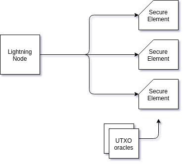

> *作者：devrandom*
> 
> *来源：<https://medium.com/@devrandom/securing-lightning-nodes-39410747734b>*

本文与 [Ken Sedgwick](https://medium.com/u/f63fc9b03017?source=post_page-----39410747734b--------------------------------) 合作撰写。

闪电网络是构建在比特币之上的二层点对点付款系统。闪电网络可以在大幅增加比特币付款吞吐量的同时降低交易费。但是，闪电网络也带来了安全性挑战，因为**闪电网络节点实际上是热钱包**。

保护普通热钱包的最佳实践是使用安全元件（例如，硬件签名模块（HSM））和多签交易。我们找到了一种将这些做法应用于闪电网络节点的方式。

由于闪电网络对脚本格式有具体要求，我们必须使用门限签名来代替多签。

## 闪电网络节点可能遭受的攻击

攻破了我们的节点的攻击者可以：

- 利用 “付款基点（payment basepoint）” 密钥窃取我们在通道内的资金

- 利用 HTLC（哈希时间锁合约）和节点标识密钥，将我们的资金发送给他们控制的闪电网络节点

如果攻击者与我们的节点有连接或侵入了我们的对等节点，还可以采取以下攻击手段：

- 利用“充值基点（funding basepoint）”密钥窃取你在通道内的资金

- 如果通道充值 UTXO 不可用，我们又接受通过该通道传入的路由付款，我们在输出通道内的资金会被吸干

## 安全措施

- 系统架构 -

要想保护自己的闪电网络节点，我们必须做到以下几点：

- 保护密钥免遭盗窃 —— 一旦攻击者窃取了我们的密钥，就能控制我们的资金

- 保护密钥免遭滥用 —— 如果攻击者可以随意签署交易，即使他们无法直接获取密钥，也可将我们的资金转走。

- 消除单点故障风险

为实现上述目标，我们认为必须采取以下措施：

- 将私钥存储在**安全元件**（例如，HSM）中

- 安全元件必须实行**策略控制**来防止密钥被滥用

- 在**门限签名方案**（TSS 或 “MPC”）中使用多个安全元件，从而避免单点故障问题

- 使用一组 UTXO 信息输入机制为通道充值 UTXO 提供存在证明 

我们的 [TSS 方案适用于](https://github.com/KZen-networks/multi-party-ecdsa/) KZen Networks 的 ECDSA 算法。[基于 Schnorr 签名算法有一个更简单、更易于分析的门限签名方案叫作 MuSig](https://github.com/ElementsProject/secp256k1-zkp/blob/secp256k1-zkp/src/modules/musig/musig.md)。

另外，我们也可以使用特定于闪电网络的方法，例如，使用 [Loop Out 机制](https://github.com/lightninglabs/loop)缩小通道体积或只为可信方创建通道。

## 策略控制

安全元件应该执行以下检查来防止盗窃：

- 充值交易必须输出到充值密钥

- 承诺交易必须从充值密钥中花费，付给付款密钥

- 付款密钥控制下的资金必须支付给白名单地址（例如，冷钱包）

- 路由中心只能路由付款，不能发起付款（参见 Loop Out）

- 路由付款时应向安全元件提供输入通道充值 UTXO 的证明

注

- 安全元件必须维护每条通道的状态。实际存储位置可以在安全元件之外，并由包含所有存储项的默克尔树保护。安全元件只需在更新数据项时将新的默克尔树根安全存储在受保护的非易失性存储器中。

- UTXO 信息输入机制是提供 UTXO 状态承诺服务的第三方信息输入机制。这类承诺在一些区块链中可以通过共识获得，但是在比特币区块链中不行。

（完）