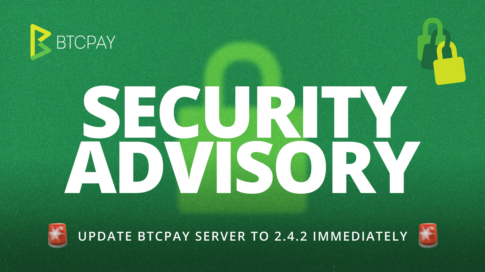

> *作者：BTCPay Server*
> 
> *来源：<https://blog.btcpayserver.org/security-advisory-btcpay-server-2-4-2/>*

## 立即行动！

如果你使用 **LND** 并运行了一个 2.4.2 版本以前的  BTCPay Server（含 2.4.2 候选发行版），**请立即升级到 2.4.2 版本**。

如果你使用了另一种闪电节点实现，或者不使用闪电节点，你不会暴露在本次发现的 LND 证书风险中。但我们应然强烈建议你升级。

## 内情概述

BTCPay Server **2.4.2** 版本修复了一个致命的安全漏洞，该漏洞会影响所有历史版本，包括 2.4.2 候选发行版（release candidates）。

该漏洞让一个未经授权的远程攻击者可以获得 **LND 软件**（一种闪电网络节点实现）的 `.macaroon` 证书文件。这些证书可以用来控制一个 LND 节点并移动资金。我们发现这种攻击仅瞄准带有 `.macaroon` 后缀的文件。

在初步沟通中，出于谨慎，我们建议用户将资金撤出 BTCPay Server 链上钱包。经过进一步的审核，我们确认该漏洞仅影响 LND 。

我们已经确认攻击者利用了这一漏洞。有用户受到了影响并遭遇了盗窃。我们暂不公布技术细节，因为节点运营者需要时间来升级。

## 受影响的范围

| 版本号                                    | 状态                                 |
| ----------------------------------------- | ------------------------------------ |
| 2.4.2 以前的所有版本，含 2.4.2 候选发行版 | ❌ 包含了该漏洞。LND 用户必须马上升级 |
| 2.4.2                                     | ✅ 已经修复了漏洞                     |

- 该漏洞存在于 2.4.2 版本以前的所有  BTCPay Server 版本（包括 2.4.2 候选发行版）。
- 暴露 `.macaroon` 证书以及资金被盗的风险仅限使用 LND 的实例。其它闪电节点实现的用户以及不使用闪电节点的用户，不受本次发现的漏洞影响，不需要通过升级来解决 LND 证书风险，但我们强烈建议这些用户也升级 BTCPay Server 。
- BTCPay Server 的链上钱包，包括热钱包，不受本次发现的漏洞影响。由 LND 链上钱包所持有资金，属于受影响的 LND 节点的一部分，可能也处在风险之中。
- 如果你使用 LND ，请把它的证书当成已经暴露，马上检查节点有无未经授权的活动。

## 如何缓解风险

### 1. 升级到 BTCPay Server 2.4.2 版本和 LND 0.21.1 版本

如果你使用 LND ，请立即升级 BTCPay Server 版本。 运行 2.4.2 以前版本的 BTCPay Server 的其他用户群体，我们也强烈建议升级。

若使用标准安装流程安装 BTCPay Server，请这样做：

在设定页面（**Server Settings**），选择 “维护”（**Maintenance**），然后选择 “升级”（**Update**）

为确定升级完全成功，请检查管理页面的页脚显示 “BTCPay Server 2.4.2”，并且你的 LND 是 0.21.1 版本。

如果你是用另一种方式安装的 BTCPay Server，请你遵循通常的升级流程。

如果你使用 LND 并且无法马上升级，那么请让 BTCPay 服务端离线，升级    LND 之后再上线。请不要让一个有漏洞的搭配了 LND 的服务端能够通过互联网来访问。

### 2. 审核你的 LND 节点活动

如果你使用 LND ：

- 检查有无并非由你发起支付
- 检查有无意料之外的通道关闭活动和不熟悉的对等节点
- 将链上余额和通道余额与你的记忆比对
- 研究任何你不记得的活动

升级操作也会将 LND 升级到 0.21.1 版本并自动重新生成其 macaroon 证书。你也可以手动轮换你的 macaroon 证书。

如果你通过自己的反向代理、Tor 服务、端口转发或 BTCPay Server 以外的路径来暴露你的 LND 节点，请立即轮换它的证书。升级 BTCPay Server 不会关闭你另外管理的访问路径。

### 3. 临时的钱包连接性变更

2.4.2 版本暂时移除了 Docker 实例上的 LND API 的公开访问。因此，现在，外部钱包（比如 Zeus），将无法通过你的 BTCPay Server 域名以及 Tor 洋葱地址来连接。

我们作出这项变更，是为了在事态仍在发酵时保护 LND 节点。我们计划在没有安全顾虑时恢复这个选项。如果你依赖于这个连接性，请联系我们，我们将帮助你寻找另一种方式。

## 总结

如果你使用 LND ，并**运行了 2.4.2 版本以前的 BTCPay Server ，请立即升级到 2.4.2 版本**。

本次发现的漏洞存在于 BTCPay Server 2.4.2 以前的所有的历史版本中。其它闪电节点实现以及不使用闪电功能的 BTCPay Server 实例不受本次发现的 LND 证书风险影响，不需要为规避这个具体的问题而升级，但我们强烈建议这些用户也安装更新。BTCPay Server 的链上钱包，包括热钱包，并不受本次发现的漏洞影响。

如果你使用 LND，请检查你的节点和余额，看看有无你并不记得的活动。如果你无法立即升级，请让你的服务端离线。

我们向受到该漏洞影响的所有用户表示诚挚的歉意。在接下来几天，我们将在准备好之后发布完整的事后报告。

我们向尽责披露此漏洞的 [Craig Raw](https://x.com/craigraw) 表示感谢，向帮助我们分析此漏洞的 [Team Red](https://opensats.org/funds/red) 表示感谢。

如需报告安全性问题，请电邮联系 [security@btcpayserver.org](mailto:security@btcpayserver.org) 。