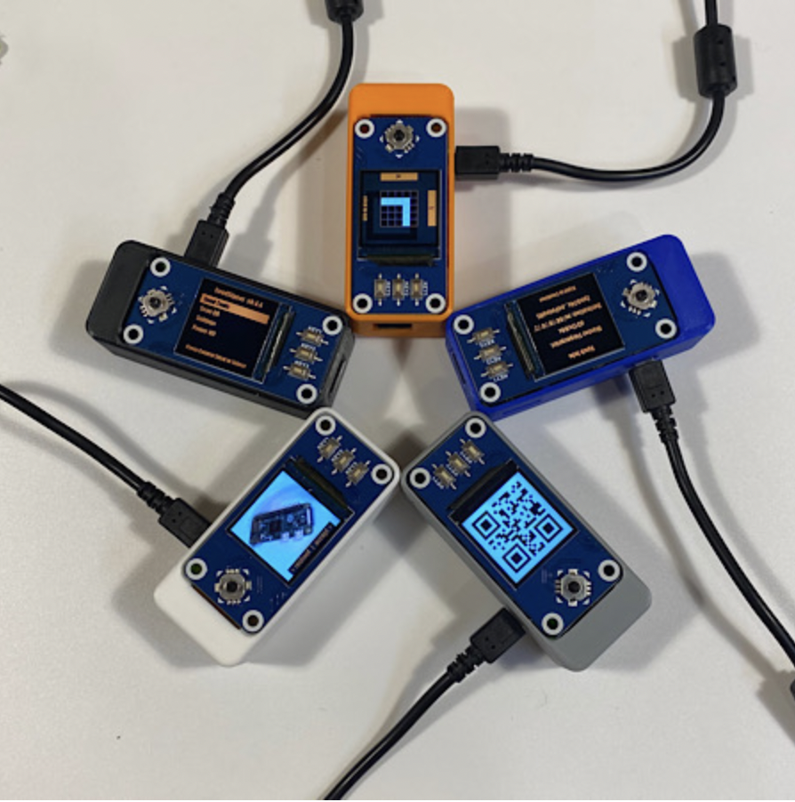
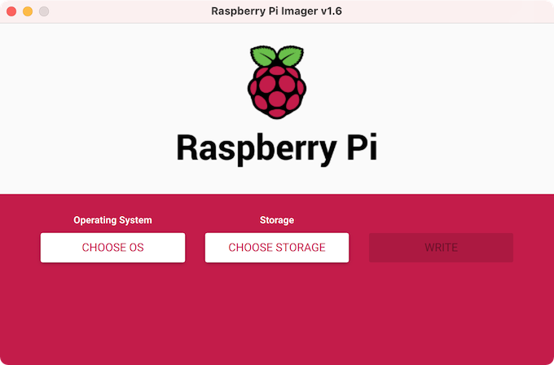

> *作者：Anony*




你所在的地方难以买到硬件签名器吗？或者，你担心硬件签名器里面有后门（或存在供应链攻击）吗？那么，你可以试试 [SeedSigner](https://seedsigner.com/)。

SeedSigner 是一种 DIY 的硬件，也就是说，你可以通过自己采购硬件并组装，来制作一个硬件签名器。而 SeedSigner 的开发者所提供的，就是驱动这些硬件的操作系统。他们整个系统的目标是，尽可能降低比特币用户搭建多签名保管装置的成本和复杂性。怎么样，是不是很酷？

只需自己从市面上购买通用的硬件，就可以组装出硬件签名器，这确实非常吸引人。但是，丑话说在前头，从普通用户的角度看，SeedSigner 的体验有许多不便之处：

- 它不能存储种子词（助记词）。所有 生成/导入 的种子词，都会在断电之后被清除。也即你每一次开机都要重新导入一遍助记词。
  - 这是因为 SeedSigner 基于通用的电脑主板 “树莓派”，这种主板不像专门的硬件签名器那样有安全芯片，它无法抵御硬件被他人得到之后从中抽取出敏感信息的风险，所以 SeedSigner 的选择是什么都不存。它是一种 “stateless（没有记忆的）” 设备。
- 它开机时间很长，一般来说你需要等待 35 ~ 45 秒才能开机。（跟主流的专用硬件相比有明显的差距）
- 无法通过 USB 接口、蓝牙、存储卡接口跟它沟通数据。既不能用这些接口向它提供数据，也不能通过这些接口获得它传出的数据。许多用户可能习惯了这些接口所提供的便利，但在 SeedSigner 上，只能通过摄像头和屏幕跟它交互。
  - 这也限制了能够跟它一起使用的钱包软件。当前，能够搭配一起使用的软件钱包有：Blue Wallet、Nunchuk、Sparrow、Specter 。

如果这些缺点你都能接受，那么，你就可以享受 SeedSigner 的这些特性了：

- “Air-gapped” 体验。这个词直译过来接近于 “隔空投送”，即不需要实体连接（比如 USB 连接）；但是，在硬件签名器的世界里，其含义远比 “没有实体连接” 更为严格 —— 也不需要蓝牙、NFC（近场通讯）、WiFi 这样的无线连接。实现 Air-gap 的两种常见方式是：摄像头-屏幕 和 存储卡。而在 SeedSigner 这里，你只能通过 摄像头-屏幕，但也只需通过这两者。
  - Air-gap 可以理解为一种用户体验特性：只要跟 SeedSigner 互动的设备能生成二维码、能扫码，就行了，不需要用户手动设置其它有线和无线连接。
  - 但是，也可以将它理解成一种安全性特性：它不通过这些连接来交互，自然也就不会被这些连接的攻击界面影响。不使用 USB，攻击者自然也就不能通过 USB 来攻击你的硬件签名器。而且二维码和存储卡这样的数据传输方式，要比上述其它连接透明很多。
- 专业性。如上所述，SeedSigner 的初衷是让多签名保管变得更方便、成本更低，为此，SeedSigner 实现了对 “PSBT（部分签名的比特币交易）” 的支持。这种数据格式是专门用来在多个签名设备之间沟通信息的。虽然 SeedSigner 基于通用的硬件，但其专业性一点也不差，甚至可以说优于大部分非 BTC 专属的硬件签名器。
  - SeedSigner 还支持在测试网上使用；还可以使用 BIP39 密语（passphrase）、还可以使用自定义的密钥派生路径！

那么，让我们来看看如何组装一台 SeedSigner 吧。

## 物料、成本及组装步骤

组装一个 SeedSigner，你需要准备以下硬件：

- 树莓派 Zero 。它是一块电脑主板。通常价格在 140 元左右。网上许多店铺会提供首客优惠，不到 100 元就可以买到一块。注意，Zero 本身是不包含排针的。推荐购买店家已经焊好排针的版本，会贵 10 块钱。不过，你直接购买店铺附送但未焊好排针的版本也可以，可以在线下的家电维修店帮你焊接排针。
  - SeedSigner 也支持使用其它型号的树莓派主板，但 Zero 是最便宜的。
  - 也不建议在网上店铺购买提供了外壳、电源等等东西的套餐，只需购买主板就好。
- 树莓派 Zero 摄像头。价格在 20 元以内。
  - 注意，必须购买跟你的树莓派兼容的摄像头。如果你使用树莓派 4，那么就需要购买兼容树莓派 4 的摄像头。
- [微雪（Waveshare）1.3 寸控制板](https://www.waveshare.com/wiki/1.3inch_LCD_HAT)。这种控制板有一块分辨率为 240*240 的屏幕、一个方向控制按钮和三个功能按钮。价格在 50 元左右。
- MicroSD 卡（也称 TF 卡）。SeedSigner 软件本体只有 40 MB，所以你可以选择非常小容量的 TF 卡。在网上找那种小容量卡的批发店铺就可以了。512 MB 的卡就绰绰有余了。价格在 10 元以内。
  - 如果你没有 “读卡器”，你也需要买一个，一般是 USB 接口的。
- 可选项。
  - Micro USB 连接线。用来连接树莓派主板和 USB 口（充电器、电脑），给树莓派供电。之所以是可选，是因为你家里很可能有闲置的 Micro USB 线（很多可充电的电器都使用这种线），如果有，就不必另外购买。
  - 外壳。SeedSigner 可以使用多种外壳（但这些外壳都是给树莓派 Zero 用的，非常小巧）。其中 Orange Pill（橙色外壳，带有给控制板硬件的按钮）可以[在官网列出的店铺](https://seedsigner.com/hardware/)中买到。所有的外壳都可以自己找 3D 模型店制作。你需要在[这个地方](https://github.com/SeedSigner/seedsigner#enclosure-designs)找到这些外壳的模型文件。把 .stl 文件发送给 3D 模型店，他们就可以帮你制作出来，比如[这个](https://github.com/SeedSigner/seedsigner/blob/main/enclosures/open_pill/print_file/open_pill.stl)。提醒一句，这种定制化的东西，多做几个会实惠一点，比如，你只做一个需要 50 块，但可能你做 3 个也只要 60 块。

总的来说，如果不购置外壳，大约 220 元就足以买到所需的所有硬件。如果购买外壳，则应该再加 50 元预算。

组装步骤：

1. 先将摄像头连接树莓派主板。将树莓派 Zero 主板的 Micro USB 接口面对自己，主板左侧的是存储卡接口；右侧的是摄像头排线接口。摄像头的排线接口有一面是金色的、一面是黑色的，黑色的一面应该向上。
2. 如果你准备了外壳，那么先将摄像头和树莓派 Zero 主板放入外壳的底部。外壳上会有卡口，可以卡住主板。如果没有外壳，则直接进行下一步。
3. 将微雪控制板扣到主板的排针上。控制板的接口跟主板是一一对应的。
4. 将下一节中制作好的 TF 卡插入树莓派主板，然后就可以给它供电、点亮它了。

SeedSigner 网站也提供了许多这样的[参考视频](https://seedsigner.com/explainers/)。

## 下载、验证软件和烧录 TF 卡

接下来我们要下载 SeedSigner 操作系统软件，并验证这些软件是相关开发者发布的，然后将它写入 TF 卡中。

### 下载

首先，在 SeedSigner 的[发布页面](https://github.com/SeedSigner/seedsigner/releases/)，根据你的树莓派主板类型，选择相应的镜像。同时还应该下载哈希摘要以及对哈希值的签名。

假如你将使用 Zero 主板，那么你需要下载这些文件，并将它们都放在同一个文件夹中：

```
seedsigner_os.0.6.0.pi0.img
seedsigner.0.6.0.sha256
seedsigner.0.6.0.sha256.sig
```

### 验证

这个过程需要用到软件 GPG，它的作用是验证对某个文件的数字签名。许多 Linux 系统都已经预装了GPG ；如果你是 Windows 系统，你可以在这里[下载](https://gpg4win.org/download.html)。

我们需要在存储上述三个文件的文件夹中运行 PowerShell（或者 “Windows Terminal”）；运行方法是按住键盘的 Shift 键，然后点击鼠标右键（Windows 11 可以直接右键打开）。打开 PowerShell 之后，运行以下三条命令（如果你的文件名不一样，则需要相应更改）：

```
gpg --fetch-keys https://keybase.io/seedsigner/pgp_keys.asc
gpg --verify .\seedsigner.0.6.0.sha256.sig
Get-FileHash .\seedsigner_os.0.6.0.pi0.img
```

第一条命令是为了从这个网站加载 SeedSigner 开发者的公钥。第二条则是使用开发者的公钥来验证 `.sig` 后缀的文件是否包含了对 `seedsigner.0.6.0.sha256` 的有效签名。如果得到了有效的签名，你将会看到这样的信息：

```
gpg:                using RSA key 46739B74B56AD88F14B0882EC7EF709007260119
gpg: Good signature from "seedsigner <btc.hardware.solutions@gmail.com>" [unknown]
gpg: WARNING: This key is not certified with a trusted signature!
gpg:          There is no indication that the signature belongs to the owner.
Primary key fingerprint: 4673 9B74 B56A D88F 14B0  882E C7EF 7090 0726 0119
```

这里最关键的信息是最后一行：“公钥指纹”。将这个公钥指纹与 [keybase.io 网站](https://keybase.io/seedsigner)上的公钥指纹相比对，如果一致，则说明 `.sig` 中的签名确实来自 SeedSigner 的开发者。

最后一步是得到 `.img`（SeedSigner 软件镜像）的哈希值。你会看到这样的信息：

```
Algorithm       Hash                                                                   Path
<p style="text-align:center">- --------       ----                                                                   --- -</p>

SHA256          750F406C133D17994EB58544AAD82B20F1478C8663AF303E45B2D9C49C4E9825       *********
```

使用 “记事本” 打开 `.sha256` 文件，看看这个哈希值是否在其中。如果在其中，则说明验证通过 —— 即，我们所下载的 `.img` 文件，确实是 SeedSigner 开发者发布的、没有遭到篡改，因为 SeedSigner 开发者签名了一个保存了哈希值的文件，而 `.img` 文件的哈希值恰在其中。如果遭到了别人的篡改，它会产生一个完全不同的哈希值，如果攻击者连 `.sha256` 也一并篡改，则在签名验证那一步就会传出错误 —— 要么 `.sig` 是一个无效的签名，要么它并不来自 SeedSigner 开发者。

## 烧录

接下来我们要将 `.img` （SeedSigner 软件镜像）烧录到 TF 卡中。首先，我们需要将 TF 卡插入读卡器，并将读卡器连接电脑。其次，我们需要借助软件，比如 [Raspberry Pi Imager](https://www.raspberrypi.com/software/) 。



安装 Pi Imager 后打开，主界面上从左到右有三个选项：

- 选择操作系统。点击这个按钮并选择我们下载好的 `.img` 文件。
- 选择存储空间。点击这个按钮并选择你的 TF 卡。
- 当前面两个都选好后，这个按钮将变得可用。点击它表示写入。因为 SeedSigner 的体积非常小，写入速度很快，十几二十秒就可以写入完成。

烧录好 TF 卡之后，就可以将这个 TF 卡插入树莓派主板了。给树莓派供电，等待 40 秒后你会看到带有 SeedSigner 图标的开机界面。

## 操作界面及使用提醒

在 SeedSigner 的主界面，你可以看到四个方块，分别是 “Scan（扫码）”、“Seeds（种子词）”、“Tools（工具）” 和 “Settings（设置）”。它们的概要功能如下：

- 扫码。用于通过二维码导入种子词，以及扫描 PSBT 二维码，从而使用已导入的种子词签名交易。
- 种子词。查看已经导入的种子词、生成新的种子词。
  - 值得指出的是，SeedSigner 可以同时导入不止一套种子词。
- 工具。主要作用是帮助你生成种子词。
  - 带有相机图案的 “New Seed” 表示可通过摄像头捕捉到的画面来生成种子词。
  - 带有骰子图案的 “New Seed”，则可以让你自己用一个骰子摇出数字并输入，从而生成种子词。
  - “Calc 12th/24th word” 支持的是一种特殊的种子词生成方法：你可以自己打印出 [BIP39 的词表](https://github.com/bitcoin/bips/blob/master/bip-0039/english.txt)，逐词剪成纸条后放在一个箱子里充分摇匀，然后取出 11/23 个词。输入 SeedSigner 之后它会帮你计算出最后一个词，从而构成一个完整种子词。
  - “Address explorer” 是在你导入种子词之后显示该种子词所生成的地址。
- 设置。关于设备的设置。比如是否允许在存储卡上存储默认的设置。
  - 如果你要切换网络（比如使用比特币测试网来测试 SeedSigner），也要在这个功能内设置，就在 “Advanced” 里面。

### 使用提醒

- 控制板的方向键可以控制选项的移动。其中，按下方向键本身也有 “确认” 的作用。
- 控制板右边的三个键在大多数时候功能都是相同的：“确认”。
- 如果你通过手动输入的方式导入种子词，请记得，在字母输入界面：
  - 使用方向键移动选项，**按下方向键表示选中字母**，KEY1 和 KEY3 可以上下移动屏幕右边的单词列表；**KEY2 表示选中单词**！
- 手动输入单词实际上并不是很便利。用扫码的方式导入种子词会更加便利。然而，这就要求我们将种子词转化成二维码。
  - SeedSigner 为自己的二维码格式提供了[详细的说明](https://github.com/SeedSigner/seedsigner/blob/dev/docs/seed_qr/README.md)，感兴趣的可以看看。
  - 此外，SeedSigner 还提供了[模板](https://github.com/SeedSigner/seedsigner/blob/dev/docs/seed_qr/README.md)，可用来打印出空的二维码。
  - 当你已经 导入/生成 种子词之后，可以在 “Seeds” 页面内选择相应的种子词，并使用 “Backup Seed” 内的 “Export as SeedQR” 功能查看它转化出来的二维码。它会有一个详情页面，使你可以将这个二维码绘制在上述模板的纸上。
  - 绘制完成之后，SeedSigner 本身会有一个 “Confirm SeedQR” 功能，用摄像头帮你确认你的绘制无误。
- 如果你使用桌面端的软件搭配 SeedSigner 一起使用，那么你可能要配备一个稍微好一点的摄像头：该摄像头需要能扫描 SeedSigner 屏幕所显示的二维码，以获得公钥、SeedSigner 签好名的消息。摄像头的分辨率并不需要很高，1080 就足够了，重要的是具备**自动对焦**功能。

> 所以，使用 SeedSigner 这样的 Air-gapped 设备的方式是：
>
> - 选择一款合适的软件钱包。比如 Sparrow 钱包。
> - 让 SeedSigner 显示种子词的公钥（XPUB），并在软件钱包中使用摄像头扫描 SeedSigner 的屏幕，获得公钥。得到了公钥之后，就意味着你可以在软件钱包中生成收款地址了（也意味着你可以将这个公钥用在多签名保管装置中了）。
> - 当你需要发起交易的时候，在软件钱包中生成交易，并显示为二维码，使用导入了相关种子词的 SeedSigner 扫描这个二维码，从而读取 PSBT。在 SeedSigner 屏幕上验证交易的信息与软件钱包上显示的一致之后，生成签名；在软件钱包上使用摄像头扫描 SeedSigner 的屏幕读取签名，然后你就得到了一笔完整的交易，可以广播出去了！

## 总结

虽然 Air-gap 对一些用户来说比较陌生，但实际上，只要你习惯了，你会发现它的体验非常好，你不需要关心连接，只需扫码就可以了，而且也安全得多。SeedSigner 就提供了这样的体验。你可以用摄像头导入种子词、扫码需要签名的比特币交易，用屏幕传出签名，这一切都非常流畅。这既有 SeedSigner 开发者的功劳，也离不开比特币社区日积月累的工作（PSBT 格式、二维码标准）。

对于有一定动手能力的朋友来说，SeedSigner 是值得尝试的选择。

（完）