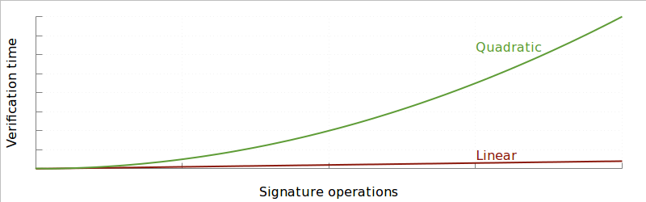

> *作者：Bitcoin Core*
>
> *来源：<https://bitcoincore.org/en/2016/01/26/segwit-benefits/>*
>
> *原文出版于 2016 年 1 月 26 日。*

“隔离见证（Segregated Witness）” 软分叉包含了许多特性，其中大部分都是纯粹技术性的。本文总结了这些特性可以带来的一些好处。

## 修复熔融性问题

比特币交易是用 64 位的十六进制哈希值来标记的，这个哈希值称为 “交易标识符（txid）”，既取决于被花费的资金，也取决于接下来谁能花费这笔交易的结果。

不幸的是，计算 txid 的方式使得任何人都可以稍微改动交易、在不改变交易的含义的同时改变交易的标识符。这个叫 “第三方熔融性（third-party malleability）”。BIP62 （“熔融性处理措施”）尝试从细节上解决这个问题，但作为一项共识检查，实现起来过于复杂，因此已经被撤回了。

举个例子，当你把一笔 txid 为 “ef74…c309” 的交易发送到网络中之后，一个第三方（比如网络中转发你的交易的一个节点，或者是尝试在区块中打包你的交易的矿工）可以稍微修改你的交易，结果是修改后的交易依然花费相同的资金并支付给相同的地址，但在确认时却使用截然不同的 txid “683f…8bfa”。

更一般地来说，如果一笔交易的一个乃至多个签名者修改了他们的交易，这笔交易将依然有效，而且会支付相同的数额到相同的地址，但 txid 会完全改变，因为它也包含了签名（译者注：在计算 txid 时，是是连签名也包含了进去的）。改变签名数据（但不改变输出和输入的选择）从而修改交易的一般情形，叫做 “脚本签名熔融性”。

隔离见证允许用户将交易可熔融的部分移到 “交易见证数据（transaction witness）” 并使之与交易的主体隔离开来，这样见证数据的改变就不会影响 txid 的计算，这就解决了脚本签名熔融性。

### 谁能收益？

- **跟踪被花费的比特币的钱包**：跟踪你的转账的状态将变得更加容易，只需通过 txid 来监控区块链即可。但如果交易可以被第三方熔铸，钱包就必须实现额外的代码，来处理 txid 变化的情形。
- **希望花费未确认交易的用户**：如果 Alice 在交易 001 中给 Bob 支付了，而 Bob 又要使用 001 的结果在交易 002 中给 Charlie 支付，那么，Alice 的支付被熔铸会使交易 002 作废，Charlie 就得不到支付了。如果 Bob 是值得信赖的人，那么他会给 Charlie 重新发起一笔支付；但如果他不是，他就可以抵赖。
- **闪电网络**：修复了第三方熔融性和脚本签名熔融性，闪电网络实现起来就不必那么复杂，而且在区块空间的利用效率上可以高效很多。移除了脚本签名熔融性之后，把区块链监控任务外包出去的闪电网络轻节点也成为了可能，不必非得运行比特币全节点才能运行闪电网络客户端。
- **使用区块链的任何人**：当前的智能合约（比如微支付的通道），以及人们期待的新型智能合约，在设计、理解和监控上都会更加简单。

注意：只有所有输入都使用隔离见证输出的交易才能避免熔融性（可以是直接的隔离见证输出，也可以是向后兼容的、使用 P2SH 封装的隔离见证输出）。

### 更多信息

- [Bitcoin Wiki·交易熔融性](https://en.bitcoin.it/wiki/Transaction_Malleability)
- [Coin Telegraph：论熔融性攻击（2015）](http://cointelegraph.com/news/115374/the-ongoing-bitcoin-malleability-attack)
- [Bitcoin Magazine：论熔融性攻击（2015）](https://bitcoinmagazine.com/articles/the-who-what-why-and-how-of-the-ongoing-transaction-malleability-attack-1444253640)
- [“概述闪电网络必需的 BIP”](http://diyhpl.us/wiki/transcripts/scalingbitcoin/hong-kong/overview-of-bips-necessary-for-lightning/)
- [BIP 62](https://github.com/bitcoin/bips/blob/master/bip-0062.mediawiki)
- [BIP 140 – 修复熔融性的另一种方法](https://github.com/bitcoin/bips/blob/master/bip-0140.mediawiki)
- [关于 683f…8bfa 交易的 stack exchange 问答](http://bitcoin.stackexchange.com/questions/22051/transaction-malleability-in-the-blockchain/22058#22058)

## Sighash 操作的线性增长

直接扩大比特币区块的简单办法面临一个重大问题：对特定类型的交易，签名的哈希计算操作是以平方级增长的，而不是线性增长的。



实际上，如果一笔交易的体积翻倍，那么签名操作的次数可能会翻倍，为了验证这些签名而需要运行哈希计算的数据量也会翻倍。这在现实中也出现过，一个区块一般需要 25 秒来验证，但一笔恶意构造的交易可能需要超过 3 分钟来验证。

隔离见证通过改变签名所需的交易哈希值的计算方式来解决这个问题：一笔交易的每个字节最多只需要哈希两次。这样做以更高的效率提供了相同的功能，：生成更大型的交易时，不会产生签名哈希操作的问题，即使是恶意构造的交易、支持更大的区块（因此支持更大体积的交易）也不用担心。

### 谁能受益？

移除签名验证时候被哈希的数据以平方级增长的问题，让区块的体积可以安全地提高。扩大区块而不限制交易的体积，让比特币可以继续支持来自和发往大群体的支付，例如挖矿交易的支付和众筹服务的支付。

修改后的哈希算法只应用在对见证数据发起的签名操作上，所以放在区块主体中的签名操作可以使用更低的限额。

### 更多信息

- [BIP 143](https://github.com/bitcoin/bips/blob/master/bip-0143.mediawiki)
- [Rusty Russell 讲解一笔需要 25 秒来验证的交易](http://rusty.ozlabs.org/?p=522)
- [CVE 2013-2292 on Bitcoin wiki](https://en.bitcoin.it/wiki/Common_Vulnerabilities_and_Exposures#CVE-2013-2292)
- [限制交易体积为 100kB 的提议](https://lists.linuxfoundation.org/pipermail/bitcoin-dev/2015-July/009494.html)
- [Bitcoin Classic 0.11.2 分支的代码增加了对 sighash 字节的共识限制](https://github.com/bitcoinclassic/bitcoinclassic/commit/842dc24b23ad9551c67672660c4cba882c4c840a)

## 增强通过 P2SH 实现的多签名的安全性

当前使用 P2SH 的多签名支付是以 160 比特的 HASH160 算法（SHA256 算法叠加 RIPEMD 算法）来保护的。但是，假如某一个签名者希望偷走所有的资金，TA 可以找出一对会哈希碰撞的脚本原像：一个是这个多签名脚本的有效地址，另一个是会给 TA 支付所有资金的脚本；只需要 80 比特（2<sup>80</sup>）的暴力搜索即可，这在一个资源极为丰富的攻击者那里已经是可以企及的数量级了。（作为参考，以稳定的每秒做 10<sup>18</sup> 次哈希运算的速率计，比特币的挖矿网络每两周就能完成 80 比特的暴力搜索）

而隔离见证只会在给单个公钥的支付中使用 HASH160（这种攻击在这里是没有用的），而在支付给脚本哈希值时使用 256 位的 SHA256 哈希值。

### 谁能受益？

任何给多签名输出和智能合约支付的人，都能从脚本的额外安全性中受益。

### 更多信息

- [Gavin Andresen 提问 80 比特的攻击是否值得担心](https://lists.linuxfoundation.org/pipermail/bitcoin-dev/2016-January/012198.html)
- [Ethan Heilman 介绍了一种循环搜索算法](https://lists.linuxfoundation.org/pipermail/bitcoin-dev/2016-January/012202.html)
- [Rusty Russell 计算了执行一次攻击的成本](https://lists.linuxfoundation.org/pipermail/bitcoin-dev/2016-January/012227.html)
- [Anthony Towns 应用循环搜索算法爆破了一些交易](https://lists.linuxfoundation.org/pipermail/bitcoin-dev/2016-January/012218.html)
- [Gavin Andresen 总结了上述内容](https://lists.linuxfoundation.org/pipermail/bitcoin-dev/2016-January/012234.html)

## 脚本的版本控制

改变比特币的脚本允许我们实现更强的安全性和功能性。但是，脚本的设计仅允许我们实现向后兼容的变更（软分叉），办法是将 10 个额外的 OP_NOP 操作码之一替换成可以条件式使脚本执行失败的新操作码，而不替换的 OP_NOP 在执行时时什么也不做的。这对许多的变更来说已经足够了 —— 例如引入一种新的签名方法，或者一种新的特性如 OP_CLTV —— 但既有些怪异（例如，OP_CLTV 必须接上一个 OP_DROP 才能使用），也无法用来启用简单到把两个字符串拼在一起这样的功能。

隔离见证为脚本引入了一个版本号，解决了这个问题：非隔离见证时代需要需要硬分叉才能使用的额外操作码，现在只需增加一个脚本版本就可以支持。

### 谁能受益？

更容易就能改变脚本操作码，让比特币可以更容易实现更加高级的脚本编程手段，包括像引入 Schnorr 签名、使用密钥恢复来压缩签名体积、支持侧链、使用默克尔抽象语法树（MAST）创建更加智能的合约这样的变更，也包括其它还在研究阶段的想法。

## 削减 UTXO 的增长率

每个参加比特币共识验证的比特币节点都维护着一个未花费的交易输出（UTXO）数据库，以确定收到的一笔新交易是有效的还是错误的。为了网络的高效运行，这个数据库必须能够快速地查询和修改，而且最好能够放在内存（RAM）中，所以保证数据库的体积尽可能小是有价值的。

但是，随着比特币的成长，这一点会变得更难，因为每一个新用户都拥有至少一个 UTXO，而且会请享用拥有多个 UTXO 以提升隐私性以及灵活性，或者为支付通道和其它智能合约提供支持。

隔离见证改善了这种处境，因为它使得签名数据（不会影响 UTXO 集的体积）相比于会影响 UTXO 集体积的数据，在征收手续费时可以获得 75% 的折扣。人们预期这会鼓励用户偏向使用对 UTXO 集的影响尽可能小的交易，以便尽可能降低手续费，并鼓励开发者在设计智能合约和新特性时尽可能降低对 UTXO 集的影响。

因为隔离见证时一种软分叉，而且不会增加区块主体的体积，在最差的情形下，UTXO 集的增长率会保持不变。（译者注：最差的情形应指隔离见证无人使用的情形。）

### 谁能受益？

削减 UTXO 的增长率将有利于矿工、企业家和运行全节点的用户，他们可以在更多用户进入比特币系统时帮助维持比特币网络当前的安全性。帮助尽可能降低 UTXO 集增长率的用户和开发者可以从更低的手续费中受益（而无视自己的交易对 UTXO 集增长率影响的用户则不能）。

### 更多信息

- [Statoshi UTXO dashboard](http://statoshi.info/dashboard/db/unspent-transaction-output-set)

## 在不验证签名时，效率会提高

历史交易的签名跟未来交易的签名相比可能不是那么有意义 —— 举个例子，Bitcoin Core 默认不会检查早于最近的检查点的交易的签名，而一些 SPV 客户端完全不检查任何签名，直接相信这些签名已经被矿工和其他节点检查过了。但是，当前，签名数据是一笔交易的组成部分，必须有才能计算交易的哈希值。

将签名数据隔离开来，使得对签名数据不感兴趣的节点可以将签名数据从硬盘中删除，甚至一开始就不下载签名数据，从而节约资源。

### 谁能受益？

随着更多交易使用隔离见证地址，运行剪枝节点或 SPV 节点的用户将能使用更少的带宽和硬盘空间来运行节点。

## 区块 容量/体积 提升

因为旧的节点只会下载剔除了见证数据的区块，所以只会对这些数据执行 1 MB 的区块体积限制。新的节点，将理解带有见证数据的完整区块，因此能够自由使用新的规则来代替这个限制，从而允许区块体积扩大。因此，隔离见证利用了这个机会，将区块体积的限制提高到了接近 4 MB，并添加了新的开销限制，以保证区块在资源使用上保持平衡（实际上，这样的结果是一个接近 1.6 MB 到 2 MB 的体积限制）。

## 谁能受益？

运行升级后的钱包的用户将能把签名移到交易的见证数据字段中，从而利用扩大的区块空间。

## 通向一个综合的区块限制

当前的共识有两种施加在区块体积上的限制：区块体积不能超过 1 MB，以及，单个区块内的所有交易的签名检查总数不能超过 20000 次（两者是相互独立的）。

如果只有一个限制，那么找出可以打包在一个区块内的最有利可图的交易组合就是背包问题（knapsack problem）的一个案例，可以容易地使用一套简单的贪婪算法接近完美地解决。但是，加入第二个约束，就会在某些情况下让问题变得非常难解，而且在现实中，人们已经发现这个理论上的问题会迫使矿工挖掘远低于允许容量的区块。

想要解决这个问题，要么需要一次硬分叉，要么需要可持续地降低区块大小。因为隔离见证无法解决这个问题，它只能落脚在不会让情况变得更糟：尤其是，隔离见证没有为隔离出来的见证数据使用一个独立的限制，相反，它为 UTXO 数据和见证数据的加权总和施加了一种限制，让两者作为一个合并的整体同时受到限制。

### 谁能受益？

最终来说，如果未来有一次硬分叉能改变区块容量的限制，变成各种参数的单一加权总和，那么矿工将受益。例如：

```
50*sigops + 4*basedata + 1*witnessdata < 10M
```

这样一来，矿工将很容易准确地填满区块同时最大化手续费收入，而且用户也将受益，因为他们可以为需要挖出的交易更可靠地计算合理的手续费。

### 更多信息

- [背包问题](https://en.wikipedia.org/wiki/Knapsack_problem)
- [2015 年 8 月在 bitcointalk 论坛上关于 Sigop 攻击的讨论](https://bitcointalk.org/index.php?topic=1166928.0;all)
- [Gregory Maxwell 在 bitcoin-dev 邮件组中讨论对见证数据的限制](https://lists.linuxfoundation.org/pipermail/bitcoin-dev/2015-December/011870.html)
- [“验证成本度量” 抄本](http://diyhpl.us/wiki/transcripts/scalingbitcoin/hong-kong/validation-cost-metric/)

## 2016-10-19 更新

本文的早期版本列出了 “致密的欺诈证明” 作为隔离见证的一种好处。但是，在最终实现的版本中，隔离见证没有让这种技术变得更加容易：无论有没有隔离见证，都需要未来的一次软分叉来启用致密的欺诈证明并获得相应的好处，而且，也将需要在区块中为之安排专门的承诺（例如，放在 coinbase 交易中），而不能延伸隔离见证所用的承诺数据。

早期版本的原文为：

> **致密的欺诈证明**
>
> 随着比特币用户基数的扩大，验证整个区块链自然会变得更加昂贵。为了保持比特币的去中心化和免信任化特性，让无法验证整条区块链的用户至少能在可以负担的范围内便宜地验证尽可能多的交易，就变得很重要。
>
> 隔离见证通过允许未来的软分叉延伸见证数据的结构以包含承诺数据，改善了我们的处境。它将允许轻客户端（SPV 节点）执行一些共识规则，例如一个区块内产生的比特币的数量，区块的体积，以及一个区块所用的签名检查操作的数量。
>
> **谁能受益？**
>
> 欺诈证明让 SPV 用户可以帮助执行比特币的共识规则，这有可能会大幅提升比特币网络在整体上的安全性，同时减少个人用户被攻击的可能性。
>
> 在未来的软分叉中，这些欺诈证明可以添加到见证数据结构中，然后帮助 SPV 客户端实施对交易的共识规则，甚至不使用隔离见证特性的交易也不能例外。

## 2020-06-23 更新

本文的早期版本将 “签名输入的值”  作为隔离见证的一种好处。但是，在最终实现的版本中，隔离见证没有让它变得安全：无论有没有隔离见证，未来都需要一次软分叉，来时被签名的输入值变得可以依赖。

因为每个输入的值都是被单独签名的，所以表面上的手续费依然可以通过欺骗的方式操纵。（CVE-2020-14199）

（译者注：如果我没有搞错的话，这个问题在隔离见证的后继者 —— taproot 软分叉 —— 中已经修复了。）

早期版本的原文为：

> **签名输入的值**
>
> 当一个硬件钱包在签名一笔交易时，它可以很容易地验证被花费的总数额，但只有拿到被花费的所有输入的完整拷贝，才能安全地确定手续费；而且必须哈希每一个输入，才能确保它们没有被填充错误的数据。因为单笔交易的体积上限是 1 MB，即使被签名的交易本身非常小，验证输入也并不必然就是一个便宜的操作。
>
> 隔离见证通过显式地哈希输入的值，来解决这个问题。这意味着，一个硬件钱包可以直接获得交易的哈希值、索引号和数值（以及被用到的公钥），而且可以安全地签名正在发起的交易，无论被花费的交易有多大、多复杂。
>
> **谁能受益？**
>
> 硬件钱包的制造商和用户是显然的受益方；但是，这也可能会让 “物联网” 应用可以更安全地在嵌入式设备中使用比特币。
>
> **更多信息**
>
> - [BIP 143](https://github.com/bitcoin/bips/blob/master/bip-0143.mediawiki)

（完）