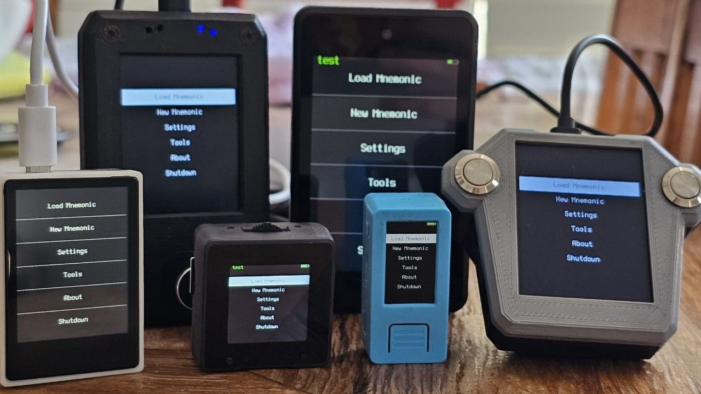
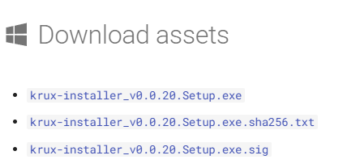
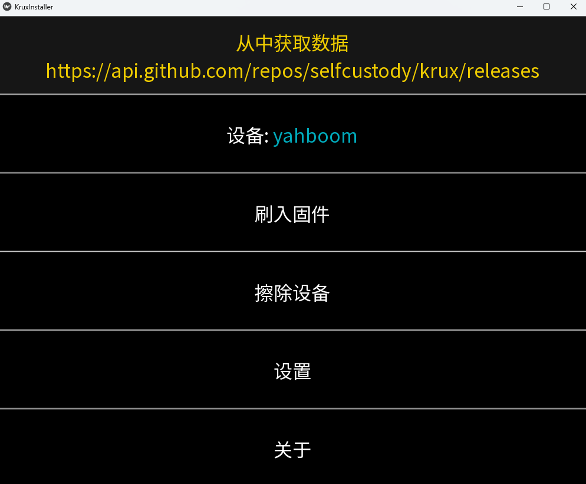

> *作者：Anony*


本文简单介绍了使用 K210 开发板制作 [Krux 签名器](https://selfcustody.github.io/krux/)的办法，以及 Krux 的特性和使用体验。



## Krux 签名器简介

Krux 是一套开源的固件，可以将基于 K210 芯片的开发板转化为比特币的硬件签名器。而 K210 芯片是基于开源的 [RISC-V 指令集](https://en.wikipedia.org/wiki/RISC-V)而设计的芯片标准，这就意味着在制作 Krux 的硬件上，玩家有相当多的选择。Krux 说明书的[设备页面](https://selfcustody.github.io/krux/parts/)给出了可以刷入 Krux 固件的 7 款硬件。

同为自制签名器，Krux 与 [SeedSigner](https://github.com/SeedSigner/seedsigner) 和 [Jade-DIY](https://github.com/epiccurious/jade-diy) 在概念上相似，但在使用体验上也有许多不同：

- Krux 的许多硬件都支持**触控屏**，这是 SeedSigner 和 Jade-DIY 都不支持的。
- Krux 的多语言支持也比另外两者更好。Krux 也支持中文。
- Krux 要求的所有硬件都带有摄像头，这意味着其默认带有基于 摄像头-显示屏（扫码-示码） 的[隔空交互](https://www.btcstudy.org/2023/08/06/seedsigner-a-self-produced-hard-signer/#air-gapped)（Air-gapped）体验。但 Jade-DIY 有多款硬件都不带摄像头（不过，这也意味着，Jade-DIY 总是可以取得最低的制作成本）。
- Krux 在密钥保存上有更多选择。这一点我们后文再展开。

总的来说，触控屏是 Krux 在体验上的特异之处。此外，由于它所使用的多款硬件都自带简单的外壳，这也使它的组装更加便利（不像 SeedSigner 一样不可避免要使用 3D 打印的外壳），价格上也有比较便宜的选择。

## 硬件挑选

在 Kurx 的设备页面可以发现，支持触摸屏的设备有三款：

- Maix Amigo （3.5 寸屏）
- Yahboom k210 module （2 寸屏）
- WonderMV （2寸屏）

这三款设备都无需其它附件，也无需 3D 打印外壳。

在选购硬件时，请务必选择**带有摄像头**的套装。

笔者从经济性角度考虑，选择了 `Yahboom k210 module`。但 Krux 的刷写过程实在过于简单，笔者有理由相信，不论你选择哪一款硬件，刷入固件的过程都不会有什么区别。

## 固件刷写

刷入固件的步骤可分为两步：（1）下载安装器；（2）自动化刷入。

### 下载安装器（以及验签）

本文使用最简单的[图形界面安装程序](https://selfcustody.github.io/krux/getting-started/installing/from-gui/)。你需要根据你的电脑的操作系统选择对应的安装器程序。

本文假设读者使用 Windows 操作系统，因此，你需要在[这个页面](https://selfcustody.github.io/krux/getting-started/installing/from-gui/windows/)的顶部下载这三样东西：



这三样东西分别是：Krux 安装器的安装文件、一个包含了一个 SHA256 哈希值的文件，还有对 Krux 安装器程序的签名。

将这三者下载到同一文件夹之后，我们再使用如下步骤来验证我们下载到的程序没有被篡改过：

- 按住键盘的 “SHIFT” 键和鼠标右键，打开 “Powershell” 或者 “终端”，输入如下命令：

  ```
  Get-Filehash ./krux-installer_v0.020.setup.exe
  ```

  按下回车键执行之后，程序会返回该文件的哈希值。手动打开旁边的 `sha256.txt` 文件，对比其中的哈希值是否一致。如果一致，则表明文件未被篡改，如果不一致，请不要使用这个安装文件！

- 在终端中使用如下命令，获得 Krux 开发者的公钥：

  ```
  gpg --keyserver hkps://keys.openpgp.org --recv-keys B4281DDDFBBD207BFA4113138974C90299326322
  ```

  然后，使用 `gpg` 的验签命令，验证 `.exe.sig` 是对 `.exe` 的有效签名：

  ```
  gpg --verify ./krux-installer_v0.020.setup.exe.sig
  ```

  如果验证通过，屏幕上打印出的信息应该含有 `good signature` 字样。如果不通过，请不要使用下载到的安装文件！

  （有经验的读者会发现，这里的签名不是对哈希文件的签名，而是对安装文件的签名。笔者也不明白为什么。）

**为确保自己下载到的软件没有经过篡改和污染，请不要跳过这些验证步骤**。

## 自动化刷入

验证完文件的完整性之后，就可以运行上一步下载到的 `setup.exe`。安装完成后，会跳出这样一个界面：



确保你连接好了你的 k210 开发板。然后点击 “刷入固件”，就可以自动完成 Krux 固件的下载和刷入。这个过程可能需要一两次你的手动确认，但极为简单，因此不再赘述。

这样安装得到的是最新版本的 Krux 固件。在笔者撰文之时，是 `25.03.0` 版本。

刷写完成后，你的 k210 开发板将重启、进入 Krux 的主界面。

## 特性及使用提醒

### 语言切换

在 Krux 的主界面，点击 “Settings（设定）”，其中包含一个 “language（语言）”。进入 “language”，用屏幕下方的 `<` 和 `>` 切换语言，遇到 “语言环境 zh-CN” 字样，就可以点击 “去”，表示确认语言选择了。

> 虽然支持中文，一部分的翻译还是比较生硬。比如这里的 “去”，英文原文为 “Go”，很容易理解，“去” 并不是恰当的翻译。

### 切换主题

在跟 “语言” 同级的菜单中，有一个 “界面” 选项，可以在其中选择界面的颜色主题。可选的主题有 5 种。

### （固件层）安全特性

在跟 “语言” 同级的菜单中，还有一个 “安全” 选项，包含了跟固件层面的安全特性相关的选项。完整的描述可见[这个页面](https://selfcustody.github.io/krux/getting-started/settings/#security)，这里仅简单介绍两个关键特性：

- 隐藏助记词。该功能开启后，对用户**导入**的种子词（助记词），Krux 不会显示出 种子词/私钥 的样貌，也不会显示备份工具。
- 防篡改检查码/启动时的 TC Flash Hash。这两个是相互搭配的功能，作用是防止设备中的 Krux 固件被篡改。用户需要先设置 “防篡改检查码”，然后，设备会要求用户用摄像头拍摄照片、从而生成足够多的随机数据、用于填满存储空间；再然后，该检查码会被用于哈希整个存储空间，并被 TC Flash Hash 功能用于校验存储空间是否遭到篡改。
  - 而 “启动时的 TC Flash Hash” 关系的是，是否要求设备在每次开机时都执行这样的篡改检查。
  - 但请注意，防篡改检查码可以阻止别人使用你的设备，但并不能防止存储空间通过 USB 访问、刷写。也就是说，你一定要记得自己是否启用了这套功能：如果你启用了，但设备开机居然并不要求你输入检查码，或输入错误的检查码也不影响其工作，就说明你的设备被篡改了（通过篡改整机的方式取消了你的检查码）。

### 生成种子词

Krux 有四种生成种子词的方式（有趣的是，它们都不使用设备本身的熵源）：

- “通过摄像头”。通过拍照获得熵源。
- “通过单词”。**注意**：此种方式的正确用法是：打印出 BIP39 词表，一条条剪下（剪成相同长度），在一个罐子（箱子）里均匀混合，然后取出 11 个/23 个（具体过程可参考[这个网站](https://seedpicker.net/guide/GUIDE.html)）。得出所需数量的词后，使用此功能逐个输入，然后 Krux 会为你生成有效的最后一个词。
  - **绝对不要**绕过上述创造随机性的程序，凭自己的感觉输入 11 个词，这是不安全的。
- “通过 D6”。即使用 6 面的色子来创造种子词。每投出一个结果就输入一次。屏幕上会显示你创造的进度。要生成一个长达 12 个词的种子词，你需要投掷至少 50 次（非常值得！）。
- “通过 D20”。即使用 20 面的色子来创造种子词。

### 种子词的加密存储

Krux 支持使用 [Passphrase](https://www.btcstudy.org/2022/12/06/everything-you-need-to-know-about-passphrases/)，也支持将种子词加密后存储在 SD 卡或设备闪存中，也可以打印成 QR 码。使用此类功能时，请非常谨慎，考虑好备份问题。

### 创建/导入种子词后的菜单

在你 创建/导入 种子词后，你可能会遇到以下四种界面（的确可能让人有些混乱）：

- 包含这些选择：“加载钱包”、“Passphare”、“自定义”、“返回”（下文称为界面 1）
- 包含这些选择：“备份种子词”、“拓展公钥”、“钱包”、“地址”、“签名”、“重启”（即设备重启）（界面 2）
- 包含这些选择：“钱包描述”、“Passphrase”、“自定义”、“返回”（下文称为界面 3）
- 包含这些选择：“网络”、“政策类型”、“脚本类型”、“账户”（下文称为界面 4）

如果你创建新的种子词，那么你遭遇界面的顺序可能是从 1 到 4；而如果你导入种子词，那么你会遇上相反的顺序（从 4 到 1）。具体来说：

- 在界面 1 选择 “加载钱包” 会进入界面 2；
- 在界面 2 选择 “钱包” 会进入界面 3；
- 无论哪个界面，“自定义” 都会跳转到界面 4。

但理解了这些选项所对应的功能，就不难把握使用顺序：

- 界面 2 所包含是钱包的基本功能，比如导出拓展公钥、查看地址和签名；
- 界面 3 的 “钱包描述”，是通过导入 “钱包描述符（descriptor）” 来说明该钱包所使用的具体脚本；跟界面 4 有些相互替代关系；
- 界面 4 所包含的设置是对 种子/钱包 使用环境的细致设定。比如说，如果你要在测试网上使用多签名钱包，那么，你需要在 “网络” 和 “政策类型” 中设置。同理，你也可以通过在 “政策类型” 中选择 “Single-sig（单签名）”，然后调整 “脚本类型”（P2PKH 或者 P2WPKH）。

总之：

- 如果你设置了 Passphrase，应尽快导入。
- 界面 3 和界面 4 的设定应视你的实际使用需要加以补充。更全面的信息一定会对你的使用有帮助（比如，让你的设备传出的公钥信息更加准确，也让你的设备从软件钱包中扫描得到的信息能够正确显示）。

（完）