> *作者：sethforprivacy*
> 
> *来源：<https://sethforprivacy.com/guides/setting-up-a-bitcoin-username/>*

在密码货币世界里，最困难的事情之一就是找出能够重复给同一人支付、*无需劳烦他们每次都给出新地址* 的办法。这一用户体验障碍背后的核心技术难题，在 Monero 中从一开始就使用 “隐身地址（stealth address）” 解决掉了；而在比特币中，最近得到越来越多采用的 “静默支付（[Silent Payments](https://silentpayments.xyz/)）”（本质上就是为比特币设计的隐身地址）以及 [BOLT 12](https://bolt12.org/) offer（为闪电网络设计的可复用且保护隐私的发票）也在技术上解决了问题。

但是，即使你有了一种又可以保持隐私、又可以重复使用的支付方法，别人怎么找到你呢？他们是给你发信息，让你给他们一串又长又乱的字符？还是你应该把它粘贴到你的推特个人简介里呢？还是说，你应该发到 nostr 网络中？[BIP 353](https://bips.dev/353/) 就尝试解决这个问题，让支付信息更容易获得 *且无需信息发布者运行一个服务器*。直接把你的支付信息添加为一个 DNS 条目（准确来说是一个 “文本（TXT）” 记录，我们下文会详细说），然后任何支持 BIP353 的钱包就可以安全地解析和验证支付细节，无需任何人工参与。

本质上，BIP 353 给了每个拥有域名的人设置自定义比特币用户名的能力（而且只需点几下鼠标）。

## 我应该使用哪种支付信息？

关于比特币用户名，一个至关重要的意识是：你 *绝不应该* 在用户名中使用标准的比特币地址或一次性的 BOLT11 发票。将一个标准的比特币地址作为你的用户名（公开暴露），将使所有人都能轻易看到 送到这个地址的交易 以及 从这个地址发出的交易，因为你也在迫使给你支付的人都重复使用这个地址（作为你的收款地址）。不应使用 BOLT11 发票的理由则恰好完全相反，BOLT11 发票都是一次性使用的，所以把它设为你的用户名，你就需要不断轮换：每当有人给你成功支付一次，你就要换上一个新的发票；这个痛苦的过程需要某种形式的自动化。（译者注：出于隐私保护的理由，也不应公开暴露 BOLT11 发票，因为它会暴露你用于收款的闪电节点的身份。在隐私性上不如下文要提到的 BOLT12 offer。）

感谢日益得到更多支持的静默支付和 BOLT12，现如今，在 [Cake Wallet](https://cakewallet.com/)、[Phoenix Wallet](https://phoenix.acinq.co/) 和 [Zeus](https://zeusln.com/) 这些集成了两者的钱包中，用户可以容易生成这两种分别为链上收款和闪电支付设计的可复用支付码，你只需设置一个静态的 DNS 记录，就可以重复获得支付，没有人能把你收到的两笔交易关联起来。

## 隐私与安全顾虑

我认为，虽然 DNS 本身不是十全十美，它为用户体验带来的力量可以胜过其缺点。匿名地注册一个域名、使用保持隐私的支付码，然后使用 BIP 353 中的 DNSSEC 来保护你免遭最简单的攻击，还是非常容易的。话虽这么说，在建立和使用比特币用户名的过程中，还是有一些简单的提醒，你要牢记：

1. 确保使用一个著名且可信任的域名供应商！
   1. 恶意的域名运营商（或哪怕仅仅是被攻击的无能服务商）可能会将你的收款细节替换成他们自己的。虽然这是极为罕见的情况，但也是有可能的，而最简单的解决方案就是只使用著名的、经过考验的域名供应商。最著名、可信任且接受比特币支付的两个域名供应商是 Njalla（本教程就使用它们）以及 Namecheap 。
2. 理想情况下，使用可以提供域名隐私性的域名供应商，以及不要求提供真实身份信息的供应商。
   1. 绝大部分域名供应商都给你提供了隐藏用来注册域名的信息（即，姓名、地址、联系方式）的选择，但也有一些供应商默认不提供。Njalla 默认保护你的信息，但 Namecheap 有一个额外的附加选项，你需要 购买/启用 才能保护你的信息。就目前来看，我觉得它应该会永久免费，但具体来说 Namecheap 未来可能会改变。
3. 在用户名中仅使用保持隐私的支付信息。
4. 就像静默支付的地址和 BOLT12 offer，你的域名也不会改变。虽然这可以提供一种类型的隐私性（防止地址复用、保护你的闪电节点的隐私性），*当你在多个平台上分享同一个域名时，其他人也将知道分享者是同一个人*。请确保你的用户从一开始就是 匿名/准匿名的，跟你的真实身份没有关联。

## 获得一个静默支付地址 以及/或者 BOLT12 offer

我会列出三个 app，它们是我最喜欢用来获得可复用且保持隐私的支付信息的应用，不过，在比特币生态系统中支持这种功能的 app 数量可能会迎来大爆发！如果你已经在使用以下其中一款钱包，可以跟随我列出的步骤；如果你用的是别家的应用，那还是选择你喜欢的应用，跳过这一段。

### 通过 Cake Wallet 获得静默支付地址

1. 下载 [Cake Wallet](https://cakewallet.com/)（译者注：如果你不是直接从正式的应用平台下载 app，请记得验证签名）
2. 新建一个比特币钱包
3. 备份这套新的种子词！
4. 点击底部的 “Receive（收款）” 按钮
5. 点击顶部 “Receive” 图标旁边的下拉菜单
6. 选择 “Silent Payment（静默支付）”
7. 复制这个支付码，然后发送给你自己，以便于在你的电脑上 复制-粘贴 它。要使用 Signal 的 “Note to Self” 这样的功能。（译者注：意思是使用安全的通讯方式。使用互联网的通讯工具来传输敏感数据是一种不推荐的做法。原作者在这里提到的 “Signal” 是一种端到端的加密通讯软件，理论上可以避免被服务商破译。但如果你的即时通讯工具没有端到端加密功能，请一定不要使用这种方式。应该使用 SD 卡/U 盘 或 本地网络。）

### 通过 Phoenix Wallet 获得 BOLT12 Offer

1. 下载 [Phoenix Wallet](https://phoenix.acinq.co/)
2. 完成钱包初始化
3. 备份你的新种子词！
4. 点击底部的 “Receive（收款）” 按钮
5. 点击 “展示可复用的 QR 码”
6. 复制它，使用 Signal 的 “Note to Self” 或类似功能分享给自己

## 通过 Zeus 获得 BOLT12 Offer

1. 下载 [Zeus](https://zeusln.com/)
2. 建立一个新钱包（要么快速启动一个内置的节点，要么连接到你自己的 CLN 节点）
   1. 注意，LND 本身还不支持 BOLT12，而且近期看不到支持的迹象，令人遗憾
3. 保存你的种子词（如果有需要的话）
4. 在主屏幕的闪电图标上从左到右滑动
5. 点击 “Pay Codes（支付码）”
6. （如有需要）为这个 BOLT12 支付码设置一个标签
7. 选择新的支付码
8. 长按 BOLT12 字符串以复制这个 offer，然后发送给你自己，以便于在电脑上复制粘贴

## 获得一个域名

现在，来到整个流程最难的一步了。为了使用 BIP353，你需要拥有一个域名（比如我的 `sethforpricacy.com` ），然后才能把这些支付指令放上去。流程还是非常直接的，不过我会带你有我最喜欢的域名注册器 [Njalla](https://njal.la/) 完全走一遍。这些步骤需要你使用 Tor 浏览器，以便在设置域名时获得多一点匿名性；但如果你认为这没必要（你也计划在别的可能关联到你真实身份的地方使用这个域名），那么你可以使用常常规的网站。

1. 如果你还没有，请下载 Tor 浏览器

2. 打开 Tor 浏览器，访问 `https://njallalafimoej5i4eg7vlnqjvmb6zhdh27qxcatdn647jtwwwui3nad.onion/` 

3. 搜索你认为有趣的域名，想搜什么就搜什么

   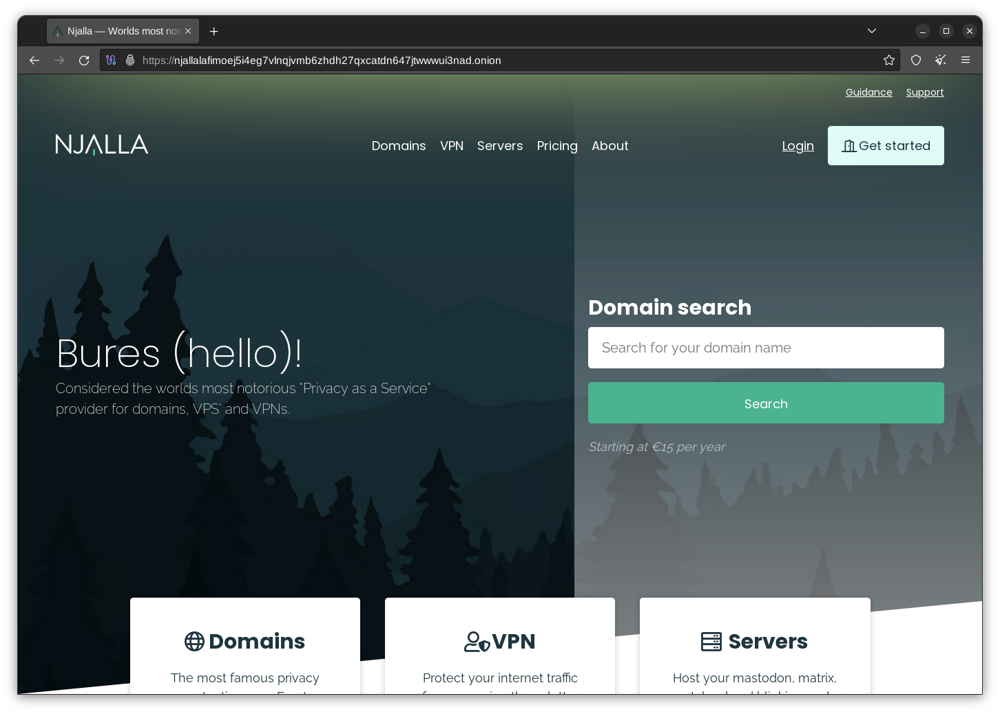

4. 如果你发现了一个喜欢的域名，就点击 “Select domain”

   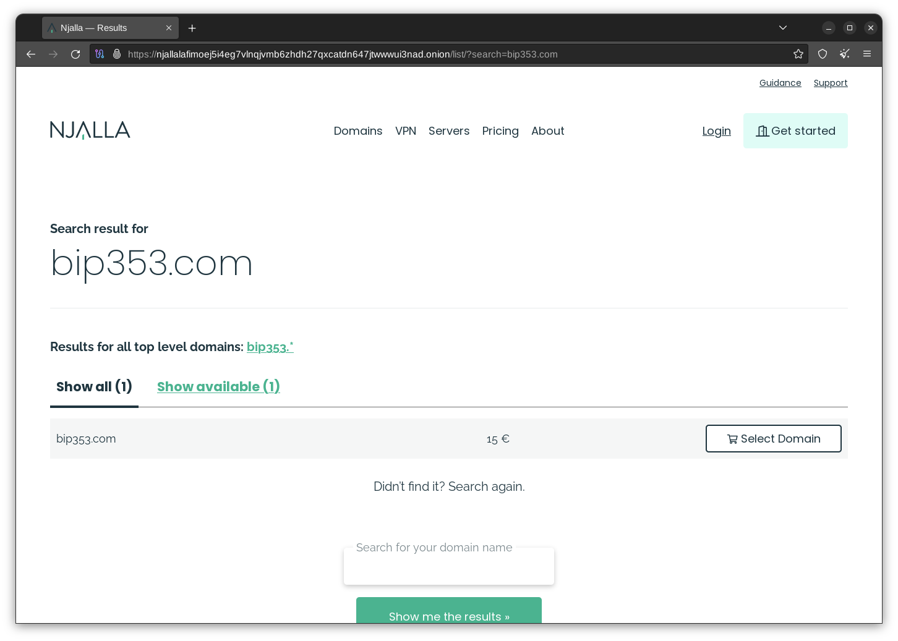

5. 选择 “Check out（结账）”

6. 创建一个账户

   1. 理想情况下，你应该使用 [SimpleLogin](https://simplelogin.io/)（或类似工具），使用一个电子邮箱昵称（而不是真实的电子邮箱地址）
   2. 此外，你应该使用一个强度高、唯一的口令。可以使用 [Bitwarden](https://bitwarden.com/) 这样的工具

   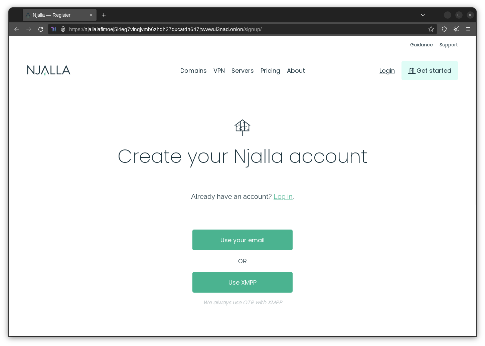

7. 进入购物清单后，点击右下角的 “Add funds（充值）” 按钮

   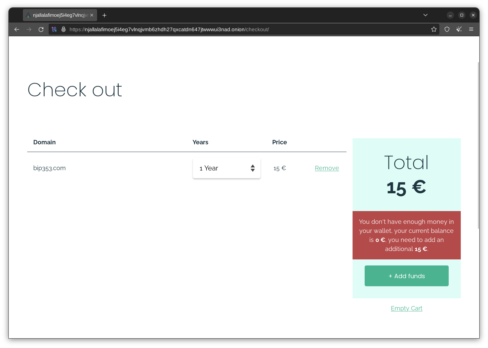

8. 使用你喜欢的支付方式充值

   1. 我会强烈建议你使用保持隐私的支付手段，比如 Monero（或者混币之后的比特币），以保证域名跟你之间没有金融上的联系

   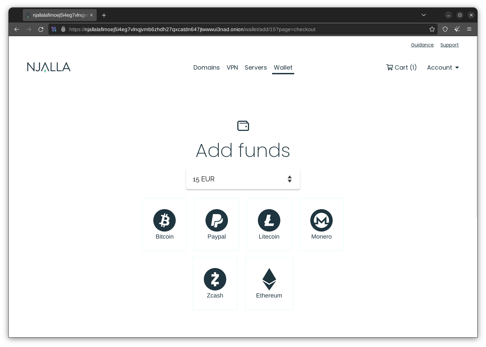

9. 资金到账之后，选择 “Pay Now（现在支付）”

这就完成了！现在，你是一个新域名的主人了，你可以使用 BIP 353 比特币用户名（以及域名的其它功能）了！

## 建立你的比特币用户名

拥有域名之后，就到了设置你的比特币用户名的时候了。切记，你要先创建一个静默支付地址，或者 BOLT12 Offer。先登录你之前建好的 Njalla 账户（或者你选择的别的域名供应商的管理界面），然后再开始。

因为 Namechaep 是另一个非常流行的域名供应商，我也会在下面列出使用 Namcheap 的配置流程。

### 在 Njalla 上创建你的比特币用户名

1. 跳转到 “Domains（域名）” 页面

2. 点击你要设置的域名右边的  “Manage（管理）” 按钮

3. 选择页面左边的 “Add record（添加记录）” 按钮

4. 将 “Type（类型）” 下拉菜单中的 “A” 改成 “TXT”

5. 在 “Name（姓名）” 字段，输入 `username.user._bitcoin-payment`，记得把这里的 `username` 改成你喜欢的词（比如 `tips`）
  
   1. 这个 `username` 就将成为你的 BIP 353 地址位于 `@域名.com` 前面的部分
   
6. 在 “Content（内容）”字段，你需要创建特定格式的字符串（由 [BIP 21](https://bips.dev/21/) 指定）
   1. 如果你只想使用 BOLT12 Offer，输入下列字符，并将 “REPLACE_ME” 换成你的 BOLT12 Offer（你从 Phoenix 或 Zeus 中得到的、以 `lno` 开头的字符串）
      1. `bitcoin:?lno=REPLACE_ME`
      2. 例如：`bitcoin:?lno=lno1pgqpvggzrdhszmg5yafguxmkm779vd8jftxskjyadjdrallmq8uxfjdjfyaq`
      
   2. 如果你只想使用静默支付，输入下列字符，并将 “REPLACE_ME” 换成你的静默支付地址（你从 Cake Wallet 中获得的 `sp1` 开头的字符串）
      1. `bitcoin:?sp=REPLACE_ME`
      2. 例如：`bitcoin:?sp=sp1qqweplq6ylpfrzuq6hfznzmv28djsraupudz0s0dclyt8erh70pgwxqkz2ydatksrdzf770umsntsmcjp4kcz7jqu03jeszh0gdmpjzmrf5u4zh0c`
      
   3. 如果你想同时使用两者，那么输入以下字符，并将 “REPLACE_ME_BOLT_12” 替换成你的 BOLT12 offer，将 “REPLACE_ME_SP” 替换成你的静默支付地址
      1. `bitcoin:?lno=REPLACE_ME_BOLT_12&sp=REPLACE_ME_SP`
      2. 例如：`bitcoin:?lno=lno1pgqpvggzrdhszmg5yafguxmkm779vd8jftxskjyadjdrallmq8uxfjdjfyaq&sp=sp1qqweplq6ylpfrzuq6hfznzmv28djsraupudz0s0dclyt8erh70pgwxqkz2ydatksrdzf770umsntsmcjp4kcz7jqu03jeszh0gdmpjzmrf5u4zh0c` 
      
      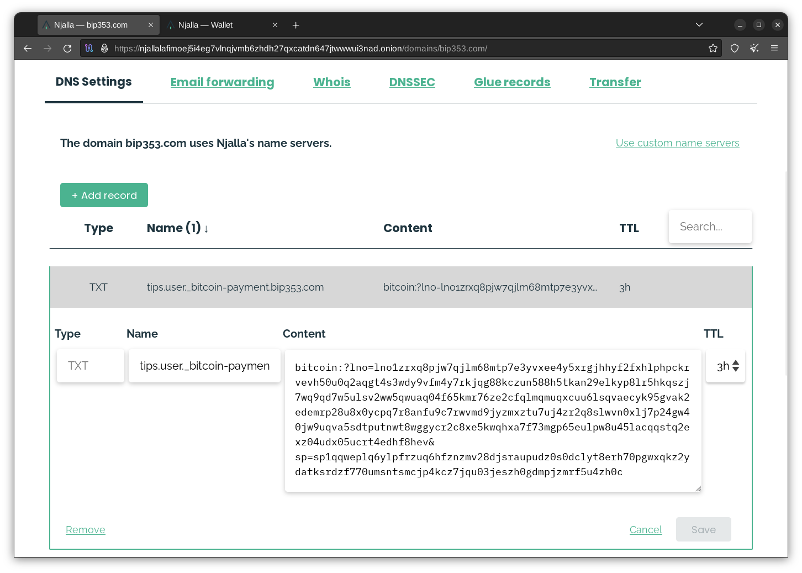
   
7. 点击右边的 “Add（添加）” 按钮

8. 跳转到 “DNSSEC” 页面

9. 选择 “启用 DNSSEC”

   1. DNSSEC 是一种协议，可以保证除了你和正式的 DNS 服务器之外，没人能替换你的 TXT 记录，这是 BIP353 的关键安全错许昌。没有它，你的用户名就无从谈起！

这就是全部啦！现在，你应该可以用你的新的用户名来收取支付啦，它的形式是 “[username@domain.com](mailto:username@domain.com)” 这样的，在我们这里，是 `tips@bip353.com` 。

### 在 Namecheap 上创建你的比特币用户名

1. 登录你的[管理面板](https://ap.www.namecheap.com/dashboard)
2. 点击你的域名右边的 “Manage（管理）” 按钮
3. 选择页面顶部右边的 “Advanced DNS（高级 DNS）” 页面

   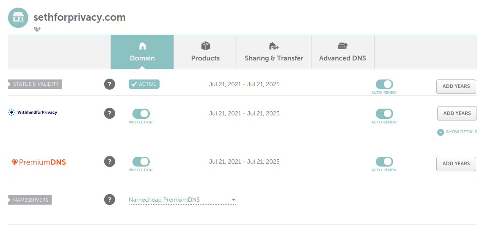

4. 选择 “Host Records（托管记录）” 细分选项的 “Add new record（添加新记录）” 功能

   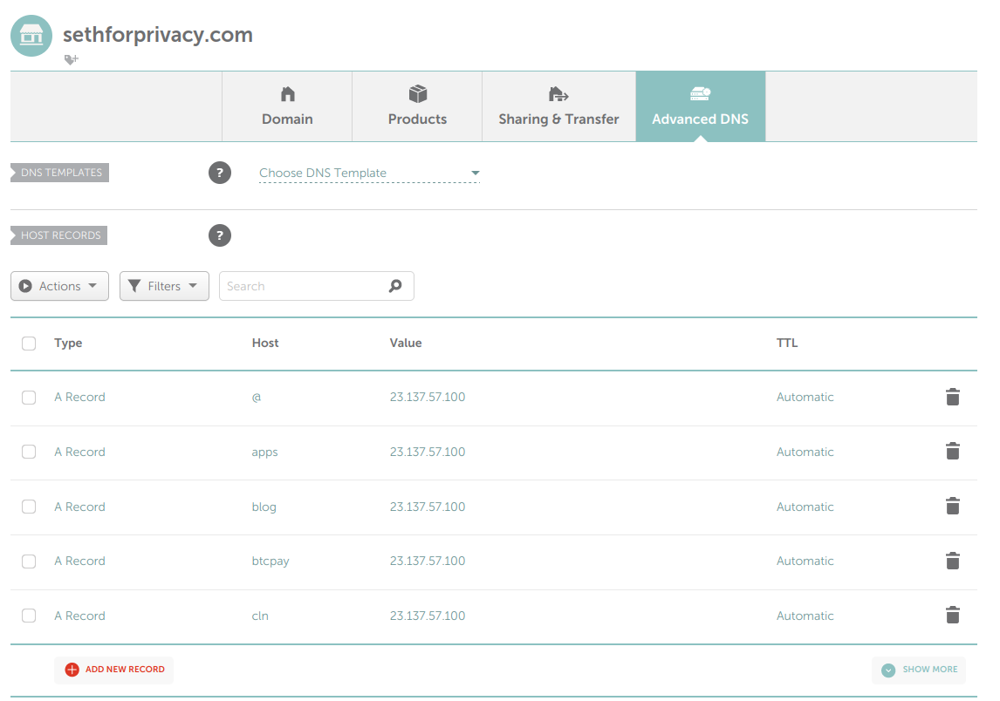

5. 将下拉列表中的 “A record” 改为 “TXT record”

6. 在 “Host（托管）” 字段，输入 `username.user._bitcoin-payment`，记得把这里的 `username` 改成你喜欢的词（比如 `tips`）

   1. 这个 `username` 就将成为你的 BIP 353 地址位于 `@域名.com` 前面的部分

7. 在 “Content（内容）”字段，你需要创建特定格式的字符串（由 [BIP 21](https://bips.dev/21/) 指定）
   1. 如果你只想使用 BOLT12 Offer，输入下列字符，并将 “REPLACE_ME” 换成你的 BOLT12 Offer（你从 Phoenix 或 Zeus 中得到的、以 `lno` 开头的字符串）

      1. `bitcoin:?lno=REPLACE_ME`
      2. 例如：`bitcoin:?lno=lno1pgqpvggzrdhszmg5yafguxmkm779vd8jftxskjyadjdrallmq8uxfjdjfyaq`

   2. 如果你只想使用静默支付，输入下列字符，并将 “REPLACE_ME” 换成你的静默支付地址（你从 Cake Wallet 中获得的 `sp1` 开头的字符串）

      1. `bitcoin:?sp=REPLACE_ME`
      2. 例如：`bitcoin:?sp=sp1qqweplq6ylpfrzuq6hfznzmv28djsraupudz0s0dclyt8erh70pgwxqkz2ydatksrdzf770umsntsmcjp4kcz7jqu03jeszh0gdmpjzmrf5u4zh0c`

   3. 如果你想同时使用两者，那么输入以下字符，并将 “REPLACE_ME_BOLT_12” 替换成你的 BOLT12 offer，将 “REPLACE_ME_SP” 替换成你的静默支付地址

      1. `bitcoin:?lno=REPLACE_ME_BOLT_12&sp=REPLACE_ME_SP`
      2. 例如：`bitcoin:?lno=lno1pgqpvggzrdhszmg5yafguxmkm779vd8jftxskjyadjdrallmq8uxfjdjfyaq&sp=sp1qqweplq6ylpfrzuq6hfznzmv28djsraupudz0s0dclyt8erh70pgwxqkz2ydatksrdzf770umsntsmcjp4kcz7jqu03jeszh0gdmpjzmrf5u4zh0c` 

    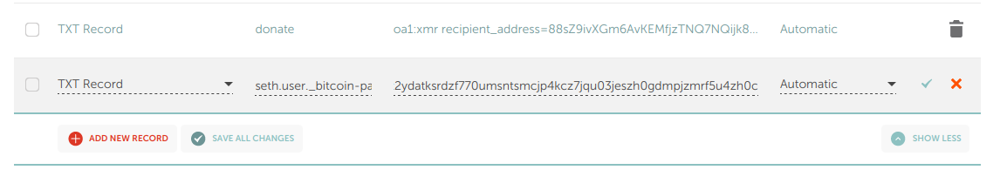

8. 点击页面右边的绿色勾，保存内容

9. 确保 “Host Records” 项下的 DNSSEC 功能启用了

   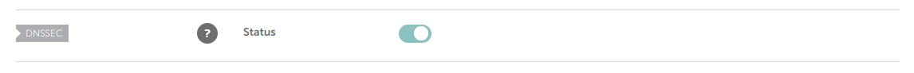

### 测试你的新用户名

最好的工具是由 [TheBlueMatt](https://x.com/TheBlueMatt)（BIP353 的作者）编写的。

1. 跳转到 [satsto.me](https://satsto.me/)

2. 在文本框里输入你的新的 [username@domain.com](mailto:username@domain.com)

   1. （在我这里是 `tips@bip353.com`）

3. 看看解析出来的支付细节对不对

   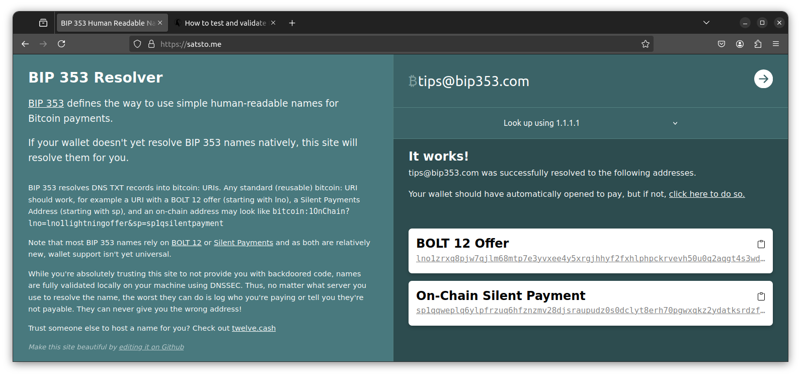

你也可以用已经支持 BIP 353 的应用（比如 Phoenix Wallet）测试看看。

## Monero 用户名

如果你只使用 Monero，有一个已经受到支持的、非常相似的协议，叫做 Open Alias。（略）

## 结论

看到 BIP 353 用户名协议的采用在增加，我非常激动，因为它让可复用且保持隐私的支付手段更易于找寻和使用。希望这份教程能帮助更多人建立自己的用户名并传播出去！如果你觉得这份指南还是太难了（或者你就是不想处理跟域名相关的东西），可以看看 [twelve.cash](https://twelve.cash/) ，一个神奇（但可信任！）的服务。

如果你对这份指南有任何疑问，或希望寻找某个方面的更多信息，请[联系我](https://sethforprivacy.com/about/#how-to-contact-me)。

（完）

