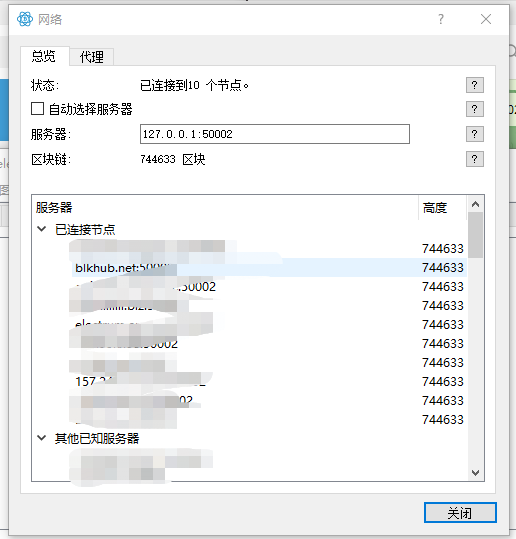
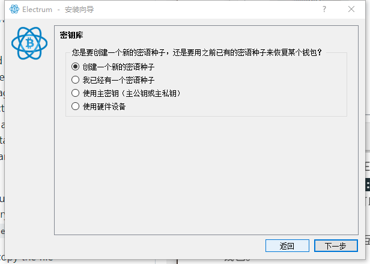
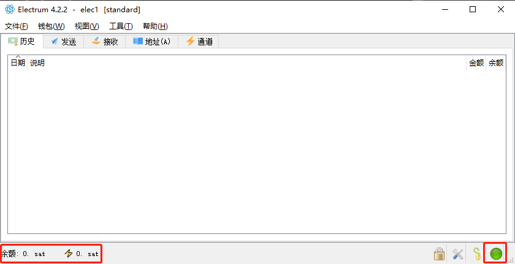

> *作者：Anony*


本文是[这份在树莓派上安装比特币节点的教程](https://www.btcstudy.org/2021/11/08/how-to-run-a-bitcoin-full-node-and-lightning-node-on-a-raspberry-pi/)的续篇，旨在帮助读者安装 [Electrum 个人服务器](https://github.com/chris-belcher/electrum-personal-server)（Electrum Personal Server，EPS）并使用 [Electrum 钱包](https://electrum.org/#home)（Electrum Wallet）。

## 一. 为什么要使用 Electrum 钱包和 EPS？

总的来说，我们使用 Electrum 钱包是为了**它的功能性，以及它的用户体验**。相比于其它钱包，Electrum 钱包的功能性非常出色。而相比于 Bitcoin Core 自带的钱包功能，Electrum 钱包的用户体验更加友好。

Electrum 钱包是比特币世界最著名（可能也是最老牌）的桌面钱包之一，拥有非常完整的钱包功能（层级式钱包、多签名钱包支持、硬件钱包支持、闪电钱包，都不在话下）。Electrum 钱包也是完全**开源**的。

最重要的是，Electrum 允许用户指定服务端，你既可以使用 Electrum 钱包团队的节点作为服务端，也可以使用自己的节点作为服务端，还可以使用别人的节点。这在最大程度上减少了**单点故障**，并给了用户对自己的信息的**更强控制权**。

不过，既然我们要当一个硬核的比特币爱好者，那当然要使用自己的节点。因为使用自己的节点可以更好地保证隐私性，你可以直接把交易发送到网络中，不需要假手他人；当你在区块链上扫描地址，也不会因为借用了别人的节点而被发现你可能在使用哪些地址。

也正因此，我们要学习安装 EPS。因为 Electrum 钱包无法直接跟 Bitcoin Core 通信，它需要借助 EPS。也就是说，实际上，**Electrum 钱包是跟 EPS 通信，而 EPS 跟 Bitcoin Core 通信，实现完整的功能**。

运行 EPS 也有额外的一些好处：它不仅可以作为 Electrum 钱包的后端，也可以作为 [Blue Wallet 手机钱包](https://bluewallet.io/)、[Trezor 硬件钱包套件 Trezor Suite](https://www.btcstudy.org/2022/04/04/connecting-your-wallet-to-a-full-node/) 的后端，它也是最流行的个人钱包服务后端。

总之，使用自己的节点有许多好处（最主要是隐私性上的），而为了搭配 Bitcoin Core，我们需要安装 Electrum 个人服务器。

## 二. 安装和配置 Electrum 钱包及 EPS

跟上一篇教程一样，我们会先列出最有帮助的文档，并在具体章节中写明它们的参考价值。这些文档有：

- 【1】Electrum 个人服务器的 Github 代码库介绍页（英文）：https://github.com/chris-belcher/electrum-personal-server#readme
  - 这个介绍页本身就是一份安装和配置的教程，还列出了一些可能有用的教程的清单
- 【2】如何安装你自己的比特币节点，Electrum 钱包和服务器（英文）：https://curiosityoverflow.xyz/posts/bitcoin-electrum-wallet/
- 【3】手把手教你在树莓派上安装 Bitcoin Core、Electrum 个人服务器和 Electrum 钱包（英文）：https://armantheparman.medium.com/complete-instructions-bitcoin-core-and-electrum-personal-server-electrum-wallet-on-a-raspberry-a35a3d83a772
  - 这篇文章的 “Edit EPS config file（编辑 EPS 配置文件）” 可以帮助我们解决一个配置中的大难题

还需要说明的是按照本教程操作的的最终效果。

笔者最终实现的效果是把 EPS 和 Bitcoin Core 安装在同一台设备（树莓派）上，而把 Electrum 钱包安装在另一台设备（Windows 系统）上，Electrum 钱包与 EPS 的沟通则使用 SSH 通道来解决。这样做的好处是更加灵活；因为节点可以放在固定的位置，不影响你在任何地方使用 Electrum 钱包；但这意味你需要随时能使用 SSH 访问你的节点，也就是你的节点设备要有一个随时能访问的 IP。

不过，将 Electrum 钱包与 EPS 安装在同一台设备上的操作，与我们这里讲解的不会有太大差别。

### 安装 Electrum 钱包并生成私钥

这一部分操作分为三步：下载并安装 Electrum 钱包；初始化设置；生成私钥并获得公钥。

先从 [Electrum 钱包下载页](https://electrum.org/#download)下载安装文件，请根据你希望安装 Electrum 钱包的设备的系统选择安装文件。比如笔者希望在 Windows 系统中安装，而你可能希望直接安装到树莓派上，那么你需要下载 Linux 系统对应的那个版本。

为确保软件的安全性，请使用 gpg 验证签名。验证签名的一般化教程可见[上一篇教程的附录](https://www.btcstudy.org/2021/11/08/how-to-run-a-bitcoin-full-node-and-lightning-node-on-a-raspberry-pi/#B-%E9%AA%8C%E8%AF%81%E8%87%AA%E5%B7%B1%E4%B8%8B%E8%BD%BD%E7%9A%84%E8%BD%AF%E4%BB%B6)；[Bitcoin Wiki 的 Electrum 页面](https://en.bitcoin.it/wiki/Electrum)也提供了验证签名的教程；还有一个细节：使用 gpg 验证签名时，请确保签名文件的前缀和被签名的文件的文件名一致，如果被签名文件的名字是 ` electrum.exe ` ，则签名文件的名字应该是 ` electrum.exe.asc ` 。从下载页中得到的签名文件的前缀与安装文件的名字不一致，会导致无法校验。

接下来是初始化设置。为了避免 Electrum 钱包在启动时默认连入 Electrum 团队提供的节点，我们需要将 Electrum 设置成离线运行。

- 如果你使用的是 Windows 系统或其它具有图形界面的系统，请正常打开软件。它会弹出如下界面来询问你是否让它自动选择服务器。请取消 “自动选择服务器” 的选项，并在 “服务器” 框内输入 ` 127.0.0.1:50002 ` 。这个地址表示使用本地的 50002 端口作为服务端，这也是 EPS 的默认监听端口：
- 如果你要使用命令行来运行 Electrum 钱包，请为命令加上  ` --server localhost:50002:s ` 参数，最好再加上  ` --offline ` 参数（参考【1】）。或者你可以直接编写 Electrum 钱包的配置文件（参考【2】）
- 最不济，你可以先把电脑的互联网连接完全断开，再运行 Electrum 钱包。

完成网络设置后，Electrum 会引导你生成一个新的钱包。因为 Electrum 钱包的功能非常全面，它支持你生成新的钱包、导入旧的钱包、生成多签名钱包、配合硬件钱包使用，等等。这里为了方便，我们直接生成一个新的钱包。请在遇到下面这个界面时选择 “创建一个新的密语种子”。它将为你生成一套 12 个词的助记词：



> 再次强调钱包使用的基本原则：如果你没有备份一个钱包，就不要向它控制的地址转入资金！

生成好了以后，我们执行最后一步：获得该钱包的 “主公钥”，该 “主公钥” 用来让 EPS 扫描区块链和监听交易。在 Electrum 钱包的菜单中点击 “钱包”，选择 “信息”，它将告诉你钱包的类型，闪电网络节点 ID 等等，复制 “主公钥” 框中的内容并保存起来。主公钥是以  ` xpub ` 、 ` ypub ` 或  ` zpub ` 开头的字符串。**注意，不要向他人暴露你的主公钥，这会让别人可以知道你所有的地址以及这些地址上的交易！**

### 安装及配置 EPS 

本部分操作分为两步：安装 EPS；配置 EPS。

我们直接用命令行完成下载和安装：

```bash
wget https://github.com/chris-belcher/electrum-personal-server/archive/refs/tags/eps-v0.2.4.tar.gz
tar -xvf eps-v0.2.4.tar.gz
cd /home/<你的用户名>/electrum-personal-server-eps-v0.2.4/
cp config.ini_sample config.ini
pip3 install --user .
bitcoin-cli createwallet <任意名称> true
```

我们分步讲解这几条命令的作用：

- 第一条命令 ` wget ` 是下载 EPS 的压缩包
- 第二条命令 ` tar ` 则是使用 tar 软件来解开压缩包
- 第三条命令 ` cd ` 是进入到 EPS 的代码文件夹。注意，这条命令无法原样复制，你需要把  ` <你的用户名> ` 改成你树莓派的用户名
- 第四条命令 ` cp ` 是把  ` config.ini_sample ` 这个文件复制并另存为  ` config.ini ` 这个文件。后文我们就会介绍如何编辑  ` coinfig.ini ` 这个文件，这也是配置 EPS 的主要步骤。
- 第五条命令是为系统安装 EPS。

接下来我们编辑  ` coinfig.ini `  文件。可以直接在文档管理器中以图形界面打开。编辑的要点如下：

- 文件里面包括注释的内容很多，看起来可能很烦人。但如果你不需要配置相应的参数，就保持原样不要动它。**请不要删去方括号（`  []`）框起来的部分！**
- 我们需要配置的部分有： ` [master-public-keys] ` 、 ` [bitcoin-rpc] ` 、 ` [electrum-server] ` 。
- 在 ` [master-public-keys] ` 部分， ` #any_name_works ` 下面一行，输入你在 Electrum 钱包中得到的主公钥： ` <随便什么名字> = <你的主公钥> ` 
  - 如果你有多个主公钥，可以分行输入，使用不同的名字就互不影响
- 在 ` [bitcoin-rpc] ` 部分，在  ` datadir =  ` 前面加上  ` # ` ，将它注释掉，然后将  ` #rpc_user = ` 和  ` #rpc_password = ` 前面的  ` #  ` 删去，在后面填上你在  ` bitcoin.conf ` 配置文件中相应的值。
  - 这一大串文字是什么意思呢？它主要解决的是你的 EPS 如何跟 Bitcoin Core 程序通信的问题。要么使用  ` datadir `  参数，填入 Bitcoin Core 的数据目录，EPS 会到该目录去寻找一个  ` .cookie ` 文件来获得 Bitcoin Core 的相关参数（这需要保持后文的  ` rpc ` 参数的注释符号）；要么使用 ` rpc ` 方法，这就需要把  ` datadir ` 参数注释掉。
  - 但是，如[上一篇教程](https://www.btcstudy.org/2021/11/08/how-to-run-a-bitcoin-full-node-and-lightning-node-on-a-raspberry-pi/#%E9%85%8D%E7%BD%AE%E6%AF%94%E7%89%B9%E5%B8%81)所述，我们将 Bitcoin Core 的运行参数写成了一个配置文档，这使得其数据目录里面根本不会产生  ` .cookie ` 文件，EPS 也将无法运行。因此我们要注释掉 ` datadir ` 参数，使用  ` rpc ` 方法。RPC 方法的用户名和口令，请在自己的 Bitcoin Core 配置文件里面找，找到后复制过来即可。如果你阅读了上一篇教程，这应该不是什么难事。
  - 如果你没有为 Bitcoin Core 编写过配置文件，比如你用的是  ` bitcoin-qt ` 而不是  ` bitcoind ` ，那么，是可以通过在  ` datadir ` 参数中填入目录来让 EPS 工作的。
  - 请一定保持 ` rpc_user ` 和  ` rpc_password ` 这两个参数的名称不变，不然会出错（中间的 ` _ ` 不能删去）。
- 在 ` [bitcoin-rpc] ` 部分， ` wallet_filename = ` 后填入你使用 ` bitcoin-cli createwallet ` 生成钱包时所用的名称。
  - 这个钱包实际上变成了 EPS 调用 Bitcoin Core 钱包组件的一个端口。请不要为这个钱包设置口令，不然你启动 EPS 时将需要把口令也附上；又因为它没有口令的保护，请不要真的使用这个钱包。我们使用 Electrum 钱包就好。
-  ` [bitcoin-rpc] ` 的其余部分是跟资源消耗量有关的参数，比如多久在网络中查询一次新交易之类的。如果你可以看懂配置文件中的注释，可以自己调一下，但不是非调不可。
- 在 ` [electrum-server] ` 部分中，将  ` broadcast_method ` 的值改为 ` own-node ` ，这将保证 EPS 只会通过你的比特币节点来跟比特币网络通信。
  - 这个参数也事关 EPS 使用 Internet 还是洋葱网络来跟外界通信。笔者没有专门了解过洋葱网络在当前网络环境下的可用性，也没有设置过 Bitcoin Core 使用洋葱网络。如果想要设置使用洋葱网络，读者还需自己做点功课。

至此，EPS 的配置文件就编辑完成了。我们使用命令行来启动 EPS。

```bash
electrum-personal-server config.ini
```

如果你的命令行窗口在 EPS 目录内，你可以直接使用上面这条命令。否则你可能需要：

```bash
electrum-personal-server /home/<你的用户名>/electrum-personal-server-eps-v0.2.4/config.ini
```

理论上，EPS 现在能够正常启动了，你将能够在命令行窗口内看到 EPS 的启动信息和捐赠地址。

> **2023 年 3 月 24 日重要补充：**
>
> 从 2023 年 3 月开始，如果你依然使用 0.2.4 及以前的 EPS，你的 Electrum 钱包将无法与之建立正常的网络连接，因此下文所谓的绿点将不会出现。这是因为 EPS 需要使用 SSL 证书，而软件包中自带的证书已经在 3 月 12 日过期。因此，你需要参考[这份 Issue](https://github.com/chris-belcher/electrum-personal-server/issues/286) 来更新 SSL 证书。简述如下：
>
> 第一步：移动到证书相关的目录，备份老的证书并在目标文件夹内删除老证书：
>
> ```
> cd electrum-personal-server-eps-v0.2.4/electrumpersonalserver/certs
> cp -r ../certs ../certs_backup
> rm cert.*
> ```
>
> 第二步：生成自签名的证书：
>
> ```
> openssl genrsa -des3 -passout pass:<password> -out server.pass.key 2048
> openssl rsa -passin pass:<password> -in server.pass.key -out cert.key
> rm server.pass.key
> openssl req -new -key cert.key -out cert.csr
> openssl x509 -req -days 1825 -in cert.csr -signkey cert.key -out cert.crt
> openssl x509 -enddate -in cert.crt
> ```
>
> 第一行指令是在生成私钥。**注意，这里的口令（password）必须长于 4 位，短于 1300 位**。
>
> 第二行是生成公钥。后面是移除私钥、生成证书请求以及签名证书。注意，在生成证书请求时，它可能要求你填入地区、组织名、用户名一类的信息，并无特别大的意义，但似乎不应一个都不填。最后一行是为证书添加 5 年的使用时间。
>
> 第三步：回退到 EPS 软件的目录（在我们这里就是 `electrum-personal-server-eps-v0.2.4`）然后运行：
>
> ```
> pip3 install --user .
> ```
> 这表示重装软件。
>
> 完成上述步骤之后，重新启动 EPS，就能保证连接顺利了。你可能需要手动杀死原来的 EPS 进程，才能重启成功。


现在，我们启动 Electrum 钱包，在钱包的主界面，你可以看到右下角出现绿色小点，左下角显示你的余额：



需要提醒的是，在 Electrum 钱包工作期间，需要保持 EPS 的命令行窗口，该命令行窗口关闭会使 EPS 停止运行。想设置 EPS 的启动快捷方式和开机启动，请参考[上一篇教程](https://www.btcstudy.org/2021/11/08/how-to-run-a-bitcoin-full-node-and-lightning-node-on-a-raspberry-pi/#%E9%85%8D%E7%BD%AE%E6%AF%94%E7%89%B9%E5%B8%81)。

## 结语

至此，我们已经配置好了 Electrum 个人服务器并使之搭配 Bitcoin Core 来运行。有了 EPS，我们可以将它作为我们的 Electrum 钱包的服务端，从而最大限度保证我们的隐私性。EPS 还可以服务其它钱包软件。Electrum 钱包内也可以生成多个钱包，为使它工作，只需将其主公钥填入 EPS 的配置文件即可。

（完）

