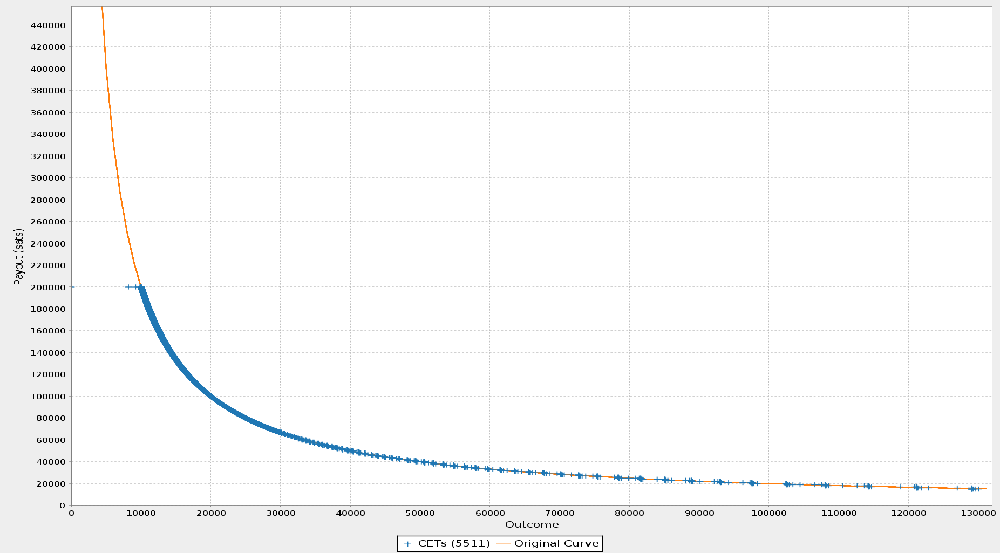

> *作者：Nadav Kohen*
> 
> *来源：<https://suredbits.com/settlement-of-dlcfd/>*

2020 年 12 月 17 日，Roman 和我缔结了一种特别的谨慎日志合约（DLC），叫做 “[差价合约（CFD）](https://www.investopedia.com/terms/c/contractfordifferences.asp)”，或者说 “谨慎日志差价合约（DLCFD）”。Roman 拿着价值 22.80 美元的比特币进入合约，最终也将拿着同样多美元价值的比特币离开合约。当然，在此期间，比特币跟美元的汇率会变化，也就是，如果比特币的美元汇率下降，那么我就必须给 Roman 支付差价，使他能拿到价值 22.80 美元的比特币、退出合约；反之，如果比特币的美元汇率上升，Roman 就只能拿着比进入合约时更少的比特币离开合约 —— 他要给我支付差价，最终他拿走的比特币仍然价值 22.80 美元。

从 Roman 的角度看，差价合约使他可以持有比特币而不承担比特币价格波动的风险（假定他想用美元给自己的资产计价）。无论比特币的美元汇率走高还是走低，这个差价合约都会为他覆盖差价，让他能留存固定的美元价值。Roman 的支付曲线如上图所示（断言机的结果是 BTC/USD 汇率）。他在 BTC/USD 的汇率为 22800 美元的时候拿着 10000 聪进入合约，因此，你可以注意到，如果汇率没有变化，他将拿回自己的 10000 聪，如果汇率上升，他就会损失一些聪，最终他得到的美元价值不变。另一种理解思路是，假设我们重新绘制这条曲线，以美元而不是聪来计量其得到的支付，那就会变成一条平线 —— 不论 BTC/USD 汇率如何变化，他得到的总是 22.80 美元。

但是，从我的角度来看（也即上图支付曲线的颠倒版本），这是一种对 BTC/USD 汇率的看多头寸，意思是，我在赌 BTC/USD 的汇率会走高，从而 Roman 要给我支付差价。

某种程度上，DLCFD 使得我们可以解耦 持有/使用 BTC 与价格波动的风险（他们通常是相连的）。只要有人认为 BTC/（其它资产） 的价格会涨，其他人（比如商人）就可以跟他们订立差价合约，

从而在一定时间内固定自己的资金的价值（以这些其它资产计）。而当这个人希望给其他人支付 BTC 时，TA 可以退出差价合约，这样从 TA 自己的角度看，TA 几乎从未暴露在 BTC 价格波动的风险下，而且依然能使用 BTC 作为一种支付基础设施。

现在我们知道差价合约是什么了，也知道了它的一些用场。现在我们来研究一下如何在比特币上执行 DLCFD。一个 DLC 由一笔链上注资交易和一组链下交易（称为 “合约执行交易（CET）”）组成。合约的每一种可能的结局，都有一笔 CET 与之对应，并且 CET 的输出就反映了该结果下各方可得的支付。每一笔 CET 都花费链上注资交易的 2-of-2 多签名输出，而且，每个 CET 的花费条件都包含断言机对各 CET 专属消息的签名，从而强制执行断言机合约。想更多了解 DLC 的原理，请看我们之前的[系列博客](https://suredbits.com/discreet-log-contracts-part-2-how-they-work-adaptor-version/)，或者开发中的 [DLC 规范](https://github.com/discreetlogcontracts/dlcspecs)（包含了额外的资源）。

就像我们在之前的《[波动性 DLC](https://suredbits.com/settlement-of-volatility-dlc/)》中提到的，DLC 理论上支持任意数量的结果（因此支持任意的断言机合约）。但是，在现实中，我们需要压缩结果的数量到合理的情形，以方便参与者的沟通和减少计算负担。我们讨论了常量值结果的连续间隔如何可以通过断言机签名每个结果的每个二进制位（也就是比特）来压缩到微不足道的大小。这使得我们可以无视不重要的数位、创建可以覆盖许多结果的交易，比如说，如果我们可以忽略最后 10 个比特（因为无论它们数值为何，支付额都是一样的），我们可以构造出一次性 覆盖 2 ^ 10 = 1024 个结果的交易。也就是说我们只需要创建、发送和存储 1 个适配器签名，而不是 1024 个！

我们的断言机 [Skrik](https://oracle.suredbits.com/event/78b04cca31f575164f8d591edba3838dcf802eccdbd7ed91a380a5593cb210c4) 承诺签名 BTC/USD 的 17 个二进制位的形式（支持从 0 美元/BTC 到 131071 美元/BTC 之间的所有价格数值）。

在我们的波动性合约中，我们使用这种压缩技巧，用不到 20 笔交易覆盖了所有不在我们预期的价格范围（17000 美元到 21000 美元）一直到 131071 美元的情形。不过，你可以注意到，在 CFD 的情形中，只有一方拥有定值期权（contant-valued collar），而且需要覆盖的情形要更少。这就是我们需要用到的第一个新工具：舍入间隔。

在合约谈判期间，Roman 和我同意，所有结果的支付额都只需精确到 100 聪；若是价格高于 3 万美元，可以只精确到 1000 聪（请注意，即时比特币价值 13 万美元，1000 聪也不过价值 1.30 美元，只是锁定资产的一小部分）。这种合意使我们可以在所有地方使用使用 CET 压缩算法，而不是只能在定值期权中使。具体来说，它使我们可以利用支付曲线上任何平坦的地方（不陡峭的地方），因为这些地方是相对平坦的，我们就可以将一大部分舍入同一个 1000 聪的结果组中，并压缩这个间隔。

这个方案效率高吗？一下是我们这个 DLCFD 的一些数据：

- 不使用舍入，需要签名 86718 个 CET，这需要大量的计算时间和大约 65 MB 的数据空间
- 将超过 30000 美元的所有结果都舍入到 1000 聪，只需签名 20547 个 CET，需要 15 MB 存储
  - 注意，这个数量的大部分都来自 10000 到 30000 的价格区间内。本质上，曲线上超过 30000 美元的平坦部分，可以被压缩到寥寥数个 CET 中！
- 将 0 美元到 30000 美元的结果都舍入到 100 聪，并将上一条的价格区间舍入到 1000 聪：5511 个 CET，只要求 3.5 MB 的空间
  - 注意，在支付曲线上最陡峭的地方，即使仅仅是舍入到 100 聪（价值 1~3 美分），可以将 CET 的数量降低 4 倍！

如果你对更多细节感兴趣，舍入间隔技术已经被包含到 “[数字结果提案](https://github.com/discreetlogcontracts/dlcspecs/pull/110)” 中，并且已经在 [bitcoin-s 库的一个实验性分支中实现](https://github.com/nkohen/bitcoin-s-core/blob/update-contract-info/app-commons/src/main/scala/org/bitcoins/commons/jsonmodels/dlc/RoundingIntervals.scala)。

让我们得以执行 CFD 的第二个大胆的工具是 Antoine Riard 的 “[非交互式协议提案](https://github.com/discreetlogcontracts/dlcspecs/blob/master/Non-Interactive-Protocol.md)”。当 Roman 和我最初广播我们的[注资交易](https://blockstream.info/tx/7f10b60c2fbd4d4632c4fc7a32a9dada7bc3b806ef78bf750079f2a180340a17)时，我马上意识到，我们犯了一个错误。我们已经同意使用 50 聪/vByte 的手续费率，但并没有检查这个费率在当时合不合理；那时候的平均手续费率远远超过 100 聪/vByte！我没有要求我们重新连接并建立一个新合约，这需要我们重新签名几千个 CET，而是使用 “[子为父偿（CPFP）](https://en.bitcoin.it/wiki/Miner_fees#Feerates_for_dependent_transactions_.28child-pays-for-parent.29)” 单方面追加手续费，简单来说就是用一笔过高手续费的交易来花费过低手续费的交易的输出，从而让整体的手续费率变得合理、让两笔交易对矿工来说都变得有吸引力（因为他们没法只让子交易上链；如果父交易得不到确认，子交易就是无效的）。因此，我广播了一笔 [CPFP 交易](https://blockstream.info/tx/6c640d606e8f61a6205cbb5661b5c080100c448420c869f9559979af59551a8b)，让我们的注资交易得以确认，这样就完全不需要我和 Roman 再有什么交互。要是我又犯了傻，我的 CPFP 交易无法为父交易提供足够多的手续费，那么我可以使用 “[手续费替换（RBF）](https://github.com/bitcoin/bips/blob/master/bip-0125.mediawiki)”，用带有更高手续费的子交易来替换原来的 CPFP 交易。（译者注：CPFP 和 RBF 都是为比特币交易追加手续费、使之更快得到确认的方法）

我们也使用非交互式协议的 CPFP 机制来确认[我们的 CET](https://blockstream.info/tx/cb5214a802f483ed564d1b1aa40c0ad5f25e87d65692b63f668eb164ad084a92)，它原来也是使用 50 聪/vByte 的手续费率的，Roman 广播了一笔[子交易](https://blockstream.info/tx/933fb4eba8531fc2ab1dfe5c9f7b6810b3cc14767aa7a57b5682c619ad41d085)来补充手续费。

最终，我们的断言机广播了对结果（BTC 价格为 23472 美元）的签名，然后你会看到，在我们的 CET 中，Roman 得到了 0.000974 BTC（23427 * 0.000974 = 22.82），正好在我们的舍入共识范围内（100 聪等于 0.023 美元），也正好是 22.82 美元！

就像我们在[上一篇博客](https://suredbits.com/settlement-of-volatility-dlc/)中提到的，不远的将来我们将支持门限断言机签名，比如使用 3 个断言机中的 2 个来执行一个差价合约。我正在撰写一个关于实现方案的提议，很快就能在 DLC 规范仓库放出！

一个更加长期，但依然非常重要的额外优化是在闪电网络上支持 DLCFD。我们现在的代码已经完全支持链上的 CFD 了，但因为链上手续费很高，只有比较大额的合约才有经济意义。闪电网络的 DLCFD 不仅可以让合约的执行变得几乎没有手续费，而且是即时确认的，甚至还可以在流动的通道中启用 [Rainbow](https://research.paradigm.xyz/RainbowNetwork.pdf) 合成资产的免信任版本！

敬请期待谨慎日志合约开发的进展，已经我们在 Surebits 的其它很棒的工作！

（完）