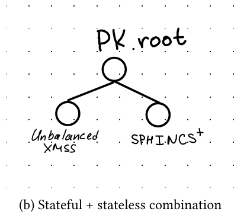
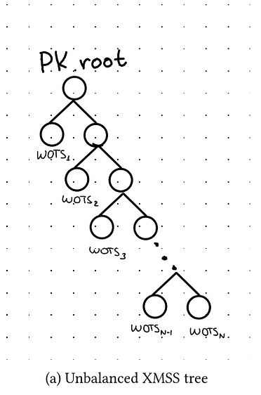

> *作者：jonasnick*
> 
> *来源：<https://delvingbitcoin.org/t/shrincs-324-byte-stateful-post-quantum-signatures-with-static-backups/2158>*

**摘要**：带状态的基于哈希函数也可以非常高效，如果由公钥生成的签名的数量较少的话。而带状态方案的一个主要问题是需要备份状态、并且在每一次签名操作之后都要正确地更新状态。通过直接结合一种无状态的基于哈希函数的方案（比如 SPHINCS+ 的一种变种）以及一种不平衡的 XMSS 树（携带一次性签名公钥（当然是带状态的）），我们得到了一种称为 “SHRINCS” 的方案。当我们只需要少量签名的时候，它非常高效，而且可以用一个静态的种子来备份。更准确地说，SHRINCS 公钥是带状态的和不带状态的公钥的一个哈希值。我们假设密钥生成发生在能够安全地保存状态的签名设备中。因此，这个签名器可以使用高效的带状态签名方案来生成签名。当这个状态已知已经损坏或丢失的时候（比如说使用一个静态的种子词备份复原了钱包），那就只能使用无状态的签名方案。因此，SHRINCS 在正常操作中利用了带状态签名方案的效率，同时，保留了健壮的无状态签名作为后备。

## SHRINCS

Mikhail Kudinov 和我的报告《[比特币适用的基于哈希函数的签名方案](https://eprint.iacr.org/2025/2203)》的附录部分已经简要介绍了 SHRINCS 方案。本文提供的是更全面的解释，希望能得到反馈。

SHRINCS 的构造需要一种无状态的签名方案和一种带状态的签名方案（后者要能生成较小体积的签名）。SHRINCS 由以下算法组成：

- $\textsf{KeyGen}() \rightarrow (\mathit{seed}, \mathit{pk}, \mathit{state})$：这个密钥生成算法会生成一个主种子、派生出私钥 $\mathit{sk}_1$ 和 $\mathit{sk}_2$，分别用于带状态的和无状态的签名方案。使用这两个私钥，它分别生成公钥 $pk1$ 和 $pk2$，用于带状态的和无状态的签名。最后，$KeyGen$ 返回元组 $(\mathit{seed}, \mathit{pk}, \mathit{state})$，其中，$\mathit{pk} = H(\mathit{pk}_1, \mathit{pk}_2)$，而 $state$ 是带状态签名的初始状态。
- $\textsf{Restore}(\mathit{seed}) \rightarrow (\mathit{seed}, \mathit{pk}, \mathit{state})$：复原算法，从一个种子中重新派生出 SHRINCS 公钥，并将 $state$ 设为 $\textsf{LOST}$，并返回元组 $(\mathit{seed}, \mathit{pk}, \mathit{state})$。
- $\textsf{Sign}(\mathit{seed}, \mathit{state}, m) \rightarrow (\mathit{state}', \mathit{sig})$：如果 $\mathit{state} \neq \textsf{LOST}$，那么签名算法就重新派生私钥 $\mathit{sk}_1$ 和公钥 $\mathit{pk}_2$，并用 $\mathit{sk}_1$、$\mathit{state}$ 和消息 $m$ 运行带状态签名方案的 $\textsf{Sign}$ 签名算法。然后，返回更新后的状态 $\mathit{state}'$ 以及拼接了 $\mathit{pk}_2$ 的签名。否则（如果状态已经损坏），那就重新派生出私钥 $\mathit{sk}_2$ 和公钥 $\mathit{pk}_1$，并使用 $\mathit{sk}_2$ 和 $m$ 运行无状态签名方案，返回 $\mathit{state}' = \mathit{state}$ 与拼接了 $\mathit{pk}_1$ 的签名。
- $\textsf{Verify}(\mathit{pk}, m, \mathit{sig}) \rightarrow \{\textsf{true}, \textsf{false}\}$：验证算法，将签名 $\mathit{sig}$ 解析为 $\mathit{sig}' \| \mathit{pk}'$，根据无状态或带状态方案来验证 $\mathit{sig}'$（在基于哈希函数的签名方案中，这就意味着复原公钥），然后检查两个公钥的哈希值等于 $\mathit{pk}$。

所以，在一个能够保存状态的签名器初始化之后，它用带状态方案来签名；但是，无论什么时候，当一个设备使用种子来复原时，它就只用无状态方案来签名。因为在 SHRINCS 中带状态签名模式高效得多，所以，一个复原后的设备来签名，会比使用最初运行 $\textsf{KeyGen}$ 的设备来签名昂贵得多。

关于在 SHRINCS 中的无状态签名方案，候选有 SLH-DSA，或者我们在报告中详细介绍的 SPHINCS+ 的一个变种。根据参数的不同，签名的大小在 3KB 到 8KB 之间，而公钥是 16 字节（在 NIST 的安全性层级中属于等级 1）。至于带状态签名方案，SHRINCS 使用我们作为的 “不平衡的 XMSS” 。一个常规的 XMSS 公钥就是一棵由众多一次性签名（OTS）公钥构建起来的默克尔树（的树根）。一次性签名方案只允许一个公钥生成一个签名，否则这个公钥就不安全了。所以，签名状态就是已经制作的签名的个数，最初是 $q=0$。要用 XMSS 签名一条消息，签名人要递增 $q$，用默克尔树上的第 $q$ 个一次性公钥来签名，然后计算通向树根的认证路径（即所谓的 “默克尔证据”）。最终的签名实质上就是一次性签名加上认证路径。

SHRINCS 并非直接使用由一次性签名（公钥）所组成的一棵不平衡的默克尔树，而是在带状态签名方案部分使用不平衡的树。因此，第一个一次性签名公钥位于深度 1，第二个一次性签名公钥位于深度 2，以此类推。这就尽可能降低了早期签名的认证路径的长度，对于预计只签名少量次数的场景来说，是理想的。对这种 “不平衡的 XMSS” 方案来说，第 $q$ 个签名就是第 $q$ 个一次性签名以及它的认证路径。在 NIST 的安全等级 1 条件下， 认证路径的大小是 $q \cdot 16$ 字节，而一次性签名的大小是 292 字节。更具体地说，我们使用的一次性签名方案是 WOTS+C（详情请看论文）。

总结以下，在使用无损的状态签名时，SHRINCS 的签名体积是 $\min(292 + q \cdot 16, s_l) + 16$，其中 $q$ 是已经为这个公钥在带状态模式中生成的签名的数量，而 $s_l$ 是使用无状态方案生成的签名的体积。如果 $q = 1$，签名比签名体积最小的 NIST 标准化方案（ML-DSA）还要小 11 倍。我估计，常规的比特币钱包的平均 $q$ 值在 1 到 2 之间。SHRINCS 的主要缺点在于，它的安全性要求安全的状态管理。不过，不像完全的带状态方案（一旦状态管理出错就会引发灾难），在 SHRINCS 中，只要你有所疑虑，就总是能切换到无状态模式。

（完）