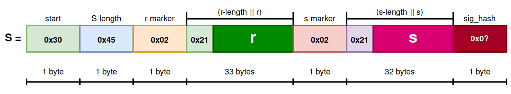
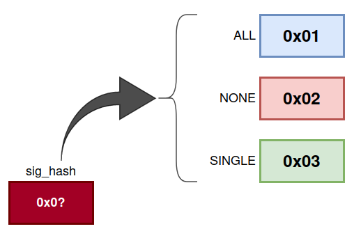
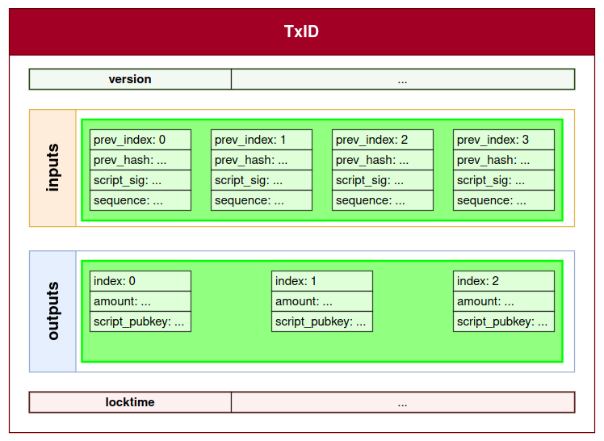
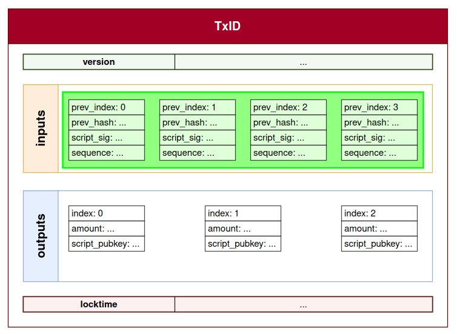
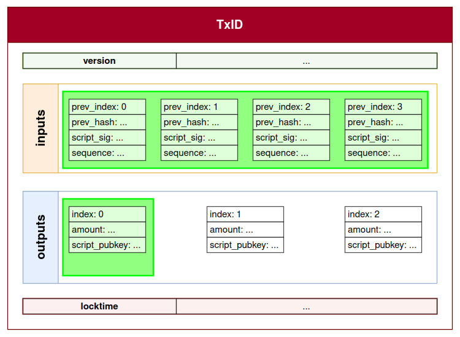
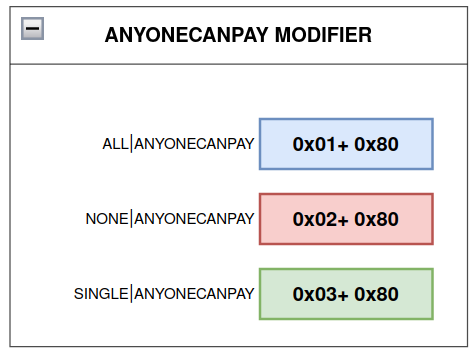
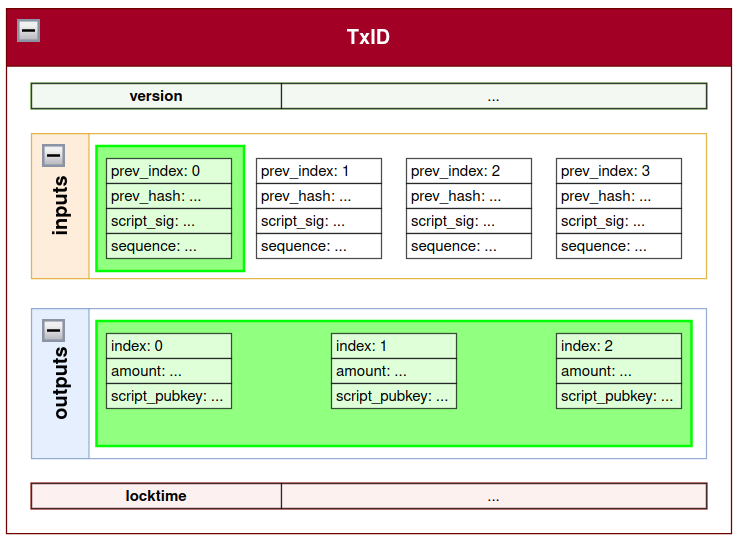
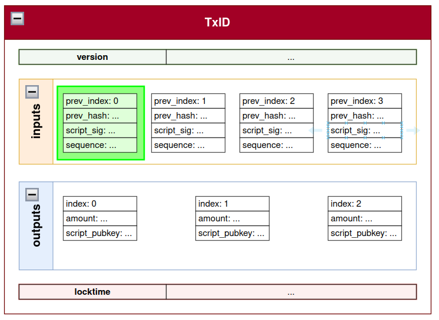
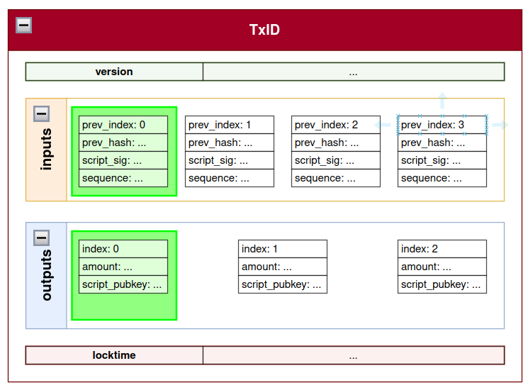

> *作者：ochekliye enigbe*
> 
> *来源：<https://enigbe.medium.com/signature-hash-flags-f059d035ddd0>*

数字签名是 “一种数学结构，可以证明一条信息的发信人身份”（Antonopoulos, 2017）。在比特币交易中，签名的用法是证明这笔交易是由 “已知的” 发送者创建的、这个 “已知” 的发送者无法否认自己广播了这笔交易，并且，在这笔交易传播的过程中，其数据没有被篡改。签名的过程是把整笔交易（或者其部分）输入哈希函数中，再将得出的哈希值与所有者的的私钥一同执行签名函数。

签名的对象可以是整笔交易或者一部分交易，并且我们也能辨别出来，这是通过签名哈希标签来实现的。这些标签是 8 个比特的字符，附加在签名的末尾；它们非常重要，因为它们使得交易可以用多种方式来构造。我们可以构造的最简单的交易类型就是一笔只有一个输入（引用一个 UTXO）和一个输出的交易。但是，交易可以有多个输入和多个输出，也就是引用来自多个所有者的 UTXO。如此一来，我们就要构造不完整的交易、由这些所有者们手机所有必要性的签名，来使这笔交易有效（否则这笔交易是无效的）。有了签名哈希标签（SIGHASH），签名可以指出被签名的哈希值承诺了交易的哪一部分。

本文将简要解释签名的结构以及如何识别 SIGHASH 标签、SIGHASH 的类型和使用方法，以及它们的应用场景。

## DER 签名的结构

数字签名是用 “唯一编码规则（Distinguished Encoding Rules，DER）” 来序列化的，该规则定义了序列化数字签名 **S(r, s)** 的标准（译者注：这里的数字签名应指椭圆曲线签名 ECDSA）。序列化的签名由下列几个部分组成，按顺序分别是：

1. 十六进制值的起点字节 [0x30]
2. 签名序列的长度 [0x44] 或者 [0x55]
3. 十六进制的 r 值标记字节 0x02
4. r 值的长度 [0x21] || r 值的大端序（Big-endian）表示
5. 十六进制的 s 值标记字节 0x02
6. s 的长度 [0x20] || s 值得大端序表示
7. 1 字节的 SIGHASH 后缀

- 图 1. DER 签名的结构 -

## 签名哈希标签的类型与用法

有三种类型的签名哈希标签：ALL、NONE 和 SINGLE。图 2 给出了每种类型的字节表示。

- 图 2. SIGHASH 类型 -

**SIGHASH ALL** 意味着，给定一笔交易 Tx，这个签名是对 Tx 的所有输入和所有输入（见下图绿框）签名。SIGHASH ALL 的步骤是：

1. 创建目标交易的一个拷贝
2. 清空每个输入的 *script_sigs（签名脚本）* 字段，并替换为它们引用的 *script_pubkey（公钥脚本）* 字段。这是因为 “签名正是 script_sig 的一部分，所以 …… 不能自己签名自己”（Song，2019，P132）
3. 确保在交易被序列化（Tx_ser）之前**没有**其它字段被设为空值。
4. 0x01 的标签放在序列化交易的末尾，然后序列化交易放到哈希函数中
5. 使用签名算法签名这个哈希值，得到最后的签名

$$msg = F_{hash}(Tx_{ser}||0x01)$$

- 等式 1. SIGHASH ALL 所用的哈希函数 -

$$S(r, s) = F_{sign}(msg, e)$$

- 等式 2. 签名算法 -

这里的 e 就是签名者的私钥，S(r, s) 就是签名。

- 图 3. SIGHASH ALL -

交易中的任何一部分数据改变，都会导致签名作废；因为交易的哈希值也将改变，原来的签名就匹配不上了。

**SIGHASH NONE** 意味着，这个签名是对 Tx 的所有输入（见下图绿框）的签名，但没有签名任何的输出。签名过程如下：

1.  创建交易 Tx 的拷贝
2. 清空所有输入的 script_sig 字段，并代之以它们引用的 script_pubkey
3. 清空所有的输出字段
4. 序列化这个拷贝
5. 在 Tx_ser 末尾加上 0x02，然后签名

$$msg = F_{hash}(Tx_{ser}||0x02)$$

- 等式 3. SIGHASH NONE 使用的哈希函数 -

对于 SIGHASH NONE 交易，任何输出的改变都不会导致交易作废。但如果输入改变，就会导致交易作废。

- 图 4. SIGHASH NONE -

至于 **SIGHASH SINGLE**，那表示交易 Tx 的所有输入都被签名了，并且跟某个被签名的输入具有相同索引号的一个输出也被签名了。这本质上就是 “授权所有其它输入来形成这个具体的输出”（Song，2019，P133）。签名流程如下：

1.  创建交易 Tx 的拷贝
2. 清空所有输入的 script_sig 字段，并代之以它们引用的 script_pubkey
3. 清空所有的输出字段，只留下要签名的那个输出
4. 序列化这个拷贝
5. 在 Tx_ser 末尾加上 0x03，然后签名

改变这个被签名的输出或任何一个输入，都会使签名作废。

- 图 4. SIGHASH SINGLE -

## 修饰符标签

有一个修饰符标签 **ANYONECANPAY**，可以加入到上述的标签中，应用在一笔交易的**单个**输入上。Rosenbaum（2019）将 ANYONECANPAY 修饰符标签理解为一种（通过设定或者不设定来）仅承诺输入的办法，而现有的 SIGHASH 标签（ALL、NONE、SINGLE）则是仅承诺输出的办法。

- 图 6. ANYONECANPAY 修饰符 -

如果你为 ALL 设置了 ANYONECANPAY，则所有输入都可以更改，而被选定的一个输入（见下图的 #0）以及所有输出都不可能更改（见下图）。

- 图 7. ALL ANYONECANPAY -

为 NONE 设定了 ALL ANYONECANPAY，则表示所有输出和所有输出都可以更改，只有被选定的这个输入不能更改。

为 SINGLE 设定 ALL ANYONECANPAY 表示所有的输出都可以更改，只有被选定的一个、跟被选定的输入有相同索引号的输出不能更改。除了这个被选定的输入，其它的输入也都可以修改、添加 以及/或者 删去。

- 图 9. SINGLE ALL ANYONECANPAY -

## 应用场景

下表总结了可以应用这些标签的应用场景：

| SIGHASH 类型          | 交易的描述与应用场景                                         |
| --------------------- | ------------------------------------------------------------ |
| ALL                   | 简单的两方 P2PKH 交易，使用一个输入引用 Alice 可以解锁的一个 UTXO，支付给一个输出 —— Bob 的公钥哈希值。从一家商店购买一件衬衫，商店可以生成一个 P2PKH 地址，而买家可以使用多个输入来支付给这一个输出。这里的签名是覆盖所有的输入和所有输出的。 |
| NONE                  | 一种空白支票交易，承诺了输入和输出的数额。一个数学系教授可以创建一笔 P2PKH 交易，加入两个面额共计 27000 聪的输入，可以支付给任何能解开某个问题的输出地址。 |
| SINGLE                | 我发现的一个特殊的应用场景是给消费。一笔交易使用了顾客可以解锁的 5 个 UTXO，支付给两个输出地址：被指定的一笔是给酒馆的咖啡和点心钱，而另一笔是缴费，给侍应生。改动客户的输入、酒馆的输出或者小费的数额，都会使交易作废。 |
| ALL\|ALL ANYONECANPAY | 有 3 个固定输出，1 个固定输入以及一个可以增加、删减的输入清单的交易。一笔价值 15000 聪的交易，在三方间分割，并使用 Alice 的价值 5000 聪的一个输入来初始化。Alice 可以邀请两个朋友每人增加 5000 聪的输入，这不会使交易作废。众筹交易也可以使用这个标签。 |
| NONE\|ALL ANYONECANPAY | 收集粉尘（面额太小的输出）是这个标签的一个流行应用场景。 |
| SINGLE\|ANYONECANPAY | 交易的模块化，也就是不同的交易可以组合起来形成一笔交易 |

- 表 1. SIGHASH 标签的应用场景 -

## 结论

在为了研究闪电网络而回顾比特币基础知识时，我坠入了签名哈希标签的云雾中。这些标签标记了一个签名签的是一笔交易的哪些部分，也提供了构造交易的灵活方法。我解释了如何从 DER 签名的结构中分辨这些标签，标签的 6 种类型（包括加入了修饰符的），以及这些标签如何使用。

如有任何反馈，不胜感激。如果你认为本文有用，或者有事实上的错误，请不吝在 Twitter 账号 [@engb_os](https://twitter.com/engb_os) 下给我留言。

（完）