> *作者：Bennet*
> 
> *来源：<https://bennet.org/learn/silent-payments-bitcoin-privacy/>*

> *“应该为每一笔交易使用一对新的密钥，以确保这些交易不会被关联起来指向一位共同的主人。”*
>
> —— 中本聪

在比特币白皮书中，中本聪暗示了，重复使用相同的地址会付出隐私性代价。

像电子邮件地址那样公开一个比特币地址 —— （举例而言）为了接受捐赠 —— 意味着把你用这个地址收取支付的永久记录公开给全世界，就不必说你日后从中花费的记录了。如果这个地址会被关联到你在真实世界的身份，那问题就更严重了。 另一种做法是不断轮换地址，也就是给每个支付者生成一个新的收款地址。这对隐私性更好，但也有点麻烦（插句话，我[曾经开发过一个开源的工具](https://bennet.org/resources/private-serverless-bitcoin-donations/)，帮你自动化这个操作）。

**今天，静默支付提供了第三种选择。**你公开 *一个* 地址，它以 `sp1` 开头，你可以随意分享它。然后，每个给你支付的人都会把钱发送到 *不同* 的比特币地址上，也就是没人能从中分辨出它们的收款方是同一个人。而且，收款方不需要跟支付方交互 —— 不需要提供闪电发票或者 LNURL 端点，更不必提供 XPUB（扩展公钥）。

实际上，自从 [BIP-352](https://bips.dev/352/) 敲定以来，这在理论上就可能实现了，但行业基础设施的支持到现在才起步。 2026 年，[Sparrow Wallet](https://sparrowwallet.com/) 发布了对静默支付的支持（我是这款桌面端钱包的最卖力鼓吹者）。结合一种新的服务端软件，叫做 “**Frigate**”，静默支付终于变得实用了。

这是我编写的手把手教学。读完整篇文章，你将拥有一个属于自己的 `sp1` 静默支付地址。

## 静默支付的工作原理

首先，你要知道，`sp1` 开头的静默支付地址 *并不是* “常规的” 比特币地址。常规的比特币地址对应着一个比特币脚本，`bc1q` 开头的隔离见证地址和 `bc1p` 开头的 Taproot 地址就是这样的。静默支付地址所编码的 *确实* 也是公钥，但这些公钥不会直接出现在区块链上 —— 我们稍后细说。所以，直接在区块浏览器网站上搜索 `sp1` 地址，是找不到的。

一个 `sp1` 地址是由以下两种元素构成的：

- 一个**扫描公钥**，用来 *发现* 给你的支付
- 一个**花费公钥**，用来 花费 这些钱

这两个公钥都有自己的私钥。这两个公钥，带上校验和以及 `sp1` 前缀，就形成了一个可以告人的静默支付地址。

以下是其他人给这个静默支付地址**发送**支付的过程：

1. 发送者的钱包软件取出各交易**输入**的私钥、将它们与接收方的**扫描公钥**（编码在 `sp1` 地址中的两个公钥之一）相结合，计算出一个**共享秘密值**。
2. 然后，这个共享秘密值会被用来调整接受者的**花费公钥**，产生一个**全新的比特币地址**（具体来说，是一个 `bc1p` Taproot 输出）；只有发送者和接收者能够知道这个地址的来历。
3. 当钱币被发送到这个 Taproot 地址时，不会有外在的标记表明这是一笔静默支付，但接收者的钱包能够使用扫描私钥，识别出它是一笔给自己的支付。

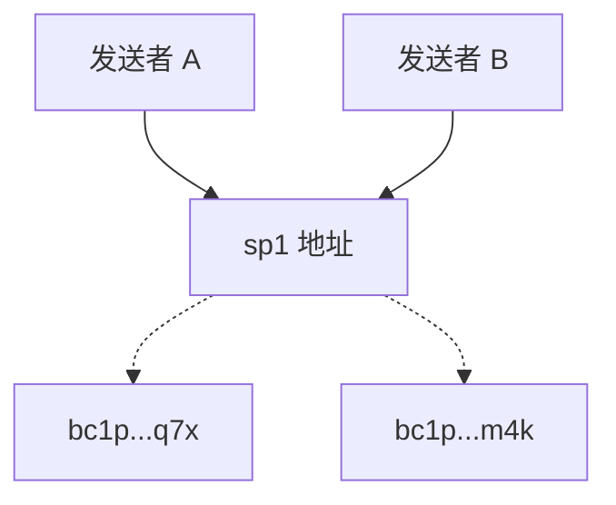

在**接收方**这一头，钱包软件的工作是识别出这些支付。因为一笔静默支付的最终目的地（收款地址）部分取决于交易的 *输入*（即用来构造交易的 UTXO），所以没有办法预先计算出所有可能的收款地址。相反，钱包只能扫描区块链、寻找给接收方的 Taproot 输出。找到之后，钱包能够使用花费私钥 —— 在使用同一个共享秘密值调整之后 —— 花费这些资金。

关键在于：两个不同的发送者，哪怕给同一个 `sp1` 地址支付，也会产生两个看起来毫无关联的 Taproot 输出，它们之间没有公开的关联，也不能回溯到最初的 `sp1` 地址。这种不可关联性，为双方都带来了隐私性好处。

> **满足你好奇的更多密码学细节**
>
> 静默支付背后的密码学叫做 “椭圆曲线上的 Diffie-Hellman 密钥交换（ECDH）”。这种技术也被用来保护今天互联网上的绝大部分加密通信。ECDH 让发送者和接收者可以独立地获得同一个共享秘密值，这样双方都能计算出地址，而且不用预先打招呼。
>
> 如果你已经开始读这些文字了，说明你可能想找到更加深入的解释。我无法在这里提供，因此，我推荐了两份阅读材料，它们对我帮助最大：
>
> - 第一篇，来自 Greg Walker 的《[比特币中的椭圆曲线密码学](https://learnmeabitcoin.com/technical/cryptography/elliptic-curve/)》，这是一份一般性的介绍，值得一读。
> - 第二批，来自 Sebastian 和 Benma 的文章，解释了[静默支付中的 ECDH](https://blog.bitbox.swiss/en/understanding-silent-payments-part-one/)，是一份非常好的、通俗易懂的介绍。
> 
> 读完这两份材料之后，我推荐你自己读一读 [BIP352 规范](https://github.com/bitcoin/bips/blob/master/bip-0352.mediawiki)。

## 为什么扫描很难，为什么要用 Frigate

**找到这些支付**需要耗费许多计算。一个[层级式确定性钱包](https://bennet.org/learn/hierarchical-determinism-how-bitcoin-hd-wallets-are-born/)有一组固定的地址，一个普通的 Electrum 服务端就足以监视这些地址。但是在静默支付中，没有可以观察的固定地址：每一笔支付都会产生一个新派生出的输出，这是收款方无法预测的。发现你的钱币的唯一办法就是取得每一笔可能的交易、使用扫描密钥重复一遍推导共享秘密值的计算，看看是否命中。

这部分额外的工作，对于一个全节点来说是 *可以承担的*（虽然在当前流行的节点实现上，支持非常有限）。但是在移动端钱包上，就完全不现实了：移动端钱包只会间歇性运行，带宽和电池都有限，并不是一个全节点。

[Frigate](https://github.com/sparrowwallet/frigate) 就是 Sparrow 的回答。它是一种 Electrum 服务端实现 ——  [跟帮助你连接自己的钱包到全节点](https://bennet.org/learn/building-a-bitcoin-node-with-raspberry-pi/)的服务端是同一种 —— 只是增加了额外的方法，可以为你扫描静默支付。它是专为速度而优化的：椭圆曲线运算就发生在数据库中，并且可以选择**用 GPU 来加速**。它还能实时接收交易池数据，所以，甚至在你的入账交易得到区块确认前，你就能在钱包中看到它。

现在有一个公开的服务端实例运行在 `frigate.2140.dev` —— 由 Sparrow 和 [2140.dev](https://2140.dev/) 联合维护 —— 任何人都能使用这个服务端。这就是让静默支付变得对大部分人可用的办法，也包括那些没有运行自己的节点的人。当然，你可以运行你自己的服务端，其中的好处我们后文会说。

### 你的扫描私钥有多敏感？

为了扫描发送给你的静默支付，Frigate 需要来自你的钱包的两件东西：你的**扫描私钥**和**花费公钥**。如果你将这些东西托付给一个公开的 Frigate 服务端，理论上这个服务端可以做什么？

**简单来说，它可以找出每一笔发送到你的 `sp1` 地址的支付，并将它们与你关联起来**。它没办法花费这些钱，但恶意的或者遭到劫持的服务端可能会从你的收款历史中拼凑出你的形象 —— 这是静默支付希望阻止的事。在这个意义上，你交出去的密钥很像一个 XPUB —— 它会暴露你的 收款/支付 历史，只是没法移动资金。

信任一个公开的 Frigate 服务端，近似于信任一个公开的 Electrum 服务端，它能看到你的钱包所查询的地址。Frigate（本身是一种开源的软件，就像 Sparrow），在内存中保存你发送的密钥，仅允许你的会话访问，就像一个普通的服务端临时保存你的地址。你要信任运营者不会搞鬼。（BIP-352 确实支持一种更加私密的模式 —— 服务端发送 “调整” 数据给你，你的钱包软件自己在本地匹配，完全不泄露扫描密钥 —— 但对于客户端来说要重得多，这也是 Frigate 选择服务端扫描的原因。）如果这份信任超出了你愿意接受的范围，你可以自己运行 Frigate 服务端。不过运行它的办法超出了本文的范围。

## 在 Sparrow 中建立一个静默支付钱包

现在，我们来建立一个新的静默支付钱包。你需要使用最新版本的 [Sparrow](https://sparrowwallet.com/download/)（在我最后一次更新本文之时，是 `2.5.2` 版本），安装到你的电脑上。

### 创建钱包

打开 Sparrow 软件的界面，在菜单选择 **File → New Wallet**（文件 -> 新钱包），给钱包安一个名字，开始创建它。在 “Policy Type”（花费条款类型） 一栏，选择 “Single Signature SP”（单签名静默支付）。 Taproot 是唯一一种可用的脚本类型，我们前面已经解释过了。

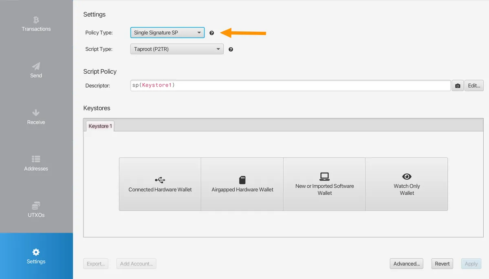

在 “**Keystores**”（密钥媒介）栏目中，点击 “New or Imported Software Wallet”（新的或导入软件私钥）。在 “Mnemonic Words (BIP39)”（BIP39 助记词）一栏，选择你喜欢的词组长度。点击 “Generate New”（生成新的），然后**使用纸币抄下这组种子词并安全保管它们**。

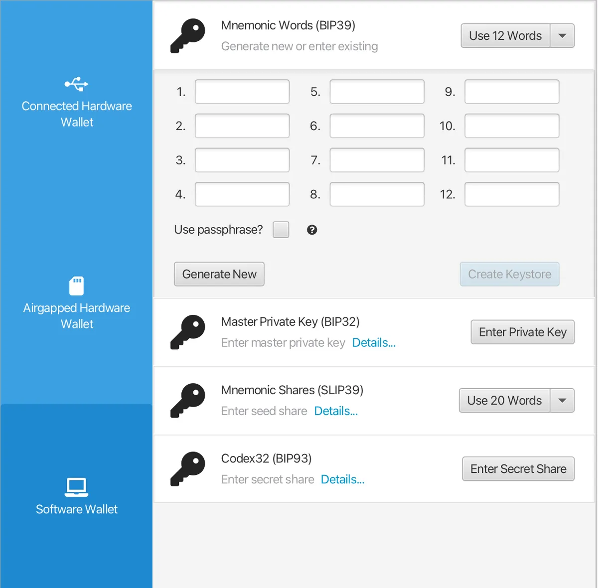

妥善备份之后，点击 “**Confirm Backup**”（确认备份）。会有弹窗让你重新输入词组，以验证你的备份的完整性。验证完之后，点击 “Import Keystore”（导入密钥），回到软件主界面。不要改变`m/352'/0'/0'` 的派生路径。点击右下角的  “Apply”（生效） 按钮 —— 你会被询问是否要为这个钱包添加一个口令。

全部完成后，你会回到 Sparrow 钱包软件主界面：

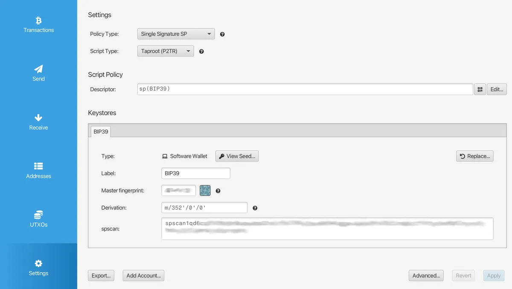

> *请注意，你刚刚创建的是一个 “**热钱包**”，意思是所有的私钥都放在你的（联网的）电脑上。我们会在下文讨论冷钱包（即专用的硬件签名器）对发送和接收静默支付的支持。* 

### 连接一个静默支付服务端

普通的比特币节点无法告诉你静默支付送达了，所以 Sparrow 需要你告知一个可以扫描支付的服务端 —— 换句话说，一个 Frigate 服务端。

打开软件的 “**Settings**”（设定）页面，点击左侧的 “**Server**”（服务端）。如果你运行了自己的 Frigate 实例（在你自己的节点上），就选 “Private Electrum”（私人 Electrum 服务端），然后输入它的细节。否则，就使用公开的服务端，点击 “Public Server”，选择 `frigate.2140.dev`。点击 “Test Connection”（测试通信），等待成功消息。

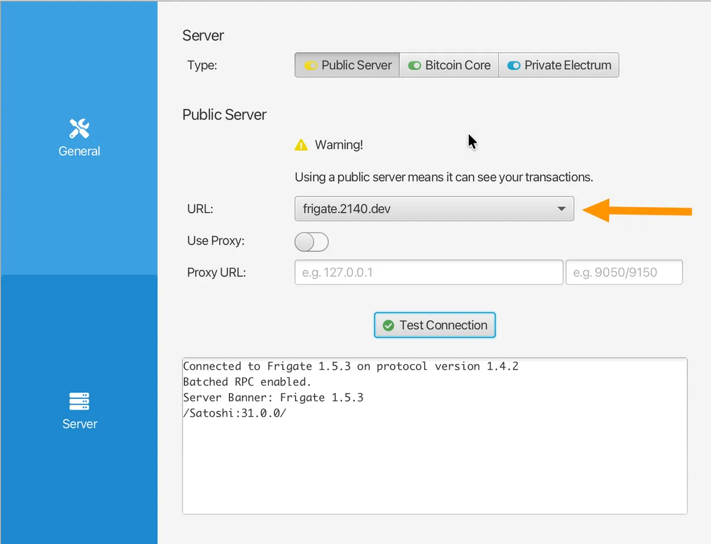

关闭设定页面，打开钱包的 “**Transactions**”（交易）侧边栏。你可能会看到 “*Wallet loading history for SP-Demo* ”这样的一句话，表示在为你加载历史。给它一些时间，也许比你为使用普通 Electrum 服务端扫描普通钱包而等待的时间要更长，最终你会看到 “*Finished loading* ”（加载结束）。你的隐私性之旅就此开启！

### 获得静默支付地址

打开 “**Receive**”（收款）侧边栏。跟普通钱包不一样，你不会每次都看到一个新地址，只会得到同一个**静默支付地址**，也就是 `sp1...` 这一串字符，以及它的 QR 码表现形式。这个就是你可以公开、重复使用、自由分享的静默支付地址了！你永远不需要改变这个地址。

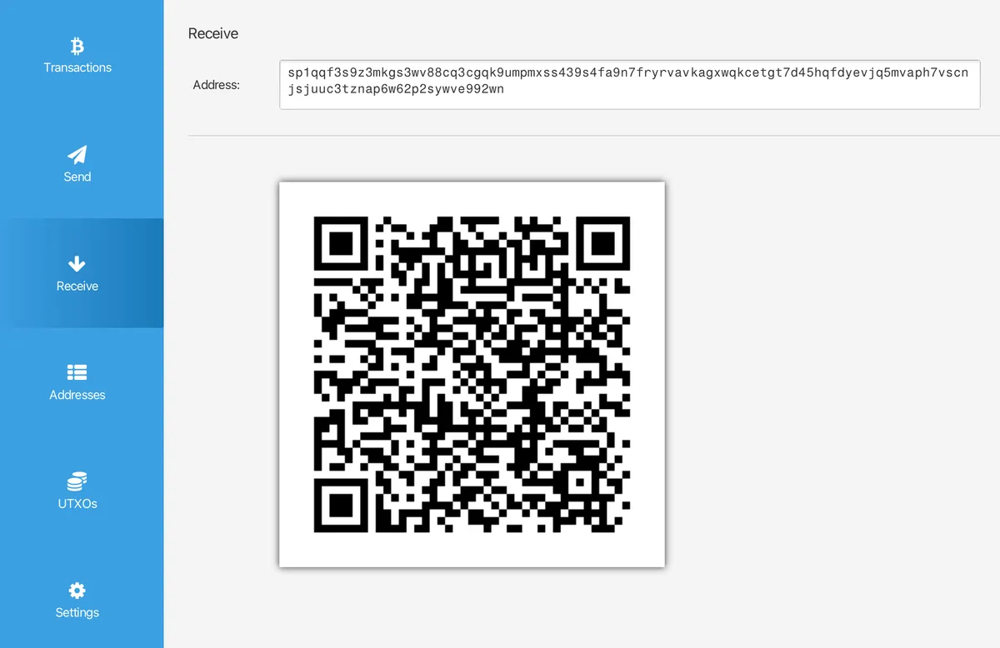

打开 “**Transactions**”（交易）和 “**UTXO**” 侧边栏，你会注意到其界面也跟 “普通” 比特币钱包有些区别：它们一开始是完全空白的，因为地址不是提前推导出来的。 你收到支付后，这些屏幕才会开始充实起来。以下是你收到第一笔静默支付之后它们的样子：

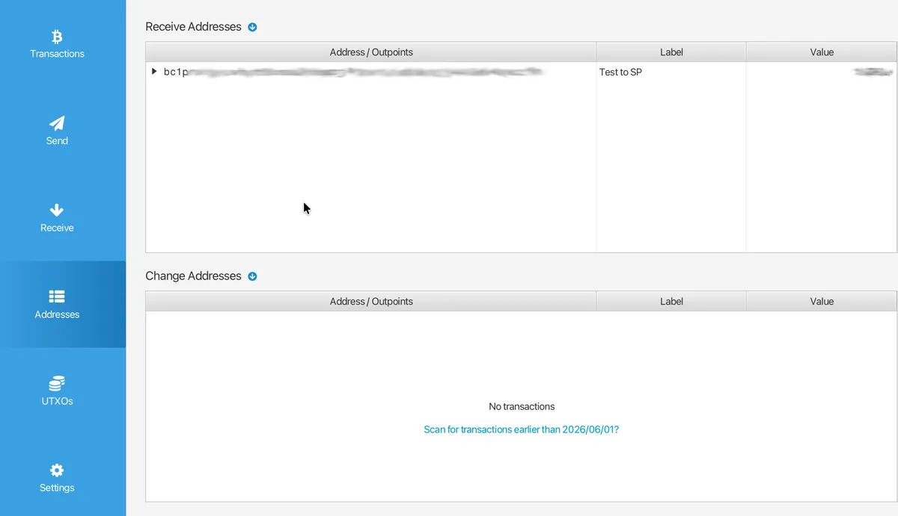

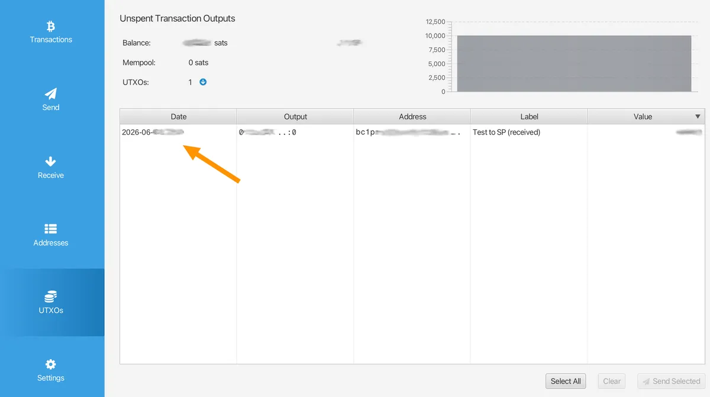

每次你在 Sparrow 软件载入这个钱包，服务端都会扫描发送给你的静默支付。出现在你的 “**Transactions**”（交易）和 “**UTXO**” 页面中的支付跟任何 “普通” 的支付一模一样，因为从区块链上看，确实没什么区别：只是普通的 Taproot 输出，只有你的钱包能识别出它们是给你的支付。

所以，我们这就讲完**收款**这一部分了。那该怎么向静默支付地址发送支付呢？

## 向静默支付地址发送支付

对 *发送* 到`sp1` 地址的支持比收款端更加完善。除了 Sparrow，还有 [BlueWallet](https://bluewallet.io/)、[Wasabi](https://wasabiwallet.io/)、[Nunchuk](https://nunchuk.io/)、[Cake](https://cakewallet.com/) 等软件钱包，都可以发送静默支付。 [Silentpayments.xyz](https://silentpayments.xyz/docs/wallets/) 页面提供了一个全面的兼容性表格。

我会讲解在 Sparrow 上发送静默支付的过程。点击 “**Send**”（发送）侧边来，把你知道的其他人的 `sp1` 地址复制进去，输入你要发送的数额和手续费，然后点击 “**Create transaction**”（创建交易）。在交易构造页面，你会看到收款目的地依然作为 `sp1` 地址列出：

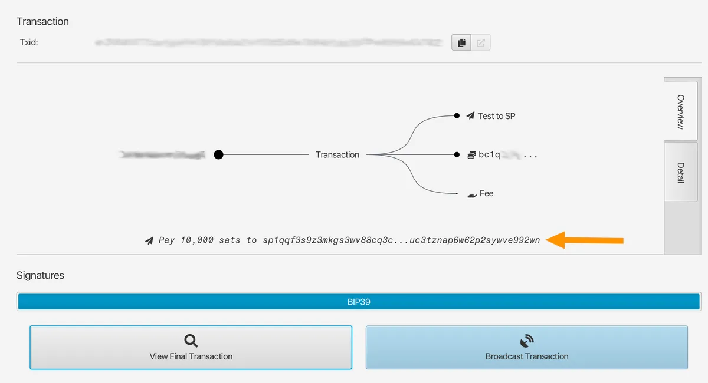

不过，在签名和广播交易之后，Sparrow 就会显示真正的 Taproot 地址（以 `bc1p` 开头），来表示这些钱币发送到了哪里：

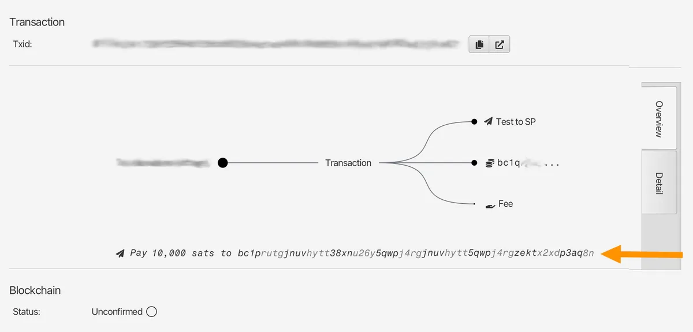

在这个页面背后，Sparrow 已经完成了本文第一节所介绍的发送方数学运算 —— 从交易的各个输入以及接收方公开的公钥，派生出一次性的 Taproot 输出 —— 并广播了最终的交易。到 [mempool.space](https://mempool.space/) 网站看看，你会发现它看起来就是一笔普通的 Taproot 支付。根本看不出来它是一笔静默支付，也无法跟你知道的那个 `sp1` 地址关联起来。

一个值得一说的细节，跟硬件签名器有关：目的地输出 *取决于被花费的输入*。因此，在签名时，钱包必须使用输入的私钥运行一次 ECDH 运算。对于放在软件中的私钥来说，这很容易。但对于一个冷钱包设备来说，它的整个设计目标就是保证私钥不要离开设备，这就产生了一个全新的兼容性问题。 这就是下一章的要点。

## 硬件签名器和冷存储

硬件支持是拖慢静默支付普及的主要障碍。

在**发送方**这一头，要给 [Bitbox](https://blog.bitbox.swiss/en/understanding-silent-payments-part-one/) 竖一个大拇指，他们是第一个完全支持发送支付到 `sp1` 地址的硬件签名器制造商。我 *认为* 通过 PSBT 文件（[BIP 375](https://bips.dev/375/)），让一个空气隔离的 Coldcard 签名器签名静默支付交易，也是有可能的，但我还没自己验证过。等我搞清楚了，我会更新这个页面。

除此之外，其他家的用户就不太走运了 —— Trezor、Ledger 和 Blockstream Jade 签名器的用户，都 *还不能* 发送支付到静默支付地址。

**那么收款呢**？要是你跟着我的教程做，但尝试导入一个来自硬件的密钥，你会看到这样的消息：

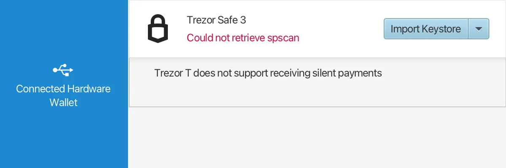

撇开设备识别错误 —— 我连接的是 Safe 3，不是 Trezor T —— 这个报错是准确的：现在你还无法 *收取* 静默支付到冷钱包。只要你读了前面的解释，你就知道，使用 `sp1` 地址来收款 *不是* 换个公钥派生路径这么简单 —— 为了检测入账支付，钱包必须持有扫描私钥，并对几乎每一笔交易的输入公钥运行 ECDH 。硬件签名器的设计用途是 *永远不要暴露私钥* 。虽然 BIP352 允许暴露扫描密钥（它只能扫描，不能花费），做到这个还是需要专门的固件支持。

所以，总结一下：大部分人都可以先从一个热钱包开始私密地 *收取* 小额款项，然后将大额的款项转入你的冷钱包，就跟普通热钱包的使用方法一样。你必须接受，绝大部分的硬件签名器的用户还无法向你的 `sp1` 地址发送支付。

### 如果静默支付对你来说还不够成熟

静默支付是个全新的东西。我前面提到的缺点可能使它不适合你的用途，这完全可以理解 —— 而且，这正是我开发我的[无服务端受捐软件](https://bennet.org/resources/private-serverless-bitcoin-donations/)的原因。不停轮换地址依然是一种接受比特币支付的可靠方法，适合所有钱包，而且不会牺牲你的隐私性。

## 自己试一试

读过本指南，继续了解静默支付的最好办法就是自己试一试。提醒一句，静默支付的技术规范还比较新，所以，**在使用真实资金测试时，务必非常小心。**

如果你缺少一个兼容静默支付的钱包，而且你更多只是想实验一下这套协议，那么 [**Silent Amulet**](https://avbforge.com/silent/) 值得关注。它是一个完全的 BIP-352 钱包，作为单个 HTML 文件在浏览器内运行。甚至你可以配置它连接你自己的 Blindbit 索引器，在本地扫描，而不需要把扫描密钥交给一个服务端，这是我在第二节提到的更加隐私的模式。

你可以通过扫描下面的 QR 码，来测试你正在使用的钱包软件是否可以解析一个 `sp1` 地址：

如果你认为这个指南有用，并且你也有兼容的钱包，捐赠无论多少聪，都让我感激，并且能支持这个指南网站继续运行。如果你的钱包 *不支持* 静默支付，你也可以[通过可靠的隔离见证钱包或是闪电支付](https://bennet.org/donate/)给卷则。

我也建议你[给 Sparrow wallet 捐赠](https://sparrowwallet.com/donate/)。这是最好的比特币项目之一，由仅仅一位开发者维护，并且是完全免费和开源的。

感谢阅读，祝囤聪顺利。

（完）

