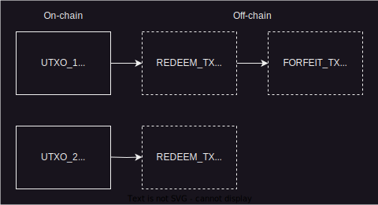
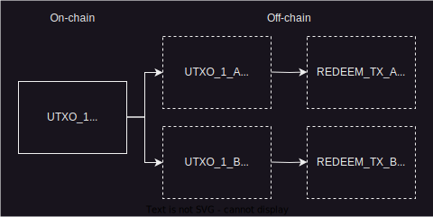
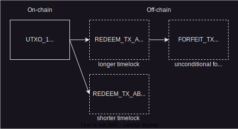

> *作者：Ruben Somsen*
> 
> *来源：<https://gist.github.com/RubenSomsen/a394beb1dea9e47e981216768e007454?permalink_comment_id=4633382>*


## 概述

Ark 是一种踪迹最小化的 coinswap 协议。Alice 把一个钱币交给服务端，条件是服务端要给 Bob 支付一个钱币。这里没有信任因素。因为所有的互换都通过服务端，而且时间锁最终会依他们的需要过期，大量的互换可以聚合在一个 UTXO 中，并且他们可以在链上高效地赎回。代价是无法立即访问自己的资金，意思是服务端最终必须锁定大量的资金。

## 解释



<p style="text-align:center">- 当  A 要给 B 发送资金时，所有的相关交易  -</p>


### 持有钱币

Alice（`A`）跟服务端（`S`）一起持有钱币，并且 Alice 可以免信任地赎回这些资金。

链上的 UTXO_1 的脚本是这样的：

```
A+S || S in 1 month (A 和 S 可以一起花费；1 个月后，S 可以独自花费)
```

`A` 在链下还拥有一笔（由 `S` 签名的） REDEEM_TX（赎回交易），将 UTXO_1 花费到这样的输出：

```
A+S || A in 1 month (A 和 S 可以一起花费；1 个月后，A 可以独自花费，所以是赎回)
```

### 准备发送钱币

现在 `A` 希望把自己的钱币发送给 Bob（`B`）

`S` 承诺会注资并创建一个新的链上 UTXO_2 ，脚本是这样的：

```
B+S || S in 1 month
```

`B` 收到一笔链下的（由 `S` 签名的）  赎回交易，花费 UTXO_2 到这样的输出：

```
B+S || B in 1 month
```

只要 UTXO_2 得到区块链的确认， `B` 就算得到支付了。

### 互换（重要关节）

`A` 希望达成的效果是，当且仅当 UTXO_2 出现在链上（即 `S` 给 `B` 发送了资金），就放弃对 UTXO_1 的权利（即 `A` 给 `S` 支付）。

为了实现这一点， `A` 签名下列的 FORFEXIT_TX（弃权交易），花费自己的赎回交易：

```
S if UTXO_2 exists* || A in 1 month (如果 UTXO_2 存在，S 就可以单独花费它；否则时间过期后，A 可以独自花费它)
```

* 这种脚本当前是无法实现的，只是更便于解释才这样写；后文会解释实际上使用的、不需要软分叉的版本

效果就输出，如果 `UTXO_2` 得到确认， `S` 就可以从 `UTXO_1` 中获取资金。

### 可能的结果

理想/预期 的结果：

- `S` 发布 UTXO_2 ，意味着 `B` 得到了支付
- `A` 不公开自己的赎回交易
- UTXO_1 的时间锁过期， `S` 拿走其中的资金（如果 `A` 释放了自己的私钥，可以绕过这个时间锁） 

敌意的 `A` 会造成的结果：

- `S` 发布 UTXO_2 ，意味着 `B` 得到了支付
- `A` 公开自己的赎回交易
- `S` 发布对应的弃权交易，然后拿走资金

敌意的 `S` 会造成的结果：

- `S` 不发布 UTXO_2 ，从而 `B` 没有得到支付
- `A` 发布赎回交易
- `A`  发布对应的弃权交易
- 弃权交易的时间锁过期， `A` 领取自己的资金

`A` 离线的结果：

- `A` 无法请求 `S` 转移资金给 `B`  
- `A` 无法及时发布赎回交易
- UXTO_1 的时间锁过期， `S` 拿走 `A` 的资金

## 链下效率

迄今为止，上述协议的效率并不高于 `A` 直接在链上支付给 `B`。最后的一个技巧是，一个 UTXO 可以包含来自多个用户的钱币。

  

<p style="text-align:center">- UTXO_1 由两位用户用户持有，而且最终完全属于 S -</p>


举个例子，我们假设 `A` 和 `B` 都在同一个池子中拥有钱币，就像上图一样。UTXO_1 的脚本是 `A+B+S || S in 1 month`；而且它是由两个链下的 UTXO 组成的一棵树：一个链下 UTXO 使用的脚本是 `A+S || S in 1 month` ，另一个是 `B+S || S in 1 month` 。如果 `A` 和 `B` 都按照预期放弃了自己的权利，那么这些链下的 UTXO 就永远不会再出现在链上了。这可以容纳任意数量的用户，也正是这套协议的效率的来源。

当前，建立这样的构造需要 A、B、S 三方预先签名，这意味着在创建一个新的 UTXO 的时候，所有的参与者都必须跟其他每个人交互。如果有 OP_CTV ，就不再有这种交互的需要了。

## 最坏的赎回情况

某个用户可能会发布赎回交易。这一个用户必须支付将 UTXO 树在链上展开的手续费，然后才能得到自己要的那个输出。这对这名用户来说是很昂贵的，因此，它为 Ark 可以处理的最小面额设置了经济性的门槛。

而且，因为树展开了，所以 `S` 现在也必须花费 `log(n)` 个输出，而不是只需花费 1 个输出。

## 合作式退出

用户除了跟 `S` 交换一笔新的链下的赎回交易，  还可以换回一个链上的、不带时间锁的输出；因此，这套协议允许最优的高效退出。

## 无需软分叉的 “检查 UTXO_2 存在” 方法

包含 UTXO_2 的交易可以包含另一个小额的 “锚点输出（ANCHOR_OUTPUT）”  ，而且这个输出只能被 `S` 花费。 `A` 可以在自己的弃权交易中包含这个输出。那么，除非包含 UTXO_2 和锚点输出的交易先上链，Alice 的弃权交易是无法上链的，这就满足了 “检查 UTXO_2 存在” 的条件。

这个锚点输出可以通过放在一棵链下输出树中，从而保留在链下，但这也意味着，如果 S 真的需要花费这个锚点输出，就必须在链上展开整棵树。

## 与支付池的比较

Ark 的主要优点在于交互更为简单，而且没有麻烦的驱逐问题 —— 花费资金只需要跟 `S` 互动，不需要跟其他人互动。

而主要的缺点就是流动性减少 —— 服务端无法立即收回资金，所以资金换手越快， `S` 被锁定的流动性就越多。如给我们假设一个 30 天的锁定时间、平均每 10 分钟移动 1 BTC 的价值，那么 `S` 就要锁定 `6 * 24 小时 * 30 天 = 4320 BTC`。 

## 确认时间

一次转账必须等相关的 UTXO 在链上得到确认才行。不过，如果接收方愿意相信 `S`，相信 TA 不会改变等待确认的交易，那么转账就可以被主观认为是立即确认的。

<p style="text-align:center">- - -</p>


本文的目的是简明地解释 Ark 背后的核心概念，因为原始文献对许多人来说都难以理解（包括我自己）。完全准确并不是我的目标 —— 许多是有根据的猜测/逆向工程 —— 所以真实的 Ark 设计可能跟这里写的有点不同（不过应该不会有太太的区别）。

## 附录：无需软分叉，减少 Ark 的交互需要

当前，资金的发送者和接收者都必须同时在线，以在 Ark 中转移价值。这个要求可以通过软分叉（即 OP_CTV）来缓解。但我们也可以不需要软分叉，只需要让发送者和接收者都可以选择跟 `S` 完成互换，从而让接收者可以自己完成支付。这种方法保留了支付证据，而且不会变成抢跑（race condition）。

 

假设 `A` 想给 `B` 支付。那么 `A` 可以给 `S` 一笔新的 `REDEEM_TX_AB` 交易，该交易的输出脚本是：`B+S or A+S or A in 1 month` ，也即添加了 `B+S` 条件。我们保证 `REDEEM_TX_AB` 会在老的 `REDEEM_TX_A` 之前生效。现在 `A` 可以通过签名一笔无条件的弃权交易，放弃自己对 `REDEEM_TX_A` 的资金索取权；如果 `REDEEM_TX_A` 被发布， `S` 可以直接拿走资金。

现在， `A`  将 `REDEEM_TX_AB` 发送给 `B` ，然后 `B` 可以通过跟 `S` 互换资金，来获得支付。如果 `B` 没有响应，那么 `A` 可以做这样的互换，或尝试跟另一个接受方启动相同的流程（注意，每一次尝试都需要缩短时间锁 —— 当然也可以缓解这种设定，但可能并不需要）。

一旦 `B` 执行互换， `A` 就可以从 `S` 处获得支付证据。如果 `S` 拒绝合作（既不展示支付证据、也不是执行互换），那么 `A` 可以通过 `REDEEM_TX_AB` 迫使 `S` 揭示 `B` 是否做了互换（即， `B` 是否签名了一笔弃权交易。    

（完）