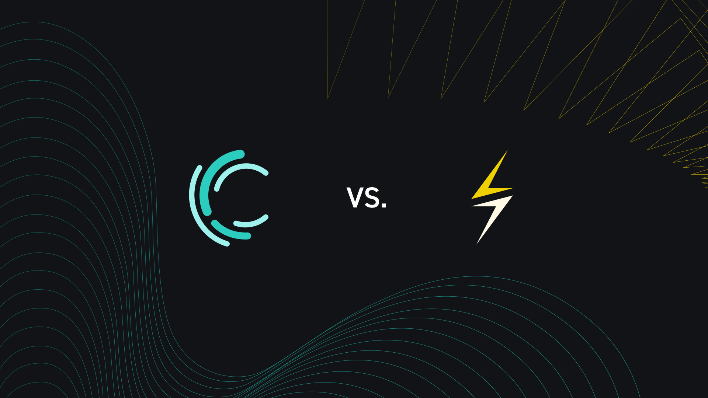
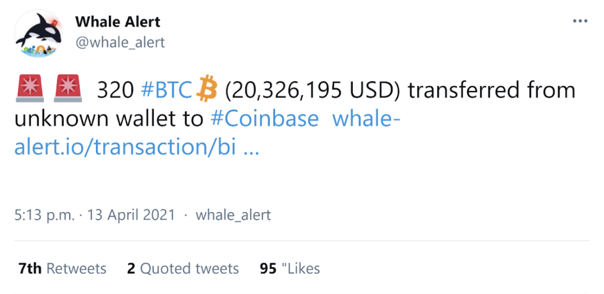

> *作者：Liquid Federation*
> 
> *来源：<https://blog.liquid.net/six-differences-between-liquid-and-lightning/>*

Layer-2 协议扩大了比特币用户的选择权。它们让比特币得以扩展，并带来了许多好处，包括低手续费、高速度和更强的匿名性。

本文比较了两种**不相同但互补**的比特币 Layer-2 支付解决方案：闪电网络和 [Liquid 网络](https://help.blockstream.com/hc/en-us/articles/900002016823-What-is-the-Liquid-Network-)。

这两种方案各有用场。闪电网络是为普通用户优化的，允许商家从顾客手上便宜且快捷地接收微支付和小额支付。Liquid 则主要是交易员和交易所用于快速而私密地转移大额比特币（和其他代币）的工具。

Liquid 也支持使用其他数字资产（比如 Tether）来支付，但出于本文的目的，我们将专注于比较在它们上面使用比特币的情形。

下面，我们会考察 Liquid 和闪电网络的六大关键区别，以及它们是如何为不同的用途优化的。这些区别可以用一张表来总结：

|          |                                                          |                                                              |
| -------- | -------------------------------------------------------- | ------------------------------------------------------------ |
|          | 闪电网络                                                 | Liquid 网络                                                  |
| 交易额   | 微支付、小额支付                                         | 普通乃至大额的支付                                           |
| 进入方式 | 开启一条支付通道                                         | 在市场上将 BTC 换成 L-BTC，或主动锁定 BTC                    |
| 退出方式 | 关闭支付通道，或者将通道内的余额全部换成 BTC             | 在市场上将 L-BTC 换成 BTC，或解除锁定 BTC（只要一部分成员可以这样做） |
| 结算速度 | 即时                                                     | 两分钟                                                       |
| 隐私性   | 强壮 —— 相对隐私，但依然可被监视                         | 非常强 —— 机密交易可隐藏交易数量和资产类型                   |
| 托管属性 | 单签名（不支持多签名）、热钱包（不支持冷钱包、硬件钱包） | 支持单签名、多签名、热钱包、冷钱包和硬件钱包                 |
| 信任模式 | 点对点，只要钱包保持在线就是免信任的                     | BTC:L-BTC 的锚定需要信任超过 2/3 的联盟理事是诚实的          |

## 1. 交易额

**闪电网络**

闪电网络是为处理微支付和小额支付而优化的。用户通过在网络中发现一条能连接支付发送者和支付接收者的、靠闪电支付通道连成的路径，来彼此支付。

- 用户 A 如何通过闪电节点构成的网络给用户 Q 支付 -

但是，每条闪电通道可以处理的交易体量，都是由这条通道在开启的时候注入的资金量决定的。所以，随着支付额的增加，找出能够完成支付的路径的概率就会降低，因此闪电网络在处理大额交易时是不可靠的。

如需处理频繁的大额交易，发送者和接收者都需要执行大量的通道管理工作，以保证有足够的流动性能满足支付请求。这在一定程度上意味着用户需要预判他人的支付行为。

随着闪电网络的增长，其处理较大额度支付的能力也会提升，但它的限制就摆在那里，大额交易无法通过闪电网络可靠地发送。

**Liquid** 

Liquid 网络是为处理中等乃至大额的交易而优化的。它跟闪电网络不一样，它是通过一条侧链来运行的：在这条独特的区块链上，用户可以使用一种跟 BTC 1：1 锚定的代币，叫做 “[Liquid Bitcoin (L-BTC)](https://help.blockstream.com/hc/en-us/articles/900001408623-How-does-Liquid-Bitcoin-L-BTC-work-)”，来发起交易。

在 Liquid 网络上，交易的体量没有限制（技术上来说只有 2100 BTC 这样的限制！）。用户可以按需要[锁定](https://help.blockstream.com/hc/en-us/articles/900001387966-What-is-a-Liquid-peg-in-)一定的 BTC，然后立即开始交易。L-BTC 的接收方无需参与任何形式的通道，支付者发送了多少，接收者就能收到多少。

因为 Liquid 运行在自己的区块链上，[它处理交易的速度就受制于其自身的区块体积限制](https://help.blockstream.com/hc/en-us/articles/900001390903-What-is-the-transaction-capacity-of-Liquid-)（不受比特币区块链的区块体积限制影响）。目前，手续费是非常低的（0.1 聪/vbyte），但随着 Liquid 得到接受，[手续费应该也会提高](https://help.blockstream.com/hc/en-us/articles/900001386846-How-do-transaction-fees-on-Liquid-work-)，影响微支付的经济性。

不过，闪电网络和 Liquid 是互补的，[用户也可以在 Liquid 上运行闪电支付](https://twitter.com/notgrubles/status/1355547472827834373?s=20)，这样就能在利用 Liquid 独特属性的同时获得微支付的便利。

## 2. 进入和退出

**闪电网络**

闪电通道的开启和关闭，就代表着用户进入和离开闪电网络。

为了建立一个闪电网络通道，两个比特币用户需要为比特币网络中的一个多签名地址注入资金。一旦资金进入这个地址，就只有两方的签名兼具时才能动用。

要在闪电网络上支付，用户需要运行一个完全同步的比特币节点和一个闪电节点，闪电节点只需要在通道开启时保持在线。

要将你的比特币从闪电网络中移回比特币主链，你需要关闭你的通道，因此需要另一笔主链交易。这意味着，要参与闪电网络，用户总是至少需要支付两笔主链交易手续费：一笔是给进入闪电网络的通道开启交易的，另一笔是给离开闪电网络的通道关闭交易的。

像 Breez 这样的非托管钱包，以及 [Blue Wallet](https://bluewallet.io/) 这样的托管式钱包，都给用户提供了更容易但需要更多信任的使用方法。托管式闪电钱包非常流行，但都有所牺牲，包括会引入一些对手方风险、具有更差的隐私性。

## Liquid

进入和退出 Liquid 网络有两种方法：

1. “双向锚定”
2. 在 交易所/互换平台 上将 BTC 与 L-BTC 互换

就像创建一条闪电通道一样，创建 L-BTC 的流程也需要通过一笔主链交易来初始化。用户的 BTC 先转入一个比特币地址并被暂时锁定。然后，这笔交易的输出将可用于在 Liquid 网络中解锁相等数量的 L-BTC。最后，L-BTC 可根据 Liquid 的协议规则在 Liquid 网络上转移。

若要将 L-BTC 换回 BTC，用户或者可以通过一个 Liquid 联盟成员发起解锁操作，或者可以直接找到另一个用户，将 L-BTC 换成 BTC。跟闪电网络一样，参与 Liquid 网络也需要至少两笔主链交易。

大部分用户都会倾向于通过互换来进入和退出 Liquid 网络。许多公司提供 BTC 和 L-BTC 的快速互换服务，包括 [Liquiditi](https://liquiditi.io/)、[SideShift AI](https://sideshift.ai/)、[SideSwap](https://sideswap.io/) 和 [Bitfinex](https://www.bitfinex.com/)。

BTC 换成 L-BTC 之后，用户很容易可以使用非托管的钱包（[AQUA](https://blockstream.com/aqua/)、[Blockstream Green](https://blockstream.com/green/)、[SideSwap](https://sideswap.io/)）来保管 L-BTC，甚至可以使用离线的硬件钱包（[Blockstream Jade](https://blockstream.com/jade/)、[Ledger Nano S](https://shop.ledger.com/products/ledger-nano-s)）。

- 锁入 BTC 时，需要比特币区块链的 102 次区块确认；而解锁 BTC 时，只需获得 Liquid 区块链的 2 次区块确认 -

## 3. 速度

**闪电网络**

**闪电网络上的支付可以做到几乎即时**。因为闪电网络支付并不要求区块链的确认，所以它可以快到网络连接所允许的限度：最高每秒可以处理几百万笔交易。

只要可以找出路径来处理所需的支付额，交易的速度就是闪电网络的主要优势之一。闪电网络的速度让比特币计价的交易可以用在日常购买（比如买咖啡）中。这也为新的支付应用开辟了道路，比如在线服务的川流式支付。

**Liquid**

与闪电网络相反，Liquid 区块链生产区块来确认交易，所以它的交易速度更慢。不过，Liquid 区块链的交易速度依然比比特币区块链快得多。Liquid 区块链会以一分钟的间隔规律地产生区块 —— 是比特币区块的生产速度的十倍 —— 而且一笔交易只需两次确认就可以认为已经敲定了。这意味着，Liquid 交易只需要大约两分钟就可以敲定。这个时延对于想要在交易所和私人钱包间移动资金的交易员来说已经够用了，不过对于像用来买咖啡的日常交易还是太慢了。

- L-BTC 交易的<a href="https://help.blockstream.com/hc/en-us/articles/900005458323-How-many-confirmations-are-needed-for-my-Liquid-transaction-to-be-secure-">确认速度比比特币快十倍，而且只需要两次确认</a> -

## 4. 隐私性

**闪电网络**

闪电网络提供了比比特币主链交易更好的隐私性，因为主链交易是实时可观测的。而闪电支付会在一系列节点间路由，无论是接收方还是中继节点，都不能确切地知道交易源自哪个节点。

而且，闪电支付也不会像链上交易一样，在区块链上留下永久的痕迹，所以一个想要攻破匿名性的攻击者必须参与交易路由 —— 事后是无法再揭开交易的信息的了。

对于小额的、不太敏感的消费者交易，闪电网络所提供的隐私性可以说是足够的了。

但是，闪电网络上依然有可能存在一些监视，因为单个节点可以从要求他们处理的交易中记录通道和方向信息。虽然这种监视方法有局限性，它依然意味着隐私性的瑕疵。

不过，因为比特币和闪电节点都不使用真名，所以用户依然有可能保持匿名性 —— 防止你的身份与你所控制的地址产生关联。

**Liquid**

相反，Liquid 网络协议是经过专门设计的，所以被转移的资产类型和数额，对发送者和接收者以外的人都是不可见的。这是通过 Blockstream 所开发的前沿密码学协议 “[机密交易](https://blockstream.com/bitcoin17-final41.pdf)” 来实现的。Liquid 的高度隐私性对交易员来说是重要的好处。假如他们再比特币区块链上移动大额资金，区块链分析会让其他人也知道（比如下面的 “[巨鲸警报](https://twitter.com/whale_alert/status/1382004132052144140?s=20)”），市场会有所反应，价格可能在交易员获得交易机会之前就发生变化。因为 Liquid 交易的机密性，交易员可以放心转移资金，无需交易意图暴露。

- 比特币区块链上的大额资金移动引发关注 -

不过，用户也要记得，在将 L-BTC 换回 BTC 时，有必要搞清楚自己使用的是带 KYC 的还是不带 KYC 的解决方案。KYC 要求将向第三方提供信息，使之能将用户与自己的比特币地址关联起来。不过，至少，任何分析都无法跟踪 BTC 锁入操作以外的 L-BTC 交易历史。

## 5. 托管方案

**闪电网络**

一般而言，闪电网络的用户必须在线保管自己的私钥，直至通道关闭。闪电节点也需要持续检测和滚动备份。虽然还没有出现数据泄露的事情，但因为节点一直在线，理论上来说攻击者是有可能窃取敏感信息乃至私钥的。

此外，因为闪电网络不允许用户使用多签名保管方案，资金都是由单个私钥控制的。这对于存储大额的比特币、以及不希望单人独享资金控制权的机构来说，都是不理想的。（译者注：从原理上来说，一条闪电通道只允许有两个用户，每个用户都使用一把公钥来表示，但并不能限制用户使用聚合签名方案和门限签名方案，从而实现对外只表现为一把公钥，对内则需要多个签名才能构造有效签名的效果。但是，目前没有闪电网络的节点实现提供这样的支持，所以如果用于希望使用这样复杂的密钥管理技术，需要自行搭建。）

Coindesk 的[这篇文章](https://www.coindesk.com/bitcoin-lightning-network-vulnerabilities-not-exploited-yet)列举了闪电网络的一些关键的可能攻击界面，以及开发者是如何解决这些问题的。

**Liquid**

在使用 Liquid 侧链时，私钥可以离线放在冷存储中，这样除非亲身盗取私钥，否则资金是不可能被偷走的。Liquid 用户还可以通过 Blockstream Green 使用硬件钱包，保证其 L-BTC 私钥永久离线。

Liquid 也支持比特币形式的多钱看。这给个人用户提供了更多的安全性，也让机构可以对他们的 L-BTC 钱包建立起共享的控制。

## 6. 信任模式

**闪电网络**

在闪电网络中，交易无需直接广播到比特币网络中，但是能得到比特币网络的保护。因为一条闪电通道的两个用户总是一起签名通道余额的每一次变化，所以任何一个用户都能随时将结算交易广播到网络中。只要双方都持续观测通道的状态（通过节点或者钱包服务），闪电网络就是高度信任最小化的，因为没有任何一个用户需要信任自己的通道对手。

## Liquid

Liquid 的信任模式基于由 15 个带有硬件安全模块（HSM）的主机服务商（叫做 “理事”）所组成的联盟。BTC:L-BTC 的双向锚定基于超过 2/3 的[联盟理事](https://help.blockstream.com/hc/en-us/articles/900003013143-What-is-the-Liquid-Federation-#:~:text=Liquid%20functionaries%20are%20specialized%20servers,in%20the%20federation's%20multisig%20wallet.)是诚实的。虽然需要一些信任，但分布式的联盟模式依然大大优越于大部分交易员所面临的其他信任模式（比如要信任单个交易所来托管他们的资金）。

联盟成员有强大的经济激励不去勾结，因为这样做会让他们已经存储在 Liquid 网络中的价值处于风险之中。就像就黁冲o，联盟成员也都是已知的法律实体，如果他们企图作恶，将面临法律后果。

- Liquid 理事分散在多个法律辖区，以提高网络的弹性 -

## 结论

闪电网络和 Liquid 网络是互补的 Layer-2 解决方案，它们让比特币可以总在更广泛的应用中、得到更多人的使用。自然，任何的 Layer-2 方案都会有所取舍，所以重要的是理解它们分别适合什么样的场景，以及什么时候最好坚持使用主链上的比特币交易。

闪电网络为小额支付提供了绝佳的工具，这些新鳄支付并不需要主链交易所提供的安全性，而闪电网络可以做到便宜又快捷。一般而言，闪电网络可以用在零售和博彩这样的应用中。

Liquid 则让中等和大额的比特币交易可以获得很高程度的机密性和安全性，以及合理的速度。所以，Liquid 适合用于交易和借贷。

如果你希望利用 Liquid 和 Lightning 各自的长处，我们有可能在 Liquid 上开发闪电网络，这样能让我们的侧链进一步扩展。

## 上手闪电网络

下载 [Breez](https://breez.technology/) 或者 [Blue Wallet](https://bluewallet.io/)，存入一些比特币，然后找到一个[支持闪电网络的商家](https://lightningnetworkstores.com/)。

## 上手 Liquid

下载 [AQUA](https://aquawallet.io/)、[Blockstream Green](https://blockstream.com/green/) 或者 [SideSwap](https://sideswap.io/)，[将一些 BTC 换成 L-BTC](https://help.blockstream.com/hc/en-us/articles/900000630846-How-do-I-get-Liquid-Bitcoin-L-BTC-)，然后找一个朋友[或者交易所](https://help.blockstream.com/hc/en-us/articles/900000629383-Which-platforms-support-the-Liquid-Network-)，尝试用一下。

（完）