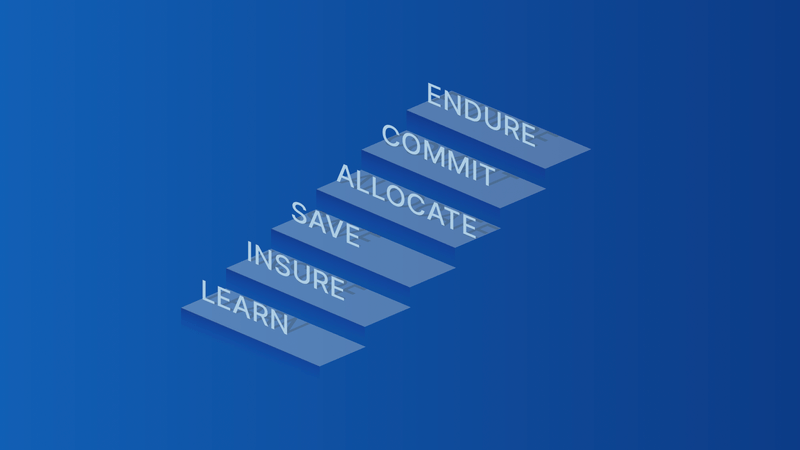

> *作者：Jessy Gilger*
> 
> *来源：<https://www.unchained.com/blog/six-stages-bitcoin-adoption>*

虽然比特币在价值存储和交换媒介上的作用日益得到认可，接受它也要分步走。这些步骤包括了解比特币、应对潜在的风险、为将来储蓄、让它进入投资组合、将长期持有视作一种机会，最终与它保持终身的关系。

这些步骤不是命中注定会发生的；实际上，你可能不会顺利地从头走到尾。这些步骤也不能全面覆盖所有情况；还有别的方式来理解比特币。但无论你是比特币世界的新人还是有经验的老手，思考这些步骤可以帮助你更好地平衡你的个人目标和比特币仓位。

## 了解

> *“在你第一次买入比特币的时候，你对比特币的了解必然是有限的 …… 更多的理解会在以后的日子里慢慢发生。”*
>
> —— Parker Lewis

如果你不经验比特币，就无法理解比特币。如果你有所好奇，最好的办法就是跳进去，这通常是每个人接受它的第一个步骤。

买入比特币没有资金门槛。你可能会从一个 “如果在街上捡到就可以开心一天，弄丢了就会难过一天” 的数量开始。对我个人来说，20 美元就够了。最重要的是从零开始，迈出这一步。最坏的情况无非是你弄丢了这一笔小钱。

玩一玩，感受一下其中的乐趣。听听有关的播客，看看视频。在社交媒体上关注一下严肃对待这种资产的人。随着你的了解和经历增长，你可能会获得更多的信心，买入更多。

## 保险

> *“比特币是保险。”*
>
> —— Greg Foss

在了解比特币之后，许多人接下来会认为比特币是保险，或者是对现有金融系统的 “对冲”。在这个阶段，有些人可能会认为如果以美元为主导的系统崩溃，比特币会是取代它的头号竞争者。

将净财富的 1% 到 5% 投入比特币的人，就可能是进入这个 *保险* 阶段了。如果投入的是 1%，即使比特币灰飞烟灭，相当于你只是在 1 美元中损失了 1 美分。这对你的财务状况不会造成毁灭性的影响，但如果它的购买力涨了 100 倍，那就保护了你的资产组合中的所有其它资产。

在对冲现有的系统时，重要的是记得，要让你的比特币处在系统之外。如果你把比特币放在交易所里，或者某个对手方那里，一旦对方倒闭，你就会失去它们。如果你将比特币视为保险，那就要[自己使用冷存储和私钥来保管它](https://unchained.com/vaults/)。否则，它就会变成别人的保险。

## 储蓄

> *“比特币是储蓄。”*
>
> —— Pierre Rochard

在这个阶段，你可能开始意识到，比特币不只是保险。比特币帮助人们保护自己的购买力、免受通胀侵蚀。从此，你可能看到了，比特币是货币，因此，对你的中长期目标而言，它是一种储蓄技术。

想要以比特币为储蓄，关键是对你的 “自由现金流” 有良好的把握：你的收入，减去你预计的开支，就等于你的自由现金流。当你的收入和开始都得到妥当的计划时，你就可以按照[定期投资法](https://www.unchained.com/blog/dca-bitcoin)，将部分或全部自由现金流投入比特币。

定期投资是一种帮助你在一段时间中逐步投入资金的方法。你需要按预定的计划购买一定数量的比特币，不管它的价格。实施定投法最流行的办法就是通过自动购买计划，就是设定你的购买计划和数额。

## 分配

> *“比特币是电子化的财产。”*
>
> —— Michael Saylor

这一阶段的人尝试采用更加主动的方式来投资比特币。他们内在地认为比特币会在他们的所有投资中占据一个可观的比重（比如，净财富的 20% 都是比特币），一般会基于自己的投资策略来买入或卖出。这可能会涉及一次性的买入或重新平衡自己的投资组合，以维持他们想要的比重。

换句话说，比特币 *储蓄者* 可能储蓄的是自己的自由现金流，而比特币 *配置者* 也会投资他们现有资产组合中的其他东西。

不论是时间的作用还是你主观的决定，比特币都有机会成为你的净财富中的重要部分。到了这个时候，你自然会考虑卖出一些比特币，因为比特币已经变得更加成熟。这可能是因为你在财务目标、风险偏好、投资周期上的改变，甚至只是因为你想实现利润、减少你在某一资产上的风险敞口。

对于个人来说，仔细思考自己买入和卖出比特币的理由、评估这对你的整体投资组合的潜在影响，是很重要的。同样重要的是，请记住，不论投资比特币或其他资产，你所采取的方法，是基于你的财务目标、风险偏好、教育和投资周期的个人决定。这些问题应该请求财务顾问。

## 承诺

> *“比特币是时间。”*
>
> —— Gigi

时间越长，比特币的实质就会得到越明显的体现。通过将时间和能量汇聚成完全稀缺的货币，这一阶段的比特币人会专注于开发和增长自己的长期财富。然而，捡起长期目标，需要纪律、承诺以及承受短期市场波动的意愿。

人们常常被激励去关注即刻的奖励和结果，这可能会导致因为意外的收获或者意外的损失而过早出售投资。我们并非天生就能以十年的尺度来思考问题。这就是[个人退休金账户](https://unchained.com/bitcoin-ira/)这样的产品有用的的地方，它们会鼓励个人忠诚于长期目标。

以长期的时间维度来投资比特币会带来特定的风险。没有什么能够保证这种资产会在接下来的数十年间如你所愿。但是，如果比特币的表现真的像处在这个阶段的比特币人所希望和预期的那样，那就会极大地影响个人的生活以及长期净财富。

## 忍耐

> *“比特币是希望。”*
>
> —— Robert Breedlove

这一阶段的的比特币人是比特币的变革力量的真正信仰者。他们认为比特币不仅仅是一种金融资产，还是一种给世界带来积极变化的方式。他们对比特币拓展人类自由、创造跨代财富的潜力饱含激情，而且他们也愿意为了追求这个目标而接受重大的风险。

虽然路上会有挫折和挑战，这些比特币人依然会坚持他们的愿景。他们会在熊市中变得坚强，不会被短期的挫折打倒。他们着眼于长期，专注于为自己和周围的人创造可以长期保持的财富和更好的未来。

有一部分比特币人甚至会在自己的财务生活中完全抛弃法定货币。他们完全相信比特币的原理，并认为这是实现他们的目标的最好方法。总的来说，这些人是被一种强大的目标感所驱动的，他们相信比特币让世界变得更好的潜力。

## 总结

理解你跟比特币相接触的可能阶段，有助于你对齐自己的个人目标和比特币可能给你的东西。不论你是仅仅在了解比特币、对冲潜在的风险、为将来储蓄、调整资产组合、坚持使用它作为主要的交换媒介，或忍受任何市场波动，获得对这些视角的坚实理解都有助于你作出明智的决策，并更好的理解你自己问你自己的 “为什么”。

（完）

