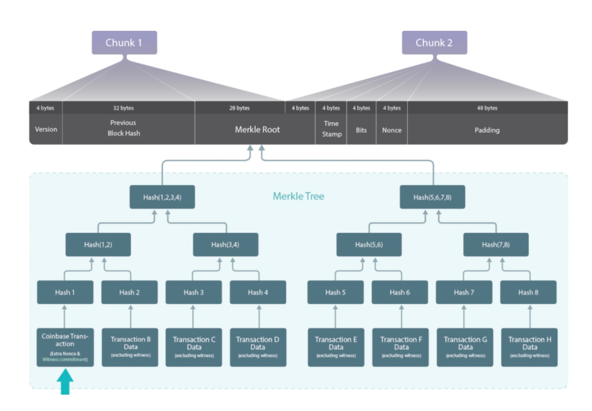

> *作者：BitMEX Research*
> 
> *来源：<https://www.bitmex.com/blog/64-Byte-Transactions>*

**摘要**：64 字节长的比特币交易可能跟区块默克尔树的哈希对象相混淆，因为后者也是 64 字节。我们研究了这个漏洞可以如何用来欺骗 “简易支付验证（SPV）” 客户端，使它认为自己收到了一笔交易（实际上并没有），以及这个弱点会造成的其它问题。虽然发动这样的攻击是非常复杂的，而且这个漏洞也不严重，它有一种较为简单的修复措施，那就是在一次软分叉中禁掉所有剥除见证数据之后长为 64 字节的交易。

## 概述

这篇文章属于我们讨论 [BIP 54](https://github.com/bitcoin/bips/blob/master/bip-0054.md) 共识清理软分叉将修复的四个安全漏洞的系列。我们已经介绍了其中两个安全漏洞：

1. [时间扭曲攻击](https://www.bitmex.com/blog/the-timewarp-attack)（[中文译本](https://www.btcstudy.org/2025/06/11/the-timewarp-attack-by-bitmex-research/)）
2. [重合交易](https://www.bitmex.com/blog/bitcoins-duplicate-transactions)（[中文译本](https://www.btcstudy.org/2025/06/18/bitcoins-duplicate-transactions/)）

在这篇文章中，我们会关注所谓的 “64 字节长的交易” 问题。其中的机关在于，在生成比特币区块中的默克尔树的中间节点时，其哈希对象的长度也是 64 字节。

一笔比特币交易的哈希值，也就是 “TXID”，是 32 字节长的。而比特币区块默克尔树的倒数第二行是哈希两个 TXID 的拼接 —— 也就是 64 字节。这个安全漏洞在于，这个 64 字节的数据（两个哈希值的拼接）可能会跟一笔 64 字节长的交易混淆。比如说，攻击者可以创建一笔长度恰好是 64 字节长的比特币交易，以此来迷惑或者诱骗一个轻节点确认一笔入账支付。我们将在下文了解这种攻击的部分步骤。

**图解比特币区块中的默克尔树**

**[Sergio Lerner 制图](https://bitslog.com/2018/06/09/leaf-node-weakness-in-bitcoin-merkle-tree-design/)：虚假交易的位置**

总体而言，我们认为，与这个漏洞相关的风险是中等乃至较低的，因为攻击非常复杂；这与 “时间扭曲攻击” 相反，我们认为后者更加严重。不过，这依然是一种有趣的漏洞，也值得修复。

## 将一个交易的 ID 藏在另一个交易里

当前已知的利用该漏洞的最严重的攻击形式，应该是诱骗使用简易支付验证（SPV）客户端的人确认一笔无效的入账交易。我们在下文提供了一个示意图，总结了这种攻击。攻击步骤如下：

1. 攻击者创建一笔真实有效的比特币交易，其长度恰好是 64 字节。这个数字已经排除了任何隔离在外的见证数据。
2. 攻击者再创建一笔虚假的、无效的比特币交易，发送（比如说）1000 BTC 给受害者。比如说，该交易的 1000.002 BTC 来自一个虚假输入，它并不存在于 UTXO 集中。
3. 攻击者为这笔虚假交易安排一个找零地址，然后使用暴力搜索，不停切换找零地址，直到该虚假交易的 TXID（32 字节长）恰好与真实有效交易（64 字节长）的后面 32 个字节完全一样。
4. 一旦找出了这样的配对，攻击者就可以向受害者的轻客户端发送 SPV 证据，其中包含从真实的区块头默克尔树根通向虚假交易的有效路径。受害者会误以为该默克尔树的最底层是倒数第二层，下面还有一笔交易。然后，这个受害者就会认为自己收到了 1000 BTC  —— 来自矿工的工作量证明被攻击者用来欺骗受害者。当然，全节点是不会受到这种方式欺骗的（其中有很多原因），但 SPV 节点就会被欺骗。

**图示攻击所用的两笔交易**

- 注：这种攻击在 Peter Todd 于 <a href="https://gnusha.org/pi/bitcoindev/20180607171311.6qdjohfuuy3ufriv@petertodd.org/">2018 年 6 月 7 日</a>出版的文章和 Sergio Lerner 在 <a href="https://bitslog.com/2018/06/09/leaf-node-weakness-in-bitcoin-merkle-tree-design/">2018 年 6 月 9 日</a>出版的文章中分别得到了解释  -

上面这种攻击看起来在计算上是不可行的，因为似乎需要找到一个完整的 32 字节的 SHA256 碰撞案例。我们已经直到这在计算上是不可行的了，而且，要欺骗一个 SPV 客户端，挖出虚假区块（在今天，需要 2^84 次搜索）显然要更加容易（比起用 2^256 次搜索找出哈希碰撞）。然而，这里的机关在于，64 字节的交易是可以调整的，所以你不需要通过纯粹的暴力搜索来匹配 32 字节。

**64 字节长的交易的后面 32 字节的组成**

| 物件         | 描述                                                         | 长度                       | 需要暴力搜索的长度 |
| ------------ | ------------------------------------------------------------ | -------------------------- | ------------------ |
| 输入 TXID    | 一笔前序比特币交易的哈希值。因此，它是随机的，无法操纵。需要暴力搜索。 | 5 字节（在该字段的后半段） | 5 字节             |
| 输入索引     | 可以先制作一笔启动交易（作为前序交易），带有几千个输出。这样，输入的索引号就可以操纵，以跟虚假交易碰撞（在一定程度上）。不过，这可能比较贵，而且构造起来也不容易。在现实中，在这里可能也需要部分暴力搜索。 | 4 字节                     | 0                  |
| 输入长度     | 难以操纵，因为对交易还有其它约束。因此需要暴力搜索。         | 1 字节                     | 1 字节             |
| 输出数量     | 交易只能有恰好一个输出，否则难以恰好是 64 字节。             | 1 字节                     | 1 字节             |
| 输出价值     | 攻击者想发送多少比特币，就可以发送多少，只要有这么多钱，并且做好了放弃它的准备。如果这笔交易的输入价值 1 BTC，那么输出的数值就有 1 亿种可能性（1 亿聪等于 1 BTC）。因此，这个字段（在一定程度上）是可以操纵的。不过，可能需要烧掉 2100 万 BTC 才能完全操纵这个字段。 | 8 字节                     | 0                  |
| 输出脚本长度 | 难以操纵，因为对交易还有其它约束。因此需要暴力搜索。         | 1 字节                     | 1 字节             |
| 输出脚本公钥 | 因为注入这笔交易的资金是无法取回的，所以这个字段可以轻松地自由操纵。 | 8 字节                     | 0                  |
| 锁定时间     | 锁定时间是可以操纵的，比如说表达为区块高度，最大值为 5 亿。因此这里有大量熵。 | 4 字节                     | 0                  |
| 总计         |                                                              |                            | 8 字节             |

因此，基于上表，在对攻击者最有利的情况下（用上一切能够操纵的字段），攻击者只需要找出 8 字节的碰撞。8 字节，或者说 2^64 次搜索，并不需要许多计算资源；普通的一台笔记本电脑也可以很快完成。事实上，可能需要稍微高于  2^64 次，因为上面的所有字段都不是完全可操纵的。

但这种攻击也并不像它看起来那么严峻。因为启动起来极端复杂，也许要制作一笔带有几千个输出的启动交易，还可能要烧掉几千美元，这还仅仅获得了能够操纵几个字节的熵。此外，SPV 钱包现在也不是那么流行了。预计要收取高价值支付的人，都直到自己需要一个全节点来验证入账支付。不过，这种攻击依然是可行的，尤其在工具都已齐备的情况下，因此，它值得关注，值得我们尝试缓解风险。

## 默克尔根哈希值碰撞

另一个一定程度上相关的比特币漏洞在 [2012](https://bitcointalk.org/index.php?topic=102395.0;all) 年被发现和修复。这种漏洞在于，两个不同的比特币区块，一个是有效的、另一个是无效的，可能具有相同的默克尔根哈希值。有几种可能会造成这种局面，其中一种也涉及将一个 64 字节的中间哈希步骤与 64 字节长的交易相混淆。

问题的核心在于，比特币节点会存储无效区块的区块哈希值，从而避免再次验证它（浪费资源）。但是，如果两个区块带有相同的区块哈希值，一个是有效区块，另一个是无效区块，比特币节点（如果先验证了无效区块，就不再能验证有效区块）就可能被诱骗从具有最多工作量证明的链上脱离、跟随较少工作量证明的敌对链。这个问题在 2012 年得到了修复，方法是让节点在缓存无效区块的哈希值之前，作额外的检查。

相关的一个漏洞在 2019 年再次曝出，因比特币开发者 Suhas Daftuar [注意到](https://gnusha.org/pi/bitcoindev/CAFp6fsGtEm9p-ZQF_XqfqyQGzZK7BS2SNp2z680QBsJiFDraEA@mail.gmail.com/)：一个相似的 bug 在 Bitcoin Core 0.13.0（发布于 2016 年 11 月）中于无心之中再次引入，并在 [2017 年 2 月](https://github.com/bitcoin/bitcoin/pull/9765)再次修复。还有其它漏洞，也跟本文讨论的这个问题有关；可能还有尚未发现的利用方式。

## 拟议的解决方案

修复这个问题不需要软分叉，至少对于欺骗 SPV 的利用方式是不需要的。SPV 钱包所用的方法可以升级，比如，总是在跟 coinbase 交易的同一默克尔树层级检查交易。然而，问题在于，SPV 钱包并没有这样做，对这个问题的了解也不广泛。因此，人们还是容易受到伤害。

当前，拟议的软分叉解决方案是 BIP 54，其方法是完全禁止剥除了见证数据之后长为 64 字节的交易。这听起来是非常简单而且容易的修复。不管怎么说，似乎没有什么理由要制作恰好长为 64 字节的交易。比如说，在我们上面的例子中，是把资金打进黑洞，才制作出了 64 字节长的交易。Suhas Daftuar 在 2019 年的一封邮件中指出，他扫描了整个比特币区块链，没有发现长为 64 字节的交易。这应该会让软分叉更流畅、更容易获得共识，因为它禁止的是从未发生过的事，因此是风险较小的、比较没有争议的。不过，到了今天，也许有一些 64 字节的交易了。

BIP54 将让比特币出现一条有些奇特的新规则：63 字节长的交易和 65 字节长的交易，都是有效的；唯独 64 字节长的交易是无效的。但是，尽可能少设立对交易的禁令，应该是更好的。

