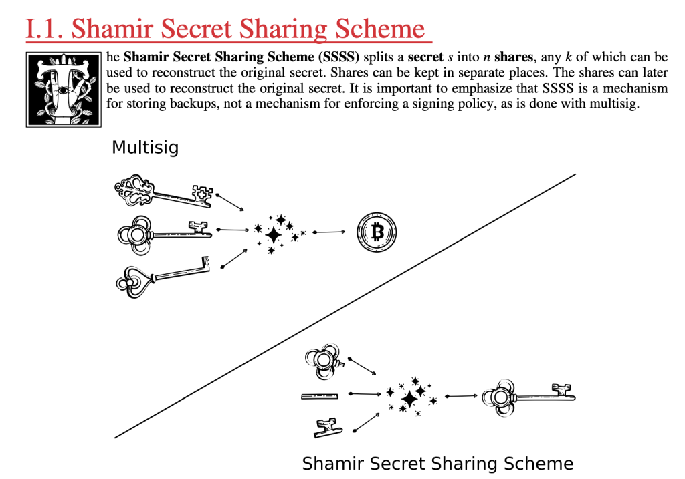

> *作者：Bitcoin Bumblebee*
> 
> *来源：<https://bitcoin-bumblebee.com/2024/10/13/slip39-an-easy-and-powerful-way-to-secure-your-seed-phrase/>*

在你自主保管比特币的时候，钱包的备份非常关键 —— 它包含了你所有的私钥；并且，在你的设备丢失、损坏或变得无法触及的时候，备份让你可以恢复对资金的控制。今天，大部分钱包 软/硬 件都使用 **BIP39** 标准，就是会生成一个 **12 个或 24 个词所组成的有序词组**（种子词）来保护你的钱包；你只需备份这套种子词，就是备份了钱包。

虽然效果明显，依赖于单一的种子词总让人感觉有些危险。要是这个备份丢了，你可能会永远失去你的钱；如果它被盗了，别人也可以控制你所有的钱。问题来了，如何提升它？**这就是 SLIP39 的出发点**。

SLIP39 提供了一种灵活而安全的解决方案，让你可以**将一套种子词的备份分割成几份**，并保证即使其中一份丢失或失盗，你的资金也依然安全。

## 什么是 “SLIP39”？

SLIP39 基于 “**Shamir 私钥分割**（SSS）”，这是密码学家 Adi Shamir 在 1979 年提出的一种密码学方法。而 SLIP39 本身是一套**开源**的标准，设计目的是提高种子词备份的安全性和灵活性；它让你可以将一个钱包的备份分成几份（可称为 “片段”），你可以将它们分散保管在不同的地方。SLIP39 保证了，一定数量（或者说一个阈值）的片段，就足以复原你的钱包；也就是增加了额外的保护层。

[解释私钥分割的视频](https://youtu.be/iFY5SyY3IMQ)

举个例子，你可以将你的种子词备份分成 3 份，并设置阈值为 2 。这意味着你只需要这 3 个片段中的 2 个，就能够复原出，这提供了额外的冗余，并提高了安全性。即使其中 1 个片段丢失或损坏，你的钱包依然能够复原，只要你的另外 2 个片段还没丢。此外，如果某 1 个片段被盗，攻击者也没法拿走你的钱，除非他们能拿到足够多的片段（满足你此前设置的阈值）。

## 为什么我不能直接切分种子词，要借助这个什么标准？

直接将你的 BIP39 种子词分成几份并不能提供与 SLIP39 相同的安全性。因为即使攻击者只找出了其中一份，距离重构出你的完整种子词也接近很多了。比如，将一套 24 词的种子词分成两半，每一半各 12 个词，不管攻击者拿到的是哪一半，要猜测（运用计算机暴力搜索）出剩余的部分都容易很多了。

相反，SLIP39 使用密码学保证了，单靠一个片段 —— 或者说在片段数量不够的时候 —— 是无法揭晓关于源种子词的任何信息的。即使攻击者找出了你的 SLIP39 备份的一个片段，也不能用来复原你的钱包，除非他们继续攻击、最终拿到了满足阈值的片段数量。所以 SLIP39 更加安全。

## SLIP39 的工作模式

你可以将一套种子词分割成许多份（**最多可以分割成 16 份**）；在分割之前，要决定阈值的数值，只要不超过片段的总数，就可以分割成功（但是，阈值与总量不相等，才能为你提供冗余）。

假设你决定将一个种子词分割成 3 个片段，并将复原阈值设为 2，你可以这样分散这些片段：

1. 保存一个片段在家里。
2. 保存一个片段在办公室里。
3. 把一个片段交给一位值得信任的朋友或家人。

即使其中一份丢失或损坏，你依然能使用剩余的两个片段复原自己的钱包。这保证了你的备份能够抵御意外、盗窃和其它不可预见的事件，消除单点故障的风险。

- 一个盗贼要从多个地方盗窃，要比只需要盗走一份词表难得多。 -

每个人的情况都不一样。在建立分割备份之前，要考虑许多因素，比如你的生活环境、你信任的人，以及你可以安全保管片段的地方人。要为你自己的具体需要计划一套备份策略。

## SLIP39 与多签名钱包有何分别？

多签名钱包要求来自多套种子词的签名来授权交易，但 SLIP39 专注于保护一套种子词（的备份）。

SLIP39 在**备份**层面提供灵活性和冗余，而多签名是在**交易授权**层面提供。

- Shamir 私钥分割与多签名的区别，来自 <a href="https://www.secretcodex32.com/">Codex32 手册</a> -

## 采用 SLIP39 的软硬件

SLIP39 是由 SatoshiLabs 提出的，它是开发 Trezor 硬件签名器的公司，同时也是 BIP39 标准（广泛采用的种子词标准）的提出者。作为一个开源标准，开发者可以自由将 SLIP39 集成到自己的软件中。这种开放性带来了更广泛的采用，多款钱包软件和硬件签名器都集成 SLIP39 以为用户提供更多的钱包复原选择。

在 2017 年，[Trezor](https://trezor.io/) 硬件签名器实现了 SLIP39（在用户操作界面中称为 “Shamir 备份”）。随后，[Keystone](https://keyst.one/) 硬件签名器在 2021 年添加了 SLIP39 。到 2024 年，Trezor 的设备将 SLIP39 的单片段备份和多片段备份都作为默认选项，让用户可以在一开始创建一套种子词（单片段），后面再升级成多片段备份。

现在许多软件钱包都支持 SLIP39，给用户提供了更多的复原选项，这在用户无法触及自己的硬件签名器时是尤其有用的。

## SLIP39 用于遗产规划

SLIP39 的灵活性使之非常适合遗产规划。你可以在多个值得信任的家庭成员或安全空间（比如保险柜和律师）中分散保存碎片。通过设置复原阈值（比如集齐 5 个片段中的 3 个），你可以确保自己的后代能获得你的比特币，无需依赖于某一个人、某一个安全空间。这防止了过早获取，又保证了你的财产不会丢失。

## 使用 SLIP39 的提醒

这里有一些实用的提醒，可以帮助你最大限度获得 SLIP39 的好处：

- **安全地分散你的片段**：在不同的安全地点（或者值得信任的人）处保存片段，以尽可能降低一次性失去所有片段的风险。
- **设置实用的阈值**：常见的选择是 2-of-3 和 3-of-5 ，确保你的钱包在某些片段丢失或损坏时依然能够复原。
- **考虑在金属上备份一个或多个片段**：将一个片段保存在金属上，可以保证它抵御火患、水浸以及其它可能破坏纸备份的灾难。
- **不要用电子设备保存备份**：避免在电子设备上存储片段，因为这会增加你的备份被黑（未经授权的访问）的风险。坚持实体存储选项，比如纸和金属。
- **定期测试你的复原流程**：定期演练复原钱包的流程，以确保你的片段是有效的，而且容易触及。这可以帮助避免在需要复原钱包时遭遇惊吓和精神压力。

## 结论

SLIP39 提供了一种安全而灵活的方式来保护你的种子词配分。通过将一套种子词分割成几个片段并设置复原阈值，它减少了单点故障风险。

## 参考链接

- [SLIP-0039 : Shamir’s Secret-Sharing for Mnemonic Codes — Github](https://github.com/satoshilabs/slips/blob/master/slip-0039.md)
- [Protecting your Bitcoin inheritance with Shamir backup — Trezor Blog](https://blog.trezor.io/protecting-your-bitcoin-inheritance-with-shamir-backup-77b5bc77ea5a)
- [Why Keystone implemented Shamir Backups — Keystone Blog](https://blog.keyst.one/why-keystone-implemented-shamir-backups-71e319f972a6)

