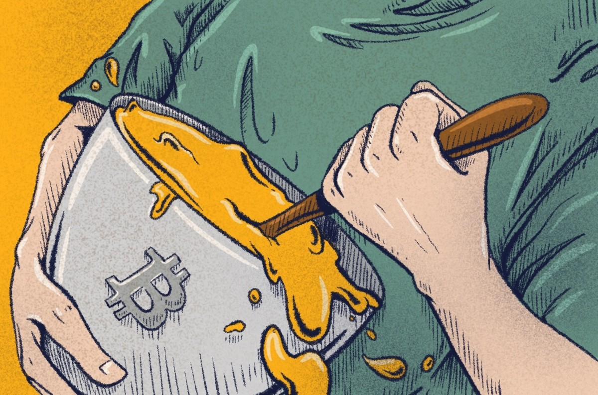

> *作者：Aaron van Wirdum*
> 
> *来源：<https://bitcoinmagazine.com/culture/snicker-how-alice-and-bob-can-mix-bitcoin-with-no-interaction>*

SNICKER 有望成为下一个在比特币生态中飞速崛起的隐私保护工具。

虽然中本聪在[白皮书](https://bitcoin.org/bitcoin.pdf)中表示隐私性是比特币协议的设计目标，但是如今的区块链分析往往可以打破用户的隐私。这确实是个问题。例如，比特币用户未必想让全世界都知道他们在哪儿花了钱、赚了多少钱或拥有多少钱，企业也未必想将自己的交易详情泄露给竞争对手。

幸好比特币开发者和研究者正在提出[越来越多的解决方案](https://bitcoinmagazine.com/articles/bitcoin-privacycoin-tech-making-bitcoin-more-private)来帮助用户重获隐私。Adam Gibson（昵称是“waxwing”）就是致力于增强比特币隐私性的先锋之一，他最知名的贡献是 JoinMarket 协议。JoinMarket 可以让用户将自己的币与其他人的币混合，并为参与这类混币的人提供经济奖励。

最近，Gibson 提出了一个新的想法：SNICKER（Simple Non-Interactive Coinjoin with Keys for Encryption Reused，复用加密密钥的非交互式简单 CoinJoin）SNICKER 现已提交为 [BIP 草案](https://gist.github.com/AdamISZ/2c13fb5819bd469ca318156e2cf25d79)，可实现非同步、非交互式混币，即，无需用户协作或同时在线。

## CoinJoin

SNICKER 基于现已成熟的比特币混币技术 [CoinJoin](https://bitcoinmagazine.com/articles/coinjoin-combining-bitcoin-transactions-to-obfuscate-trails-and-increase-privacy-1465235087)。眼下最热门的一些混币方案就采用了 CoinJoin，例如，Wasabi Wallet（ZeroLink）、Samourai Wallet（Whirlpool）和 JoinMarket。

[扩展阅读：比特币混币器是什么？](https://bitcoinmagazine.com/guides/what-are-bitcoin-mixers)

CoinJoin 本质上是将多个交易合并成一个的工具。假设 Alice 想要支付 1 BTC 给 Carol，Bob 想要支付 1 BTC 给 Dave。在这种情况下，Alice 和 Bob 可以联手创建一笔大交易，各自支付 1 BTC（共计 2 BTC）给 Carol 和 Dave。区块链分析师将无法断定谁在给谁支付，这就保护了所有人的隐私性。

现实中，比特币的交易数量常常会泄露隐私。如果 Alice 想支付 1 BTC 给 Carol，但是 Bob 想支付 2 BTC 给 Dave，我们只要将付款数量和收款数量配对就可以明显看出付款方和收款方之间的对应关系。

这就是为什么 CoinJoin 会得到各大混币方案的青睐。假设 Alice 和 Bob 没有付款给其他人，而是发送了 1 BTC 给自己。这两笔交易被合并后，区块链分析师无法辨别谁拿了哪个币。因此，将两个 BTC 混合起来保护了 Alice 和 Bob 的隐私。

CoinJoin 混币器虽然有效，但是有一个缺点：需要交互。CoinJoin 交易只有经过所有参与者签名后才有效。但是，为了签名整笔交易，参与者必须先将所有比特币和新的收款地址都添加至该交易。换言之，这笔交易需要经过多次传递，所有参与者都要同时在线。

这些要求对于很多用户来说都有点困难，这也是 CoinJoin 交易未能普及的原因之一。SNICKER 的目的就是避开这些要求。

## SNICKER V1

这一部分介绍的协议是 SNICKER 的首个提议版本。该版本相比其它版本更易于理解，但是请注意，它既不是 SNICKER 协议的最优版本，也不是最有可能实现的版本。（关于其它版本的介绍，请参见下文。）

SNICKER v.1 的运作方式如下：

假设 Alice 想要混合 1 BTC，即，比特币区块链上的未花费交易输出（UTXO）。她要做的第一件事就是重新将这 1 BTC 发送到同一个地址上。没错，在 SNICKER v.1 中，Alice 复用了地址。这虽然有违比特币的最佳操作习惯，但是能够公开表示该 UTXO 可用于混币。

顺便一提 ，这并不表示 Alice 不能使用这 1 BTC。这 1 BTC 仍存放在 Alice 的钱包内，随时都可以花掉。这 1 BTC 只是被标记了。

Bob 也有 1 BTC 要混合。（实际上，双方用于混币的 BTC 数额无需相等，只要 Bob 的 BTC 数额不少于 Alice 的就够了。）Bob 虽然不认识 Alice，但他知道一定有像 Alice 这样的用户将自己的 UTXO 标记成了可混合的。因此，Bob 在比特币区块链上寻找可以匹配的 UTXO。Bob 找到了 Alice 的 UTXO，很有可能还找到了更合适的 UTXO，包括虚假的匹配结果（并非所有复用的地址都可用于混币）。为简单起见，此处假设 Bob 只找到了一个匹配结果：Alice 的 UTXO。（我们稍后会讲到其它匹配结果和虚假匹配结果。）

匹配完成后，Bob 得到了被复用的地址的对应 *公钥 。*这都要归功于地址复用：Alice 第一次花费 UTXO 时就将公钥发布到了区块链上。（UTXO 被花费时其公钥才会在区块链上公开可见，而地址总是可见的。）（译者注：比特币的有些地址类型中，公钥是一直公开可见的，但现在人们常用的地址类型，比如 P2PKH、P2WPKH，公钥不是直接可见的。）

此时，Bob 有了 Alice 的 UTXO（因为她标记过了）和她的公钥（因为这个 UTXO 已经从 Alice 的地址上支出过一次了）。

接下来，Bob 使用 Alice 的公钥并将其与自己的私钥（他想用于混币的 UTXO 的对应私钥）相结合，创建一个“共享秘密值”。毫不夸张地说，这是密码学最古老的把戏。之所以说这个秘密值是共享的，是因为只有 Alice 和 Bob 可以生成它：Bob 用自己的私钥和 Alice 的公钥，Alice 用自己的私钥和 Bob 的公钥（对应的是 Bob 想要用于混币的 UTXO）。

现在，Bob 有了 Alice 的 UTXO 和她的公钥，以及一个共享秘密值（由 Bob 使用 Alice 的公钥和他自己的私钥生成）。

Bob 以一种新颖的方式使用这个共享秘密值：他使用这个秘密值来“调整” Alice 的公钥（通过一些运算）。这种调整实际上创造出了一个新的公钥，只是（现在还）没人拥有对应的私钥。

有趣的是，在密码学的神奇作用下，Alice 能够找到与调整后的公钥对应的私钥！只要她使用同一个共享秘密值调整原始私钥，新生成的私钥就能匹配调整后的公钥。

换言之，Bob 能够为 Alice 生成一个新的公钥以及新的比特币地址，但只有 Alice 能够支出这个地址上的余额。这一切都可以在 Alice 不知情的情况下完成！

现在，Bob 有了 Alice 的 UTXO 和公钥、一个共享秘密值，以及一个属于 Alice 的新的比特币地址（使用 Alice 的公钥和共享秘密值生成）。

有了这些就差不多可以创建一个有效的 CoinJoin 交易了。具体来说，Bob 将 Alice 的 UTXO 和他自己的 UTXO 作为输入，Alice 的新地址和他自己的地址作为输出（另外还有其它费用等等，例如，有可能需要一个找零地址）。然后，Bob 签名这笔交易。

现在唯一缺少的就是 Alice 的签名。

### 联系 Alice

最后一步就是联系 Alice，这实际上比听起来更容易，但是需要用到最后一招。

Bob 可以将这个近乎完整的 CoinJoin 交易发布到某处以便 Alice 找到。例如，SNICKER 用户专用公告栏，最好基于 Tor 隐藏服务或其它能够确保发布者匿名的服务。

但是，如果以纯文本的形式发布，效果还是不够理想。如果有人密切监视公告栏，很容易就能辨别出哪个输入属于挂单者（在本例中是 Bob），哪个输入属于吃单者（在本例中是 Alice）：已签名的输入就是挂单者的。这种形式本身就有可能泄露隐私。如果 Bob 挂多个单来混合不同的 UXTO，情况会变得更糟。在这种情况下，监视者或许能够找出所有与 Bob 关联的不同 UTXO，因为 Bob 在公告栏上同时挂了多个单。

为避免这种情况，Bob 使用 Alice 的公钥加密 CoinJoin 交易！这样一来，只有 Alice 能够解密该交易，监视者探知不到任何信息。

将加密过的交易发布到公告栏上后，Bob 就完成了他要做的一切。他高兴的话，甚至可以在网络上销声匿迹。

### Alice 的回合

由于 CoinJoin 交易已经加密，这就引入了最后一点复杂性。虽然 Alice 知道该去哪儿寻找交易包（在 SNICKER 公告栏上），但她不知道自己要找的是哪个：公告栏上的所有 CoinJoin 交易看起来都像是加密数据块。

只有一个解决办法。Alice 需要使用自己的私钥尝试解密所有交易包，希望从中解出有用的那个。

一旦 Bob 的加密数据块变成了 CoinJoin 交易，Alice 就有了完成混币所需的一切。她使用自己的私钥和 Bob 的公钥（就包含在 Bob 的输入中）生成共享秘密值，然后使用这个共享秘密值生成新的私钥。在确认这个新的私钥与输出中新的收款地址匹配后，Alice 签署该 CoinJoin 交易并将其广播到比特币网络上。

就这样，Alice 和 Bob 成功完成了混币，尽管他们从未进行过交互，甚至不需要同时在线。

虽然从文字表述上来看整个流程有点麻烦，但是别忘了这些全都可以经由软件抽象成笔电或手机屏幕上的几个按钮，甚至完全实现自动化。

## SNICKER V2

到目前为止，本文介绍的都是 SNICKER 的第一个提议版本。Gibson 还提议了第二个版本，另外还有其它变体版本尚在讨论中。

SNICKER 的第二个版本与第一个版本差不多，区别在于前者免去了地址复用之需 —— 代价是引入了更多复杂性。

在第二个版本中，Bob 不再从复用地址那里获取 Alice 的公钥，而是从创建 Alice 的 UTXO 的交易的输入那里获取公钥。Bob 假设该交易中至少有一个输入由 Alice 本人创建，而且 Alice 依然拥有这些输入的私钥。

Bob 之所以做出这种假设，是因为这次 Alice 的 UTXO 将被更清楚地标记为可用于混币，而且只有当输入的对应私钥由 Alice 控制时才会被标记得如此清楚。SNICKER BIP 没有具体说明如何进行初始标记，但是指出有些钱包（例如 JoinMarket 钱包）会准确无误地反映标记情况。或者说，Alice 可以直接在公告栏上发消息为自己的 UTXO 打广告。

更妙的是：一旦 SNICKER 得到采用，寻找混币配对将变得更加容易。这是因为 SNICKER 交易 *本身* 识别度较高，而且现有的 SNICKER 用户很可能会想要再度进行混币。换言之，初期引导阶段过后，未经过混币的 UTXO 会与已经过混币的 UTXO 混合，让更多 UTXO 参与混合，扩大混币市场。

## 挑战和机遇

正如上文所述，SNICKER BIP 目前仍是草案，尚待审议和改进。（该提案自 Gibson 首次在[博客](https://joinmarket.me/blog/blog/snicker/)中公开提出后已经有所改进。）如今，作为一项 BIP，SNICKER 可以走上标准化道路，最终兼容不同钱包。

SNICKER 同样面临一些难题和挑战，不过看起来不是很难解决。例如，应该选择哪些 UTXO 用于配对，以及如何限制虚假匹配结果的数量。除了重用地址之外，我们还可以根据金额、UTXO 币龄或特定钱包类型来筛选潜在匹配结果。

就像上文提到的那样，即使存在多个匹配结果（包括虚假匹配结果），也不会是什么大问题。挂单者（“Bob”）可以为所有匹配结果都创建候选交易。即使这些候选交易彼此冲突（因为 Bob 在每个交易中用的都是同一个 UTXO），也仅仅意味着第一个响应的吃单者（第一位 “Alice”）能够与 Bob 混币成功，其它候选吃单者会发现自己晚了一步，但是不会有任何损失。对于虚假匹配结果，这些交易同样不会造成任何伤害。Bob 的挂单只会躺在公告栏上永远无人问津（直到被清除为止）。

但是，垃圾信息是个不容小觑的问题。由于公告栏会存储加密数据块，不可能筛除“虚假”挂单：攻击者可以发布任意垃圾信息来破坏 SNICKER 协议。Gibson 在其 BIP 草案中提出了一些针对该问题的解决方案，但是这些解决方案会引入新的权衡，例如，提高挂单成本。

另一方面，SNICKER 也带来了一些优点，只是为了简单起见没有详述。其中一个优点是，挂单者可以额外加一笔钱到吃单者的输出里，作为经济激励来吸引吃单者接受混币。SNICKER 还可以让挂单者同时与两位以上用户进行混币，尽管这会复杂得多。

正因为 SNICKER 协议是非交互式的，Gibson 认为相比 JoinMarket 之类的隐私技术，SNICKER 更容易在钱包中实现。迄今为止，Electrum 钱包已经表示有兴趣采用 SNICKER 提案，但距离真正的实现还有很长一段路要走。

*如需进一步了解 SNICKER 的信息和背景，请阅读* [*SNICKER BIP 草案*](https://gist.github.com/AdamISZ/2c13fb5819bd469ca318156e2cf25d79)*，关注比特币开发邮件列表中的*[*讨论*](https://www.mail-archive.com/bitcoin-dev@lists.linuxfoundation.org/msg08320.html)*和 Gibson 关于该提案的（稍微有些过时的）*[*博客文章*](https://joinmarket.me/blog/blog/snicker/)*。*

（完）