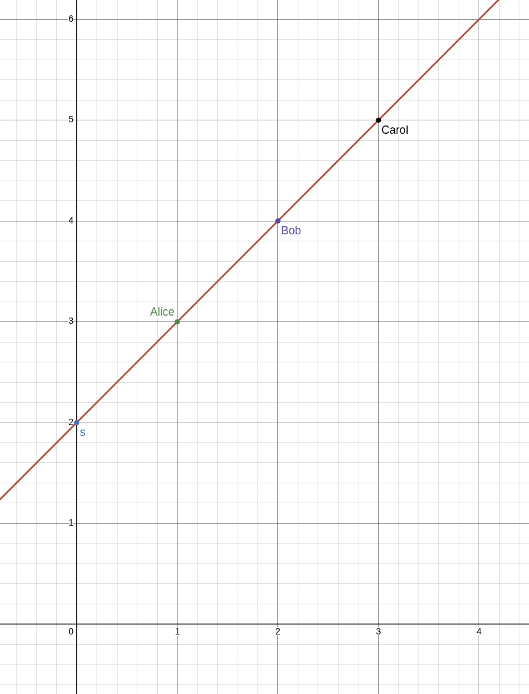
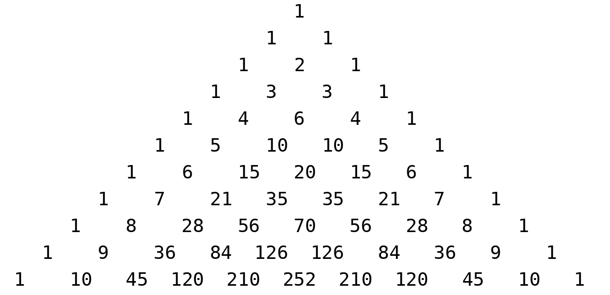

> *作者：Dadav Kohen*
> 
> *来源：<https://nkohen.github.io/blog/some-secrets-shared/>*

在密码学中，“秘密值分割（**secret sharing**，私钥分割）” 指的是将一个秘密值分割为多个碎片（称为 “秘密值碎片”），从而没有单个设备存储完整的秘密值、但汇集几台设备就可以集体复原出秘密值的方法。需要秘密值分割的场景的经典案例包括导弹发射代码以及企业环境下的共同保管；在这两种场景中，都需要以多人授权为采取行动的前提。近来，秘密值分割在涉及机密数据的 “多方计算（MPC）” 以及私钥管理中得到大量使用；在后面这个场景中，一个人或者一个团体通过一个私钥来持有密码货币，而他们希望将这个私钥分割成 $n$ 的私钥碎片，当且仅当集齐 $t$ 的碎片就能使用这个私钥。

在本文中，我们将讨论两种形式的秘密值分割：“复制型秘密值分割（RSS）” 和 “Shamir 秘密值分割（SSS）”。我们将介绍这两种方案的细节，只需稍微有些背景知识就能读懂。我们还会介绍，将 RSS 碎片转化为 SSS 碎片的过程，可以用来构造一种叫做 “伪随机秘密值分割（PSS）” 的方案， 一套装置就能产生出任意数量的安全且确定性的 SSS 实例。最后，我们将看到这些构造在门限 Schnorr 签名方案 [Arctic](https://eprint.iacr.org/2024/466) 中的作用。

## 2-of-3 秘密值分割案例

假设我们要分割一个秘密值 $s$ 为 $n=3$ 份，分别记为 $(s_1, s_2, s_3)$，使得任意 $t=2$ 个碎片就可以复原出秘密值 $s$ 。为求清晰和简洁，假设我们要将这三个碎片分别交给三个人：Alice（A）、Bob（B）和 Carol（C）。 

最容易想到的办法是将秘密值分成三份，三份相加就可以得到 $s$ 。比如，我们可以随机选出 $s_1$ 和 $s_2$ ，然后令 $s_3 = s - s_1 - s_2$ 。结果是，碎片有 3 个，但全部集齐才能恢复出秘密值；只知晓其中任意两个，不会获得关于 $s$ 的任何信息，因为无法排除任何可能性。然后，我们可以将这种 $t=3$ 的方案转化为 $t=2$ 的方案，办法是让一份碎片包含多段信息。也就是说，我们把集合 $\{s_2, s_3\}$ 交给 Alice；把集合 $\{s_1, s_3\}$ 交给 Bob，然后将集合 $\{s_1, s_2\}$ 交给 Carol 。没有任何人知道关于 $s$ 的信息，但他们中的两个凑在一块儿，就能一起知道 3 个片段，从而知晓秘密值 $s$ 。

另一种办法是利用 “任意两点可确定一条直线” 这个数学事实。因此，如果我们一个标准的 2 维平面上选出一个点作为 $(0, s)$ ，然后选出第二个点，其第二个坐标值为随机数，即 $(1, s_1)$ ；这两个点就唯一地确定了一条直线，它必然包含更多点 $(2, s_2)$ 和 $(3, s_3)$。一旦我们随机选出 $s_1$，就能使用非常基础的手段，推导出关于其它数值的方程。比如说，我们已经知道这条线的斜率是 $\frac{s_1 - s}{1 - 0} = s_1 - s$ ，因此：

$$
s_2 = s_1 + (s_1 - s) = 2s_1 - s
$$

并且：

$$
s_3 = s_2 + (s_1 - s) = 2s_1 - s + (s_1 - s) = 3s_1 - 2s.
$$

因此，只要我们把 $(1, s_1)$ 交给 Alice、把 $(2, s_2)$ 交给 Bob、把 $(3, s_3)$ 交给 Carol，那么其中任何两人都能一起计算出这条线，并且能够揭晓 $s$ ：就是在这条线上，其第一个坐标值为 $0$ 的那个点的第二个坐标值。此外，又没有哪个人可以独自知道关于 $s$ 数值的任何信息。

请注意，不管是哪一种分割方法，我们都有以下好的属性：

- 如果每个人都把自己的秘密值碎片乘以某个常数 $c$ ，那么其得到的恰好就是原始秘密值乘以 $c$ 所得到的数值的碎片。
- 如果我们对两个不同的秘密值 $s_1$ 和 $s_2$ 分别执行同一种秘密值分割、并且使用同样的参数，然后每个参与者都得到两者的其中一个碎片，那么，他们得到的恰好就是秘密值之和 $s_1 + s_2$ 的一个碎片。

这两种属性合在一起，叫做 “线段性（linearity）”。

上述第一种方法的线段性是很容易看出的，因为每一方都拿着一对可以相加的数，并且显然：

$$
c\cdot s = c\cdot (s_1 + s_2 + s_3) = c\cdot s_1 + c\cdot s_2 + c\cdot s_3 \quad \text{且}
$$

$$
s + s' = (s_1 + s_2 + s_3) + (s_1' + s_2' + s_3') = (s_1 + s_1') + (s_2 + s_2') + (s_3 + s_3')
$$

上述第二种方法的线段性也只需要稍微花点功夫就能看出。关键是，每一条直线都可以用一个等式 $y = L(x)$ 来表示，只要函数 $L$ 满足 $L(0) = s$ ，然后我们的碎片 $s_1, s_2, s_3$ 就分别等于 $L(1), L(2), L(3)$ 。因此，如果我们有两条直线 $y = L_1(x)$ 和 $y = L_2(x)$，并且 $s = L_1(0)$ 和 $s' = L_2(0)$ ，那么直线 $y = L_1(x) + L_2(x) = (L_1 + L_2)(x)$ 满足 $(L_1 + L_2)(0) = s + s'$ 以及 $(L_1 + L_2)(i) = L_1(i) + L_2(i)$ ，对 $i=1,2,3$ 都成立。在这里，你可以把 $L_1 + L_2$ 理解成 $x$ 的一个新的函数。比如，如果 $L_1(x) = 2+x$ 而 $L_2(x) = 3-5x$ ，那么 $(L_1 + L_2)(x) = 5 - 4x$ 。

这种线段性，正是让各方能在秘密的输入上执行多方计算而无需揭晓这些秘密的原因。比如说，如果我们已经在私钥 $x$ 以及一个随机 nonce 值 $k$ 上执行了秘密值分割，希望对公开可知的常数 $H(R, m)$ 计算数值 $s = k + H(R, m)\cdot x$ 。这个数值 $s$  就是共享密钥 $x$ 对消息 $m$ 的 [Schnorr 签名](https://nkohen.github.io/blog/introduction-to-schnorr-signatures)。我们的秘密值分割方案的线段性意味着，因为我们以同样的方式分割了 $x$  和 $k$ ，所以，可以让每个参与者都将其 $x$ 的碎片乘以 $H(R, m)$ ，再加上其 $k$ 的碎片，得到的就是 $s$ 的一个碎片。最后，他们就能一起恢复出 $s$ ，而无需在任何中间步骤暴露 $x$ 或 $k$ ！这也意味着，如果我们能以  2-of-3 的形式线性地分割一个秘密值，只需要求 3 个参与者中的 2 个配合，我们就能在共享秘密值上运行计算，而无需让任何一方知道计算的秘密输入。在本文的末尾，我们会更深入地介绍这种秘密值分割的用法。

## Shamir 秘密值分割

就像上面的案例，使用直线，对于任何 $t=2$ 的方案都很妥当，但如果我们要构造一种需要全部 $t=3$ 个参与者合作才能复原出秘密值的方案呢，能用类似的办法码？

可以证明，任意三个点都能唯一确定一条曲线：一条抛物线！（三个点也可以确定一个圆形或一个平面，但它们不如抛物线那么通用。）更泛化地说，对于任意数量 $t$ ，可以用任意 $t$ 个点唯一确定一条以 $(t-1)$ 次[多项式](https://en.wikipedia.org/wiki/Polynomial)来表达的曲线。证明我们放在[下文](#多项式插值的唯一性)。而且，只知道任意 $t-1$ 个点，不会得到关于曲线上的另一个点的信息，只要曲线是随机生成的。

换句话说，如果我们希望制作私钥 $s$  的一种 $t$ of $n$ 的分割方案，我们可以随机选出数值 $a_1, a_2,\ldots, a_{t-1}$ ，然后使用它们来定义一个多项式：

$$
f(x) = s + a_1x + a_2x^2 + \cdots + a_{t-1}x^{t-1}.
$$

因为我们设置其常数项为 $s$ ，所以，我们有 $f(0) = s$ 。然后，我们令 $s_1 = f(1), s_2 = f(2), \ldots, s_n = f(n)$ ，然后将 $(1,s_1), (2, s_2), \ldots, (n, s_n)$ 分别分发给各个参与者。最后，任意 $t$ 个参与者都可以使用他们的碎片来重新构造出多项式 $f(x)$ ，因为这可以由任意 $t$ 个点来唯一确定，由此，可以计算出 $s = f(0)$ 。这种方案，叫做 “Shamir 秘密值分割（SSS）”。但是，到底要怎么做才能从一组 $t$ 个点 $(x_1, y_1), (x_2, y_2), \ldots, (x_t, y_t)$ 中计算出 $f(x)$ 呢？计算出一条拟合一组给定点的曲线的问题叫做 “插值（interpolation）”，将在下一节中讨论。如果你已经熟知 “拉格朗日插值法” 的细节， [可以跳过下一节](#复制型秘密值分割)。

## 拉格朗日插值法

我们先从尝试计算一条直线（也就是 $t=2$ ）开始。给定两个点： $(x_1, y_1)$ 和 $(x_2, y_2)$ 。那么我们的直线的斜率是 $\frac{y_2 - y_1}{x_2 - x_1}$ ，因此，我们可以使用点 $(x_1, y_1)$ 以及这个斜率，写下这条直线的点斜式：
$$
y - y_1 = \left(\frac{y_2 - y_1}{x_2 - x_1}\right)(x - x_1)
$$

但是，如果是这种形式，这个当时将无法推广到更高次的多项式上，所以，我们要尝试重写这个等式，目标是让 $x_1$ 和 $x_2$ 的用法更加对称。毕竟，我们也很容易使用另一个点来获得同一条直线的另一个点斜式： $y - y_2 = \left(\frac{y_2 - y_1}{x_2 - x_1}\right)(x - x_2)$ 。作为第一步，我们分离出 $y$ ，并将 $x$ 与 $y_1$ 和 $y_2$ 的部分分开，然后交换并分解出 $y_1$ ：

$$
\begin{align*}
y - y_1 &= \left(\frac{y_2 - y_1}{x_2 - x_1}\right)(x - x_1)\\\\
y &= \left(\frac{x-x_1}{x_2 - x_1}\right)(y_2 - y_1) + y_1\\\\
&= y_2\left(\frac{x-x_1}{x_2 - x_1}\right) - y_1\left(\frac{x-x_1}{x_2 - x_1}\right) + y_1\\\\
&= y_2\left(\frac{x-x_1}{x_2 - x_1}\right) + y_1\left(1 - \frac{x-x_1}{x_2 - x_1}\right)\\\\
&= y_2\left(\frac{x-x_1}{x_2 - x_1}\right) + y_1\left(\frac{x_2 - x_1}{x_2 - x_1} - \frac{x-x_1}{x_2 - x_1}\right)\\\\
&= y_2\left(\frac{x-x_1}{x_2 - x_1}\right) + y_1\left(\frac{x_2 - x}{x_2 - x_1}\right)\\\\
&= y_2\left(\frac{x-x_1}{x_2 - x_1}\right) + y_1\left(\frac{x - x_2}{x_1 - x_2}\right)
\end{align*}
$$

这就得到了更加对称的等式，也更容易理解一些。如果我们代入 $x = x_1$ ，就会得到：

$$
y = y_2\left(\frac{x_1 - x_1}{x_2 - x_1}\right) + y_1\left(\frac{x_1 - x_2}{x_1 - x_2}\right) = y_2\cdot 0 + y_1\cdot 1 = y_1
$$

同样地，如果我们代入 $x = x_2$ ，就会得到：

$$
y = y_2\left(\frac{x_2 - x_1}{x_2 - x_1}\right) + y_1\left(\frac{x_2 - x_2}{x_1 - x_2}\right) = y_2\cdot 1 + y_1\cdot 0 = y_2
$$

因此，我们似乎是得到了这些 “砖块” 直线：$L_2(x) = \frac{x - x_1}{x_2 - x_1}$ ， $L_1(x) = \frac{x - x_2}{x_1 - x_2}$ ，在我们代入 $x_1$ 或 $x_2$ 的时候，两者的值分别是 $0$ 或者 $1$ 。比如说，当我们代入 $x_1$ 的时候，$L_2(x_1)$  就等于$0$ ，因为显然，分子是 $0$ ；当我们代入 $x_2$ 的时候，$L_2(x_2)$ 的分子与分母相等，所以其值成了 $1$ 。然后，在函数中，这条直线会被乘以 $y_2$ ，所以我们拿这个 $1$ 乘以 $y_2$ ，就得到了我们想要的结果。因为 $y = y_2\cdot L_2(x) + y_1\cdot L_1(x)$ 。

记住这个例子。我们如何用类似的办法，在给定三个点 $(x_1, y_1), (x_2, y_2), (x_3, y_3)$ 的时候计算出一条抛物线呢？具体来说，假设我们希望构造出一条新的抛物线 $L_1(x)$ ，使得 $L_1(x_1) = 1, L_1(x_2) = 0$ 且 $L_1(x_3) = 0$ 。为了实现两个结果 $0$ ，我们可以从抛物线 $y = (x - x_2)(x - x_3)$ 开始；然后，为了确保 $L(x_1) = 1$ ，我们可以让这个多项式除以我们给它代入 $x_1$ 时候的值，从而得到：

$$
L_1(x) = \frac{(x - x_2)(x - x_3)}{(x_1 - x_2)(x_1 - x_3)}
$$

类似地，我们可以定义 $L_2(x) = \frac{(x - x_1)(x - x_3)}{(x_2 - x_1)(x_2 - x_3)}$ ，而 $L_3(x) = \frac{(x - x_1)(x - x_2)}{(x_3 - x_1)(x_3 - x_2)}$ 。最后，我们可以定义出我们的多项式：

$$
\begin{align*}
f(x) &= y_1\cdot L_1(x) + y_2\cdot L_2(x) + y_3\cdot L_3(x)\\\\
&= y_1\cdot \frac{(x - x_2)(x - x_3)}{(x_1 - x_2)(x_1 - x_3)} + y_2\cdot \frac{(x - x_1)(x - x_3)}{(x_2 - x_1)(x_2 - x_3)} + y_3\cdot \frac{(x - x_1)(x - x_2)}{(x_3 - x_1)(x_3 - x_2)}.
\end{align*}
$$

一口气念不全！而且随着参数增加，这个式子还会变得更大，所以我们加入一些记号来让式子变得紧凑。假设我们有一组参与者，都编了号，$C = \{x_1, x_2, x_3\}$ ，然后，对于固定的数字 $i$ ，砖块 $L_i(x)$  在 $x_i$ 上的值将是 $1$ ，而对 在 $C$ 中的其它数值上，其值为 $0$ ，这可以用以下的连乘符号来表示：

$$
L_i(x) = \prod_{x_j\in C\setminus\{x_i\}} \frac{x - x_j}{x_i - x_j}
$$

换句话说，对于每一个 $x_j\in C$ （排除了 $x_i$ 本身），我们乘以一个因子 $\frac{x - x_j}{x_i - x_j}$ 。然后，我们可以使用以下连加记号精确地写出 $f(x)$：

$$
f(x) = \sum_{i=1}^3 y_i\cdot L_i(x)
$$

这个式子更容易理解，就是对于每一个 $i$（从 $1$ 到 $3$），我们加上与该 $i$ 对应的 $y_i\cdot L_i(x)$  。上述两式结合，我们可以这样写：

$$
f(x) = \sum_{i=1}^3 y_i\prod_{x_j\in C\setminus\{x_i\}}\frac{x - x_j}{x_i - x_j}.
$$

$f(x)$ 的这种形式，可以推广到任意次的多项式。只要我们给出 $t$ 点 $(x_1, y_1),\ldots, (x_t, y_t)$ ，我们就能计算出唯一一条以 $t-1$ 次多项式来表示、穿过这些点的曲线：

$$
f(x) = \sum_{i=1}^t y_i \prod_{x_j\in C\setminus\{x_i\}}\frac{x - x_j}{x_i - x_j},
$$

其中 $C = \{x_1,\ldots, x_t\}$ 就是  $x$ 系数/参与者索引号 的集合。对于每一个 $k$ ，这条曲线都恰好穿过 $(x_k, y_k)$ ，因为只要我们把  $x_k$ 代入 $x$ ，就会发现这些加法项都变成了 $0$（因为各项有一个乘法项的分子是 $x - x_k$ ），只剩一个不等于 $0$ 的加法项就是对应于 $i = k$ 、乘法项等于 $1$ 的那个，因此 $f(x_k) = y_k\cdot 1$ 。

这种从一些点重构出一种多项式形式的方法，叫做 “拉格朗日插值法”，而我们使用的砖头 $L_i(x)$，则叫 “[拉格朗日多项式](https://en.wikipedia.org/wiki/Lagrange_polynomial)”。

### 多项式插值的唯一性

虽然从所有实用目的触发，简单 假设/相信/信任 $t$ 个点可以唯一定义一个 $(t-1)$次的多项式，就已经完全足够了，但是大多数证明这必然成立的论证都不难（只是可能有些繁琐），所以我把其中一种论证放在这里，权当好玩。这一节的内容[与本文剩余章节的内容无关](/blog/some-secrets-shared/#replicated-secret-sharing)。

我们希望证明的是，如果 $f(x)$ 和 $g(x)$ 是两个 $(t-1)$ 次的多项式，并且在 $t$ 个各不相同的 $x_i$ 上 $f(x_i) = g(x_i)$，那么两者就完全相同 $f(x) = g(x)$ 。

两个 $(t-1)$ 次的多项式的差值，最高次数就是 $(t-1)$ ，所以 $h(x) = f(x) - g(x)$ 是一个最高只有 $(t-1)$ 次的多项式，并且在那 $t$ 个输入 $x_i$ 上，其输出为 $0$ 。这样的导致一个函数求值得零的输入，称为该函数的 “根”。因此，如果我们能证明，一个 $(t-1)$ 次的多项式 $h(x)$ 有 $t$ 个不同的根则表明 $h(x) = 0$ ，就足够了（这样我们就证明了， $f(x) - g(x) = 0\Rightarrow f(x) = g(x)$ ）。

等价地，我们可以证明如果 $h(x)$ 是一个非零的、最高 $(t-1)$ 次的多项式，那么它最多只有 $(t-1)$ 个根（因为这就意味着如果它有更多根，就表明 $h(x)$ 是个零函数）。如果 $t = 1$ ，那么 $h(x)$ 是一个最多只有 $t-1 = 1-1 = 0$ 次的多项式，也就是 $h(x)$ 是个常数非零值，没有根（因为我们已经假设了 $h(x)$ 不是 $0$ 函数）。如果 $t = 2$ ，那么 $h(x)$ 最高次数为 $t-1 = 2-1 = 1$ 次，所以它要么是一条非零的直线，要么是个非零的常数函数，两个都最多只有 $1$ 个根。接下来我们将使用[数学归纳法](https://en.wikipedia.org/wiki/Mathematical_induction)来论证（如果你不熟悉数学归纳法，但熟悉编程中的 “递归” 概念，那么归纳法本质上就是递归在形式化论证中的名称，就像接下来这个）。

假设每一个最高 $(n-1)$ 次的非零多项式最多只有 $(n-1)$ 个根，我们希望证明，这意味着每一个 $n$ 次非零多项式最多只有 $n$ 个根。令 $h(x)$ 为一个任意的 $n$ 次非零多项式。如果 $h(x)$ 没有根，那么它有少于 $n$ 个根，我们通过。反过来，（如果它有根），则有一些数值 $a$ 使得 $h(a) = 0$ 。考虑这样一个多项式： $p(x) = h(x + a)$ ，它正是把 $(x+a)$ 代入 $x$ 的结果。这是一个新的多项式，最高次数为 $n$ 。此外，我们有 $p(0) = h(0 + a) = h(a) = 0$ ，由此我们可以断定，将 $p(x)$（展开形式）中的每一项都除以 $x$ ，我们就可以可以将它分解成 $p(x) = x\cdot q(x)$，而 $q(x)$ 最高只有 $(n-1)$ 次。最后，我们可以利用这个事实：

$$
h(x) = h((x-a) + a) = p(x-a) = (x-a)\cdot q(x-a)
$$

看出 $h(x)$ 等于 $(x-a)$ 乘以一个最高 $(n-1)$ 次的多项式，它最多只有 $(n-1)$ 个根（根据我们的归纳法假设），所以可以断定 $h(x)$ 最多只有 $n$ 个根。

总结一下，我们已经证明了，如果一个多项式 $h(x)$ 有一个根 $a$ ，那么 $h(x) = (x-a)\cdot q(x)$ ，而 $q(x)$ 是次数更低的多项式；因此，根据归纳法，所有最高 $(t-1)$ 次的非零多项式最多只有 $(t-1)$ 个根；也因此，如果 $h(x) = f(x) - g(x)$ 有 $t$ 个根（因为 $f(x)$ 和 $g(x)$ 在 $t$ 个不同的输入上都相等），我们可以断定 $h(x) = f(x) - g(x) = 0\Rightarrow f(x) = g(x)$ 。

## 复制型秘密值分割

回顾一下本文开头的 [2-of-3 案例](#2-of-3-秘密值分割案例)，其中一种构造秘密值分割方案的办法是创建一组加法秘密值，它们都是随机的数字，只是所有这些加法秘密值的和就等于原本的秘密值，然后，将这些加法秘密值的一些集合分发给每一个参与者，使得其中任何 $t$ 个参与者都能集体复原出所有秘密值。这个想法可以这样形式化并推广：

为每一个大小为 $t-1$ 的子集 $a_i\subseteq \{1,2,\ldots, n\}$ ，创建一个秘密值 $\phi_i$ ；其中除了一个数值以外，所有数值都是随机选出的，只有那个数值是被选定的，使得所有 $\phi_i$ 的和等于秘密值 $s$ ；将数值 $(\phi_i, a_i)$ 分发给每一个其编号**不在** $a_i$ 之中的成员。换句话来说，对于每一个 “规模尽可能接近但仍不够格” 的参与者子集，也就是规模为 $t-1$ 的子集，创建一个秘密值，让这个参与者子集（$t-1$ 个人）之外的每个人都知晓。这就保证了，至少 $t$ 个参与者才能复原出秘密值，因为任意 $t-1$ 个参与者，都不知道其中一个秘密值。此外，任意 $t$ 个参与者都能集体知晓所有的秘密值，因为 $t$ 个人中，至少有一个位于任意规模为 $t-1$ 的子集 $a_i$ 的补集中。

举个例子，我们要执行 $3$-of-$4$ 的秘密值分割，在 Alice（$1$）、Bob（$2$）、Carol（$3$）、Dave（$4$）之间。然后，我们开始枚举集合 $\{1,2,3,4\}$ 的所有规模为 $3-1=2$ 的子集：

$$
\begin{align*}
a_1 &= \{1,2\},\\\\
a_2 &= \{1,3\},\\\\
a_3 &= \{1,4\},\\\\
a_4 &= \{2,3\},\\\\
a_5 &= \{2,4\},\\\\
a_6 &= \{3,4\}.
\end{align*}
$$

接下来，我们计算其和为 $s$ 的 $6$ 个值 $(\phi_1, \phi_2, \phi_3, \phi_4, \phi_5, \phi_6)$ ，其中从 $\phi_1$ 到  $\phi_5$ 都是随机选出的，只有 $\phi_6 = s - \sum_{i=1}^5\phi_i$ 。最后，$(\phi_1, a_1)$ 交给 Carl 和 Dave、$(\phi_2, a_2)$ 交给 Bob 和 Dave、 $(\phi_3, a_3)$ 交给 Bob 和 Dave、$(\phi_4, a_4)$ 交给 Alice 和 Dave、$(\phi_5, a_5)$ 交给 Alice 和 Carol、 $(\phi_6, a_6)$ 交给 Alice 和 Bob 。最后，Alice 知晓 $\{\phi_4, \phi_5, \phi_6\}$、Bob 知晓 $\{\phi_2, \phi_3, \phi_6\}$、Carol 知晓 $\{\phi_1, \phi_3, \phi_5\}$、Dave 知晓 $\{\phi_1, \phi_2, \phi_4\}$ 。结果是，他们中的任何两个人，凑在一块，都少一个秘密值，因此无法知晓 $s$ 的任何信息；而任何三个人凑在一块，就能知道所有秘密值从而复原出 $s$ 。

你可能注意到了，在 $2$-of-$3$ 的复制型秘密值分割（RSS）中，我们只需要 $3$ 个加法秘密值，每一个参与者都得到其中 $2$ 个；而在 $3$-of-$4$ 案例中，就需要 $6$ 个加法秘密值，每个参与者都得到其中 $3$ 个。普通来说，在一个 $t$-of-$n$ 的 RSS 中，加法秘密值的总数量等于集合 $\{1,2,\ldots, n\}$ 的规模为 $t-1$ 的子集的数量，记作 $\binom{n}{t-1}$（读作从 $n$ “选” $t-1$），然后每个参与者所得到的加法秘密值的数量，等于规模为 $t-1$ 但不包含 TA 的子集的数量，也就是 $\binom{n-1}{t-1}$ 个。这对 RSS 来说算是坏消息，尤其是对对比上文讲过的 SSS：每个参与者只得到一个数字。$\binom{n}{t}$ 的数值会随 $n$ 的增长而呈指数增长，除非 $t$ 有上限或者说 $n-t$ 有上限（即便是这样，结果依然会迅速增长）（下图的行数对应 $n$ 、对角列数对应 $t$ ）。 

因此，并不令人以外，尽管 RSS 较为简单，SSS 还是成了秘密值分割的默认方法。不过，在许多实际应用比如私钥管理中，涉及的设备数量（$n$）相对较小。比如说，哪怕要使用 $10$ 台设备，因此在最坏情况下需要 $\binom{10}{5} = 252$ 个加法随机数，每个设备都知道其中 $\binom{9}{5} = 126$ 个加法秘密值，每个秘密值是 $32$ 字节，那么每一方也只需要存储大约 $4$ kB 的数据。同时，使用 $20$ 台设备的最坏情况是每台设备要存储大约 $3$ MB 的数据。显然，RSS 难以拓展到使用大量设备的情形，但对于这样使用少量签名器的情形，依然是非常实用的。

除了简洁性，RSS 的另一个好处在于，它让秘密值分割可以超越门限方案，形成更加通用的复原策略（尽管它不是本文的重点）。举个例子，如果有一个秘密值要在 Alice (A)、Bob (B)、Carol (C)、Dave (D) 和 Erin (E) 之间分享，要求 A、B、C 中任何两人能够复原这个秘密值，且 A、D、E 中任何两人能够复原这个秘密值，那么我们可以创建 $5$ 个加法秘密值，使得 $\sum_{i=1}^5\phi_i = s$ ，并且给 A $\{\phi_2, \phi_3, \phi_4, \phi_5\}$、给B $\{\phi_1, \phi_2, \phi_3\}$、给 C $\{\phi_1, \phi_4, \phi_5\}$、给 D $\{\phi_1, \phi_2, \phi_4\}$ 、给 E $\{\phi_1, \phi_3, \phi_5\}$ 。因为 A 只缺少 $\phi_1$ ，那她跟其他任何一方合作都能复原出秘密值；此外，B 和 C 一起就能知道所有 5 个加法秘密值，D 和 E 特使如此；但 B-C 两人中的任何一个，跟 D-E 中的任何一个合作，是无法知道所有加法秘密值的。这可以通用化到表达任何条款。但我们还是回到门限秘密值分割这个话题上来吧。

（未完）
