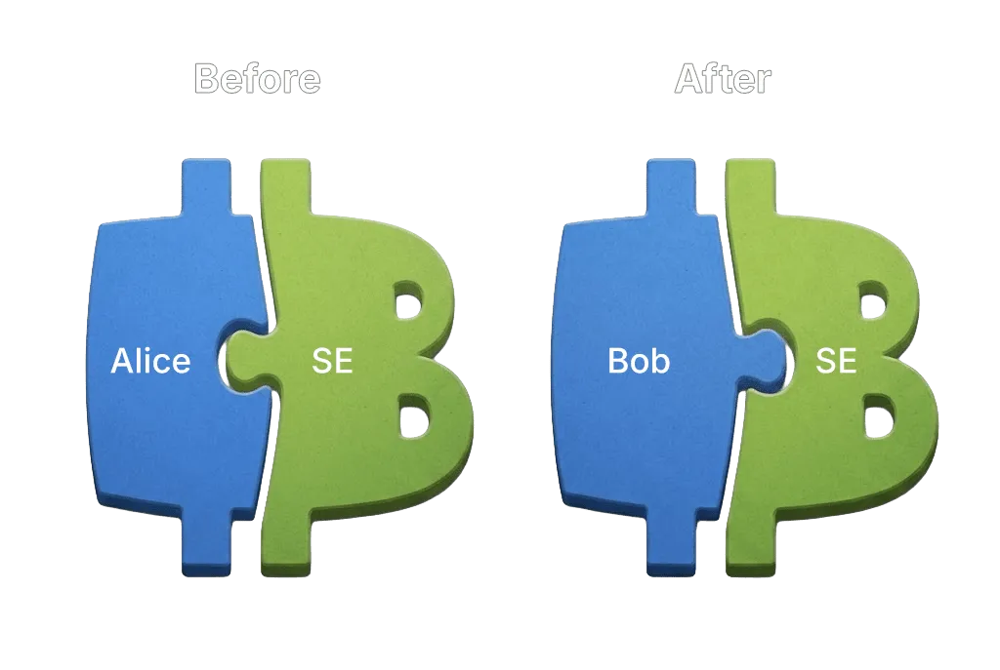

> *作者：Roy Sheinfeld*
> 
> *来源：<https://bitcoinmagazine.com/technical/spark-explained-like-youre-five>*

有些朋友可能记得，多年前我写过一篇《[用算盘来理解闪电网络](https://blog.breez.technology/understanding-lightning-network-using-an-abacus-daad8dc4cf4b)》，那是在我意识到许多人并没有完全理解闪电网络之后写的。那时候，我的目的不是解释闪电网络的密码学和实现的细节，而是阐释支付通道背后的核心观念。我使用了算盘作为比喻，好让读者集中注意力在概念上，而不是在机制上。效果相当不错，后来人们都使用这个算盘的类比来给初学者解释闪电通道。

最近，我感到一种强烈的沮丧。

因为在讨论 Spark 时，我察觉到了类似的情形。一些人知道要说 “[statechain](https://bitcoinmagazine.com/technical/bitcoin-layer-2-statechains)”（[中文译本](https://www.btcstudy.org/2025/06/21/bitcoin-layer-2-statechains-by-shinobi/)），但对绝大部分人来说，所知也就到此为止了。就跟那时候面对闪电网络一样，问题并不在于缺乏智力或懒惰，仅仅只是因为不清楚背后的思维模型。所以，我会再试一次一样的事情：从概念触发解释 Spark 的工作原理，不使用密码学术语。

## 两块拼图

Spark 的核心是让用户可以收取和发送比特币而无需广播交易到区块链。也就是说，相关的比特币在变更所有权时，从区块链网络中看，它并没有发生移动。相反，改变的只是能够联合授权该比特币的花费的人。这种联合授权是在用户和一组运营者（叫做 “Spark 实体（SE）”）之间分享的。

为了解释这是怎么工作的，想象要花费 Spark 装置中的一组比特币，需要完成一个简单的两拼图谜题：

- 一块拼图由用户持有；
- 另一块拼图由 SE 持有。

只有两块相互匹配的拼图拼到一起的时候，这些比特币才能花出去。不一样的钱币使用不同的谜题。

现在，我们来看看变更所有权的过程是什么样的。

最初，Alice 持有一块拼图，跟某个 SE 手上的某个拼图是一对。她可以通过让两个拼图评在一起来花费自己在这个 Spark 装置中的比特币。当 Alice 想发送自己的比特币给 Bob 的时候，她让 Bob 先跟 SE 一起创造一套新的拼图。重要的是，谜题本身并没有改变：旧的谜题和新的谜题（形状）是一样的，只是组成它的拼图的形状改变了。新的一套拼图是给 Bob 设计的：一个跟着 Bob，另一个跟着 SE 。从此之后，只有 Bob 手上的拼图能跟 SE 手上的凑成一对。Alice 可能依然拿着自己手上的旧拼图，但是那没有什么用。因为 SE 已经把自己手上与 Alice 配对的那一块拼图销毁了，所以 Alice 的那一块跟谁的拼图都配不上了、不能用来花费这个钱币了。因此，所有权在实质上转移给了 Bob ，即使由 Spark 装置控制的比特币在区块链内并没有移动。

以后，Bob 可以重复同样的过程，将同一组比特币发送给 Carol；以此类推。每一次转账，都是通过替换拼图（而不是在区块链内广播交易）来实现的。

到这里，我们自然会有疑问：要是 SE 没有抛弃自己的旧拼图，那会怎么样呢？在这种情况下，SE 可以串通以前的所有权人（比如 Alice）来花费应该属于最新所有权人（比如 Bob）的比特币。我们需要[信任](https://docs.spark.money/learn/trust-model) SE —— 在协助转移所有权的时候，会销毁自己原来的那块拼图。然而，需要明白的是，一个 SE 并不是就是一个人，它是多个运营者组成的一个团体，而且，SE 这边的拼图也不是由一个运营者独自持有的。替换拼图需要多个运营者之间的配合。每一哪一方可以秘密持有一块旧拼图或在事后重新创建它。所以，只要有一个运营者在转账期间是诚实的，就足以阻止一块旧拼图被重新激活。

关键的想法很简单：Spark 不在区块链内转移比特币；在转移比特币时，它只是替换掉拥有花费权限的人。由它控制的比特币在链内的位置并没有改变，改变的只是可以拼在一起的拼图。

为了让解释更加精炼，我有意不提 [Spark 的单方面退出机制](https://docs.spark.money/learn/technical-definitions)，他是 Spark 的安全模型的重要部分，但介绍它就会偏离我想要讲的核心理念。重要的是，Spark 并不是一个用户要永远依靠 SE 的系统。虽然日常转账依赖于联合授权，Spark 依然给用户提供了不需要 SE 配合、独自在区块链内花费自己的资金的选项。这种逃生舱是一开始就设计好的，只不过超出了本文的范围。

（完）