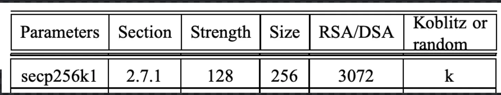
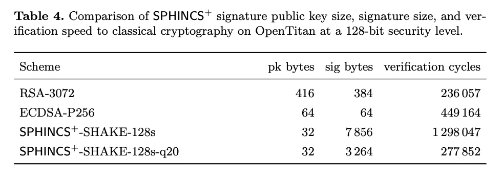
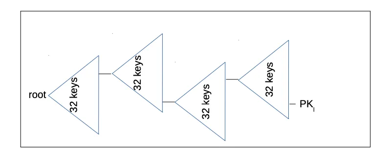
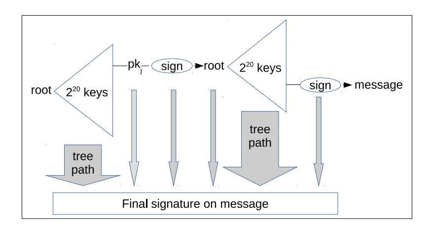

> *作者：NIFTY*
> 
> *来源：<https://insider.btcpp.dev/p/sphincs>*

*Presido Bitcoin 是旧金山的一个 Bitcoin-only 的联合办公空间，他们在上周举办了一场关于比特币和量子计算的行业会议。[@roasbeef](https://x.com/roasbeef) 是 `btcd` 和 `lnd` 两种客户端软件的首席维护者，以及 [Lightning Labs](http://lightning.engineering/) 的首席技术官。他在会议上提出了一种为比特币添加量子安全签名方案 SPHINCS+ 的提议。在今天的报告中，Insider 的协议专家 [@niftynei](https://x.com/niftynei) 将为你解读这个提议。*

## 量子安全问题

比特币区块链上的大部分资金都是用私钥来保护的。为了让区块链确认你的比特币交易（资金转移），你需要证明你拥有花费这些资金的权限，具体做法就是提供一个签名。有效的签名只能由能够接触到正确私钥的人生成。

从某种意义上来说，比特币也是 “通过混淆来实现安全性”，这里的 “混淆” 就是猜测出你的私钥的难度。可能作为私钥的数字的数量是天文数字级别。猜测出某个私钥需要花费许多时间和能量，是任何人在合理的时间范围内都做不到的（比如需要几百年时间）。

然而，当前的比特币密钥依赖于基于椭圆曲线的数学等式。椭圆曲线是创建公私钥的明智选择，因为这样的公私钥关系一般来说比质数分解（另一种作为公私钥密码学基础的 “数学系统”）更加安全，公私钥的体积也更小。

但是，椭圆曲线密码学也有一个问题。Shor 算法由 [Peter Shor](https://www.youtube.com/watch?v=wnhZPmB8KLg) 在 1994 年发明，基于傅里叶变换，意味着一台具有足够量子比特（qubits）的量子计算机（quantum computer）可以快速计算出任何公钥的私钥。

Shor 算法意味着我们 *知道* 如何打破椭圆曲线密码学，只是能够做到这件事的工具还不存在。这样的工具会不会出现、什么时候会出现，也是一个有很多争议的话题，不仅出现在比特币社区中，也出现在广大的密码学界。用来保管比特币的每一个私钥的安全性，都取决于在无限长的未来、不会有任何人能够接触到能够执行 Shor 算法的工具。

普遍的共识是，到未来的 *某个* 时间点，比特币需要迁移到一种 *后量子*（post-quantum）的公私钥密码学系统中。@roasbeef  上周在 Presidio Bitcoin 的提议基于 “SPHINCS+” 哈希签名方案。我们先来简单看看它是怎么工作的，以及为什么它可能是一个保护比特币的好选择。

## 量子安全，但数据沉重

“SPHINCS+” 是一种基于哈希函数的签名构造。它的核心是，依赖于密码学哈希函数（而不是优雅的椭圆曲线等式或者隐秘的大质数分解）来构造公钥和验证签名。基于哈希函数的密码学方案不受 Shor 算法影响，因为它们在单向函数（one-way functions）背后 *不使用* 函数式数学系统（functional math systems）。相反，哈希函数依赖于暴力的原像（preimage）数据堆叠。而暴力不包含在量子计算机傅里叶变换面前脆弱的数学关系（或者说捷径）， 也就没有 Shor 算法可以利用的对象。

堆叠数据，也就是哈希函数，有一个缺点：它的公钥和签名需要多得多的数据来分享。中本聪为比特币选择了椭圆曲线，正是因为在确认一个签名以及将资金锁定到一个公钥时，基于椭圆曲线的密码学需要分享的数据 *体积较小*。我喜欢说，比特币是椭圆曲线密码学的杀手级应用（killer app）；在中本聪在比特币协议中使用 secp256k1（具体的一种椭圆曲线）之前，大多数密码系统都在使用 RSA（或者说质数分解）作为底层的数学系统。根据 [SEC 2](https://www.secg.org/SEC2-Ver-1.0.pdf) 参数论文，签名的安全性要达到 128 比特，RAS 的公钥需要长达 3072 个比特，而椭圆曲线的公钥只需要 256 比特。

小体积对区块链系统是非常重要的，因为任何添加到区块链上的数据都必须发送给网络中的每一个对等节点、由他们存储。紧凑的签名和公钥体积意味着，同样大小的数据空间可以塞进更多的交易。体积上的节省可以说就是中本聪为比特币选择椭圆曲线而不是 RSA 密码学的理由。

相比之下，后量子的密码学系统（中的公钥和签名）都大得令人难以置信。SPHINCS+ 系统中的公钥跟比特币当前的密钥系统中的公钥体积一样大，但签名的体积达到几千个字节。隔离见证 v1（也即 Taproot）中的 Schnorr 签名是 64 字节长；而 SPHINCS+ 的基准测试签名是 3 ~ 7 千字节。

- 来自 NIST SPHINCS+ <a href="https://csrc.nist.gov/csrc/media/Events/2024/fifth-pqc-standardization-conference/documents/papers/a-note-on-sphincs-plus-parameter-sets.pdf">参数论文</a> -

## SPHINCS+

SPHINCS+ 是一种复杂的签名方案，是用多层的后量子签名 “小工具” 开发出来的；将它们结合在一起之后，SPHINCS+ 就创造了一种量子安全的 公钥/私钥 对，可以安全地签名许多消息。与它的前辈 “XMSS（eXtended Merkle Signature Schemes）” （也是一种基于哈希函数的后量子签名方案）不同，在 SPHINCS+ 中，你不再需要为一个密钥对记忆曾经制作过的签名。

一个  SPHINCS+ “结构” 可以制造一个公钥，这个公钥可以签名多条消息而不会揭晓私钥。

而一个 SPHINCS+ “结构” 由以下三个部分组成：

- FORS，即 “随机子集森林（Forest of Random Subsets）”。这是 SPHINCS+ “结构” 的底层，也是用消息来确定要揭晓哪些原像的地方。被揭晓的原像集合将成为 SPHINCS+ 签名的基础。在 SPHINCS+  中，消息实际上是使用 FORS 来 “签名” 的。下一部分将用来把 FORS 签名绑定到 SPHINCS+ “超级结构（super structure）”（我选择这么称呼它）的根公钥上。

- WOTS+，即 “Winternitz 一次性签名+”。这是一种后量子的、基于哈希函数的签名算法，可以安全地签名一条消息。SPHINCS+ 使用 WOTS+ 签名将在 FORS 中揭晓的原像绑定到分层的 XMSS 默克尔树上。这棵分层的默克尔树的树根即是 SPHINCS+ 公钥。（WOTS 和 WOTS+ 的唯一区别在于，这个带有 “+” 的变种在每一次哈希运算中都包含了一个随机前缀，从而缓解了 “多目标哈希攻击（multi-target hash attacks）”。“SPHINCS+ ” 中的 “+” 也同样意味着，每一次哈希运算中都包含一个随机生成的前缀。）

- XMSS 默克尔树。一棵 XMSS 默克尔树的每个叶子上都是一个 WOTS+ 公钥。SPHINCS+ 用 XMSS 默克尔树所构成的层级创建了巨大的金字塔结构。树之上的树通常被称为 “hypertrees（超级树）”。父树的每一个叶子都是一个 WOTS+ 公钥，这个公钥要来签名在它之下的树的树根，就这样将树绑定在一起（从而形成一个结构）。树的数量以及层级的数量，都是可以改变的，取决于一个 SPHINCS+ “超级结构” 想要的签名大小。要求的签名体积越小，验证和生成签名所需的哈希次数就越多。所有树的最低层的每一个叶子都是一个 FORS 。许多默克尔树以及许多层级，意味着金字塔的底部有许许多多的 FORS，可以用来制作重用概率非常小的安全签名。

  （译者注：这里之所以将一个 SPHINCS+ 结构称为 “金字塔” 而不是 “一整棵树”，是因为它确实不像单棵默克尔树那样，完全由叶子开始逐级合并、最终形成一个树根（从而一个树根就承诺了底层的所有叶子）；相反，顶层的一棵 XMSS 默克尔树的每个叶子是一个 WOTS+ 公钥，每个 WOTS+ 公钥都 *签名* 第二层某一棵 XMSS 默克尔树的树根，这些第二层 XMSS 默克尔树也是同样的构造：每个叶子是一个 WOTS+ 公钥；依此类推；因此，下一层的 XMSS 默克尔树的数量总是上一级数量的倍乘，也就是一个金字塔。最底层的不是 XMSS 默克尔树，而是 FORS 默克尔树（森林） —— 一个 FORS 公钥会对应许多棵默克尔树，可用来制作签名。）

- 超级树图的过度简化版本。上图中的 PK 在 SPHINCS+ 语境下实际上是 FORS 签名。而 “root” 是 SPHINCS+  公钥。 -

生成一个 SPHINCS+ 公钥的基本流程是：生成放在树根中的 WOTS+ 公钥，然后计算这些树的默克尔根（译者注：原文如此；疑应为 “生成放在叶子中的 WOTS+ 公钥，然后计算这些树的默克尔根”）。最顶部的一棵树的树根就是 SPHINCS+ 公钥。默克尔树的树根的体积由用来计算这个树根的哈希函数决定。一般来说，我们选择使用 SHA256 哈希函数，其输出是 256 比特。这就意味着，这样一棵默克尔树的树根将是 32 字节。这就是 SPHINCS+ 公钥的由来。

生成一个 SPHINCS+ 签名需要使用消息的一个哈希值，以随机选择要连接到 SPHINCS+ 超级树、生成 FORS 签名的 FORS 子树。一旦 FORS 签名生成之后，再用上一层 XMSS 树中的一个 WOTS+ 公钥的私钥来签名它；如此，签名与（公钥的）默克尔路径结合起来，一层一层向上，直到抵达最顶端的 SPHINCS+ 公钥。所有的 WOTS+ 签名、FORS 签名，以及让它们从 FORS 签名走向 SPHINCS+ 公钥的默克尔路径，就是这条消息的签名。你可以想象，这是很大一堆数据， 这就是为什么 SPHINCS+ 签名要比椭圆曲线签名（64 字节）大上几个数量级的原因。

- 包含再 SPHINCS+ 签名中的数据的示意图；右边的 “sign” 会生成一个 FORS 签名；而中间的 “sign” 会生成一个 WOTS+ 签名。 -

## 为什么要使用 SPHINCS+ ?

SPHINCS+ 是充分分层的，它非常笨拙，而且依赖于多种不同的 “工具” 来生成签名：Witnernitz 签名、FORS 和 XMSS 子树。

SPHINCS+ 的复杂性来源于它强大的特性集合。它是对 XMSS 的严格优化。XMSS 也是一种后量子的签名方案，允许一个公钥签名多条消息，但你必须跟踪已经用来签过名的默克尔树叶子。SPHINCS+ 则使用从被签名消息的摘要中生成的随机性，确定性地选择超级树上的一个子树叶子。

在比特币中，理想情况下，你应该为每一笔交易轮换一个公钥，这意味着你要为 *每一个* 在比特币中使用的公钥生成一个新的 SPHINCS+ 超级结构。

一开始，我困惑于为什么要在（理想情况下）一次性的公钥上提供这么强大的多次签名功能。

来自 Blockstream Research 的 [Jonas Nick](https://x.com/n1ckler) 指出，你会在想要追加手续费或者交易因为某些原因而丢失时再次签名；[Laolu](https://x.com/roasbeef)（也就是 roasbeef）指出，闪电网络这样的链下协议，需要（同一公钥）多次签名以跟踪私人合约内的状态转换。

在比特币上你可能不需要无限的重复签名功能，这就允许我们构造规模更小的 SPHINCS+ 超级结构来生成公钥。更小的超级结构意味着签名的体积会更小，因为需要携带的默克尔树路径减少了。但同时，这也意味着，在安全性开始下降之前，你可以制作的签名的数量变少了。在椭圆曲线密码学中，签名 nonce 的复用会立即泄露私钥；而在 SPHINCS+ 中，公钥的过度使用（用于签名），只会让安全性从 128 比特开始逐渐降级（随着底层的 FORS 开始部分复用）。

在深入研究之后，我不得不说，我真的成了 roasbeef 的使用 SPHINCS+ 作为后量子签名方案的提议的支持者。为了确定具体的参数，还有许多设计工作要做。我期待有一个 BIP 草稿（他表示已在撰写中），可以帮助填补一些围绕超级结构的层数与安全重复签名次数关系的空白。

还值得指出的是，就像 roasbeef 的演讲提到的，SPHINCS+ 不允许使用 种子词/子密钥 派生路径。这意味着 BIP32 层级式钱包会死去。这里还有别的选择，但我们将失去使用层级式派生路径来描述组成一个钱包的公钥的办法（当前的 xpub 和子钱包行业习惯就是这个作用）。

## 该走哪条路呢？

比特币将迁移到一种后量子签名方案。什么时候、使用哪种方案、什么参数，可能是接下来几年的热门话题。

Roasbeef 的 SPHINCS+ 提议是一种吸引人的选项，尽管多层树超级结构非常复杂。在我看来，所有基于哈希函数的后量子公钥方案都非常狰狞。SPHINCS+ 也丑陋，但这是因为它提供了最多的特性，尤其是重复签名时候的 “*无状态性*（statelessness）”（译者注：也可译为 “免记忆性”）。

随着我更加理解每一部分在协议中扮演的角色，我开始强烈赞赏这种设计出这种多层结构的聪明。

Roasbeef 在编写 BIP 上还有许多工作要做，尤其是在选择每一棵树的深度以及子树的层数上，还有 Winternitz 签名的体积以及 FORS 的参数。签名的体积和生成签名所需的哈希次数之间存在两难。要先在计算量和链上踪迹之间找出正确的平衡，才能发布正式的 BIP 。

那么还剩最后一个问题：

迁移到 SPHINCS+ 是否意味着比特币成了一种金字塔骗局（pyramid-scheme）？很难定义，但看起来的确是这样。

（译者注：这里是一语双关的玩笑，因为 “pyramid-scheme” 既可以表示 “金字塔骗局” ，又可以指代 SPHINCS+ 的 “金字塔结构”。）

## 致谢

感谢 Jonas Nick 和 Olaoluwa Osuntokun 在解释 SPHINCS+ 公钥复用和参数调整上的帮助。

## 进阶阅读

想要更加深入？以下是一些很好的材料，也是我撰写这篇文章的资料来源：

- Laolu 在 7 月 17 日的 Presidio Bitcoin 比特币与量子计算会议上的[演讲幻灯片](https://drive.google.com/file/d/12UlzfGvG09IwvzWscL2FT8CoewGBWlGD/view)
- [Sphere10 的 Winternitz 签名讲解](https://sphere10.com/articles/cryptography/pqc/wots)，让我掌握了后量子签名的基础知识
- 来自软件开发者 Ethan Rahn 的一篇[深度讲解博客](https://er4hn.info/blog/2023.12.16-sphincs_plus-step-by-step/)，包含了很好的示意图，以及一些后量子签名的开发历史
- [SPHINCS+](https://csrc.nist.gov/csrc/media/Presentations/2022/crclub-2022-10-19a/20221020-crypto-club-kelsey-slides-MD-hash-sigs.pdf) 的极佳深度讲解，来自 NIST 的 John Kelsey。是我看过最好的详尽解释，但显然被埋没了。

（完）