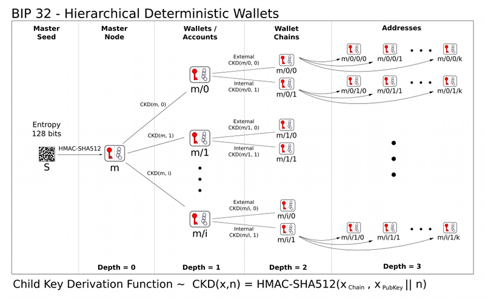
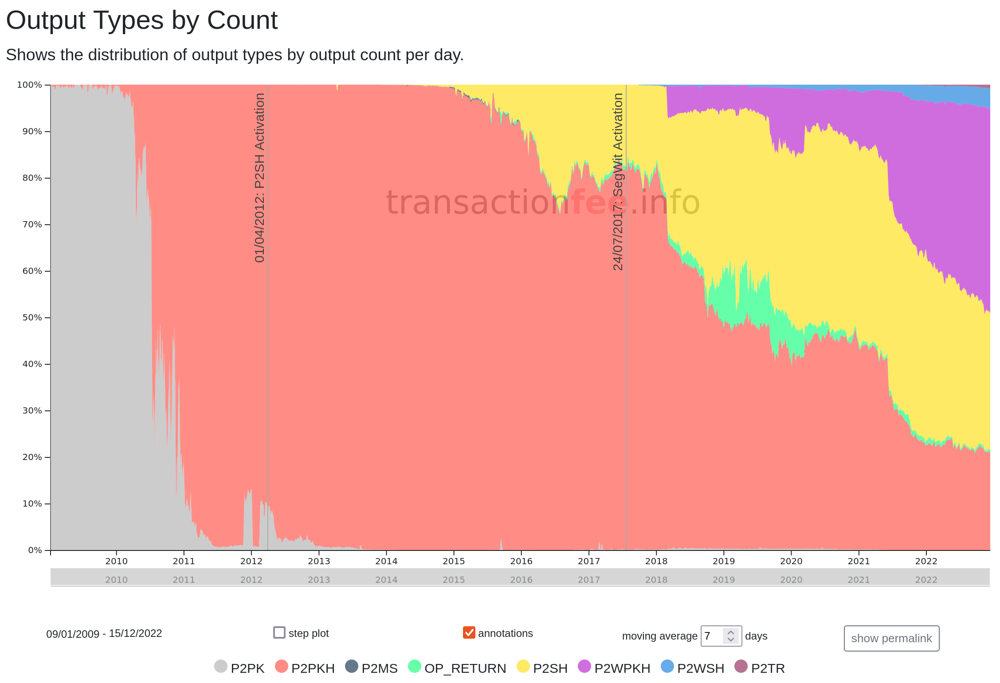

> *作者：Wizardsardine*
> 
> *来源：<https://wizardsardine.com/blog/state-of-the-art-for-bitcoin-wallet-backups/>*


制作比特币钱包备份时，我们希望根据自身需要和风险情况，找出下列特性的最优组合方案：

**冗余性**：存有几份完整的备份副本。

**安全性**：第三方获得完整的备份副本的难度。

**复杂性**：用来创建、保护和找回副本的系统的复杂程度。

**健壮性**：面对不利的政治、社会、时间和环境条件，备份能否安然无恙。

**跨钱包兼容性**：备份能否用于不同的钱包。

虽然上述特性之间不存在绝对对立，但是试图增强一个特性往往需要我们在另一个特性上做出妥协。

## **确定性 vs 非确定性**

我们将要讨论某些确定性和非确定性操作。确定性和非确定性的定义如下：

**确定性**：只要输入相同，每次生成的输出**必定**相同。

**非确定性**：输入相同，每次生成的输出**可能**不同。

*私钥* 可能会经由确定性或非确定性方法生成，详见下文。

*地址* 通过确定性方法由一个或多个公钥和锁定脚本单独或共同生成。

## 确定性和比特币脚本

虽然地址生成本身是确定性的，但是从备份的角度来看，备份中仍有必要包含钱包所用的脚本和派生路径。如果没有这些，通过此备份找回的钱包可能会不知道被发送至某一地址的代币属于它，也不知道如何花费这些代币！

这里有一些“脚本模板”可以为你提供捷径：

- “标准”地址类型（例如，P2PKH、P2WPK、P2WPKH）本质上是特定脚本的模板。钱包可以利用这些模板通过一组特定密钥暴力生成通用地址类型。

请注意这些捷径本质上依赖的是隐含信息，而非让备份 *明面上* 包含所有必要数据。因此，这类备份的健壮性较弱。如果将来有一天隐含信息丢失了，依赖它的备份可能会失去作用，或者需要大量（甚至于不可能完成的）暴力破解。

关于如何在备份中显式包含使用一个或多个密钥的脚本，查看下文的“输出描述符”章节。

## 比特币备份技术发展史

我们将跟随比特币骨灰级用户 Alice 的视角，看她这些年来是如何好好保护钱包备份的。

理想情况下，Alice 的备份应该具备冗余性、安全性、健壮性和低复杂性。即使是在她本人失联的情况下，也可由她选择的受益者轻松安全地访问。

### 早期比特币软件

就最早期的 Bitcoin Software 版本（Satoshi 客户端，也就是如今的“Bitcoin Core”）而言，备份采用的是原始手段。Alice 能采取的最佳措施就是定期备份 `wallet.dat` 文件（由软件钱包创建并使用）。虽然此系统复杂程度较低，但它既不安全、健壮，也不具备很强的冗余性 —— 除非 Alice 手动创建很多副本。

发送或接收交易时，软件会动态生成新的密钥。也就是说，每当 Alice 执行一笔交易或生成一个新的收款地址时，她都要重新备份更新后的 `wallet.dat` 文件，因为该文件中包含了以往备份中不存在的新密钥。

如果 Alice 勤勤恳恳地为她的 `wallet.dat` 文件创建了多个冗余副本，那么她每执行一笔交易就得更新 *所有副本*。说它容易出错、用户体验差已经很客气了。

备份 `wallet.dat` 文件的好处之一是交易和钱包元数据同样会被备份。这里面也包括了分配给地址的“标签”，这样 Alice 就可以记住每个币（更具体地说是 UTXO）来自何处或被送往何处。详见后文。

### 密钥池（Key Pool）

后来，比特币软件新增了“密钥池（Key Pool）“ 功能。默认情况下，密钥池中包含 100 个私钥可用于未来交易。这意味着，从技术角度来说，用户无需在每次交易后都进行备份。

软件提前生成 100 个随机的非确定性私钥，并将它们保存在 `wallet.dat` 文件内。Alice 进行交易（收付款）时，软件会从密钥池中选择一个私钥用来生成一个新的找零或收款地址。紧接着会再生成一个新的私钥补充到密钥池中，确保未使用的地址数量为 100 个。请注意，Alice 的当前备份中**不**包含新生成的私钥，但是其余 99 个都在。

引入密钥池后，Alice 的备份虽说没那么容易出错了，但她需要追踪密钥池的状态。备份的复杂性本质上没有变化，因为 Alice 必须确保同步更新备份的所有副本，否则就要承担降低冗余性的风险。

这意味着，Alice 需要定期备份钱包，只是可以选择延长时间间隔而已。当时，指南上说的是你只需“[大约每 30 笔交易](https://bitcointalk.org/index.php?topic=1414.msg17441#msg17441)”备份一次即可。Alice 担心自己会忘了上次备份后执行的交易数量，于是仍选择每笔交易备份一次。

### 纸钱包

2011 年中，[纸钱包](https://blog.trezor.io/paper-wallets-a-relic-of-the-past-1f711ba82b8c)变成了热议话题；它为 Alice 这样的用户提供了一种简单的方法，让他们能够轻松形成复杂性极低的有形实体备份，并且容易实现冗余性。纸钱包的安全性非常低 —— 只要是拿到副本的人都可以立即访问并卷走钱包里的资金，除非钱包还使用了强大的 [BIP38 ](https://github.com/bitcoin/bips/blob/master/bip-0038.mediawiki)密语。

纸钱包通常会存储转化成[钱包导入格式（Wallet Import Format, WIF）](https://en.bitcoin.it/wiki/Wallet_import_format)的单个私钥及其对应的 P2PKH 地址，并使用二维码表示，以便用户使用手机相机或网络摄像头扫描。安全生成并打印出来之后，Alice 就可以放心将比特币发送到自己的地址。 

花费比特币时，Alice 必须将私钥导入她的钱包软件，后者会生成对应的 scriptPubKey 并扫描区块链以找到匹配的 UTXO。使用这些 UTXO 作为交易输入，软件钱包就可以构建并签署交易，并将其广播至点对点网络或挖出包含此交易的区块。

但是，纸钱包的缺点也[很多](https://en.bitcoin.it/wiki/Paper_wallet)。

从协议的角度来看，最大的问题是纸钱包实际上只支持备份单个密钥，这是在鼓励用户重复使用地址，不利于保护隐私性。此外，虽然比特币离线存储（在纸上）时可能是安全的，但你在花费比特币时仍需将你的私钥加载到计算机上才能生成交易，使得你容易遭受一切针对此计算机的攻击。

### 确定性钱包

> 又被叫作：非分层确定性钱包

2011 年，其它比特币钱包实现开始使用 *确定性* 密钥派生形式。通过这些方案，用户能够根据单个随机生成的“种子”确定性地生成大量新密钥。确定性钱包主要有两大优点：

1. 可以备份单个对象（种子）
2. 可以派生新的地址用于执行每笔交易，而不会导致以前的备份失效。

这样一来，Alice 就可以增加备份的冗余性，同时还能保留为每笔交易使用新地址的最佳做法。

备份单个种子也为更加健壮的备份存储介质开辟了新的可能性，因为种子无需备份在数字介质上，尽管在引入 BIP39 之前几乎没人探索过新的可能性。

### BIP32 和分层确定性钱包

**HD**：分层确定性

**BIP32**：分层确定性钱包

2012 年初提出的 [BIP32](https://github.com/bitcoin/bips/blob/master/bip-0032.mediawiki) 试图改进早期的确定性钱包设计，并使用预先确定的层次结构和派生路径语法支持根据单个种子派生多条子密钥链：



这使得单个备份可以对应多个独立的钱包，从理论上来说甚至可以对应多种密码获币，**只要用户记住并备份使用的派生路径即可**。

虽然 BIP32 并未显著改进非分层确定性钱包的备份体验（二者实际上都需要备份单个种子），但它确实为未来的钱包设计提供了一个重要基石。

请注意，BIP32 的提议者之一 gmaxwell 后来[评论](https://github.com/bitcoin/bitcoin/pull/5266#issuecomment-93718490)道：

> BIP32 根本无法代替备份，最多只能保护密钥材料。它没有采取任何保护元数据的措施，但元数据可能会起到绝对关键的作用……

以及

> 我有点后悔发明目前最常用的公钥派生方法了 —— 出现了使用过度和损害安全性的问题（通常是因为用户没有理解其影响）。

备份元数据可能会起到重要乃至关键的作用，但是 BIP32 方案并未涉及这方面。

### P2SH

2012 年中，[P2SH](https://learnmeabitcoin.com/technical/p2sh) 地址类型问世。使用 P2SH 地址时，接收方会对其用来锁定比特币的（赎回）脚本运行哈希计算，并使用得到的哈希值生成地址。之后，只有当接收方想要花费此比特币时，才需要将赎回脚本作为 ScriptSig 的一部分公开。欲知更多详情，请阅读 [BIP16](https://github.com/bitcoin/bips/blob/master/bip-0016.mediawiki)。 

从备份的角度来看，这意味着使用 P2SH 地址收款的钱包除了私钥（们）之外还有个新的东西需要备份：解锁脚本（通常被叫作 redeemScript）。

此数据无法像 主/子私钥 和公钥（以及 P2PK 或 P2PKH 地址）那样以确定性方式由种子派生而得。

从下方来自 transactionfee.info 的图中，我们可以看到 P2SH 地址直到 2014 年以后才真正得到广泛使用。



Alice 本人没有使用过 P2SH 地址，因为手抄比特币脚本实在太容易出错，而且可用工具有限，钱包兼容性也很差。

### 硬件钱包，BIP39 和 BIP44

**BIP39**：用来生成确定性密钥的助记词

**BIP44**：确定性钱包的多账户分层结构

2013 年，第一代“硬件钱包”Trezor 初次亮相。第一版 Trezor 的设计目标很简单：让用户能够将其私钥存储在安全、离线且静态交互（airgapped）的设备内，并使用该设备内的私钥签署有效的比特币交易。

Trezor 采用的是分层确定性钱包设计。为了弥补其不足，Trezor 团队 (SatoshiLabs) 设计了 [BIP39](https://github.com/bitcoin/bips/blob/master/bip-0039.mediawiki)，注明了随机种子与助记词之间如何进行双向转化。这意味着，确定性或分层确定性钱包的用户再也无需备份一长串用来表示种子的字母数字（或十六进制）字符串，只需备份 12 或 24 个（英语）单词即可。

十六进制种子示例：

```
3d1d3da431ce5f2f26a4fd3b481c285edac280cebdbc3fbbf7739c2ccbb73f99acc816687daa86ef51a7fb95c19f170da5aafbf49a9e4177abc4cad13a3c7ca2
```

助记词示例：

```
check day then tiger collect join hotel hawk absorb ginger wash track crowd hero scale
```

你可以在这个网站上[生成](https://iancoleman.io/bip39/)自己的 BIP39 助记词，以了解更多助记词、种子和根密钥的例子，但是**请勿真的将通过该网站生成的钱包用于交易**。

BIP39 极大拓宽了种子备份方案的可能性。用户开始在存储介质上肆意发挥[创造力](https://wizardsardine.com/blog/state-of-the-art-for-bitcoin-wallet-backups/#seed-phrase-backup-solutions)。现在，Alice 能够增强其备份的健壮性。

但是，硬件钱包依然存在一个问题，虽然从理论上来说，硬件钱包已经能够根据种子生成签署交易所需的私钥了，但是它们可能不知道应该通过哪条 BIP32 派生路径这么做。

[BIP44](https://github.com/bitcoin/bips/blob/master/bip-0044.mediawiki) 试图通过为 BIP32 派生描述符的不同部分指定含义来解决该问题。BIP44 实现后，硬件钱包就能知道应该跟随哪条 BIP32 派生路径（例如，表示为 m/44'/0'/0'/0/0 的形式）派生密钥和地址。

硬件钱包、BIP39 和 BIP44 对 Alice 的影响是，Alice 不仅可以安全地生成助记词，还能轻松实现备份冗余性。Alice 可以使用在线（热）钱包（通过 xPub 主公钥）生成收款地址，并安全地使用硬件钱包离线签署交易。

### 助记词备份方案

BIP39 之后，很多有趣的助记词存储设计得到了试验：[1](https://blog.lopp.net/metal-bitcoin-seed-storage-stress-test/)、[2](https://blog.lopp.net/metal-bitcoin-seed-storage-stress-test--part-ii-/)、[3](https://blog.lopp.net/metal-bitcoin-seed-storage-stress-test-round-iii/)、[4](https://blog.lopp.net/metal-bitcoin-seed-storage-stress-test-iv/)、[5](https://blog.lopp.net/metal-bitcoin-seed-storage-stress-tests-round-v/)、[6](https://blog.lopp.net/metal-bitcoin-seed-storage-stress-tests-round-vi/) 。

### SegWit（隔离见证）

**BIP141**：Segregated Witness（共识层）

**BIP49**：基于 P2WPKH-nested-in-P2SH（P2WPKH 嵌套在 P2SH 中）的账户的派生方案

**BIP84**：基于 P2WPKH 的账户的派生方案

SegWit 生效之前，钱包和签名设备需要在备份时考虑以下地址类型：

- P2PK
- P2PKH
- P2SH

2017 年的 SegWit 升级引入了新的标准地址脚本，即，Pay-To-Witness-PubKey-Hash (P2WPKH) 和 Pay-To-Witness-Script-Hash (P2WSH)，二者都使用了新的 bech32 地址编码。

这意味着需要新的派生规范来帮助钱包决定如何根据种子派生这几类地址以及花费地址上的余额。P2WPKH 的相关规范都写在了 [BIP84](https://github.com/bitcoin/bips/blob/master/bip-0084.mediawiki) 里。

除此之外，新的 SegWit 地址类型也可以用旧的（兼容性更好的）P2SH 格式“包裹”起来，例如，P2SH-P2WPKH。这意味着未升级的旧版钱包仍能向支持 SegWit 的钱包付款。BIP49 详述了 P2SH 包裹下的 P2WPKH 地址的派生。

SegWit 本身并没有为备份方案带来很大改变，但它确实开始在交易费层面上降低了复杂脚本的成本，并满足了大量使用多签、门限多签乃至更复杂脚本的新型比特币应用和服务的需求。

就像 P2SH 那样，如果 Alice 想要使用自定义脚本作为 P2WSH 的一部分，她需要单独备份此脚本，但这里是作为“见证脚本（witness script）”的一部分。

另外需要注意的是，备份方案的复杂性正在呈指数级增加。比特币每经历一次技术迭代，都会出现需要额外备份的信息，这是个需要解决的问题。

### Taproot、脚本和备份

在 Taproot 的进一步支持和激励下，用户能够使用更为复杂的自定义脚本。用表格列出需要备份的信息似乎是个不错的主意……

Bitcoin Core 开发者 Gloria Zhao [绘制](https://bitcoincore.reviews/22363)了一张很有用的表格，展示了各种地址类型及要求，其中加粗的脚本元素需要额外备份。

| Output Type | scriptPubKey | scriptSig | redeem script | witness   |
| ------| ------ | -----------| ------ | ------- |
| P2PK | \<pubkey> OP_CHECKSIG  | \<signature>  |    |       |
| P2PKH | OP_DUPOP_HASH160 \<pubKeyHash> OP_EQUALVERIFYOP_CHECKSIG | \<signature> \<public key>    |     |         |
| P2SH   | OP_HASH160 \<scriptHash> OP_EQUAL   | \<data pushes> \<redeem script> | **(arbitrary)** |       |
| P2WPKH | 0 \<pubKeyHash>  |     |    | \<signature> \<public key> |
| P2WSH | 0 \<witnessScriptHash>   |       |     | \<data pushes> **\<witness script>** |
| P2SH-P2WPKH | OP_HASH160 \<redeemScriptHash> OP_EQUAL | \<redeem script> | 0 \<pubKeyHash> | \<signature> \<public key>            |
| P2SH-P2WSH | OP_HASH160 \<redeemScriptHash> OP_EQUAL | \<redeem script> | 0 \<scriptHash> | \<data pushes> **\<witness script>** |
| P2TR (key path) | 1 \<public key> |    |   | \<signature> |
| P2TR (script path) | 1 \<public key> |    |    | \<data pushes> **\<script> \<control block>** |

**注意**：上表不涉及派生路径。如果你使用的是基于 BIP32 的分层确定性钱包，可能还需要备份派生路径。

### 输出描述符

2017 年底，Bitcoin Core 0.17 最先开始支持[输出脚本描述符](https://github.com/bitcoin/bitcoin/blob/master/doc/descriptors.md)。

其构想是对一个或一组根据钱包种子或 xpub 生成的输出进行程序化的描述。我们可以透过 BIP 中的一些例子了解描述符是什么样的：

```
pkh(02c6047f9441ed7d6d3045406e95c07cd85c778e4b8cef3ca7abac09b95c709ee5)
```

这个描述符描述了一个特定公钥的 P2PKH 输出。

```
wpkh(02f9308a019258c31049344f85f89d5229b531c845836f99b08601f113bce036f9)
```

描述了一个特定公钥的 P2WPKH (SegWit) 输出。                 

```
pkh([d34db33f/44'0/0']xpub6ERApfZLCkDtcHTcx...BGRjaDMzQLcgJvLJuZZvRcEL/1/*)
```

形容一组 P2PKH 输出，但是另外指明了这个 xpub 是指纹为 d34db33f 的主密钥的子密钥，并且使用路径 44'/0'/0' 派生得到。

输出脚本描述符带来的影响是，Alice 从此可以在一个跨平台的对象中备份自己的种子词、派生路径以及让钱包重新生成脚本所需的一切信息。

但是，此方法有一些缺点。虽然描述符比种子更完整，但它不可能像 12 或 24 个助记词那么容易备份。

## 比较单签设置下的传统方案备份与描述符备份

Alice 正在考虑使用一个简单的单签设置来保护她的代币。她想要评估传统的种子备份方案与描述符备份方案在此设置下的表现。

### 传统方案备份需求

（假设使用的是标准化派生路径，例如，BIP49、BIP84）

一串助记词：

```
check day then tiger collect join hotel hawk absorb ginger wash track crowd hero scale
```

### 描述符备份需求

一系列 taproot 地址的单签描述符：

```
tr(tprv8ZgxMBicQKsPeXo5tpYTymqeW6MVjobp7mBAe/86'/1'/0'/1/*)#en5pdj5a
```

### 总结

在使用标准化派生路径的单签设置下，备份助记词作为最简单的方法似乎更胜一筹，因为抄写 12 个英语单词远比抄写包含私钥在内的描述符方便得多。

但前提是必须从地址 0 开始使用标准化派生路径。否则，Alice 的钱包仅凭种子可能无法定位并花费资金。为防范此风险，这里有一个[网站](https://walletsrecovery.org/)可以帮助那些使用非标准或非常用派生路径的用户定位资金。

Taproot 描述符无需满足上述前提条件，因为它明确声明了派生路径。

## 比较自定义花费策略下的传统方案备份与描述符备份

Alice 已经做出了决定。担心自己遭遇不测，她希望能够提高备份的冗余性，却又不想直接将自己的私钥或助记词泄露给其他人。她听说现在可以自行使用 miniscript 编写自定义策略了。于是，她开始设计一个具备以下特征的策略：

1. Alice 随时都能花费自己的资金

在 Alice 无法签署交易的情况下，其他人可以通过以下三种方式花费 Alice 的资金：

2. 如果 Alice 的父母和律师相互配合，可以立即花费这笔资金。
3. 超过一定时间后，Alice 的父母可以花费这笔资金。
4. 超过一定时间后，律师可以花费这笔资金。

上述策略如下图所示（通过 [Bitcoin devkit playground](https://bitcoindevkit.org/bdk-cli/playground/) 绘制）：



如果是 p2wsh 地址，则上述策略的文本形式如下所示：

```
or(pk(Alice),thresh(2,pk(Parents),pk(Lawyer),older(4209492)))
```

如果 Alice、她的父母和律师使用以下助记词和 xpub：

Alice 的助记词：

```
check day then tiger collect join hotel hawk absorb ginger wash track crowd hero scale
```

xpub：

```
[148def1d/0/1h/2]xpub6DNwBKQytFFCcav7YKTxGBVxPBkd1MyhsLEd2MDtn8CLWJsLAUZGtAntKCxQu45xF2Yrj46YzvHRLMAa1LPVhWcJJKryNfWPX8Ubbm4HBAg/18/*
```

Alice 父母的 xpub：

```
[fb68bb01/0/42]xpub69x7KEERUvDHWALWoQ9rFbK5mmLzCXZqDsnAy3gZH6M29PPW5DsKch6gEWLNcivzGdwU9NiqxijNCCysoVRzmUkLehiuiBGEfvPXK87GFTA/*
```

助记词：

```
enlist civil inherit olympic supply income mad lock pencil transfer sure celery raven zebra then
```

律师的 xpub：

```
[35ea9c73/0/42h]xpub6BFYWjYe8shCWGzn2rL8HTYEfQxN8knqrWkAKng1QN7vFJUJF6ueiacWAzvgCsJsM5myLXVXmtS6pB13kzkoAPcMJT7iY4DyMwFyLP4xt6j/789/987/*
```

我们来看看 Alice 是如何使用自己创建的这个相对简单的策略进行备份的。

### 传统方案备份需求

首先，Alice 还是要像之前那样备份助记词：

```
check day then tiger collect join hotel hawk absorb ginger wash track crowd hero scale
```

除此之外，Alice 还需要备份由她的钱包为每个新生成的地址创建的脚本，如下所示：

```
# Alice pubkey
038eeab436808eb353b6af6e77f643bbb30fe7c571ed953c882bf3406875f08c82
OP_CHECKSIG
OP_NOTIF
    # Parent pubkey
    024b9dd6d5293644a386fac67627a2c47c7d937b9bc120e85fc9844f22cc267219
    OP_CHECKSIG
    OP_SWAP
    # Lawyer pubkey
    02c318db4f038fd658bdb43b5ad26da910b31602e3783627f7e28a6bfb1da33e0b
    OP_CHECKSIG
    OP_ADD
    OP_SWAP
    OP_DUP
    OP_IF
        543b40
        OP_CSV
        OP_VERIFY
        OP_ENDIF
    OP_ADD
    OP_PUSHNUM_2
    OP_EQUALVERIFY
    OP_ENDIF
OP_PUSHNUM_1
```

Alice 还需要告诉她的继承人和律师哪些钱包能够导入和导出这种原始脚本。

更重要的是，虽然任何比特币节点都能验证它们在一笔交易中看到的脚本是否合法，但是大多数钱包不知道如何满足这种自定义脚本的花费条件。因此，Alice 可能需要自己编写一个钱包软件，或在备份的同时告诉自己的父母和律师哪些钱包能够花费她的资金。

### 描述符备份需求

Alice 的策略可以转换为以下范围描述符：

```
wsh(
    t:or_c(
        pk([148def1d/0/1h/2]xpub6DNwBKQytFFCcav7YKTxGBVxPBkd1MyhsLEd2MDtn8CLWJsLAUZGtAntKCxQu45xF2Yrj46YzvHRLMAa1LPVhWcJJKryNfWPX8Ubbm4HBAg/18/*),
        v:thresh(2,
            pk([fb68bb01/0/42]xpub69x7KEERUvDHWALWoQ9rFbK5mmLzCXZqDsnAy3gZH6M29PPW5DsKch6gEWLNcivzGdwU9NiqxijNCCysoVRzmUkLehiuiBGEfvPXK87GFTA/*),
            s:pk([35ea9c73/0/42h]xpub6BFYWjYe8shCWGzn2rL8HTYEfQxN8knqrWkAKng1QN7vFJUJF6ueiacWAzvgCsJsM5myLXVXmtS6pB13kzkoAPcMJT7iY4DyMwFyLP4xt6j/789/987/*),
            snl:older(4209492)
        )
    )
)#66wwtznl
```

除此之外，Alice 还需要像之前那样备份助记词：

```
check day then tiger collect join hotel hawk absorb ginger wash track crowd hero scale
```

虽然上述描述符看起来有点吓人，而且是个相当大的备份对象，但是此备份格式相比传统备份格式具备以下优势：

1. 能够派生出多个地址，无需通过额外的备份步骤避免地址重用。

1. 可由任意支持描述符的钱包导入并使用

> **注意**：就像上文的原始比特币脚本那样，此描述符 **不** 包含任何危及安全的信息，因此可以“公开”备份在云端或密码管理器内。一旦被发现，只会失去隐私性。（译者注：因为这段描述符中只公开了公钥。）

将助记词连同描述符一起导入后，描述符钱包就获得了创建见证脚本/见证和花费资金所需的全部信息。

### 总结

在此设置中，我们可以清楚地看到，导出和备份原始比特币脚本比起备份描述符更麻烦。

此外，支持描述符的比特币钱包能够解析、理解和导入描述符。更重要的是，它们知道如何花费使用有效描述符创建的比特币地址上的资金。

这意味着，Alice 现在可以高枕无忧了，因为她知道即使她有一天失联了，她的继承人也能轻而易举地将两个描述符导入任意钱包，找回她的资金。

## 结语

虽然如今有很多比特币用户已经满足于仅备份助记词，但是像 Alice 那样采用更高级的锁定策略（哪怕只是基础的多签设置，不依赖于隐性排序密钥）有可能通过设置超时时间、门限签名方案和额外的解锁路径为用户带来更高的安全性。

这类方案最好使用助记词和描述符相结合的备份。

如果你选择使用更高级的策略，使用描述符相比备份助记词和原始比特币脚本更具优势。请向继承人和律师说明你的策略，以防你遇到无法亲自联系他们的状况，确保万无一失。

（完）